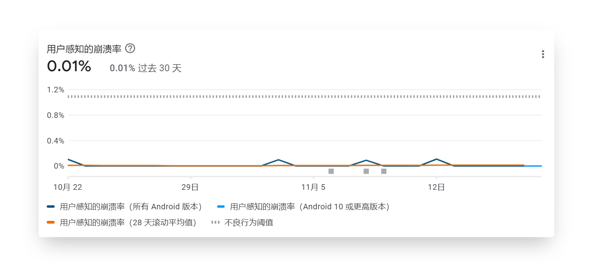
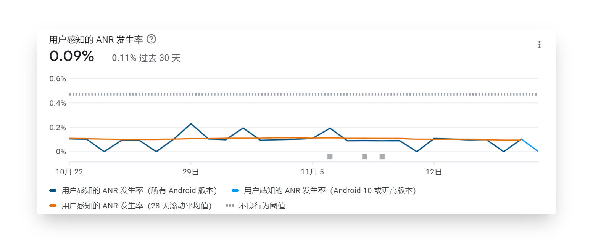
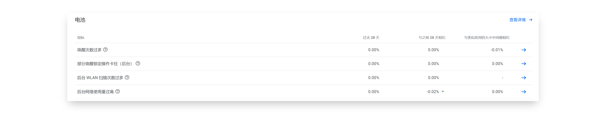
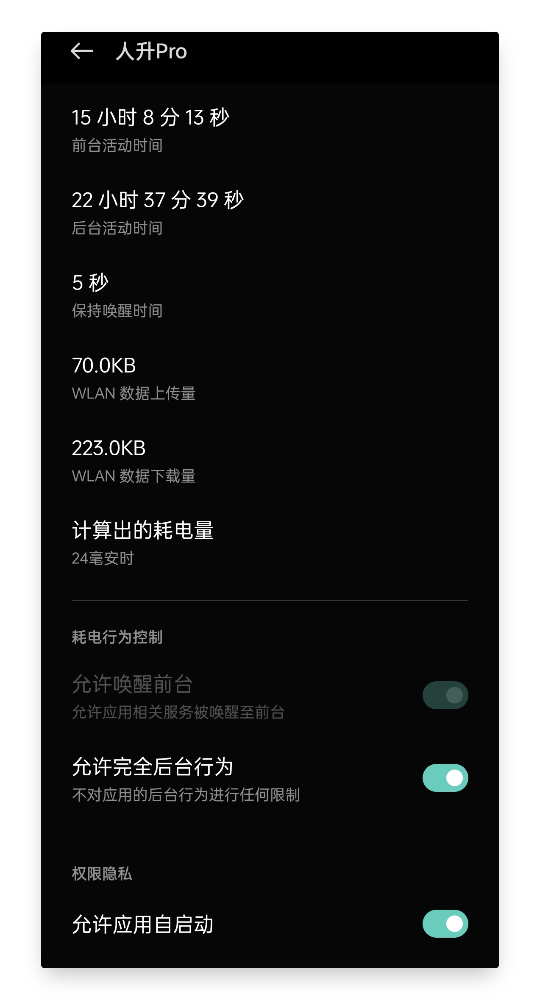
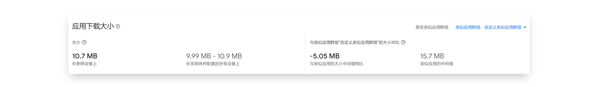
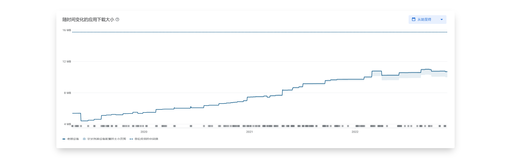
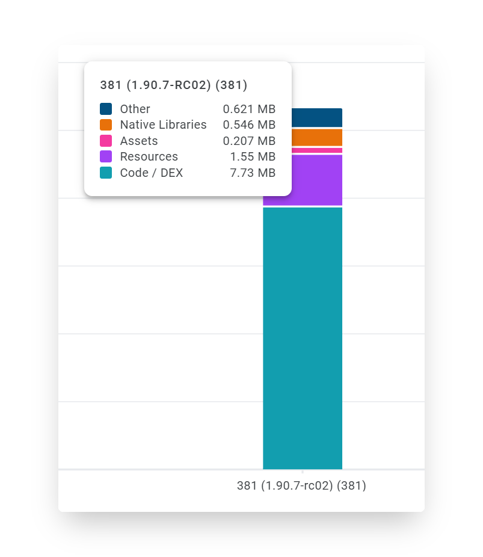
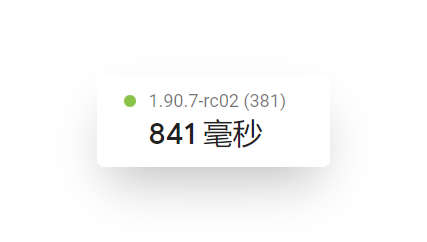
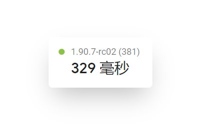

## 开发工效

尽管《人升》只是款小众的软件，但我们希望它的质量、性能水平能达到出众的水平，并且我们做到了。

以下是一些线上相关数据：

> 数据基于 Google Play 统计，应用版本为 v1.90.7-rc02，覆盖用户群体为全球、用户设备 Android 版本为5~13。

 

### 崩溃率

《人升》近 60 天的崩溃率仅为 0.01%，远低于 Google Play 定义的不良阈值 1.09%。

而类似群组应用的中间值为 0.14% 左右。

 

### ANR 率（应用未响应）

ANR 的定义是长时间卡顿，比如点击按钮后，5 秒钟应用都没响应。

《人升》的 ANR 率为 0.10% 左右浮动，远低于 Google Play 定义的不良阈值 0.47%。

但类似群组应用的中间值为 0.05% 左右。

 

由于《人升》前期留下了一些技术债务，这方面还有不少的改进空间。

 

## 电池耗电相关指标

后台几乎不存在任何耗电问题。

《人升》自身的逻辑后台几乎完全不会执行任何逻辑，只包含任务提醒、小部件刷新等必要逻辑。

此处统计可能不包含番茄钟**倒**计时场景，目前番茄钟倒计时是基于手机运行和 CPU 调度的，而非类似任务提醒的定时任务。

 

此前也曾经出现过部分系统（MIUI）在部分系统版本下，出现耗电异常的情况。这可能是由于系统调度、第三方库或兼容性问题导致的。

目前没有类似反馈。

 

以下是实测一加8T + ColorOS 后台运行 24 小时以上的真实耗电情况。

 

## 包体积

即便《人升》已经持续更新了 4 年。

目前在 Google Play 上基于 App Bundle 的分发特性加持下，下载体积也保持在了 10.7 MB 左右。

对比海外类似群组应用的中间值（15.7 MB）也是少了接近 1/3。

《人升》接近 4 年的应用体积“膨胀”。

《人升》的体积构成，大部分都是被代码逻辑所占用（含第三方库）：

- 资源文件（图片、音效等）：0.207 MB + 1.55 MB
- 底层库：0.5MB
- 代码：7.73MB

 

## 启动速度

《人升》90 分位的**冷启动**速度为 841 MS。

也就是说绝大多数用户（90%）都能享受到秒启动。

《人升》50 分位的**冷启动**速度为 329 MS。

也就是说一半用户（50%）都能享受到**半秒**启动。

