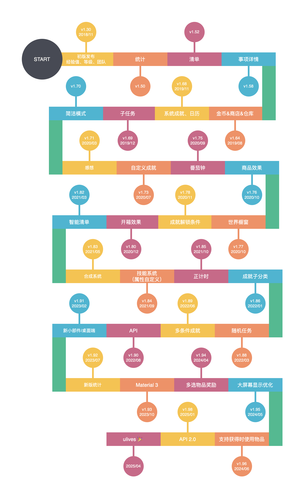

# 更新日志

## 里程碑

## 详细日志

**1.88.4 (2022/4/21)**

1. 修复仓库搜索会导致崩溃的问题
2. 修复自定义背景和历史页面的显示错乱问题
3. 修复编辑时的UI重叠问题
4. 修复成就获得商品奖励时数量可能显示异常的问题
5. 修复成就计算事项完成次数在某些特殊情况下，可能与实际次数不符的问题
6. 修复历史页面快速点击时可能会导致标题消失的问题
7. 修复新建或编辑事项时，点击属性后，正在焦点的输入框再次点击没法弹出软键盘的问题
8. （Play版本）修复法语语言下，设置每月限购会崩溃的问题

**1.88.3（2022/4/09）**

1. 修复恢复备份后，执行云备份会提示冲突的问题
2. 修复编辑任务开始时间、子任务提醒时间未默认选中已填写时间的问题
3. 修复批量简易合成时，其他使用效果只会按一次计算的问题
4. 修复系统成就任意属性达到10级不会计入自定义属性的问题
5. 修复非会员“我的”页面文本UI显示异常问题

**1.88.2（-）**

> 仅Play版本发布，更新内容包含于1.88.3

**1.88.1（2022/4/02）**

1. 修复一个备份提醒导致的崩溃问题

**1.88.0（2022/3/30）**

✨特性

1. 新增世界模块分享「随机任务」功能
2. 计数事项可选设置系数影响商品数
3. 支持设置贷款利率
4. 图片管理支持一键筛选未使用图片+全选操作
5. 支持自定义图片裁剪尺寸（即使用更高清的图标，会员功能）
6. 成就内显性显示“感想”开关
7. 优化“全部”清单的排序算法

⚡️优化

1. 优化部分弹窗视觉效果
2. 优化备份/恢复功能的相关交互
3. 优化委托页面的加载速度
4. 大幅优化商品选择弹窗的加载速度

🐛修复
1. 修复自定义背景错乱的问题
2. 修复可能将任务创建至已删除清单的问题
3. 一些崩溃问题修复

**1.87.1（2022/3/07）**

1. 商店和仓库的排序菜单显性显示“自定义”排序
2. 修复仓库中可能出现异常排序的问题
3. 反馈页面新增跳转邮件反馈的按钮
4. 优化因数据库版本问题恢复失败的提示语
5. 修复简洁模式卡片偶现金币数量不展示的问题

**1.87.0正式版（2022/3/04）**

> 这里仅包含内测结束的修复改动，更多特性改动请查看内测版本日志

1. 修复自定义卡片背景某些情况下会缩放异常的问题
2. 修复在连续收到任务提醒时，点击任务提醒通知可能会跳往错误任务详情的问题
3. 修复滑动增加计数任务计数时，卡片上的数字不正常刷新的问题
4. 增加新版本新手指引任务

**1.87.0-rc02（2022/2/25）**

1. 完善恢复操作的错误处理和提示
2. 优化设置“每周几”的交互，增加设置异常（开始-期限不处于同一天）的警告
3. 优化部分页面的夜间模式配色
4. 修复图片选择框和图片管理内可能会错误显示缓存的问题
5. 修复备份冲突弹窗中的“下载”操作不支持Google Drive/Dropbox的问题
6. 修复商店的搜索可能会显示错误结果的问题
7. 修复任务置顶可能会失效的问题
8. 修复部分UI异常和文本问题

**1.87.0-rc01（2022/2/23）**

**✨特性**

1. 成就子分类支持折叠操作
2. 引入Material You设计风格开关（实验）
3. 仓库支持跟随商店排序
4. 仓库支持商品“星标”操作
5. 商店支持全选操作
6. 商店、仓库的相关操作支持选择MAX数量
7. 任务支持连续创建
8. 任务支持配置：卡片备注自动添加商品奖励的描述（即会自动显示“奖励：【某商品】x1”）（会员）
9. 任务支持指定冻结持续时长（会员）

**⚡️优化**

1. 备份冲突弹窗增加“跳过”按钮
2. Play版本支持法语/波兰语
3. 任务点击通知提醒现支持跳转到任务详情
4. 编辑任务相关时间时，默认弹窗会指向编辑前的时间而非当前时间
5. 商店的各个清单选择入口都支持“重命名”、“删除”、“新建”操作
6. 扩展页面UI重新设计
7. “删除日历账号”增加二次确认弹窗
8. 商品售罄不再自动下架
9. 示例任务中的“早起”任务改为0惩罚
10. 获得商品奖励时，如果商品数量为负数，现在会出现相关警告
11. 优化商品使用效果中的金币随机算法
12. “设为完成”操作增加完成音效
13. 优化夜间模式下的部分UI显示
14. 优化任务列表的性能表现

**🐛修复**

1. 修复部分语言下，“未关注”的文案异常
2. 修复“退货”弹窗上的商品图标可能显示不正常的问题
3. 修复任务可能在快速完成时重复生成的问题
4. 修复“合成”系统的当前清单的记忆可能失效的问题
5. 修复横屏状态下可能无法正常QQ登录的问题
6. 修复“合成”系统在[全部]清单编辑合成配方，可能会导致合成配方在原清单中消失的问题
7. 修复无限任务连续多次点击完成，可能会导致完成次数显示归零的问题
8. 修复备份无法设置“每月”备份间隔的问题
9. 修复简洁模式下经验图标不显示的问题
10. 修复图片管理中缺少“成就”、“成就清单”栏目的问题
11. 修复任务详情页面不支持放弃团队任务的问题
12. 修复世界模块的指引未正确展示的问题
13. 修复图片上传失败时，也能够成功分享商品，但本地图片会被覆盖的问题
14. 修复部分罕见崩溃和异常问题

**1.86.0（2022/1/20）**

**特性**

1. 成就子分类：划分类别，自动统计类目计数
2. Google Drive备份
3. 图片管理功能（备份页面内）
4. 商品随机金币效果
5. 成就批量复制
6. 计步支持多次输入步数和多次领取奖励
7. 番茄钟支持设置商品兑换
8. 支持自定义退货打折比例
9. 备份改用专属格式（部分系统支持直接打开导入备份）
10. 简易合成支持批量操作
11. 新增自定义音效选项：商品使用
12. 新增成就解锁条件：当前ATM存款
13. 负面事项支持详情页面的次数统计
14. “全部”清单支持重命名
15. 统一应用的通知渠道命名和描述

**优化**

1. 优先排序已解锁但未领取奖励的成就
2. 状态页面的番茄今日专注时长会根据时长按小时数显示
3. 仓库增加商品描述显示
4. 新帐号注册会弹出确认对话框
5. 支持显示维护公告
6. 番茄额外计时增加“跳过”的确认对话框
7. 支持卸载应用时保存数据（需要系统支持）
8. 优化备份和恢复逻辑
9. 优化单次事项和无限事项的逾期逻辑，支持编辑
10. 优化无限事项的图表统计时间依据，以完成时间为准而非期限时间
11. 简洁模式卡片也会显示单次、无限事项的逾期时间
12. 尝试提升倒计时功能的后台运行存活率
13.  优化感想功能：
    - 默认开启
    - 团队任务设置页面不显示实际不生效的“感想”开关
    - 去除令人迷惑的感想开关记忆功能
14. 商品、仓库清单选择弹窗增加商品数量展示
15. 通知栏继续计时时，也取消正在进行中的振动效果
16. 世界模块中的动态文本支持选中复制
17. 优化自定义成就页面的数据刷新动画效果
18. 优化恢复逻辑，显示“加载中”对话框而非直接卡死界面
19. 优化“崩溃弹窗”可能看不到底部按钮的问题
20. 点击任务通知提醒，现在会跳转到任务所在的清单页面
21. 自定义属性图标，现支持选择应用内置图标库
22. 优化“稍后阅读”的分享操作名称，而非直接显示应用名
23. 优化成就解锁通知，现会显示成就描述
24. 桌面小部件进入主页，也会自动跳转至“委托”模块
25. 优化完成日事项清单后的文案显示
26. 优化商品倒计时效果的操作文案和顺序
27. 在隐藏所有属性的情况下，状态页面也不再显示“属性”卡片

**修复**

1. 修复一个罕见的成就解锁弹窗崩溃问题
2. 修复桌面小部件在宽度不足的清空下，一个任务可能挤占多行的显示问题
3. 修复计步首次运动授权，可能会支持显示传感器积累的总步数问题
4. 修复暂停一个倒计时，再启动另一个倒计时会出现的崩溃或恢复错乱问题
5. 修复可输入商品0分钟倒计时效果并会崩溃的问题
6. 修复在新增或编辑事项页面，重命名当前选中的清单，显示的清单名称没有及时刷新的问题
7. 修复“每年”重复频次的卡片显示异常
8. 修复自定义金币在某些情况下不会及时生效的问题
9. 修复小部件会显示冻结事项的问题
10. 修复自定义成就没有显示“长按操作”提示的问题
11. 修复“我的”页面的总经验值没有统计自定义属性经验值的问题
12. 修复“感想”页面在预览图片后的异常刷新回到最顶的问题
13. 修复在MIUI系统下，已经启动应用的时候，“番茄”的静态快捷方式只会跳转到首页的问题
14. 修复非会员可能也会加载自定义背景的问题
15. 修复商店页面金币数量刷新不及时的问题
16. 修复日历不能翻到下一年的问题
17. 修复修改清单的名称后，小部件上的清单名称不会及时刷新的问题

**内测 -> 正式版的修复改动**

1. 优化Google Drive上传大文件的成功率，增加重试和优化分块策略
2. 修复非中文环境下，会员可能不展示单独自定义任务背景按钮的问题
3. Google Drive/DropBox备份失败，改为跳转到了备份页面而非WebDAV配置页面
4. 增加Google Play校验失败的弹窗说明，提供数据导出路径
5. 「我的」页面的昵称跟随会员状态变动颜色
6. 消除大部分场景下的ATM利率浮点数误差问题
7. 删除本地数据时，也会同步删除自定义背景、属性图片和音效文件
8. 修复步数统计图的异常问题
9. 修复从新建待办事项页面点击属性的问号按钮，跳转到属性自定义页面编辑后，回到新建待办事项页面属性未刷新的问题
10. 自定义商品效果时，点击弹窗外部不再会自动取消弹窗，避免编辑中的内容丢失
11. 优化商品设置页面的外语UI问题（俄语文本过长）
12. 尝试修复部分机型的彩色Toast崩溃问题
13. 修复仓库页面选中状态下，仍能点击使用按钮的问题
14. 修复智能清单中显示已逾期单次任务的逻辑，适配新的逾期时间存储方式
15. 在仓库选中状态下，切换清单应该取消选择

**1.85.4（2021/12/08）**

常规的问题修复版本，下个特性版本仍在尽力开发中~

1. 修复非暗色模式下小部件的金币默认图标显示不正确的问题
2. 修复连续升级/降级的情况下，进度条动画播放不正常的问题
3. 修复仓库页面的金币数量更新不及时的问题
4. 修复编辑“每周几”事项时，期限时间可能会被强制更改的问题
5. 修复编辑事项时，屏幕旋转可能会导致更改的子任务信息丢失的问题
6. 修复新建或编辑商品时，金币的位数限制实际未生效的问题
7. 修正事项详情页面的年完成次数的显示条件
8. 优化应用内的图片存储，不应被系统相册扫描
9. 优化感想开关的描述
10. 一些崩溃问题修复

**1.85.3（2021/11/18）**

1. 优化正计时的时间计算方式，会补上CPU休眠的时间
2. 修复复制商品的同时编辑图标会导致原商品图标丢失的问题
3. 其它一些小问题修复（如团队标签）

**1.85.2（2021/11/07）**

1. 修复暂停正计时后，结算时无法生成记录和奖励的问题
2. 修复在智能清单下使用“移至”操作会导致列表显示不准确
3. 修复“当前金币拥有数”的当前数值显示与实际计算不符合的问题（当前数值显示不包含ATM存款）
4. 修复番茄钟工作结束，然后连续点两次跳过按钮，记录和奖励会重复的问题

**1.85.1（2021/11/02）**

0. 修复感想列表加载问题

**1.85.0**

> 可参考1.85.0-rc01

**1.85.0-rc02（会员内测版本，2021/10/23）**

1. 修复没有历史番茄记录时，添加计时数据的崩溃问题
2. 自定义或重置金币图标后，应该刷新首页任务列表和小部件的显示
3. 修复底部导航栏模块配置页面点击左上角返回按钮时，会闪屏回到首页的问题
4. 修复重新启用内置属性后，页面不会立即刷新的问题

**1.85.0-rc01（会员内测版本，2021/10/20）**

【功能】
1. 番茄钟支持正计时模式
2. 粘贴多行文本快速创建子任务
3. 商品支持复制操作
4. 滑动切换事项清单方向，支持反向（设置-事项）
5. 支持清空番茄数获得记录
6. 番茄钟增加强制横竖屏切换按钮
7. 成就解锁条件增加：
    ● 合成获得商品数量
    ● 商品累计获得数量
    ● 商品当前拥有数量
    ● 人生等级
    ● （重复）任务的专注时长
8. 技能图标也支持多种裁剪方式设置
9. 静态快捷方式：
    ● 新增任务
    ● 进入番茄页面
10. 音效自定义增加：
    ● 获取成就奖励（含系统成就和自定义成就）
    ● 开箱
    ● 合成（含简易合成和合成）
    ● 通知提醒音效
11. 金币图标自定义
12. 商品使用效果支持设置多个经验值变动效果
13. 经验值饼图适配技能的改动
14. 历史页面支持状态筛选
15. 团队标签功能

【优化】
1. 子任务金币奖励为0时，不在详情内展示金币奖励
2. 新建成就清单的页面，增加“创建成就”的指引
3. 优化小部件的图标显示
4. 完成子任务增加音效（详情、新增页面）
5. 在新建或编辑（事项、商品、成就、合成）页面输入内容后点击返回键，应弹放弃更改的确认框
6. 商品创建的排序优化（自定义排序情况下，新添加的商品应优先最顶）
7. 编辑事项/商品时，应不自动弹出输入法
8. 新建事项页面，应支持横屏且不会丢失数据
9. 桌面小部件会员主题色适配
10. 商品选择框优化，改为显示后再异步加载数据
11. 仓库标签也增加“合成”、“ATM”入口
12. 将历史记录更改状态中的【设为完成】和【撤销】操作放回一级菜单
13. 事项详情增加番茄钟快捷入口
14. 商店“全部”清单排序优化（增加按清单分组的选项，仅商店）
15. 选择每周几重复后，应强制再次计算期限时间。（防止用户选了工作日重复，期限还有停留在周六日。）
16. 返回“委托”页面时，如果“+”号按钮未显示，触发显示。

【修复】
1. 将成就页面配置到底部导航栏的情况下，清单上的进度刷新不及时的问题修复
2. 历史事项的状态切换问题修复
3. 负数倒计时逾期显示修复
4. 金币成就应计入ATM中的存款
5. 修复番茄计时暂停状态下，两次重进入番茄钟会导致计时清空的问题
6. 修复限购在某种情况下可能会失效
7. 修复倒计时记录很罕见的情况下会重复的问题
8. 修复快速连续点击不同的任务卡片，可能会导致返回页面后其中一个卡片的任务内容显示为空白的问题
9. 金币和经验值自动计算的逻辑调整
10. 部分崩溃问题修复

**1.84.4 (2021/10/09)**

1. 修复内置图标可能不显示的问题

2. 更新Q群

**1.84.3 (2021/10)**

1. 更新海外文本

**1.84.2 (2021/09/26)**

1. 修复合成可能导致的死锁问题

2. 修复不可使用的商品详情中显示异常的使用效果问题

3. 优化小部件圆角视觉效果

**1.84.1 (2021/09/20)**

1. 修复编辑时无法清空目标重复次数的问题

**1.84.0 (2021/09/19)**

【功能】

1. 技能系统（属性自定义）

   原有的所有机制都适配了属性自定义系统，如成就的属性达到解锁条件、商品的经验值奖励等。

2. 自定义番茄钟的食用效果，允许更改经验值和属性种类

3. 商店图标支持更改裁剪样式（商店设置）

4. 商品详情现会展示使用效果列表

5. 增加会员主题色#6bab8b

6. 支持删除提醒日历账号

【优化】

1. 番茄钟页面支持横屏样式显示

2. 商品设置增加“可贷款金额”的描述

3. 增加云同步文件体积提示

4. 升级Facebook、Dropbox相关依赖

5. 部分页面UI显示和文本优化

6. 优化新增子任务的交互

【修复】

1. 修复属性默认图标版本不一致的问题

2. 修复快速点击开箱可能会导致重复开箱或者崩溃的问题

3. 修复删除事项时，已经提醒过的日历事件不会同步移除的问题

4. 修复在历史页面将事项从“已完成”设置为“逾期”后的状态异常问题，升级新版本应自动修复历史数据

5. 修复新建商品时，清单选择对话框中，当前选中的清单标记不正确的问题；并且移除了“全部”清单的显示

6. 修复编辑事项其他内容+目标重复次数，会编辑失效一遍的问题

7. 新建成就页面，修复属性选择不能编辑置空的问题

8. 其它一些小问题修复和优化

**1.83.16 (2021/08/20)**

1. 修复离线模式修改头像的崩溃和不生效问题
2. 优化商品开箱效果选择的交互
3. 修复部分长文本输入框的聚焦问题
4. 修复提醒的期限时间在某些情况下显示不正确的问题
5. 修复简洁模式的相关配置更改后不会立即生效的问题

**1.83.15**

1. 惩罚事项支持在桌面小部件中标记惩罚
2. 修复“折叠非七天内事项”的异常表现
3. 感想图片数量上限提升为9张图
4. 登录页面会展示上次登录方式
5. 惩罚事项撤销（标记为完成）时，不再额外奖励
6. 智能清单现支持显示已完成事项
7. 修复某些情况下，自动备份至下载文件夹的异常情况
8. 修复部分UI显示问题

**1.83.14**

1. 修复番茄钟执行“跳过”时可能不会记录时长的问题
2. 修复惩罚事项会执行逾期和惩罚逻辑的问题
3. 修复惩罚事项编辑的相关问题
4. 修复横屏状态下选择图片的相关问题
5. 修复从自定义路径恢复备份时的偶现恢复失败问题

**1.83.8-1.83.13**
【功能】
1. （会员）支持独立设置事项卡片背景
2. 删除记录功能现支持删除感想、仓库、计时记录
3. 系统成就可抉择是否获取经验值或金币奖励
4. 事项搜索功能
5. 支持本地自动备份至“下载”文件夹（安卓10及以上）

【优化】
1. 改进默认的通知提醒调用方式，理论上能增强Android6以上的通知成功率
2. 提升番茄钟计时的通知优先级至【高】，提高后台计时的存活概率和通知显示
3. 关于页面增加QQ群和官网链接，优化UI，QQ支持一键加群
4. 改进成就通知的触发时机，在首页时应触发后就立即提醒
5. 事项清单“筛选”选项中增加“仅应用到当前清单”的选择框，并且将默认和全部清单的选项分离
6. 合成时增加动画效果
7. 反馈增加兔小巢社区反馈渠道，方便上传图片和问题跟踪
8. 计数事项输入框增加相对值显示
9. 优化未选中的Tab显示效果
10. 移除点击头像时的随机提示，改为点击进入个人主页
11. 未设置金币奖励时，显示为“未设置”而非“0”
12. 开箱设置的概率低于0.01%时，不再显示“0.00%”而是改为“<0.01%”
13. 感想不再记忆开关，并且默认关闭
14. 优化日历、相机权限申请流程
15. 优化部分页面的点击效果和显示效果
16. 优化日历提醒方式，尝试解决部分设备可能会删除日历账号的问题

【修复】
1. 修复感想页面的连续筛选崩溃问题
2. 尝试修复设置开箱的对话框的罕见崩溃问题
3. 修复感想输入框较长的时候，点击文本都会自动跳到最底的问题
4. 修复创建团队时不能设置随机金币奖励的问题
5. 国内分发的版本彻底移除Firebase相关依赖
6. 修复成就清单页面的刷新偶现异常问题
7. 修复选择内置图标的一个偶现异常崩溃问题
8. 修复删除所有子任务后，返回详情页面仍可见子任务的问题
9. 修复无法编辑合成默认清单名称的问题
10. 修复个人资料页面会显示筛选框的问题
11. 修复团队事项设置商品奖励后，不能继承的问题

**1.83.7 (2021/06/24)**

1. 清单增加按金币排序
2. 引导页面增加语言选择
3. 优化成就页面加载速度
4. 更换QQ群一键加入信息
5. 修复开箱时连续点击可能多次触发库存变动的问题
6. 修复日事项清单中的单次逾期事项错误显示问题

**1.83.6 (2021/06/22)**

【功能】
1. （会员）支持独立设置事项卡片背景
2. 删除记录功能现支持删除感想、仓库、计时记录
3. 系统成就可抉择是否获取经验值或金币奖励
4. 事项搜索功能
5. 支持本地自动备份至“下载”文件夹（安卓10及以上）

【优化】
1. 改进默认的通知提醒调用方式，理论上能增强Android6以上的通知成功率
2. 提升番茄钟计时的通知优先级至【高】，提高后台计时的存活概率和通知显示
3. 关于页面增加QQ群和官网链接，优化UI，QQ支持一键加群
4. 改进成就通知的触发时机，在首页时应触发后就立即提醒
5. 事项清单“筛选”选项中增加“仅应用到当前清单”的选择框，并且将默认和全部清单的选项分离
6. 合成时增加动画效果
7. 反馈增加兔小巢社区反馈渠道，方便上传图片和问题跟踪
8. 计数事项输入框增加相对值显示
9. 优化未选中的Tab显示效果
10. 移除点击头像时的随机提示，改为点击进入个人主页
11. 未设置金币奖励时，显示为“未设置”而非“0”
12. 开箱设置的概率低于0.01%时，不再显示“0.00%”而是改为“ <0.01%"

**1.83.0-alpha04 (2021/05/23)**

1. 支持底部模块自由配置、排序和禁用
   模块需要后续逐渐进行适配，目前仅支持部分功能模块（如番茄、历史未适配）
2. 商品的倒计时效果增加第二种暂停模式，会停留在通知栏，可随时恢复
   并且增加“试验”标识
3. 选择跳过番茄钟时，增加无法获得番茄的提示
4. 示例任务增加展开折叠的提示
5. 修复部分页面的列表顶部布局可能导致的崩溃问题
6. 优化断网时的网络错误提示
7. 优化完成子任务时的金币奖励提示，改为非阻碍式的Toast提示

**1.83.0-alpha03 (2021/05)**

1. 修复合成页面的空布局显示可能超过屏幕的问题
2. 修复新建页面的「魅力」属性名称显示错误的问题
3. 修复金币设置的部分问题
4. 优化成就页面的动画效果，适配处于底部导航栏的场景
（适配了但是还没做好界面，请等待后续更新）
5. 升级目标SDK版本到Android11
6. 修复「时刻」页面的空布局展示问题
7. 修复利息计算异常的问题

**1.83.0-alpha02 (2021/05/16)**

1. 修复合成配方可以创建在「全部」清单内的问题
2. 修复进入合成系统界面后，无论处于哪个清单，实际显示内容为「全部」清单的问题
3. 简单修复ATM利息的计算方式

**1.83.0-alpha01 (2021/05/16)**

1. 完整的合成系统，支持任意N对N合成实现
   - 清单
   - 新建/编辑
   - 合成对话框
   - 夜间模式和多语言支持
   「入口」在商店页面顶部

2. 新建事项页面内部代码重构
   为了应用的扩展性，我们几乎完全整理了一遍新建事项的代码，后续可能也会重新设计UI。
   后续alpha更新也会增加「目标重复日期」、「相对提醒时间」、「惩罚类型事项（待定）」等功能。
   如果遇到了问题，可随时切换至旧版页面。

3. 在商店顶部增加ATM入口
4. 事项附件至多支持9张图片，并且调整了存储路径
5. 团队TAG功能
   内置了实现，但是目前还没配置好具体TAG内容，所以暂时不会展示

**1.82.16 (2021/05)**

1. 修复示例事项无法正确执行逾期逻辑的问题（仅新用户有效）
2. 修复无限事项在某些情景下完成次数数值会缺少1次的问题

**1.82.15 (2021/05)**

1. 修复后台音效播放问题

**1.82.14 (2021/05)**

1. 再次修复gms损坏时的闪退问题
   该问题属于用户的gms损坏+系统机制导致的问题，《人升》虽然通过方法绕开了该问题，但如果用户不进行处理的话，仍有更大可能运行其他一些app（接入了相关谷歌服务的app）会出现间歇性闪退问题。
   用户侧解决方法：卸载或者冰箱冻结谷歌框架，或者安装完整可用的谷歌框架。

**1.82.13 (2021/05)**

1. 修复无限事项可能导致清单加载缓慢和撤销计数不准确的问题
2. 修复在桌面小部件完成事项可能会多次播放完成音效的问题
3. 修复智能清单内的顶部事项总计数不精准的问题
4. 支持删除所有本地数据和删除账号功能
5. 修复团队事项的子任务编辑不能继承的问题

**1.82.12 (2021/05)**

1. 修复撤销完成无限事项的计数问题
2. 修复冻结事项仍会提醒的问题
3. 对清单切换做了些许优化，可能会提高老设备的切换速度，并且增加了加载动画
4. 修复自定义休息结束音效不生效的问题，支持设置商品计时结束音效
5. 修复番茄钟使用“跳过”操作时无法统计专注时长的问题
6. 修复商品倒计时的暂停按钮不生效的问题

**1.82.11 (2021/05)**

1. 修复撤销完成无限事项的计数问题
2. 修复冻结事项仍会提醒的问题
3. 对清单切换做了些许优化，可能会提高老设备的切换速度，并且增加了加载动画
4. 修复自定义休息结束音效不生效的问题，支持设置商品计时结束音效
5. 支持俄罗斯语（*仅Play版本支持）

**1.82.10 (2021/05)**

1. 修复番茄钟使用“跳过”操作时无法统计专注时长的问题
2. 修复商品倒计时的暂停按钮不生效的问题
3. 捕获一个创建日历提醒失败导致崩溃的问题

**1.82.9 (2021/05)**

1. 修复复制后的事项的期限可能被清空，重复时可能会导致崩溃的问题
2. 优化完成无限事项后的刷新速度
3. 修复团队任务的提醒时间计算问题
4. 修复滑动完成事项可能导致动画不能正确结束，一直留白的问题
5. 团队任务应支持滑动放弃
6. 进货窗口的商品介绍支持滑动浏览

**1.82.8 (2021/04/27)**

**功能**
1. 增加事项连续完成次数的显示（目前仅支持当前连续完成）
2. 商品倒计时效果优化，增加结束和暂停两种操作；在异常中止时以绝对时间计算
3. 支持单独设置番茄钟的振动模式和响铃开关（后续会针对会员支持完全自定义振动模式）
4. 部分支持日历中进行中事项的未来期限预览
5. 支持重新开始单次、无限事项
6. 修改「我的」页面的数据展示，将“逾期”、“放弃”改为“成就（解锁）”和“感想”数；在统计页面显示“逾期”、“放弃”数量
7. 支持从「桌面小部件」设置页面直接申请创建小部件（Android8以上）

**优化**
1. 移除gms部分依赖，改用hms实现崩溃收集等功能
2. 支持查看商店、仓库图片大图
3. 优化计步可能会导致的耗电问题
4. 修复字体偏大情况下的部分显示问题
5. 优化对无限事项的撤销处理
6. 优化番茄钟通知的显示，增加进度条显示
7. 在事项完成后，移除当前正在显示的通知提醒
8. 优化金币的收入和支出统计方式
9. 补充一些用户指引和提示
10. 编辑事项时，支持清空商品奖励选择
11. 连续崩溃处理时，增加「已知问题」公告
12. 优化属性的未选中时显示效果

**修复**
1. 首页对清单排序后，应立即刷新状态
2. 修复详情页面不会立即刷新子任务列表的问题
3. 强行修复微博授权登录的崩溃问题
4. 修复番茄钟计时的通知可能显示的事项名称不正确的问题
5. 修复番茄钟计时的通知倒计时显示不准确的问题
6. 修复当事项、成就只有商品奖励时，不会弹出奖励框的问题
7. 修复某种情况下无法购买0金币商品的问题
8. 优化修复艾宾浩斯事项的计算方式
9. 优化无限事项的今日完成次数计算方式

**1.82.7-hms (2021/04/16，仅在华为应用市场发布)**

1. 去除gms，改用hms实现崩溃收集等功能

**1.82.7 (2021/04/10)**

1. 优化[时刻]页面在空数据时的显示
2. 修复处于智能清单时，在完成所有子任务后，触发错误位置的事项自动完成的问题
3. 优化对逾期单次事项的排序和智能清单显示规则
4. 字体现支持跟随系统字体大小，适配了大部分有问题的UI
5. 增加和优化部分新手指引

**1.82.6 (2021/04/02)**

1. 修复番茄计时暂停时，偶现不能保存状态的问题
2. 修复番茄计时暂停时，不能记录专注时长的问题
3. 优化在完成所有子任务后，触发主事项完成的时机
4. 增加记忆法的时间表和目标重复次数的指引说明

**1.82.5 (2021/04/02)**

1. 修复开箱偶现异常展示结果的问题
2. 智能清单分组现会按清单顺序排序
3. 支持关闭按清单分组功能

**1.82.4-alpha01 (2021/03/25)**
功能：

1. 开箱支持设置固定奖励
现可以使用开箱效果设置多种类型的奖励了

2. 事项详情页面可以直接跳转到感想页面，查看该事项相关的感想列表
3. 感想页面支持直接过滤某个事项的感想列表
4. 重新编写了重复事项的统计方式，这会修复一系列的统计异常问题
5. 在事项详情页面，点击统计日历，可查看具体某一天的完成数
6. 自定义成就现支持设置经验值奖励、随机金币奖励，重新设计了奖励设置的UI
7. 智能清单现在会按清单分组显示
8. 支持“年重复”

优化：
1. 将物品的使用次数限制调整到50，与开箱保持一致
2. ATM存款、取款增加max操作（最大值）
3. 部分外链改为应用内打开，如事项说明书
4. 优化选择图标时，样例图标重复加载、混乱的问题
5. 倒计时效果结束时，现在会振动+播放音效，并支持自定义（会员）
6. 更换默认商品图标

修复：
1. 修复可能将任务直接添加到智能清单的问题
2. 修复新建成就清单、新建成就、新建商品时，屏幕旋转可能导致的填写丢失问题（新建事项页面还未优化）
3. 修复选择物品奖励时，某些清单重复显示的问题
4. 修复桌面小部件完成计数事项时，不支持提前结算的问题
5. 修复一个会导致桌面小部件加载不了数据的问题
6. 修复复制一个已解锁成就，编辑后不能计算进度的问题
7. 修复一个导致番茄钟正计时功能失效的问题

**1.82.1 (2021/03/12)**
1. 修复智能清单的相关问题（无法二次启用、进度计算为0、显示错误时间事项、桌面小部件无法选择、全部清单未隐藏等）
2. 修复顶部卡片进度条刷新问题
3. 修复撤销提前/超额完成的事项时，多扣/少扣奖励的问题
4. 修复逾期处理时，惩罚可能显示为”-NULL"的问题

**1.82.0 (2021/03/11)**
 【功能】
1. 智能清单（智能筛选日、周、月事项）
2. 全新一版属性图标
3. 新增商品使用效果「倒计时」
4. 番茄钟自动结束后支持继续计时，可选将额外时间计入专注时间，获得额外的番茄
5. 计数事项支持提前结算奖励，超额结算奖励
6. 支持修改逾期事项的状态至放弃
7. 支持完成未开始的事项，可选是否推迟时间

【优化】
1. 商品详情页面展示库存数
2. 选择事项、商品时，支持按清单筛选
3. 优化用户成就页面的加载效果
4. 优化用户成就的进度触发时机
5. 常见疑惑点增加更多指引
6. 商品统计支持按时间筛选
7. 改进用户指引

【修复】
1. 修复升级音效未播放的问题
2. 修复逾期处理弹窗可能连续出现的问题
3. 修复新用户提示和其他弹窗可能同时出现的问题
4. 修复番茄计时可能计入脏数据，影响页面展示的问题
5. 修复小部件点击图标进入应用，可能不会直接跳转首页对应清单的问题

**1.81.6**

1. 修复“未收到提醒”的判断条件和提示上限

**1.81.5 (2021/03/02)**

1. 支持意大利语（部分）
2. 优化通知图标显示
3. 修复『每周几』事项的提醒不能正确重复的问题
4. 优化常驻通知，增加耗电提示
5. 优化『每周几』事项的默认期限日期
6. 优化按期限排序的规则：无期限在末尾
7. 修复选择拍照时，无法拉起应用的问题
8. 优化日历提醒的账号规则：优先使用自创建的日历账号
9. 增加番茄钟未收到提醒时的操作提示

**1.81.4**

1. 修复目标重复次数不能正确结束事项的问题
2. 优化成就解锁条件查询后的资源释放

**1.81.3**

1. 支持设置默认期限时间（默认为次日0点）
2. 优化「扩展」页面的逻辑
3. 优化「资讯」的配置逻辑
4. 修复几个罕见崩溃问题
5. 修复不能重置属性描述的问题

**1.81.0-1.81.2**

【功能】
1. 子任务全部完成后，会自动标记完成主任务
2. 支持删除金币历史记录
3. 支持「全选」、「批量冻结/解冻」操作
4. 增加滑动操作「编辑」、「计时」
5. 支持连续新建清单
6. 支持退货商品时放弃金币
7. 支持12小时制显示

**1.80.7（2021/01/26)**

【功能】
1. 增加商品的相关统计（购买、使用、开箱、奖励获得次数）
2. 自定义属性的描述
3. 简洁模式增加配置项：隐藏所有额外信息

【优化】
1. 「不可购买」的仓库物品现也支持退货（删除）操作，返还0金币
2. 重新设计的属性描述对话框
3. 优化「快速创建常驻通知」的逻辑：添加事项后，回到之前的页面（而不是人升中的上一个页面）
4. 所有能够选择待办清单的地方也支持了管理功能（编辑、重命名等）
5. 搜索界面增加搜索动画

【修复】
1. 修复某些情况下，番茄专注统计页面的展示会很长的问题
2. 修复在修改团队任务的经验值后，下一次任务会恢复的问题
3. 修复自定义属性后，状态页面不能及时更新，且可能字体重叠的问题
4. 移除番茄钟的废弃逻辑：距离上次专注超过4小时，会重置状态
5. 修复在「忽略媒体文件」的情况下生成的备份文件，恢复时会出现异常的问题

**1.80.6（2021/01/22)**

【功能】
1. 支持分享带有开箱效果的商品
2. 增加独立的搜索界面，支持根据用户昵称进行搜索
3. 团队和橱窗界面按活跃度/热度/进货数排序，支持按时间进行筛选
4. 支持开启常驻快速创建事项通知
5. 备份支持忽略媒体图片文件

【优化】
1. 数据管理界面会展示媒体图片文件占用的体积
2. 隐藏商店的清单编辑弹窗中的「归档」按钮
3. 更新葡萄牙语文本资源
4. 优化so库，减少应用体积
5. 优化利息的计算时机，改为跨天时，而不是超过24小时后
6. 增加部分用户指引

【修复】
1. 低版本系统可能无法创建番茄钟快捷方式的问题
2. 当开箱效果套娃获取当前物品时，结算的库存数量异常的问题
3. 当删除单次事项，顶部卡片进度条不会刷新的问题
4. 修复当设置了空的开箱效果时，可以添加其他使用效果的问题
5. 修复接口缓存导致的部分问题

**1.80.5（2021/01/14)**

1. 开箱支持10连、50连开启
2. 增加【开箱得到指定物品一定次数】的成就解锁条件选项
3. ATM增加利息功能，可自由设置日利率（0-10%）
4. 食用/售卖番茄时，支持输入相应的数量
5. 可对休息时间结束专门设定音效（会员）
6. 交互优化和问题修复

**1.80.4（2021/01/05)**

1. 修复低版本安卓系统的兼容性崩溃问题
2. 修复奖励“仅文本”不可输入的问题
3. 修复简洁模式有时候显示不出时间的问题

**1.80.3（2021/01/04)**

1. 橱窗图标增加查看大图/添加到选择列表的功能
2. 修复内置图标整体不居中的问题
3. 修正用户成就界面的文案问题
4. 裁剪图片支持自由裁剪
5. 修复夜间模式概率表的颜色错误，增加数量显示
6. 修正商品相关的文案错误
7. 选择待办事项/商品时支持直接新建
8. 用户成就支持「复制」操作
9. ATM增加隐藏金额的功能
10. 修复一个当商品操作过多时的崩溃问题
11. 金币负数时应该支持购买0金币的商品
12. 修复番茄专注记录会重复计算暂停+跳过的时间，忽略小于半分钟的专注记录
13. 优化成就清单列表和商品列表的初次加载动画
14. 修复仓库历史无法显示橱窗进货的商品图片的问题
15. 将限制同时使用的数量从5提升到了10

**1.80.2（2020/12/28)**

1. 适配HMS

**1.80.1（2020/12/27)**

1. 适配HMS
2. 修复自动备份开关判断失误的问题

**1.80.0（2020/12/17)**

**功能**

1. 新增【开箱】使用效果！
自定义概率随机获得物品，并且可以定义数量
2. 支持Dropbox云同步（国内网络可能无法正常访问）
3. 新增了几个默认图标，并且支持了动态更新
4. 支持设置自动备份间隔
5. 用户成就补上「移至...」功能
6. 简洁模式可进行配置（只显示时间/显示金币数量）
7. 选择图片增加历史记录
8. 支持对单个事项设置惩罚系数
9. 支持在历史页面“重新开始”事项

**优化**

1. 优化仓库的动画效果
2. 在服务器异常时弹窗提醒
3. 优化更新提示
4. 优化了番茄钟结束时的振动效果和时长
5. 用户成就的在标题栏增加（已完成/总数）的显示
6. 记忆对事项的感想开关、系统成就的排序
7. 优化一些文案，修正错误
8. 支持从动态点击进入团队详情
9. 填写的动态内容增加持久化缓存，防止输入的内容和图片丢失
10. 对事项的状态追加了一层判断，防止各种意外导致重复事项丢失

**修复**

1. 修复“不可购买”商品可退货的问题
2. 修复撤销完成的成就进度显示不正确的问题
3. 修复事项标签颜色可能不正确的问题
4. 修复购买重新上架的商品后，仓库显示不正确的问题
5. 修复重新上架的商品，库存为0的问题

**1.79.3（2020/12/17)**

1. 番茄钟支持记录暂停时间段
2. 增加“检查重复效果”按钮
3. 增加振动开关
4. 优化网络请求

**1.79.2（2020/12)**

1. 适配 EMUI 的日历提醒
2. 修复用户成就和仓库物品拖动后，显示状态不正确的问题

**1.79.1（2020/12)**

1. 修复自定义属性选择不了图片的问题

**1.79.0（2020/12)**
**功能**
【待办事项】

1. 从日历界面直接新建指定日期的待办事项（作为开始时间或期限时间）
2. 支持针对单个待办事项指定完成后是否要记录感想

【番茄】
1. 增加计时统计页面
2. 状态页面增加统计卡片
3. 事项详情页面增加该事项获取的番茄总数显示
4. 完成计时时增加振动提醒

【用户成就】
1. 支持设置商品奖励
2. 支持3种新的解锁条件【待办事项获得番茄数】、【商品购买数】和【商品使用数】

【商店】
1. 商品点击可查看详情
2. 商店增加顶部快捷切换清单
3. 个人页面增加上架橱窗的商品显示

【会员】
1. 增加5种专属主题色
2. 支持自定义音效（完成、购买、升级和番茄计时结束）
3. 支持商品打开“无法购买”的选项

**优化**

1. 优化编辑时对开始时间的处理
2. 增加备份间隔提醒
3. 增加番茄钟界面指引
4. 桌面小部件设置内增加指引
5. 桌面小部件增加圆角（默认样式）
6. 统一事项详情内的完成次数计算方式，与成就保持一致
7. 仓库物品增加选中提示
8. 商品、待办事项选择框增加搜索
9. 优化团队任务出现异常时（本地存在服务器上已完成任务）的处理情况
10. 选择商品作为奖励时，显示剩余数量
11. 用户成就新建后立即更新进度
12. 用户成就页面的浮动按钮也会随滚动自动隐藏
13. 点击状态页面的金币状态卡片可跳转金币详情页面
14. 商店的清单选择页面不应该显示“归档”开关
15. 优化详情页面内，子任务的点击范围

**修复**

1. 修复部分用户可能遇到的合成到错误物品的问题
2. 修复首页顶部栏可能会消失的问题
3. 修复一些界面商品图标显示不正确的问题
4. 修复未设置经验值的事项在详情页面放弃，不会自动退出页面的问题
5. 修复仓库历史记录没法正确显示合成商品的信息的问题
6. 修复用户成就中的两个金币解锁条件，设置时交互异常
7. 修复合成配方中的数量限制
8. 修复在不按确认键，直接创建待办事项时，子任务不生效的问题
9. 修复不会折叠已完成事项的问题

**1.78.0/1/2（2020/11)**

1. 自定义成就的自动解锁条件，支持进度显示和解锁提示
（总计完成事项、连续完成事项、达到指定等级、获得番茄总数等）
2. 支持自定义经验值
3. 商品支持批量移动
4. 感想支持直接跳转查看事项详情
5. 更新翻译资源

**1.77.4（2020/11/12)**

功能
1. 【事项】详情页面增加子任务、计数和目标重复次数的进度展示
2. 【事项】详情页面增加周期完成统计

优化
1. 团队事项现在也支持显示已完成状态

修复
1. 修复某些情况下点击新建团队按钮却出现分享橱窗商品的问题
2. 修复列表状态异常导致崩溃的问题
3. 修复成就感想的一些异常问题

**1.77.3（2020/11/xx)**

1. 修复“显示已完成事项”开启后的一些问题（如无法正确删除、撤销弹窗不显示）
2. 修复番茄钟有时无法记录当前时间的问题
3. 微调部分UI
4. 重复频次增加一个“每周几”的快捷入口
5. 修改筛选的文案

**1.77.2（2020/11/xx)**

1. 修复隐藏计数卡片后，重启不生效的问题
2. 修复桌面小部件的异步刷新问题
3. 修复退货多个商品时，返还的价格只计算了一个的问题
4. 排行榜增加“关注”提示
5. 对新用户增加了一个样例商品
6. 编辑待办事项返回时，增加“是否放弃修改”的对话框
7. 修复上架橱窗商品的对话框，可以选择从其他用户进货的商品的问题

**1.77.1（2020/11/05)**

**功能**

1. 【事项】快捷切换清单的顶部导航栏
2. 【事项】“显示已完成事项”的开关
3. 【事项】清单支持归档操作
4. 【状态】页面增加金币的状态显示
5. 【用户成就】现在也发表感想
6. 【橱窗】现在支持分享和进货带有“合成”效果的商品（仅支持一级合成，且需要新版本用户才能进货成功）

**优化**

1. 【事项】冻结事项会折叠显示，且不在日历的“即将期限”中显示
2. 【事项】清单上现在会展示未完成数量
3. 【事项】夜间模式现在会跟随系统设置
4. 【事项】增加说明文档入口，优化提示
5. 当数据库版本异常时，增加升级应用的提醒
6. 优化WebDAV自动备份逻辑，完善自动备份的错误提示

**修复**

1. 修复在橱窗页面下载商品后，无法重新上架的问题
2. 修复主页在放置后台、旋转屏幕等情况下可能导致崩溃的问题

**1.77.0（2020/10/28)**

**功能**

1. 社区增加【橱窗】模块
   - 分享你设定的商品
   - 随意浏览、进货社区用户们分享的有趣商品

**优化**

1. 修正“每月”重复循环的逻辑
2. 优化商店、仓库列表的刷新效果
3. 优化图片上传策略
4. 切换后台时，自动释放音频池

**修复**

1. 修复当未执行过WebDAV备份时，启用自动备份无法生效的问题
2. 修改待办事项的商品奖励不会受库存设置影响的问题
3. 修复购买具有使用效果的物品时，即便切换至“不立即使用”，仍存在5个数量限制的问题
4. 修复设定“自定义商品使用文案”后，进入编辑页面仍显示默认值的问题

**1.76.0（2020/10/13)**

**功能**

1. 【事项】子任务默认金币设置
2. 【商店】和【成就】：现已经内置了上百个模板图标
3. 【通用】音效全局开关
4. 【感想】现支持按事项内容进行筛选
5. 【番茄】支持在“设置”页面创建快捷方式
6. 【番茄】自定义番茄售价

**优化**

1. 【感想】筛选时，现在会在顶部显示筛选类型和内容
2. 【会员】增加更多会员状态的 UI 显示
3. 【番茄】倒计时的情况下，页面会保持常亮状态
4. 【杂项】指定文本默认颜色，防止因为自定义主题导致文本显示异常
5. 【杂项】当页面显示有限时，新建事项页面会提示下方还有更多设置
6. 【杂项】隐藏无用的“主页”侧边栏按钮，更换“感想”图标
7. 【杂项】新建成就和商品页面，增加了“更换图标”按钮

**修复**

1. 修复【重复事项】颜色设置会丢失的问题
2. 修复搜索状态中，查看一个团队并返回后，页面会自动刷新的问题
3. 修复当清单达到一定数量后，“新建”按钮显示不出来的问题
4. 修复当处理“自动备份”冲突后，点击“云朵”按钮无反应的问题

**1.76.0-alpha03 略**

**1.76.0-alpha02 略**

**1.76.0-alpha01（2020/10/09）**

**功能**

1. 【商店】：支持定制商品的使用效果
   - 增加或减少经验值
   - 增加或减少金币
   - 增加“不可使用”类型的商品

**优化**

1. 指定默认字体颜色，防止受到第三方主题影响

**修复**

1. 修复 MIUI 下，创建的番茄钟图标显示不出来的问题

**1.75.2（2020/10/05）**

**功能**

1. 【事项】子任务默认金币设置
2. 【商店】和【成就】：现已经内置了上百个模板图标
3. 【通用】音效全局开关
4. 【感想】现支持按事项内容进行筛选
5. 【番茄】支持在“设置”页面创建快捷方式
6. 【番茄】自定义番茄售价

**优化**

1. 【感想】筛选时，现在会在顶部显示筛选类型和内容
2. 【会员】增加更多会员状态的 UI 显示
3. 【番茄】倒计时的情况下，页面会保持常亮状态
4. <del>【杂项】指定文本默认颜色，防止因为自定义主题导致文本显示异常</del>（仍存在该问题）
5. 【杂项】当页面显示有限时，新建事项页面会提示下方还有更多设置
6. 【杂项】隐藏无用的“主页”侧边栏按钮，更换“感想”图标
7. 【杂项】新建成就和商品页面，增加了“更换图标”按钮

**修复**

1. 修复【重复事项】颜色设置会丢失的问题
2. 修复搜索状态中，查看一个团队并返回后，页面会自动刷新的问题
3. 修复当清单达到一定数量后，“新建”按钮显示不出来的问题
4. 修复当处理“自动备份”冲突后，点击“云朵”按钮无反应的问题

**1.75.1（2020/09/20）**

**优化**

1. 国内应用市场分发的版本，默认语言设置为简体中文

**修复**

1. 修复计步模块隐藏不生效的问题
2. 修改重复待办事项的商店奖励不能被继承的任务
3. 修复逾期处理弹窗的UI问题
4. 修复经验值减少时的进度条不精准的问题
5. 修复获得金币总数显示不正确的问题
6. 修复商店/仓库搜索不正常的问题
7. 修复顶部进度条刷新不及时的问题

**1.75.0（2020/09/16）**

**功能**

1. 初版游戏化番茄钟：完成番茄钟获得番茄，食用或者出售番茄，支持关联待办事项
2. 自定义清单事项颜色、待办事项颜色
3. 支持自由隐藏【状态】、【商店】、【我的】模块
4. WebDAV 自动备份同步功能：每次进入应用时自动同步，出现冲突时弹窗处理（需要手动开启）
5. 待办事项列表支持展开收缩，隐藏未开始事项
6. 支持清除所有历史记录
7. 可以但没有必要的会员系统

**优化**

1. 终止团队增加确认对话框
2. WebDAV 页面增加坚果云教程入口
3. 重构了状态页面，提高了主页性能
4. 去除了侧边栏的“主页”按钮
5. 替换掉一些不符合风格的图标
6. 优化新建页面选择清单的UI
7. 用户成就支持批量删除
8. 支持从仓库”重新上架“商品

**修复**

1. 修复在完成待办事项后，但在没关闭弹窗前，直接关闭应用导致事项不会执行【重复】的问题
2. 修复一些其他崩溃问题

**1.74.2（2020/08/23，仅谷歌Play发布）**

支持葡萄牙语

**1.74.1（2020/08/16）**

1. 修复登录页面的UI重叠问题
2. 修复安卓10以下也会显示运动权限“授权”按钮的问题

**1.74.0（2020/08/12）**

**功能：**

1. ATM：使用ATM来存放你的金币
2. 商品库存设置：售罄时商品自动下架
3. 现支持把商品设置为事项的奖励
4. 将用户成就的交互逻辑与其他页面保持统一

**优化：**

1. 部分操作增加小幅度振动
2. 改进一些页面的动画效果和 UI
3. 改进第一次播放音效的效果

**修复：**

1. 适配 Android 10 的获取步数权限（需手动授权）
2. 修复某些情况下，切换语言不生效的问题
3. 修复在桌面小部件完成任务时，即便达到目标次数也不会自动结束的问题
4. 修复在隐藏社区的情况下，底部菜单栏颜色不正确的问题

**1.73.0（2020/07/26）**

**功能：**

1. 用户成就初版（入口在“实验”内）
2. 经验值惩罚动画
3. 支持微博授权登录
4. 现支持修改事项记录的完成时间
5. 团队现在也支持设置子任务金币奖励
6. 团队现在支持点赞操作

**优化：**

1. 购买商品增加音效
2. 裁剪图片增加圆形标识

**修复：**

1. 修复子任务的金币设置不能继承到下一次事项的问题

**1.72.1（2020/06/13）**

**功能：**

1. 清空成就数据

**优化：**

1. 商品描述的展示

**修复：**

1. 修复编辑商品图片不生效的问题
2. 修复编辑动态文本不生效的问题

**1.72.0（2020/06/10）**

**功能：**

- 子任务提醒
- 子任务金币奖励
- 桌面小部件优化：
  1. 设置透明度（仅暗色模式）
  2. 显示金币
  3. 支持显示计数事项对话框
- 统计页面时间区间选择
- 仓库：商品支持退货（8折出售）
- 团队支持子任务

**优化：**

- 单次事项不再显示完成次数
- 计数事项可选择是否启用“多倍经验值奖励”
- 滑动完成计数任务的行为修改为：完成次数+1
- 崩溃收集系统升级
- 语言选择对话框：增加“帮助翻译”的入口
- 增加时区变化监听

**修复：**

- 设置商品图片：在裁剪透明图片后，透明部分不再会变成纯黑

- 优化桌面小部件完成事件处理，修复完成后出现提醒、后台无法完成的异常问题
- Google Play版本应用内切换语言，将会触发语言下载
- 修复没有设置金币奖励的事项，在详情页面仍显示金币项的问题
- 修复“滑动完成（无对话框）”模式下，滑动后页面显示异常的问题
- 尝试修复部分机型，输入子任务后，点击软键盘回车无反应的问题

**1.71.4（2020/04/17 更新）**

**修复**

- 一个兼容性崩溃问题

**1.71.3（2020/04/16 更新）**

**修复：**

- 修复图标显示不正确的问题
- 修复崩溃报告上报异常的问题

**1.71.2（2020/04/14 Google Play更新）**

**功能：**

- Play版专属功能（以后会员也会加上）：
  1. 自定义卡片背景图和不透明度
  2. 自定义商店物品的”使用“操作按钮文案

- 感想收藏功能
- 感想页面增加搜索功能：按感想内容、按日期收藏、只查看收藏
- 增加土耳其语言

**优化：**

- 改用新图标

- “举报”列表条目支持多语言显示
- 调整设置页面UI
- 优化切换主题颜色/语言时的切换效果，理论上不再需要重启
- 裁剪图片界面优化
- 清单界面：目前选中的清单会有额外背景效果
- 稍微优化了一下增加子任务的逻辑
- 商店页面增加至多两行的描述显示

**修复：**

- 修复成就完成日期显示不正确的问题
- 修复商店图片被误删除后，显示为空白的问题
- 单次事项逾期后，不再清空子任务状态
- 修复不同语言情况下，事项详情页面的两个等级显示不全的问题
- 修复逾期处理后，下一个事项的重复次数不会+1的问题
- 修复默认事项设置中，随即金币数量的“最大值”显示不正确的问题
- 修复数据备份界面不能滑动的问题
- 修复快速滑动完成事项时，出现异常情况的问题
- 修复桌面小部件不会显示“冻结”状态的问题
- 修复首页顶部的进度条偶现不正确的问题

**服务端修复（2020/4/13）**

- 修复举报功能异常的问题

**1.71.1（2020/03/17）**

**优化：**

- 优化待办事项顶部卡片的进度条动画效果

**修复：**

- 修复部分用户会启动闪退的问题（感谢酷安 @第六代魁拔 帮忙验证）
- 选择图片增加权限判断

**1.71.0（2020/03/13）**

**功能：**

- 感想功能：记录完成本地事项的心得体会

- 增加滑动操作“完成事项（不弹窗）”：使用该操作的时候，不会显示奖励、感想等弹窗。

**修复：**

- 修复卡片不能正确地从未开始状态切换到开始状态

- 修复“撤销”过的事项，在逾期的时候，可能会消失的问题。

- 修复“重要程度”、“困难程度”排序时，不能正确显示选中状态的问题。

**1.70.6（2020/03/09）**

**优化：**

1. 调整成就提示框的颜色，与主题色一致。

**修复：**

1. 修复点击“逾期处理”对话框的按钮时，状态不能正确切换的问题。

2. 修复“复制”功能，不能正确复制子任务的问题。

3. 修复偶现的批量“移动”事项时，可能的崩溃问题。
4. 修复某些机器上，顶部菜单卡片不能正确显示在最前的问题。

**1.70.5（2020/03/06）**

**修复：**

1. 修复某些情况下，待办事项卡片显示持续加载中的问题。

**1.70.4（2020/03/05）**

**优化：**

- 没有商品时，商店页面现在也会显示金币数
- 点击商店页面的金币数，现在能跳转「金币收支详情」页面
- 修改仓库为空时的文案
- 优化在英文下，桌面小部件的文本格式显示
- 重新实现点击桌面小部件事项，跳转事项详情页

**修复：**

- 修复当筛选为“今天”时，完成事项后可能不会出现“还有x个事项未开始”的问题
- 修复社区动态显示不正常的问题

**1.70.3（2020/03/05）**

**修复：**

- 修复手动输入金币数量无效的问题
- 修复在团队、个人页面点赞无效的问题
- 修复子任务进度不能正确更新的问题
- 修复桌面小部件不能正常完成事项的问题

**1.70.2（2020/03/04）**

**功能：**

- 复制任务：长按可以在菜单中复制一份相同的任务
- 新事项默认设置
- 商店清单功能

- 社区时区支持：社区现支持任意时区，非东8区的会显示相同时区信息
- 社区海外版：使用英语语言现在会进入英文社区
- 桌面小部件升级：
  1. 点击事项空白处能进入事项详情
  2. 点击“主页”按钮能进入应用内的相应清单显示
  3. 点击"新增"按钮能进入当前所选清单的“新建事项”页面
- 「日历页面」“已完成”也加上了菜单，可进行撤销等操作

**优化：**

- 事项卡片的动画更加完善

- 移除了一个不必要的权限
- 增加了完成音效
- 优化了「历史页面」显示样式
- 在启用「系统日历提醒」情况下，如果缺少日历读写权限，现在会显示能够再次申请的弹窗。

**修复：**

- 修复在简洁模式下，计数事项的进度显示不会更新的问题
- 修复某些情况可能导致事项重复的问题
- 修复某些情况下移除子任务会崩溃和显示不正常的问题
- 修复 WebDAV 在地址出错时崩溃的问题
- 修复在恢复备份后，偶现的主题色显示异常的问题

**1.70.1（2020/02/14）**

1. 功能：可进行“撤销”对话框显示时长设置（事项设置内）
2. 优化：历史页面的操作逻辑，现可在“菜单”中进行“撤销”操作
3. 优化：更改撤销逻辑，现在可以撤销任意时间的单次事项
4. 优化：优化动态的显示效果
5. 修复：多个页面不该出现的附件按钮
6. 修复：修改自定义属性的文本定义后，在新建事项页面不生效的问题
7. 修复：图片附件不会被重复事项继承的问题

**1.70.0（2020/02/11）**

1. 简洁模式：全新的简洁待办卡片
2. 图片附件：每个待办事项可以附上至多3张图片
3. 支持WebDAV云备份设置
4. 自定义属性的名称和图标
5. 修复桌面小部件的颜色不正确问题
6. 修复选中状态下，点击圆圈仍是完成事项的问题
7. 优化各个页面卡片显示

**1.69.2（2020/01/10）**

1. 修复罕见的登录崩溃问题
2. 调整夜间模式下菜单文字颜色

**1.69.1（2020/01/08）**

1. 【优化】“未开始事项”提示布局优化
2. 【优化】桌面小部件的时间显示
3. 【修复】加载团队事项后，不会自动刷新列表的问题
4. 【修复】团队事项在详情页面点击编辑按钮扔无法编辑的问题
5. 【修复】罕见的子任务列表崩溃问题

**1.69.0（2019/12/28）**

1. 【功能】子任务
2. 【功能】自定义排序：现支持待办事项/清单/商店的拖动排序
3. 【功能】冻结事项：用于暂停某个重复事项，冻结的事项逾期时不会进行经验值/金币惩罚
4. 【功能】批量操作：事项批量删除/移动，商品批量下架
5. 【功能】桌面小部件支持清单选择
6. 【功能】“逾期处理”页面
7. 【功能】团队支持“按活跃度排序”、“筛选未截止团队”
8. 【功能】团队事项现在支持部分编辑：设置备注、金币、提醒等
9. 【功能】排序依据增加“重要程度“、“困难程度”
10. 【功能】成就现在支持排序：“按完成时间”、“按进度”
11. 【功能】成就进度现在会同步到云端
12. 【功能】现支持自定义滑动操作
13. 【优化】“筛选”设置为“显示今天事项”或者“显示仅七天事项”的时候，会提示还有多少个事项未开始，并可以临时显示
14. 【优化】桌面小部件现支持跟随主题色设置
15. 【优化】团队事项现支持放弃操作
16. 【优化】“设为完成”操作将撤销惩罚
17. 【优化】发表动态的内容增加保护机制，在发送的时候再次点击完成的时候会恢复之前的内容。
18. 【优化】“单次事项”的逾期处理优化
19. 【优化】“日历”视图的待办事项增加点击到事项详情的入口
20. 【优化】优化平板的显示效果
21. 【优化】“置顶”图标增加英文版图标
22. 【优化】大量视觉优化效果：升级Material Components
23. 【修复】某些情况下点赞显示“点赞操作失败”的问题
24. 【修复】“倒计时显示时间”的状态显示不正确的问题
25. 【修复】改动系统时区后，应用内时间显示不生效的问题
26. 【修复】某些事项的逾期时间显示不准确的问题

**1.68.5（2019/12/20）**

1. 修复逾期事项的时间计算问题

**1.68.4（2019/12/13）**

1. 修复成就重复问题
2. 修复某些情况下开始/期限时间计算错误的问题
3. 修复少了一个成就的问题

**1.68.3（2019/12/10）**

1. 【修复】修复设置了提醒的单次事项逾期时的崩溃问题

2. 【修复】修复编辑事项/新建事项的时候的一些异常崩溃问题

3. 【修复】修复商店新增按钮偶现点击无效的问题

4. 【修复】修复系统缺失存储访问框架时，使用自定义路径备份/恢复时崩溃的问题

   这里捕获了异常（不直接崩溃），加上了提醒。但实际问题出于系统缺失，所以没法根本上解决。**需要检查系统完整性（更新或者重新安装系统），或者使用默认路径。**

5. 【修复】修复当放弃事项的时候很罕见的崩溃问题

6. 【修复】修复当成就解锁动画弹出时很罕见的崩溃问题

**1.68.2（2019/12/05）**

1. 【功能】备份升级：备份现在支持备份商店图片和偏好设置
2. 【功能】计数事项奖励调整：计数事项的经验值奖励现在会根据次数增倍（最高6倍）
3. 【优化】卡片优化：事项卡片部分视觉优化
4. 【优化】团队详情里事项时间显示优化
5. 【优化】计数事项点击的时候会自动将完成次数+1
6. 【修复】修复偶现的备份恢复失败问题
7. 【修复】修复在事项详情页面进行操作后，返回历史页面事项状态没更新的显示问题
8. 【修复】修复兑换“坚持完成事项天数”的奖励显示是”耐力“，却实际是”力量“的问题
9. 【修复】修复「程度级别介绍]页面中的lv4图标错误
10. 【修复】修复某些清空下，提醒时间计算错误的问题

**1.68.1（2019/11/25）**

1. 【优化】优化单次/多次事项的逾期逻辑。
2. 【修复】修复历史页面点击日期的崩溃问题。
3. 【修复】开启“统一事项颜色“后，修复选择重复频次的颜色错乱问题。

**1.68.0（2019/11/24）**

1. 【功能】全新设计的成就系统：包含56种成就。
2. 【功能】日历视图：总览你的事项完成情况，能快速浏览某一天的期限情况。
3. 【功能】历史页面：改进了UI，增加了头部日期显示，并且增加了筛选清单功能。
4. 【功能】金币详情页面：显示每一天的金币变动条目，并且汇总了每天的收入支出。
5. 【功能】开放了目标次数编辑的限制。
6. 【功能】金币惩罚系数：现在可以在“自定义设置”里设置金币的惩罚系数（默认是0）。
7. 【功能】加入团队的时候，现在可以选择事项所属清单，并且可以把团队描述用作事项备注。
8. 【功能】商店：搜索功能。
9. 【功能】商店：购买商品时可直接选择是否使用。
10. 【功能】倒计时：显示设置里新增“倒计时显示时间”的选项。
11. 【优化】经验值获取动画改进：现在支持升多级的动画效果，并且修复了某些情况下动画显示不准的问题。
12. 【优化】优化了「告示板」主页面右上角的菜单，将“显示xx事项”放入了新增的“筛选”按钮里。
13. 【优化】事项详情页面的“事项完成次数”算法改进，不再是按事项内容匹配。
14. 【优化】「告示板」页面的今日事项计数现在与所选清单绑定，不再是所有清单的。
15. 【修复】修复当改动日期格式后，因为格式问题，新建团队失败的问题。
16. 【修复】修复了底部导航栏导致的一些崩溃问题。
17. 【修复】修复了夜间模式下，应用内语言设置不生效的问题。
18. 【修复】修复某些情况下偶现的，商店页面“新建”按钮永远消失的问题。
19. 【修复】团队时间计算问题修复，并且新建团队时候加上“首次结束时间”设置不正确的提醒。

**1.67.4（2019/11/08）**

1. 【功能】“时刻”增加“优质”筛选项，保留有写下感想的动态和新建团队的动态。
2. 【功能】查看用户团队的时候，可以筛选“进行中”和“已终止”的团队。
3. 【功能】增加重要程度和困难程度的四个级别的描述。（入口是新建事项页面的奖励设置卡片右方问号。
4. 【优化】团队数量现在显示的是进行中的团队数量。
5. 【优化】优化夜间模式下，一些页面的颜色显示。
6. 【优化】优化一些图片资源内存消耗大的问题。
7. 【优化】删除历史记录增加二次确认对话框。
8. 【优化】商品描述改为可多行输入，并且优化了商品描述的显示。
9. 【修复】修复在”所有清单“情况下编辑事项，自动修改为”默认清单”的问题。
10. 【修复】修复一个底部导航栏导致的崩溃问题。
11. 【修复】修复“单次”团队任务会有两次的问题。

**1.67.3（2019/10/28）**

1. 【优化】现在你可以为不同清单分别设置排序、分类条件。
2. 【修复】修复一个告示板页面的崩溃问题。
3. 【修复】修复引导页的状态栏颜色异常问题。
4. 【修复】修复成就提示框被遮挡的问题。

**1.67.2（2019/10/25）**

1. 【功能】备份和恢复功能现支持自定义路径。

2. 【优化】捐赠增加微信渠道，以及增加了查看捐赠名单的功能。

3. 【优化】优化用户详细信息页面的显示问题。

4. 【修复】优化达成成就的提示框显示位置异常的问题。

5. 【修复】修复当旋转手机屏幕，会导致步数统计异常的问题。

   

**1.67.1（2019/10/22）**

1. 【功能】选择图片新增从文件选择器中选择。
2. 【优化】优化新建计数事项时的输入框显示。
3. 【优化】优化了计数事项填写已完成次数的光标位置。
4. 【优化】优化了仓库使用物品的次数的光标位置。
5. 【修复】修复了时刻、用户、团队页面中动态的图片错乱问题。
6. 【修复】修复选择图片时因权限问题导致的崩溃问题，并且现在会提示更换选择图片的方式。
7. 【修复】修复完成事项时旋转屏幕导致的崩溃问题。
8. 【服务器】暂时取消了发表动态时的敏感词过滤。因为现在用的网上的词库不合理，如果遇到不合理的情况麻烦反馈~我们会尽快修改词库。

**1.67.0（2019/10/20）**

1. 【功能】新增事项类型：计数事项。
2. 【功能】皮肤系统：显示设置里增加主题颜色设置，预设了18种主题色。
3. 【功能】批量购买和使用：商店购买和仓库使用物品现在支持设置数量。
4. 【功能】金币统计：统计页面增加金币获取量/使用量的统计图表。
5. 【功能】用户的属性等级：现在可以在用户个人详情页面查看用户的属性等级、性别、地址等信息。
6. 【功能】清空金币：现在你能将金币重置为0。
7. 【功能】应用内反馈：关于界面新增应用内反馈功能。
8. 【功能】团队设置优化：现在可以设置团队任务的结束日期了，并且改进了事项时间的计算方式，持续时间不再是一天内。
9. 【优化】新建团队的截止时间改为可选项。
10. 【优化】任务卡片显示金币数量。
11. 【优化】稍后阅读备注优化：自动去除备注中与事项内容重复的部分。
12. 【优化】将“统一事项颜色为蓝色”改为“统一为主题色”。
13. 【修复】修复桌面小部件有时不能完成已经开始事项的问题。
14. 【修复】修复事项详情中团队任务时间显示不正确的问题。
15. 【修复】尝试修复Smartisan OS选择图片时的权限崩溃问题（未验证）
16. 【修复】修复Android8.0可能导致的输入框崩溃问题
17. 【修复】修复设置为日历后，取消日历提醒权限导致的崩溃问题。

**1.66.1（2019/9/27）**

1. 【优化】将“紧迫程度”的文案变更为“重要程度”
2. 【修复】修复“告示板”页面长按弹出菜单时，页面自动滚动的问题。
3. 【修复】修复新建团队的时候，开始时间和结束时间设置无效的问题。
4. 【修复】修复“默认不发表团队动态”初次设置不生效的问题。
5. 【修复】修复查询已加入团队列表、关注列表、粉丝列表的一些问题。

<!-- more -->

**1.66.0 （2019/9/25）**

1. 【功能】团队现在支持设置金币（范围限制0-99）
2. 【功能】本地和团队现在支持设置随机金币
3. 【功能】商店增加设置：自动使用购买的物品、贷款金额设置
4. 【优化】属性升级增加提示，部分图标和颜色优化，事项卡片间隙改小
5. 【优化】将正倒序选项移入“排序”选项里，并且增加现在使用的排序方式提示
6. 【优化】优化团队事项的获取逻辑，增加获取时的提示，以及获取后自动刷新列表
7. 【优化】标题栏增加自动收缩，增大可视面积
8. 【优化】优化页面的加载逻辑，加快加载速度
9. 【修复】修复可完成时间的错误显示
10. 【修复】修复新增事项里的选择清单的“默认清单”名称显示不正确的问题

**1.65.1 （2019/9/13）**

1. 【优化】桌面小部件增加显示“多次”事项的每日完成次数
2. 【修复】Kotlin升级导致的一个严重崩溃问题
3. 【修复】告示板列表刷新的一个崩溃问题

**1.65.0 （2019/9/10）**

1. 【功能】稍后阅读：通过其他应用的分享功能（如知乎、微博、浏览器等）快速建立“稍后阅读事项”。

   同时，事项备注中的链接现在支持点击调起浏览器。

2. 【功能】自定义经验值惩罚倍数，可设置 0 - 5.0 倍。

3. 【功能】商店、仓库的排序系统。（因为遇到了一些问题，仓库暂不支持拼音排序）

4. 【功能】现在可以点击选择紧迫程度和困难程度了。

5. 【功能】事项详情页面加上该事项完成总次数。

6. 【功能】“多次”事项添加每天完成次数显示。

7. 【优化】取消了状态页面的波浪动画和相应选项，该动画即便不播放也会消耗大量性能。

8. 【优化】完成、放弃、删除事项后，自动取消该次事项的提醒。

9. 【优化】优化社区搜索不到相应团队时的显示。

10. 【优化】社区页面的新增按钮也添加自动隐藏功能，另外页面切换时会重新显示该按钮。

11. 【优化】当选择的属性少于3个的时候，任务卡片不合理的间距修复。

12. 【优化】优化了一些图标显示。

13. 【修复】修复“事项详情”页面、“我的”页面不会及时刷新的问题。（修改团队信息现在还有这个问题，下个版本修复）

14. 【修复】修复部分Android版本应用内语言修改不生效的问题。

15. 【修复】修复了一两个可能的崩溃问题。

**1.64.3 （2019/8/30）**

1. 修复完成/放弃/删除事项后，立刻进行变更清单/排序等操作引起的崩溃问题。
2. 优化社区的页面加载逻辑。

**1.64.2 （2019/8/29）**

1. 修复两个比较严重的崩溃问题
2. 修复逾期事项的逾期时间显示问题，应该为期限时间
3. 修复逾期事项设为「已经完成」不会增加金币的问题
4. 修复新增事项里，选择清单的时，不能正确显示更改后的名字问题

**1.64.1 （2019/8/28）**

1. 增加编辑商品功能，修复商品描述不生效的问题。
2. 增加删除仓库记录功能，修复仓库记录时间不显示日期的问题
3. 商店和统计对调了入口
4. 商店页面滑动时自动隐藏“新增”按钮，增加点击tab回到最顶功能
5. 优化计步统计
6. 修复已建立事项的提醒时间/期限时间不能置空保存的问题

**1.64.0 （2019/8/23）**

1. 全新的金币&商店&仓库激励体系：
   管理个人商店，上架商品（自己想要的奖励），设置价格（奖励获取的代价）

   完成事项获得金币奖励，前往商店购买商品（获取奖励），然后在仓库中使用你的商品吧~

2. 新增放弃事项时的经验值损失提示

3. 修复团队搜索、计步统计问题

4. 统计页面的统计范围从7天调整为30天

5. 一些布局优化，修复一些罕见崩溃。

**注：**金币现在仅本地事项支持，团队事项暂时不支持。后续会继续完善金币功能。

**1.63.0（2019/8/11）**

1. 增加系统日历提醒机制（可在事项设置中更换）
2. 增加清空经验值的功能
3. 增加删除已发表的动态功能（在个人主页长按动态）
4. 优化一些界面显示

**1.62.3（2019/8/6）**

1. 采用新的崩溃反馈方式。
2. 修复社区页面重复加载的问题。
3. 修复一个获取经验值时的崩溃问题。

**1.62.2**

1. 设置里增加自动检测更新功能。
2. 修复[用户]页面的点赞操作失败的问题。

**1.62.1**

1. 修复完成事项时可能崩溃的问题。

**1.62.0**

1. 社区动态增加点赞功能
2. 在「我的」页面可以将收获的点赞数兑换成魅力经验值
3. 在「我的」页面可以将连续完成事项天数兑换成耐力经验值。
4. 社区中的「时刻」页面添加自动过滤功能。
5. 社区页面可以点击Tab回到最顶了。
6. 修复一个因网络问题引起的崩溃问题。
7. 性能优化，文案更改。

**1.61.0**

1. 新增夜间模式。
2. 新增「历史」页面的日期筛选功能。
3. 新增「特性」页面展示更新内容和未来计划。
4. 「显示设置」页面新增更改日期格式的设置。
5. 待办事项页面滚动时，自动隐藏新增事项按钮。
6. 修复部分Android版本应用内修改语言无效的问题。
7. 修复暖启动时短暂黑屏，细节、性能优化。

**1.60.8**

1. 修复因为混淆导致登录界面闪退的问题。

**1.60.7**

1. 现支持重命名默认清单。
2. 修复有时候图标显示不出来的问题。
3. 优化提交崩溃报告的对话框。
4. 采用混淆优化应用体积，提高运行效率。
5. 部分界面开始采用MVP架构重构。

**1.60.6**

1. 修复新建事项时候“开始时间数据异常”的问题
2. 将隐藏事项页面头部的事项计数卡片改为持久性的，不再是临时性的了。
3. 大幅度优化了主页、状态、历史等页面的性能表现。

**1.60.5**

1. 修复逾期事项的清单分类可能变回默认清单的问题。

**1.60.4**

1. 增加应用内语言更改。

   设置(Settings)→显示设置(Display Settings)→语言设置(Language)

2. 新建本地事项的开始时间新增了两个选项

   - 自动调整（根据重复频次）
   - 期限当天
   - 自定义

3. 现在支持隐藏事项页面头部的事项计数卡片。相应的也在右上角菜单加入了重新显示的选项。

4. 修复了当编辑事项时，修改所属清单不生效的问题。

**1.60.3**

1. 修复数个崩溃问题。

**1.60.2**

1. 修复一些文本显示

**1.60.1**

1. 修复了默认情况下，桌面小部件设置「隐藏非今日事项」显示勾选，实际未生效的问题。

**1.60**

1. 添加了英文翻译
2. 新增了 Google 授权登录
3. 界面微调

**1.59c**

1. 修复了提醒不正常的问题。
2. 修复了在一些情况下，新建事项点击没反应的问题。

**1.59b**

1. 修复 Android P 在桌面小部件完成时可能崩溃的问题。

**1.59a**

1. 修复v1.59的桌面小部件完成时可能崩溃的问题。  

**1.59**

1. 现在支持滑动完成事项了。
2. 新增「统一事项颜色」设置：将所有类型的事项统一为蓝色。
3. 完成事项时底部弹框提供「撤销」选项。
4. 「新建事项」页面可以选择「所属清单」了。
5. 「排序」新增按「重复频次」排序选项。
6. 优化了桌面小部件完成事项的实现方式，可能解决了一些问题。
7. 「关于」页面新增「通过Android绿色应用公约认证」的链接。
8. 现在新建事项时可以不选择相关属性，直接新建普通事项了。

**1.58c**

1. 为了提前适配Android Q和遵守绿色应用公约，去掉了对读写外部存储权限的使用依赖。
2. 修复放弃事项会让目标完成次数+1的逻辑问题。
3. 修复选择艾宾浩斯记忆法的事项缺少最后一天的问题。（需要新建事项）
4. 修复不能把事项编辑为艾宾浩斯记忆法的事项的问题。
5. 修复编辑个人资料的一个崩溃问题。

**1.58b**

1. 修复选择艾宾浩斯记忆法的事项开始时间异常的问题。
2. 修复事项详情页面目标次数计数有误的问题。

**1.58a**

1. 修复「状态」页面的步数兑换经验值“领取”按钮不可点击的问题。
2. 修复删除历史记录后，「我的」的事项统计数据不会相应变化的问题。

**1.58**

1. 增加事项详情页面。（可点击待办事项卡片或者历史页面的记录查看）
2. 优化当事项备注过长时，待办事项卡片的显示效果。
3. 优化大部分对话框的显示效果。
4. 优化设置页面的显示效果，并且增加了选项说明文字。
5. 新建待办事项页面，增加了各个设置项的指引说明。并且属性下方加上了名字。
6. 新手指引增加清单和主页右上角的菜单选项（时间范围选择）的说明内容。
7. 修复了当团队事项逾期后，自动领取下一次团队事项不会刷新页面的问题。
8. 更换了新图标。
9. 支持库迁移到了AndroidX。
10. 修复了一个桌面小部件完成事项时的问题。
11. 修复了一些崩溃、逻辑和内存泄露问题。

**1.57a**

1. 修复当事项名较长时候的一些显示问题。

**1.57**

1. 添加了「隐藏计步」的设置项。
2. 调整了重复事项的处理逻辑：每次事项的持续时间将对应上重复频次。
3. 修复了编辑事项的一些问题。
4. 修复了两个罕见的崩溃问题。
5. 去掉了手动输入计步数据的步数限制。
6. 颜色微调。

**1.56**

1. 重复频率增加"艾宾浩斯记忆法"选项。

   （依次重复频率为当天→1天后→2天后→4天后→7天后→15天后）

2. 优化待办事项卡片和桌面小部件的时间显示。

3. 新增了本地数据的备份/恢复功能。

4. 修复重置“团队截止加入日期”时的崩溃问题。

5. 修复了一些情况下标题栏菜单错乱的问题。

6. 一些界面优化。

**1.55**

1. 修改了“放弃”操作的逻辑：不再会中断重复事项。
2. 修复了编辑事项时候的“重置”按钮显示异常。
3. 桌面小部件添加圆角。
4. 修复服务器宕机时的程序崩溃，并且添加了提示。
5. 服务器修复了 emoji 问题，在昵称、团队、动态等地方都能使用 emoji 了。（代价是丢失了一天的数据orz）
    因为一些意外，3月3号服务器停止了服务近10个小时。
    并且丢失了一小段时间的团队数据，很抱歉_(:з」∠)_。
    丢失的部分团队事项应该无法完成，2号后第一次登陆的用户可能要重新登陆一遍，麻烦了。

**1.54**

1. 修复因为网络原因没领取到下一次事项的问题（上次判断写错了orz）
2. 修复一个崩溃问题
3. 一些界面微调

**1.53**

1. 「清单」新增了一个「所有清单」：可以查看所有清单的事项。
2. 「提醒时间」加入了三个预设选项：期限前10分钟、期限前30分钟、期限前1小时。
3. 修复桌面小部件只显示当前清单的问题。
4. 「待办事项」和「状态」页面布局优化，理论上适配了任意宽度。（解决了当最低宽度为320dp的显示问题）
5. 修复 QQ 授权登陆时获取失败昵称、头像的问题。
6. 步数兑换力量经验值的奖励数值调低。
7. 修复了右上角菜单错乱的问题。
8. 一些页面的小修小改，属性图标进行了微调。
9. 偷偷地加了个「捐赠」功能。

**1.52**
功能：

1. 「清单」分类功能：
- 新建清单
- 重命名清单
- 删除清单
- 事项的「移至」功能。
2. 「历史」页面新增将逾期事项「设为完成」的功能（点击时间会弹出选项）

优化：
1. 优化了对团队事项逾期的处理逻辑，防止出现因为网络原因没领取到下一次事项的情况。
2. 优化了当团队名太长时，动态的布局显示。
3. 修复了当重复点期限日期的「设置时间」时触发的一个问题。
4. 优化了对登陆授权失效的处理。
5. 修复了发表动态时的一个错误提示。

**1.51**

功能：

1. 新增「期限日期」的「具体时间」设置，现在可以建立如“每天的4:00到第二天的4:00”周期事项。
2. 当选择「重复频次」为「每日」的时候，新增了一个设置「星期几忽略」的功能。即可以设置如“每周一到周三”的周期事项。
3. 设置里新增了「默认不发表团队动态」的选择项
4. 「社区」的「时刻」新增了范围的选择，可以选择「所有」浏览社区的所有创建和完成事项的动态。
5. 「排序」新增按拼音字母排序的功能。

优化：

1. 待办事项页面新增了移除和新增的动画效果。
2. 修复了完成事项后，桌面小部件没有立即刷新的问题。
3. 修复了近七天步数统计柱形图的数据显示不全的问题。
4. 修复了经验值收支详情页面的文字重叠问题。
5. 「关于」页面的「检测更新」功能，检测到新的更新时，会弹出一个对话框说明更新内容，询问是否更新。
6. 「自动重做逾期事项」加上了对单次事项的支持。
7. 还有一些页面的小修小改和代码优化。

**1.50**

1. 新增「统计」页面（替换掉原来的「消息」模块）：可以查看近七天事项完成数、经验值获取、经验值分布、每日步数等统计数据。
2. 新增了「经验值收支详情」页面，可以查看经验值的变动详情。
3. 新增了本地事项的「完成奖励」功能，可以自设事项的完成奖励。
4. 新增了「手动输入每日步数」的功能。
5. 优化了各个页面的工具栏标题显示。
6. 优化了「历史」的加载方式，提升了加载速度。
7. 优化了小部件的自动刷新间隔。
8. “登陆”→ "登录"。

**1.49**

1. 紧急修复一个逾期事项重做的逻辑bug
2. 增加了历史页面中记录的删除功能

**1.48**

1. 增加了【隐藏社区和消息模块】的设置项
2. 修复了【自动重做逾期事项】的一个逻辑问题：可能把团队事项当做本地事项来重做。
3. 修复了历史页面的逾期事项不显示【重做】按钮的问题

**1.47**

1. 增加了事项的【开始时间】选项
2. 增加了事项的【显示所有事项】、【显示今日事项】、【显示近七天事项】的选项
3. 增加了简单的【排序】功能（按开始时间、期限时间、创建时间或者经验值排序）
4. 优化了新建事项的界面
5. 修复了一个登陆后打开社区还要求登陆的问题
6. 修复了社区的一个崩溃问题

**1.46**

1. 增加了简单的新手指引功能
2. 增加了一个默认开启的“自动重做逾期事项”的选项
3. 新增事项页面增加了容错处理：选择重复周期后，会默认期限日期为当天
4. 修复了重做时，期限日期不正确逻辑问题；以及在历史页面的“重做”按钮的显示逻辑问题
5. 修复了在有事项逾期情况下，小部件可能导致应用崩溃的问题
6. 修复了登陆界面的一个崩溃问题（还优化了按钮的字体位置）
7. 修复了终止团队时的一个崩溃问题

**1.45**

1. 增加了编辑团队的功能
2. 增加了小部件的【白色字体和图标】的设置选项
3. 增加了一个“常见问题”的侧边栏入口
4. 优化了加载中和加载失败的图片显示
5. 修复了一个可能导致团队头像为空的问题
6. 修复了一个“退出登录”可能引起的问题

**1.44**

1. 【功能】本地事项可以设置事项「目标次数」了
2. 【优化】简单适配了一下全面屏
3. 【优化】优化了小部件的隐藏事项的逻辑（从隐藏所有未开始事项改成隐藏非今日的事项）
4. 【优化】默认不开启“状态”页面的波浪动画（开启可能导致页面卡顿和崩溃（？)）
5. 【优化】修复了一个导致事项的字体颜色不正常的bug
6. 【优化】排行榜可以直接进入个人主页

**1.43**

1. 增加了小部件的【暗色主题】
2. 增加了小部件的【隐藏未开始事项】的设置选项
3. 修复了在完成团队事项、领取团队事项时，小部件不会自动刷新的问题

**1.42**

1. **桌面小部件**

2. 优化了团队、动态列表的每次加载数量
3. 稍微优化了计步器（只有步行检测传感器的时候也能计步了）
4. 修复了单次和多次任务“重做”时崩溃的问题
5. 修复了修改个人信息后，本地显示头像异常的问题

**1.41:**

功能：

1. （本地）可以自定义重复频次
2. 增加了一个“默认重复事项”的选项

其他：
1. 修复了成就页面的一个逻辑bug
2. 修复了当服务器在维护时，打开社区可能会应用崩溃的问题
3. 修复了一个引起新建团队时崩溃的问题（弹出错误提示）
4. 一些页面的细节优化

**1.40：**

1. 解决了Android P不能QQ登陆的问题（昵称暂不能含emoji，这个要等服务器端修复）
2. 解决了动态文本显示不全的问题