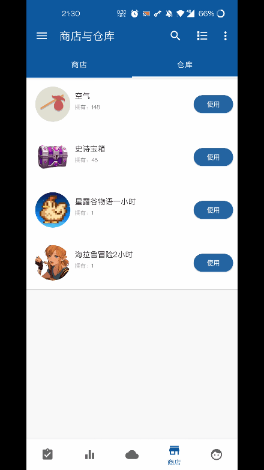

# 1.80.0 - 開箱

## 總覽

1. **開箱（隨機獎勵）**
2. **圖示歷史記錄**
3. **對單個事項設定懲罰係數**
4. **比較小但有用的改進**

<!-- more -->

---

## ▋ 開箱（隨機獎勵）

規劃已久的開箱/抽獎功能終於上線了，現在可以實現這樣的場景：

**完成待辦事項，獲得經驗值、隨機金幣和寶箱。**

**在寶箱中可以開出自己想要的多種獎勵，雙倍的隨機快樂。**

開箱功能會作為一種「商品使用效果」上線。

**你可以自由設定箱子內的物品內容、數量和獲取機率。**

**享受成為【遊戲策劃】的感覺吧~**

### **設定方式**

建立商品時，新增自定義使用效果【開箱】：

> 如果你是會員，還可以把操作按鈕的文案設定為“開啟”

然後可以設定箱子中的內容和比重：

### 關於機率比重的說明

一個商品的實際機率其實是 這個商品所佔的比重 / 所有比重之和。

比如只有兩個商品，比重設定都是50%，那其中一個商品的獲得機率其實就是 50% / (50%+50%) 也就是 50%。

按照這個思路，其實《人升》支援0.01%之類的機率設定：

比如兩個商品，其中一個比重是1%，另外一個是9999%。

> 可以完美模擬某些氪金遊戲的低機率（

### 機率表

在檢視商品詳情時，可以檢視商品的機率表：

> 這裏的機率文字的色值其實用的是某個deadgame的稀有度設定

###  後續發展

**目前還是初版，僅支援單抽，以後可能會擴充套件十連抽等等功能。**

⚠️而且暫時不支援分享開箱效果，後續會增加支援。

---

## ▋ 圖示歷史記錄

現在選擇的圖示會帶有歷史記錄，減少了重複選擇圖片的繁瑣操作。

並且，如果你在櫥窗看到了合適的圖示，現在可以直接將圖示新增到這個歷史列表中：

---

## ▋ 對單個事項設定懲罰係數

在進階設定中，可以啟用對單個事項設定懲罰係數的開關。

啟用後，即可對針對某些事項調高或者調低懲罰了。

---

## ▋ 比較小但有用的改進

- 使用者成就支援「複製」、「移至...」操作
- 裁剪圖片支援自由裁剪
- **現可設定自動備份的間隔，並且引入了Dropbox備份支援**
- 簡潔模式可進行配置（只顯示時間/顯示金幣數量）
- 支援在歷史頁面“重新開始”事項
- 支援從動態點選進入團隊詳情
- 填寫的動態內容增加持久化快取，防止輸入的內容和圖片丟失

 