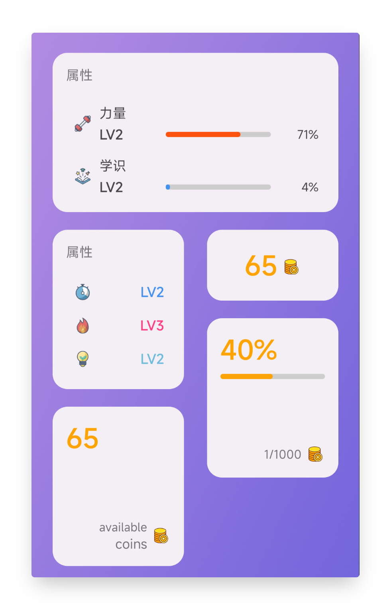
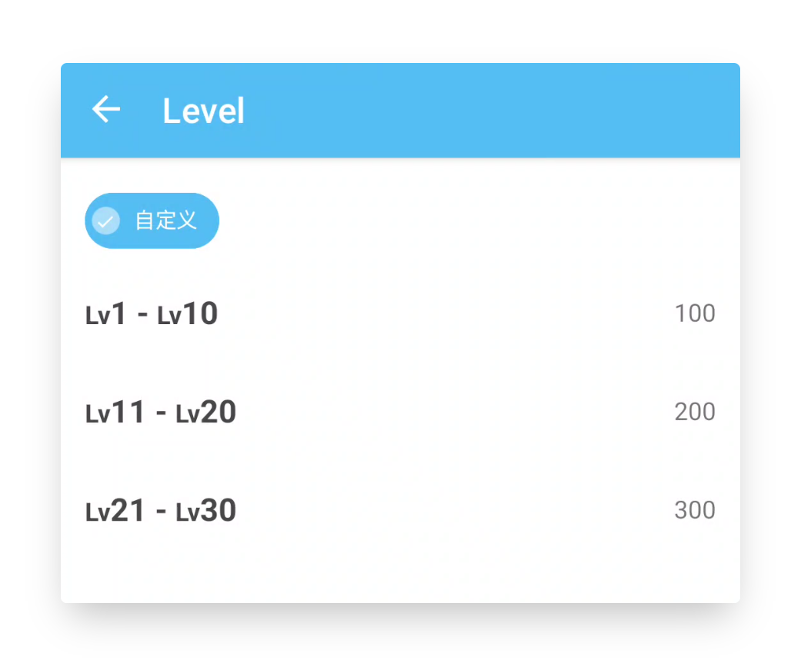
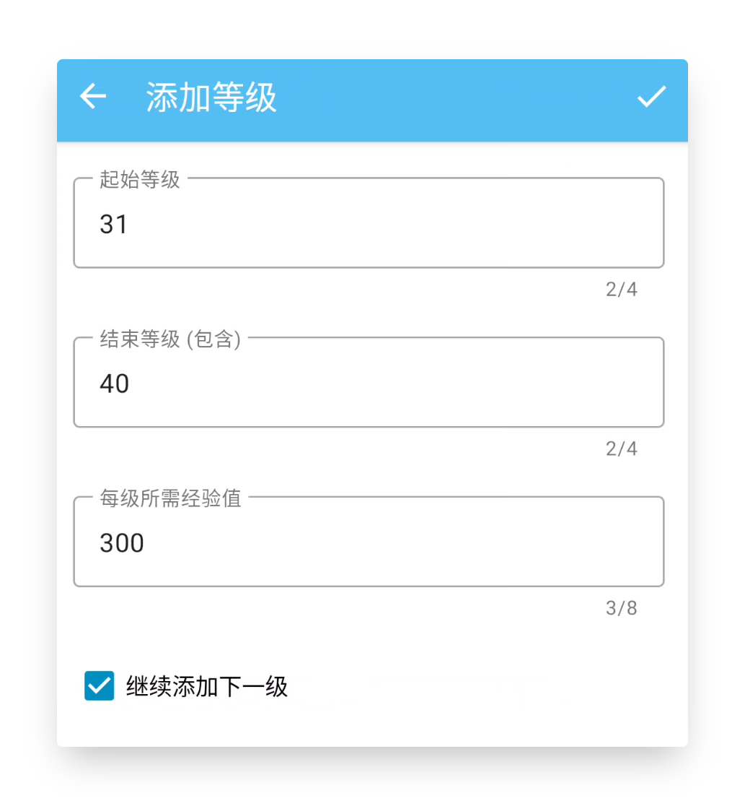
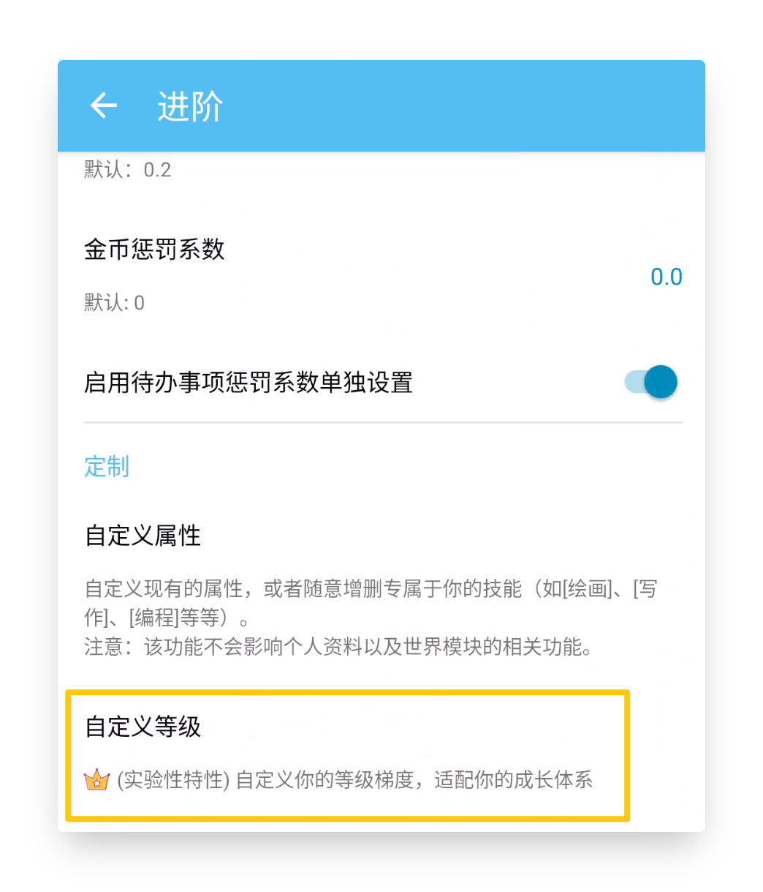
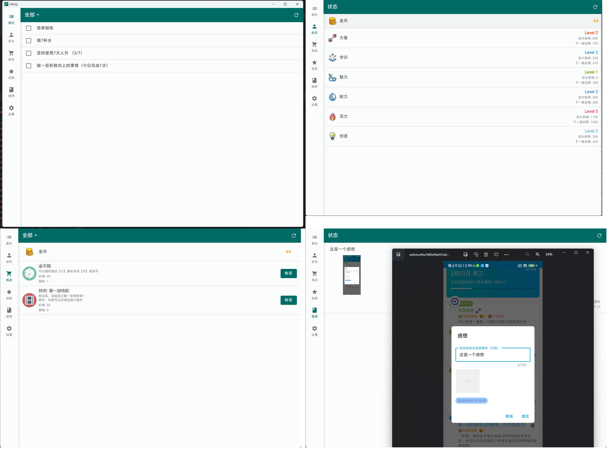
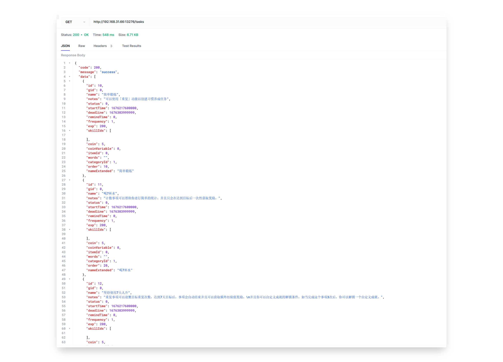
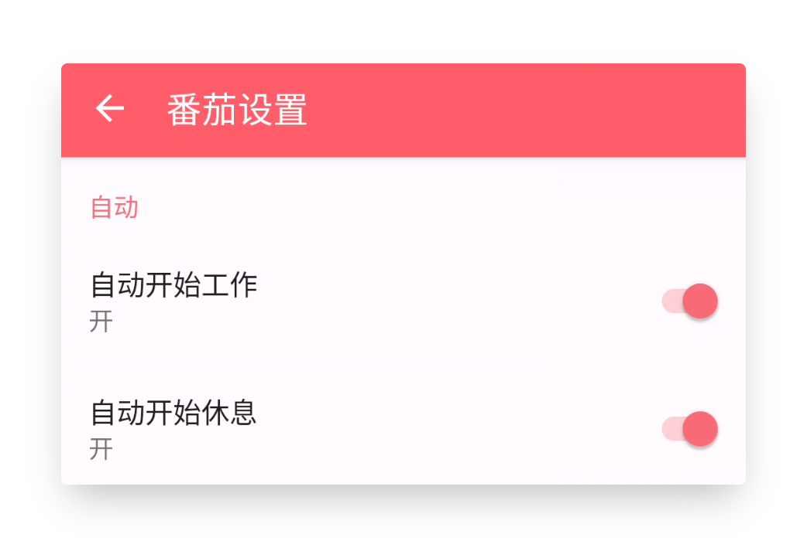

<h1 align="center" padding="100">v1.91. 0 - 狀態小部件、自定義等級梯度、簡易桌面端（會員內測）</h1>

大家久等了~

由於各種雜事，年底至今整體的開發和學習進度都延後了不少。

線上 v1.90.x 版本比我們想象的要穩定，雖然也有一定數量的小問題，但幾乎沒有大問題。

大家久等了~

由於各種雜事，年底至今整體的開發和學習進度都延後了不少。

最近終於回到了正常更新的狀態，v1.91 將會按照之前的「開發路線圖」帶來一些更新。

我們原定在 v1.91 引入整合谷歌日曆。但在實際開發途中遇到不少技術阻礙。爲了儘快推出更多的更新，我們目前暫時決定延後它，轉而先開發一些其他功能再回來研究谷歌日曆整合。

我們還嘗試涉足一個新領域：區域網桌面端的搭建。需要注意的是，該桌面端還十分簡陋且依賴於手機資料。

**v1.91 會進行一週或以上的會員內測。**

**如果您是會員，請在「擴充套件」頁面點選加入「alpha測試」，然後在「關於」頁面檢測更新即可獲取到內測版本。**

## 🔖總覽

1.   **🏆小部件：全新的狀態小部件（第一批）**
2.   **📈屬性：自定義等級梯度**
3.   **✨多端：桌面端**
4.   **✏️API：查詢完整列表資料和其他改進**
5.   **🍅番茄：自動開始工作、休息計時**
7.  **🚀其他：效能最佳化**
10. **完整更新日誌**

<!-- more -->

---

## 🏆小部件：全新的狀態小部件（第一批）

本次更新會帶來一系列跟屬性、金幣相關的小部件：

- 金幣（小、大、目標） 
- 屬性列表（小、大）

並且這僅僅是第一批~

### 📝 使用方式

一般是長按或雙指桌面縮放新增小部件。

**如果你是 MIUI 使用者，操作方式會複雜更多**，可以搜尋一下 MIUI 怎麼新增小部件，或者在 B 站檢視我們的影片教程。

---

## 📈屬性：自定義等級梯度

在 v1.91 版本中，你可以自定義你的等級梯度，即每個等級所需的經驗值。

你可以根據自己的喜好選擇更高的挑戰性，或是更平緩的增長曲線，現在都依你所願。

如果你只是想了解系統內建的等級表，也可以前往該頁面檢視。

### 📝 使用方式

側邊欄 - 設定 - 進階 - 自定義等級

---

## ✨多端：桌面端

這段時間，我們也嘗試了新的東西，並且隨著新的 API 更新，我們使它能夠查詢到各種詳細列表資料。

我們開發了一個**完全開源**的區域網桌面端軟體，它可以透過連線到您的手機並展示各種列表資料，並且支援一部分簡單操作：購買商品、完成任務、匯出感想圖片並用系統圖片瀏覽器檢視。

該軟體理論上支援 Windows、Linux 和 MacOS 系統（間接也算是使「人升」支援🍎了，雖然不是大家想要的🍎）。

當前，桌面端仍處於早期開發階段。

我們將繼續進行維護並新增更多功能，例如可以透過桌面端新增任務、以桌面端為適配介面的互動、將感想匯出為 markdown 格式等。

### 📝 使用方式

詳情可檢視「側邊欄 - 設定 - 實驗 - 雲人升」 一欄。

---

## ✏️API：查詢完整列表資料和其他改進

**數據接口**

作為桌面端的資料來源基礎，該版本我們提供了完整的資料查詢介面。

如果你是 Android 開發者，你可以透過我們的 LifeUp SDK 查詢「人升」中的各種資料。

如果你是其他任何型別的開發者，你可以透過使用 HTTP 協議呼叫《雲人升》API。這也是桌面端的做法。

如果你不瞭解開發，也不用擔心：

首先，現在是最好的學習機會。

第二，上述資料的 API 開放，意味著社羣的開發者可以使用這些資料進行二次開發。

比如，他們可以設計任務列表頁面、商店頁面，進行更復雜的二次開發（比如折扣、買賣大頭菜功能？）。

二次開發的成果也可以惠及到所有使用者（真正的 MOD）。

具體介面後續會補充到 API 文件中。

**其他 API 介面改進**

新增

- ATM 存取款
- 商品設定“是否禁止購買”
- 任務設定“標籤顏色”
- 直接設定 ATM 餘額
- 簡單查詢指定商品詳情
- 彈窗介面增加第三種按鈕和操作選項

行為變動

- confirm_dialog 彈窗 API，如果不提供某些按鈕的文字或操作的話，該按鈕現在會直接不展示。

  這將提供更高的彈窗控制靈活度，比如你可以設定一個無按鈕的純文字彈窗，用於顯示文字、激勵語。

- penalty 懲罰 API，以往版本扣除商品最多100件，現在將限制擴充套件到了9位數。

### 📝 使用方式

檢視我們的 API 文件以及 GitHub 倉庫。

---

## 🍅番茄：自動開始工作、休息計時

該版本還將引入自動開始番茄鍾功能。

請確保你的手機已經進行了「相容性配置」，避免系統中斷番茄鐘的執行。

**注意，開啟「自動開始休息」後，原先的額外統計的小倒計時功能將失效。**

### 📝 使用方式

前往 番茄 - 右上角設定 頁面。

---

## 🚀其他：效能最佳化

透過使用者反饋和線上資料收集，我們發現在大量資料的情況下，“人升”應用中某些資料查詢的效率會顯著降低。

對於一款待辦事項工具類應用，穩定性和長期性是至關重要的。

因此，在這個版本中，我們針對大量資料的場景進行了一系列最佳化。這些最佳化能夠顯著提高大部分列表頁面的載入速度（特別是待辦事項頁面）。

我們將繼續針對這些場景進行最佳化。

---

還沒有關注公眾號？

關注一波小透明吧.jpg

後續更新介紹等都會在公眾號釋出。

![[Pasted image 20220522010757.png]]

---

## 完整更新日誌

**1.91.0-alpha01 (2023/02/13)**

**✨特性**

1. 支援自定義等級梯度
2. 首批新增小部件
   - 金幣（小、大、目標）
   - 屬性（小、大）
3. 支援透過 Content Provider API 查詢“人升”中的大部分資料詳情資訊，包括：
   - 提供新版《雲人升》
   - 提供簡陋的初版區域網桌面版（Windows、Linux、MacOS）
4. 番茄計時記錄支援多選刪除
5. 番茄鍾支援設定自動開始休息和工作
6. API 改進和新增欄位，包括：
   - ATM 存取款
   - 商品設定“是否禁止購買”
   - 任務設定“標籤顏色”
   - 直接設定 ATM 餘額
   - 簡單查詢指定商品詳情
   - 彈窗介面增加第三種按鈕和操作選項

**♻️最佳化**

1. 改進大量資料時的查詢、處理速度和效能表現

2. 修復自適應圖示的不正確邊距問題

3. 最佳化番茄計時記錄的顯示效果

4. 改進恢復備份時的互動表現

5. 增加透過 Google Play 獲得會員許可的 UI 體現

6. 當從檔案系統直接匯入備份時，如果選中的不是“人升”的備份檔案，會提供禁用該一鍵匯入特性的提示

7. 在選擇商品彈窗時，搜尋商品後，自動關閉輸入法

8. API 行為變動，包括：

   - confirm_dialog 彈窗 API，如果不提供某些按鈕的文字或操作的話，該按鈕現在會直接不展示。

     這將提供更高的彈窗控制靈活度，比如你可以設定一個無按鈕的純文字彈窗，用於顯示文字、激勵語。

   - penalty 懲罰 API，以往版本扣除商品最多100件，現在將限制擴充套件到了9位數。

**🐛修復**

1. 修復番茄計時等頁面會在某些情況下在尾部顯示“載入中”的問題
2. 修復某些第三方庫導致的崩潰問題
3. 修復將番茄鍾放置於底部導航欄時，會因為提示彈窗而崩潰的問題
4. 修復在瀏覽他人個人主頁時，顯示的屬性值異常的問題
5. 修復屬性等級降低 API 事件、通知未能正確傳送的問題
6. 修復某些長按-編輯頁面的互動問題
7. 修復圖片管理、合成頁面的部分邊距異常問題
8. 修復部分彈窗不可滾動，導致橫屏下無法正常使用的問題

**✨特殊釋出：雲人升 v1.1.1（2023/02/13）**

1. 支援 Content Provider 資訊讀取和授權操作。
2. 在服務啟動期間，申請 Wake Lock，以便在鎖屏時也能夠響應操作。
3. 增加 Content Provider 的一系列介面。

**✨特殊釋出：人升-桌面端 v1.0.1（2023/02/13）**

初版釋出，需要搭配《雲人升》和手機端使用。

支援以下操作：

- 查詢任務、清單、商品、成就、商品、感想列表。
- 購買商品、完成任務。
- 支援使用桌面端圖片瀏覽器檢視感想大圖。

---

> 蹭個熱度
>
> 潤色助理：ChatGPT
>
> 程式碼編寫、單元測試編寫助理：GitHub Copilot
