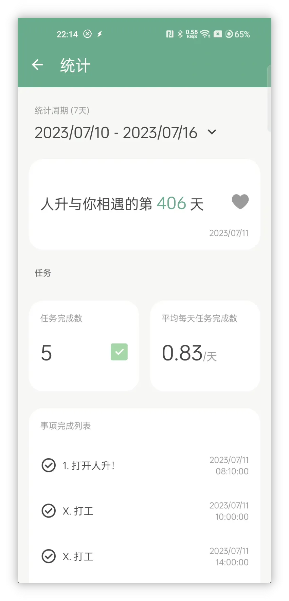
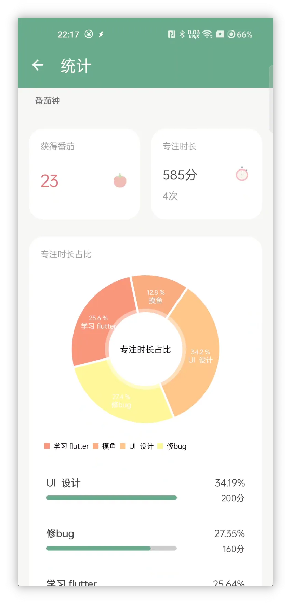
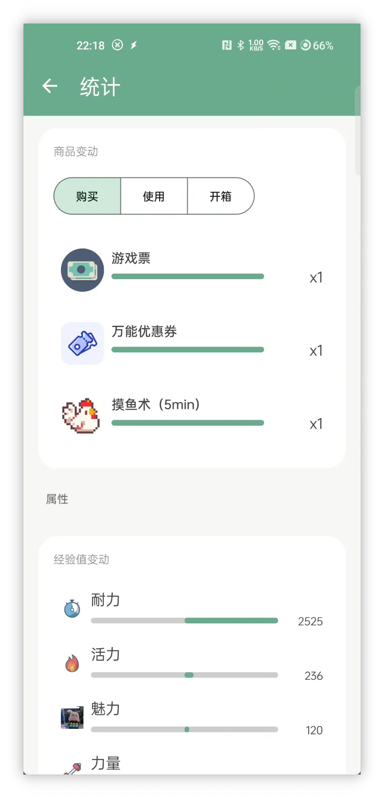
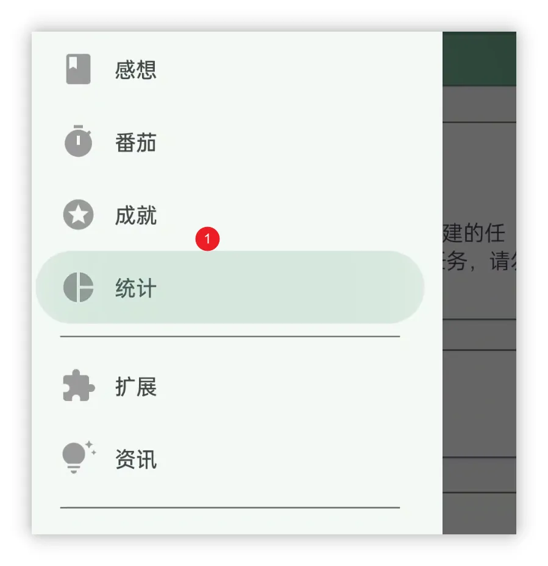
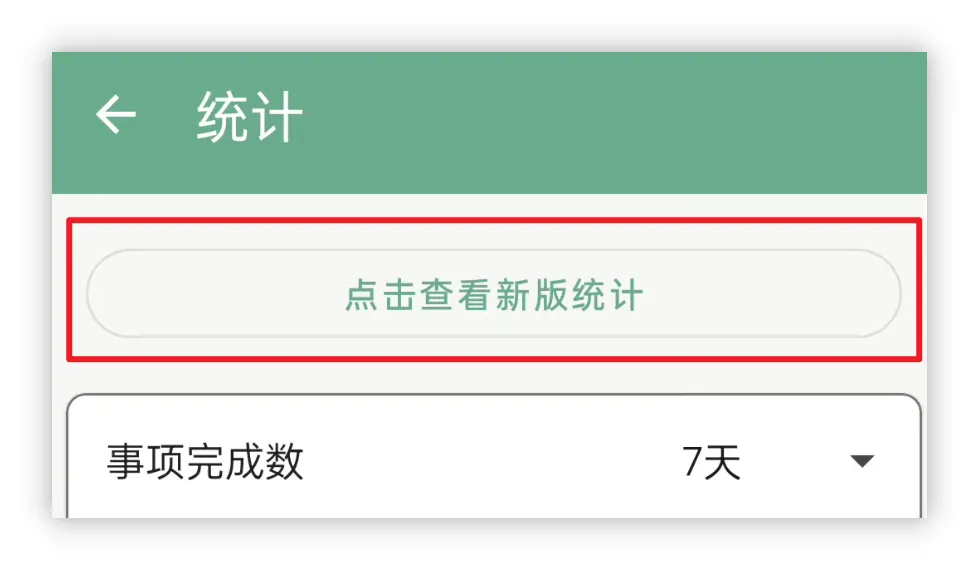
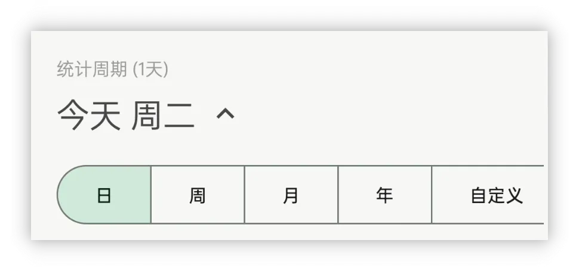
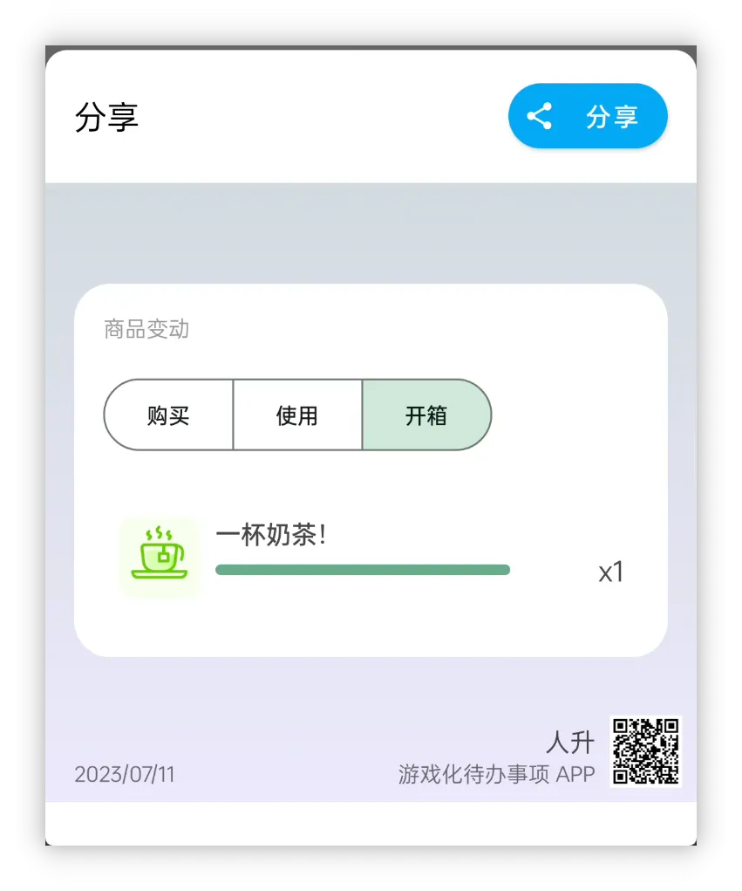
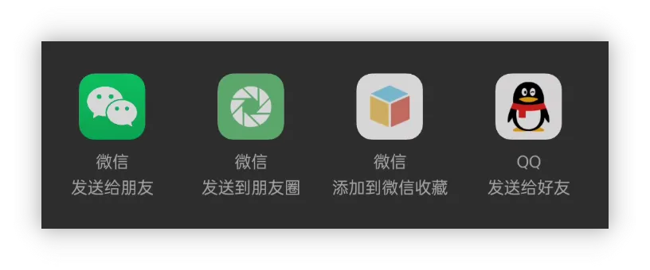

![[cover 1.jpg]]
<h1 align="center" padding="100">v1.92.0 - 統計2.0</h1>

## 簡介
該版本我們帶來了全新設計的統計功能，目前正在會員內測中，歡迎參與內測~

## 📈統計 2.0

統計和資料覆盤也是我們提升生產力的重要一步。

> 回顧自己的努力：既能以資料激勵自己，也能從資料中挖掘問題，改進自己的計劃。

為此，我們推出了【統計 2.0】，為你帶來一系列有趣的資料統計。

這些統計都是基於我們以往提供的原始歷史資料（任務歷史、計時歷史、倉庫使用歷史等）。

 

### ❓如何使用？

升級 v1.92.0 內測版本後，點選【統計】頁面，再點選頂部的【點選檢視新版統計】即可~

 

### 📊統計項

統計 2.0 會涵蓋各個模組的資料統計：無論是**番茄**的專注任務佔比、每天的平均番茄數、每天的**屬性**變動、**商品**購買統計、**任務**完成列表等都應有盡有。

 

### ⏰時間篩選

本次統計 2.0 支援了**高自由度**的時間範圍篩選，你可以快捷檢視當天、當週、當月、當年，自定義時間範圍。

你的人升應由你做主，不必等到年末檢視年終總結，也不必害怕再也沒法看到每年的年終總結。

在人升中，可以隨時檢視**往年的年終總結**，好奇自己的2022年年終總結資料嗎~趕快更新試試吧！

**不同的時間範圍選擇，可能會展示不同型別的統計項。**

 

### 👥分享

歡迎去朋友圈曬出你的**人升軌跡**！

現在你**只需要長按**你想要分享的資料統計卡片，即可生成分享卡片，並一鍵分享到其他應用（如微信朋友圈、QQ等）。

 

### 🍪畫餅時間

雖然目前的統計幾乎涵蓋了各個模組，但開發下來仍覺得有很多改進空間。

一些已知問題：

- 時間範圍的互動改進（比如 2020年 就在使用的使用者，應當直接提供一個【2020年】統計的選項）
- 資料計算耗時問題，增加載入進度展示。
  - 如果選擇的時間段的資料量比較大，目前計算可能會比較耗時，而且沒有明確的進度顯示
  - 長列表生成分享卡片，可能會遇到生成出來了，但是展示不了的問題（不影響分享）

規劃：

- 持續增加各種統計項和統計維度，比如現在是沒法做到回顧某一天的屬性值的。
- 新舊統計合併。
- 做好統計和狀態的專案區分，統一重新設計【狀態】+【我的】+【統計】頁面。

---
除此之外，我們還修復了近段時間反饋的大量問題和一些問題修復。

詳情可以查閱下述的更新日誌~

## 完整更新日誌

**1.92.0 (2023/07/11)**

> 會員內測釋出時間

**✨特性**

1. 統計2.0
1. 分享卡片

**♻️最佳化**

1. 現在支援為“不可購買”的商品設定價格，並用於退貨等場景
2. 當在設定中關閉“獨立設定任務懲罰”後，不再顯示懲罰按鈕
3. 最佳化團隊詳情中子任務的展示 UI
4. 最佳化感想的展示 UI

**🐛修復**

1. 修復當屬性裁剪樣式改為“圓角矩形”後，編輯圖示可能會長期顯示老圖示的問題

