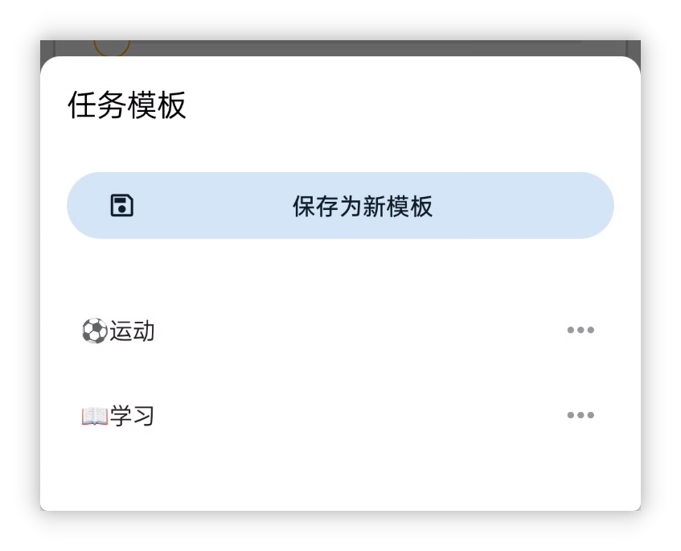
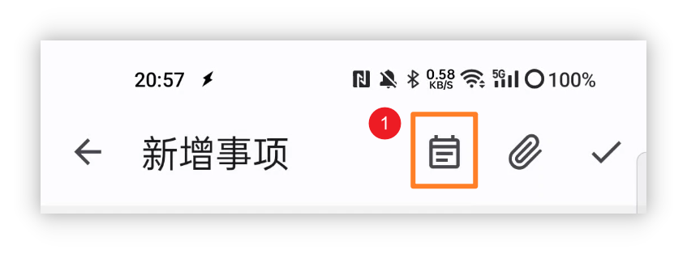
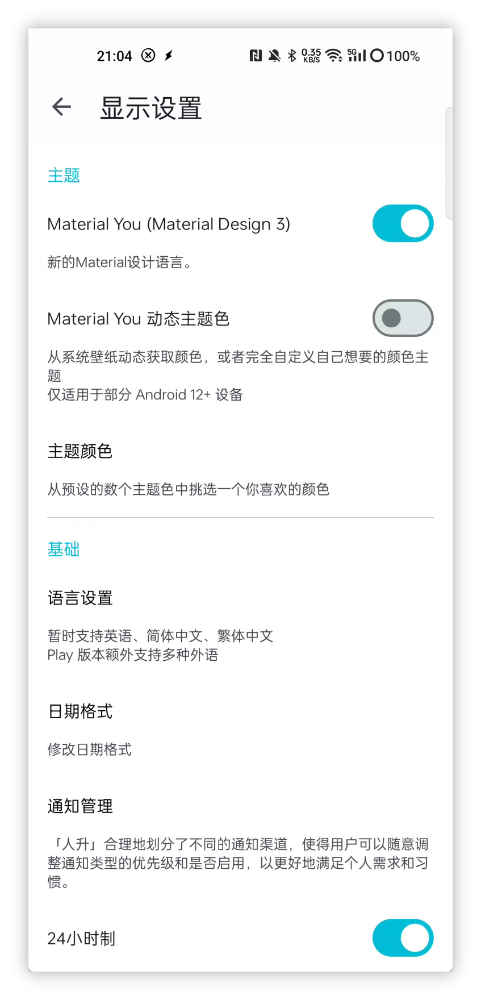
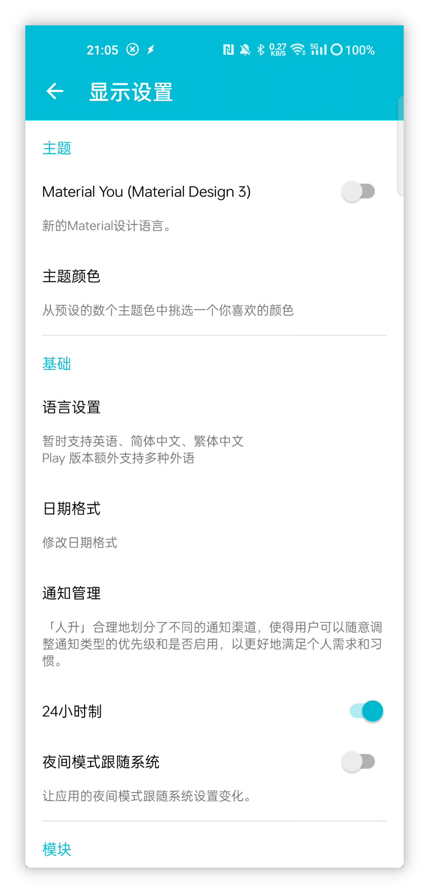
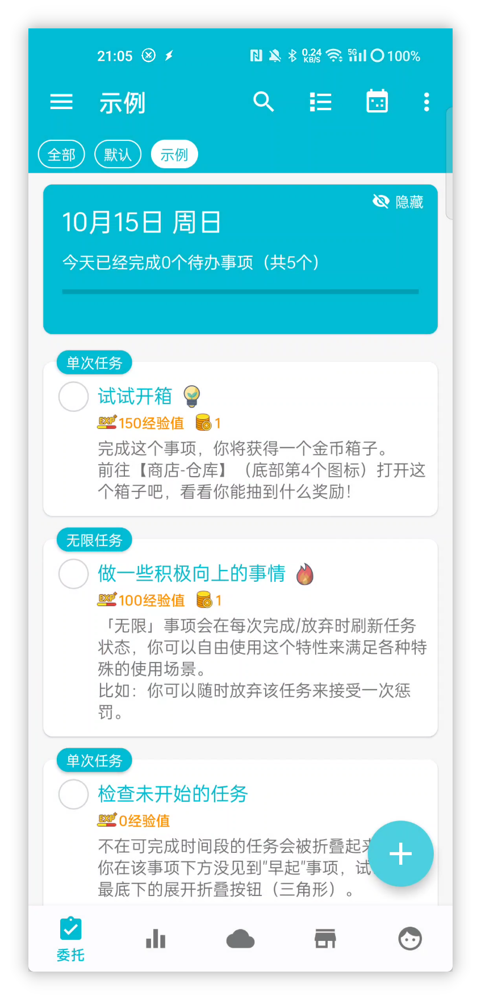
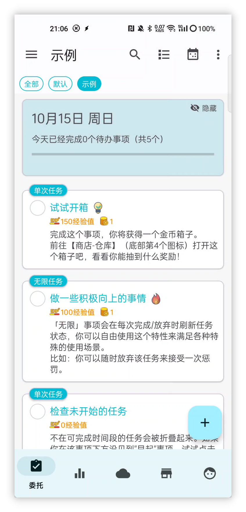
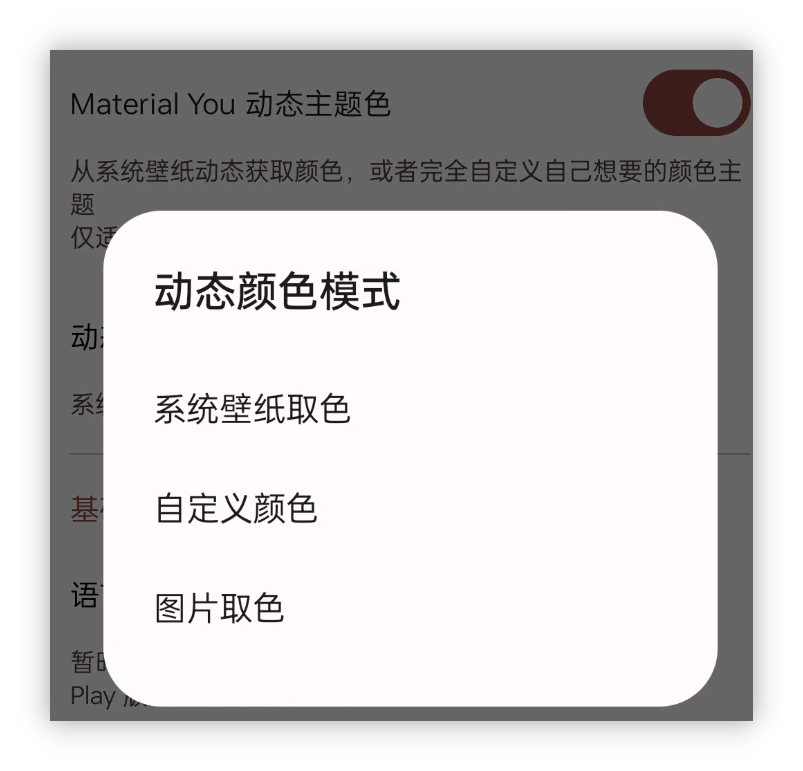
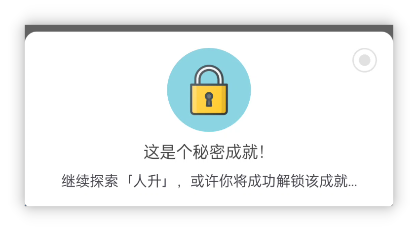

![[cover 1.jpg]]
<h1 align="center" padding="100">v1.93.0 任務模板與新主題</h1>

## 簡介
許久不見~

本次更新帶來了任務模板、秘密成就，以及完整適配了新的設計語言 Material You 等特性。

部分功能模組如感想、API 也有著部分改進和最佳化。

**❓如何加入內測？**

如果你已經是會員的話，可以在應用內-關於頁面，點選**檢測更新**獲取內測版本。

目前版本正在“會員嚐鮮”渠道釋出，後續測試穩定後，會輪動到其他渠道。

**📧如何反饋問題？**

如果你在內測途中遇到了任何問題，歡迎隨時透過郵件、會員渠道、QQ 群等方式反饋~

## 一、📋任務模板

該版本引入了內建的任務模板功能。而不再需要使用“複製任務”、“API”的方式間接實現了。

使用者在新建/編輯任務時，可以將當前的選項儲存為模板。

未來建立任務時，可以一鍵匯入之前的獎勵設定、任務設定等等。

 

### 📕如何使用？

新建/編輯任務時，點選頂欄的任務模板按鈕即可。

任務模板會記錄你設定的絕大多數內容，但目前並不包含期限時間。

## 二、🎨Material You 主題

--

該版本完整適配了 Material You 的 UI 設計語言（主題）。

這一套設計語言更佳現代化，並且觀感上會更佳簡潔。也是未來官方主推的 UI 樣式之一。

並且由於 Material You 有個核心特色是【每個人都能擁有不一樣的主題色】。

這使得《人升》也能引入動態從桌布取色、自選主題色等新機制了。**（但這一點需要裝置支援。）**

 

### 📕如何使用？

如上圖所示，開啟【側邊欄 - 設定 - 顯示】即可調整相關選項。

如果你的裝置不支援動態主題色，則還是隻能透過預設的主題色中挑選。

但如果你的裝置支援動態主題色的話，你可以開啟動態主題色功能，並高自由度地自定義你想要的主題色：

## 三、✨更多特性

**UI 主題**

1. 完整適配 Material Design 3
2. 支援設定 Material Design 3 主題的顏色來源：自選顏色、從桌布取色、從圖片取色等
3. 部分動畫效果改進：彈窗等
4. 最佳化“邊到邊”（沉浸式）適配效果

**任務**

1. 支援任務模板
2. 詳情頁面的統計，支援切換依據時間標準。並且最佳化了預設選項
3. 歷史頁面支援搜尋任務名稱，並調整了相應的 UI 和互動

**成就**

1. 支援設定秘密成就
2. 新增成就時，支援“繼續新增下一個成就”

**屬性**

1. 支援隱藏屬性

**番茄**

1. 支援編輯計時記錄
2. 番茄頁面支援完成任務（暫停狀態下，長按選擇的任務）

**感想**

1. 支援在感想頁面直接建立感想

**API**

1. 增加`使用商品`的 API

2. 增加`隨機` API

3. 增加`直接編輯經驗值`的 API

4. `商品`API現支援調整“禁止使用”、“標題顏色”、“操作文案”等引數

5. `商店設定` API 支援“silent”引數

6. 支援`time`時間佔位符

   現在你可以不借助自動化工具，就可以使用 API 設定明天截止、下個月截止之類的任務了

---

除此之外，我們還修復了近段時間反饋的大量問題和一些問題修復。

詳情可以查閱下述的更新日誌~

### ♻️最佳化

1. 部分顯示資料 ID 的地方增加字首
2. 團隊動態顯示最佳化
3. 嘗試解決部分 Toast 提示太長顯示不全的問題
4. 最佳化了小部件完成團隊時，部分邏輯與應用內不一致的問題
5. 統計頁面：在選中“自定義”時間範圍後，再次點選“自定義”，現在可以觸發重新選擇日期
6. 相容鴻蒙 4 上進度條通知沒法顯示操作按鈕的問題
7. 最佳化通知請求的互動邏輯
8. 最佳化輸入法會擋住【目標重複次數】輸入的問題
9. 現在建立任務時，會記錄使用者選擇的非具體的開始時間（比如自動、期限當天），編輯時，會恢復此類選項而非具體時間，避免導致編輯的時間不符合預期
10. 建立任務時，如果出現了重複不符合預期的警告，現在也會在“檢查重複”彈窗上顯示
11. 增加印尼語
12. 更新翻譯

## 🐛修復

1. 修復某些情況下，世界模組可能會卡載入（一直轉圈圈）的問題
2. 修復某些情況下，商店/倉庫可能會一直顯示載入（一直轉圈圈）的問題
3. 修復透過 content provider 呼叫含 UI 的 API 時，可能會發生錯誤的問題
4. 修復任務排序可能不符合預期的問題
5. 修復統計頁面選擇“自定義”時間範圍後，資料不正確的問題
6. 修復通知請求的彈窗不支援滾動的問題
7. 修復世界模組搜尋某些情況下會顯示所有內容的問題
8. 修復【顯示已完成】選項也會展示被凍結的任務的問題
9. 修復統計頁面平均值計算問題

