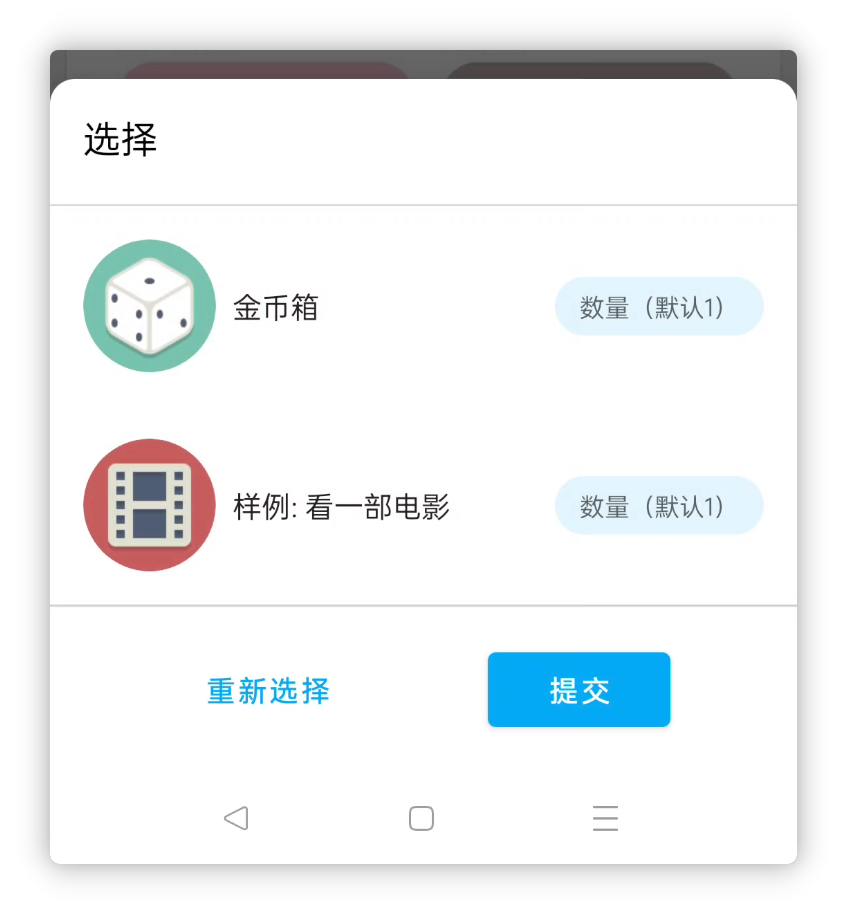
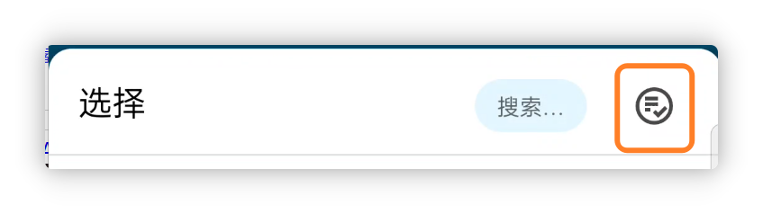
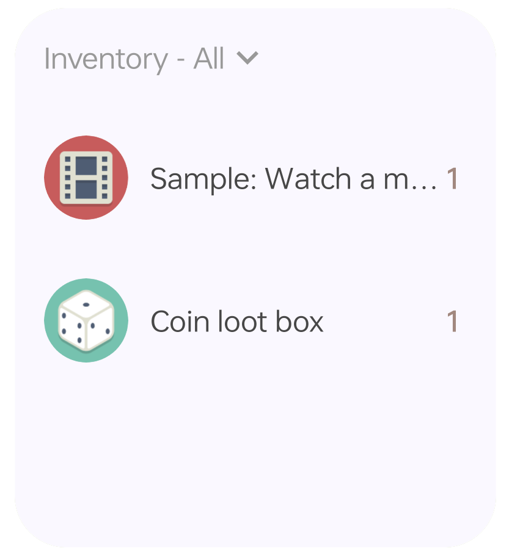
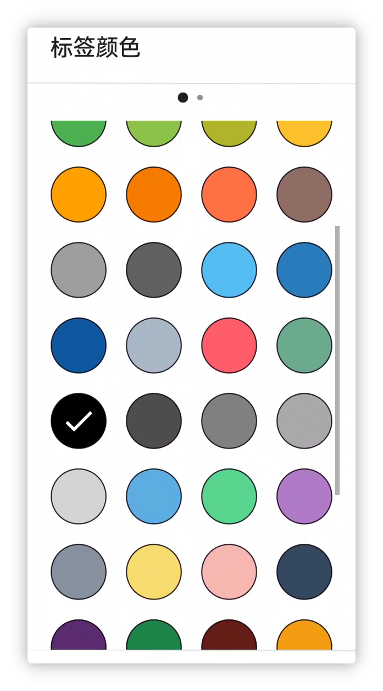
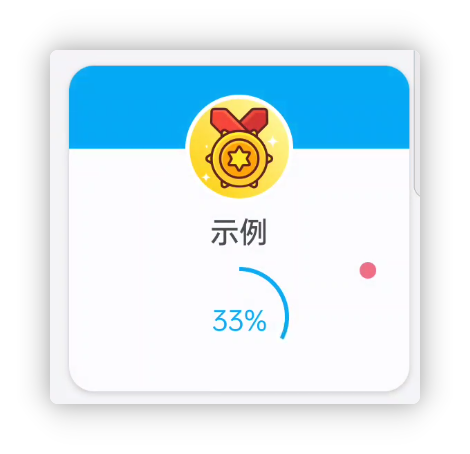
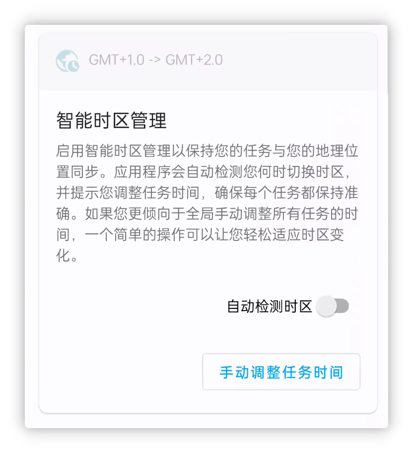
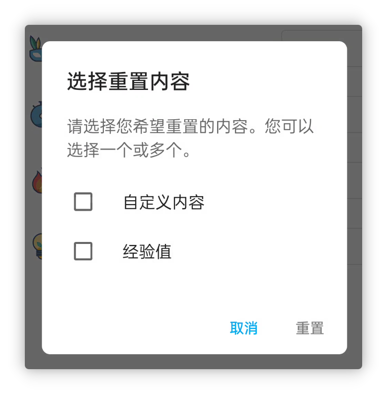

<h1 align="center" padding="100">v1.94.0 多選商品獎勵</h1>

## 簡介
本次更新主要帶來了多選商品獎勵、倉庫小部件等特性，其次仍是大量的最佳化、效能提升和問題修復。

**❓如何加入內測？**

如果你已經是會員的話，可以在應用內-關於頁面，點選**檢測更新**獲取內測版本。

目前版本正在“會員嚐鮮”渠道釋出，預計本週測試穩定後，會輪動到其他渠道（會員內測-穩定）。

**📧如何反饋問題？**

如果你在內測途中遇到了任何問題，歡迎隨時透過郵件、會員渠道、QQ 群等方式反饋~

## 一、✅多選商品獎勵

現在，在人升中各個選擇商品的地方，基本都支援了多選商品。而不再需要透過設定開箱、合成的方式來實現多種獎勵。

比如，你可以：

- 直接為任務設定多種商品獎勵
- 設定開箱時，直接挑選多個商品，再一次性設定機率
- 直接為成就、子任務設定多種商品獎勵

 

### 📕如何使用？

選擇商品時，點選頂部的多選按鈕即可。

> 需要注意的是，部分場景可能僅支援單選。

## 二、🔧倉庫小部件

該版本引入了兩種尺寸的倉庫小部件。

現在你可以直接在桌面上檢視倉庫的內容，並快捷使用倉庫裡的商品了。

 

### 🚀 最佳化和問題解決

儘管我們數個版本前推出了商店小部件。

但上線後，我們陸續收集到了一些崩潰或者異常問題。

比如由於小部件的系統傳輸限制，如果商品過多甚至可能會導致應用崩潰。或者切換清單異常。或者自定義圖片載入失效。

在該版本中，我們也找到了合適的解決方案。現在商店、倉庫小部件應該支援能夠顯示大量的商品，我們測試過接近1000件商品的商店小部件仍能夠正常使用和載入。（當然，不推薦這樣幹）。

 

### 📕如何使用？

一般是長按系統桌面即可建立小部件。

如果你的裝置是小米、紅米裝置（MIUI/HyperOS），MIUI/HyperOS新增小部件的方式較為隱藏，請查閱相容性配置文件檢視如何新增小部件。

## 三、✨更多特性

**UI 主題**

1. 自定義（任務、商品文字）顏色增加了更多的預設值
1. 適配 Android 14 單色自適應圖示特性
1. 增加了很多語言適配（Google Play版本）

**成就**

1. 如果存在未領取獎勵的成就，成就清單現會顯示小紅點。

**任務**

1. 懲罰任務的子任務現會正常執行懲罰邏輯
1. 增加【智慧時區管理】，如果你涉及到跨時區工作，人升也支援自動檢測時區變動，並且支援全域性調整時間
1. 詳情頁面的統計依據現支援記憶上一次的選擇，並且我們最佳化了部分場景的預設值
1. 最佳化了【我的】頁面的連續完成任務天數的寬限處理，現在應該某一天忘記完成任務，補打卡也能續上連續完成天數

**屬性**

1. 支援刪除經驗值記錄
1. 支援重置單獨一個屬性的經驗值

**小部件**

1. 現在點選商店、倉庫小部件的空白處，支援直接進入小部件所指向的清單，而非上一次清單
2. 任務小部件現會顯示計數任務的進度

**API**

> API 相關的文件在本文釋出時可能仍未更新，我們預計會在本週內更新，請等待一會~

1. 增加編輯番茄記錄的API
1. 完成任務的API現也支援正常處理懲罰任務
1. 完成任務的API現也支援處理計數任務（增加`count`引數）
1. 完成任務的API現支援獎勵係數引數
1. 調整商品API支援更改商品所屬清單id
1. 新建、調整商品的API支援排序依據引數
1. 跳轉API現支援跳轉到使用商品彈窗
1. 部分引數的定義不夠統一，現已統一處理。如`itemId` -> `item_id`
1. 增加正計時開始、暫停、結束的廣播通知
1. 調整商品的API的`title_color_string`現支援傳空字串以恢復預設值
1. 完成任務的廣播增加清單id
1. 開箱、合成現也會觸發使用商品的廣播

---

除此之外，我們還修復了近段時間反饋的大量問題和一些問題修復。

詳情可以查閱下述的更新日誌~

### ♻️最佳化

1. 新增或編輯任務時，如果沒有選擇屬性，輸入經驗值增加警告提示
1. 最佳化了上傳重試記錄
1. 最佳化了自定義等級頁面的標題展示和輸入限制
1. 最佳化了經歷過大量重複的任務的撤銷效能耗時問題。
1. 重構了使用商品彈窗、日曆介面等邏輯。
1. 最佳化了任務提醒的相關邏輯，確保已經刪除或者來自之前資料的提醒不會再被髮出。
1. 最佳化了備份介面的相關等待中文案。
1. 在自定義屬性頁面選擇的圖片，現也會加入到歷史選擇中。
1. 編輯番茄記錄時，現會嘗試修正（增加、減少）正確的番茄數。

### 🐛修復

1. 修復統計、備份相關的系統成就在重構後未正常觸發的問題。
1. 修復隨機API搭配toastAPI小部件使用等場景可能會跟預設的toast衝突問題。
1. 修復了從小部件進入任務詳情，在某些場景下不會重新整理任務詳情的問題。
1. 修復了某些特殊情況可能會導致錯誤多次開箱的問題（提前預支商品庫存）。
1. 修復在詳情頁面編輯沒有子任務的任務，並新增子任務，返回後不會展示子任務的問題。
1. 修復了某些特殊情況，無法編輯金幣獎勵的問題。
1. 修復了某些情況，領取團隊事項可能不生效的問題。
1. 修復了MD2下某些底部彈窗的樣式異常問題。
1. 修復了番茄鐘的追加時間取值可能錯誤的問題。
1. 修復了經驗值變動小部件的顏色條可能顯示不出來的問題。
1. 修復了某些任務在日曆-進行中可能沒法正常顯示出來的問題。
1. 修復了歷史、感想等頁面的某些列表載入問題。
1. 修復了完成任務API連續呼叫兩次沒法連續完成兩次任務的問題。

