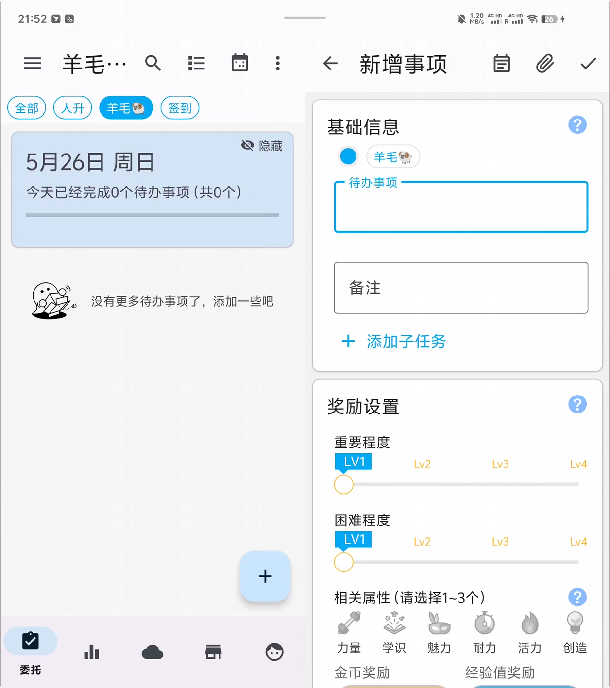
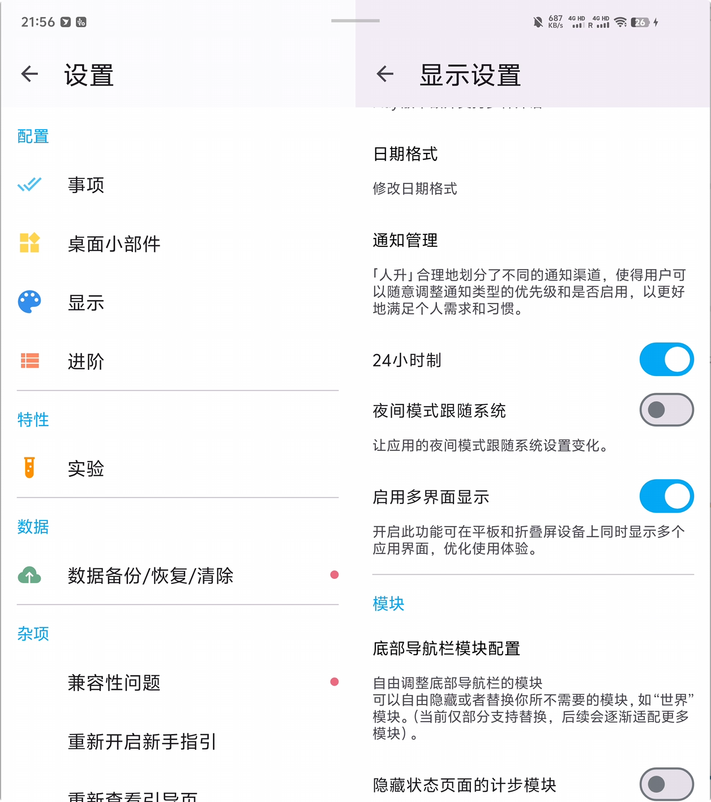
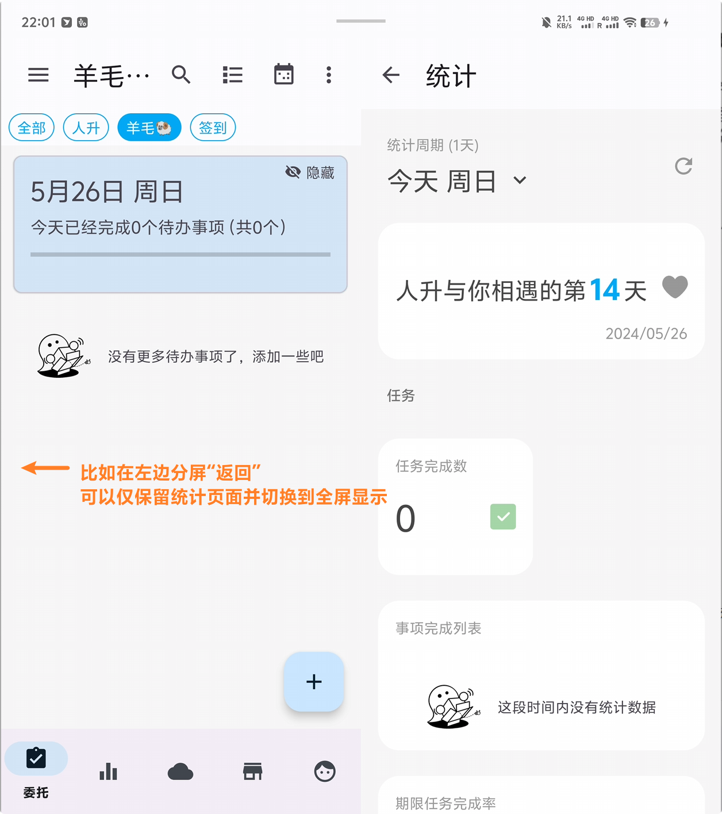

<h1 align="center" padding="100">v1.95.0 大螢幕適配</h1>

## 簡介
本期更新主要帶來了大螢幕裝置的顯示最佳化，支援應用內分屏顯示多個介面（平行視界）。

除了這一點之外，還帶了一部分最佳化和問題修復。

比如商店、倉庫小部件支援了與應用內一致的裁剪顯示，統計圖表的資料顯示最佳化等。

即便是非大螢幕裝置，也推薦更新~

## 一、大螢幕顯示最佳化

如果你使用的大螢幕裝置，且系統支援該功能的話，現在**人升**支援分屏顯示不同的介面。

不同的介面會有著不同的分屏規則（比如成就頁面會優先左邊顯示成就清單，右邊切換到清單內的成就列表），使用者也可以透過在不同的分屏中“返回”來讓另外一邊螢幕佔滿全屏。

如果你對當前的分屏規則有任何反饋的話，歡迎隨時到 QQ 頻道或者 GitHub issues 頁面提交反饋~

 

### 📕如何使用？

- 更新後，該功能預設開啟。
- 可以前往【設定】-【顯示】-【啟用多介面顯示】調整功能是否開啟。

⚠️ 注意，該功能需要裝置系統支援。並非所有大屏裝置支援。如果你的裝置不支援的話，可以檢視是否有系統更新。

## 三、✨更多最佳化和近期更新日誌

**🎉1.95.0-rc01 (2024/05/24)**

**✨特性**

**重點更新**

1. 支援為平板、摺疊屏等大屏裝置應用內分屏顯示

**♻️最佳化**

1. 商店、倉庫小部件的圖片現重新支援了應用內一致的裁剪效果
2. 統計頁面，當只選擇一天時，現在也支援顯示折線圖

**🐛修復**

1. 修復了編輯 API 任務時，編輯頁面顯示的任務型別不正確的問題
2. 修復了統計頁面中任務完成、放棄、逾期數統計計算異常的問題

**1.94.3 (2024/05/10)**

**♻️最佳化**

1. 當系統深色模式變動時，現會嘗試更新小部件適配主題
2. 當隱藏了【世界】模組後，系統成就的小紅點提醒不再計算【世界】模組相關的資料

**🐛修復**

1. 修復了多選商品時的低機率崩潰問題
2. 修復了與彈窗相關的低機率崩潰問題
3. 修復了呼叫修改商品 API 時，倉庫小部件可能不會重新整理的問題
4. 修復了倉庫小部件可以使用【不可使用】的商品的問題

**1.94.2 (2024/04/26)**

**🐛修復**

1. 修復了計算任務當前次數異常的問題（會導致設定了目標重複次數的任務進度不準確）
   - 該修復會回滾之前的最佳化撤銷任務的效能的改動，待後續實現更合理的解決方案

