<h1 align="center" padding="100">v1.96.0 獲得時自動使用商品</h1>

## 簡介
本期更新主要支援了：

1. 完成任務或解鎖成就時直接使用商品，觸發商品效果
2. 單次使用商品的數量限制放寬至 1000
3. 現購買開箱、合成類商品也支援直接使用（開箱/合成）
4. 團隊任務也將支援釋出感想至本地感想

## 一、完成任務或解鎖成就時，直接使用商品

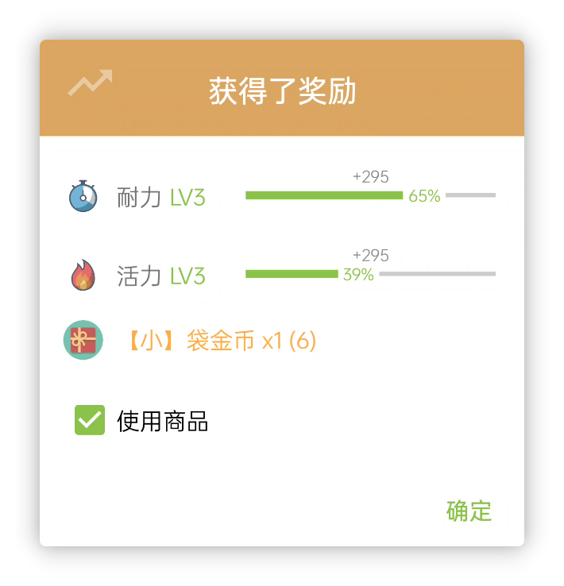

 

### 📕如何使用？

- 該功能對任務（事項）、成就都生效。
- 目前該功能不會預設開啟，你需要編輯任務或成就的商品獎勵，勾選自動使用商品才針對該任務或成就啟用該功能：

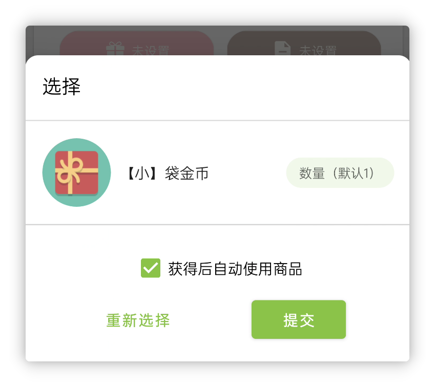

隨後在完成任務時，即可二次確認是否要立即使用商品。

**該功能適配所有的商品使用效果，包括：**

- 經驗值增減
- 金幣增減
- 觸發 URL 跳轉（API）
- 倒計時
- 開箱
- 簡易合成

不過使用該功能的話，有一點需要特別留意：

商品的使用效果非常複雜，**人升是不支援撤銷商品使用的。**

如果你完成了任務，並且使用商品，然後再撤銷完成，這實質上可能會導致你的商品數量扣至負數。

這也是為什麼完成任務的彈窗會有二次確認是否要使用商品。

未來版本也會針對擁有數為負數的商品加強互動提示。

## 二、“使用”商品最佳化

除了上述功能外，我們針對“使用”商品的邏輯也做了更多的最佳化：

1. 購買開箱、合成類商品，現在也支援直接使用
2. 單次使用包含特殊使用效果的商品的最大數量限制從100調整至1000（包含開箱，但URL效果比較特殊，仍限制為1）

## 三、團隊任務釋出本地感想

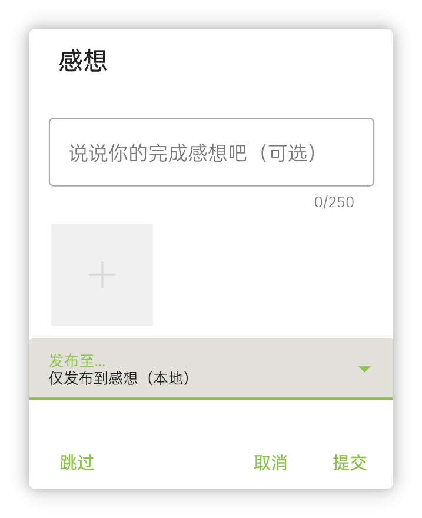

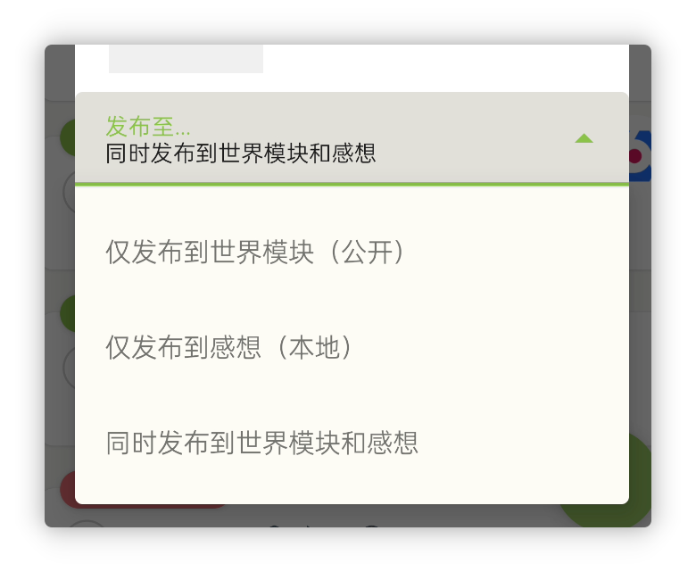

現在完成團隊任務，你可以自由選擇釋出感想的地方。

## 四、獎勵、懲罰彈窗重構

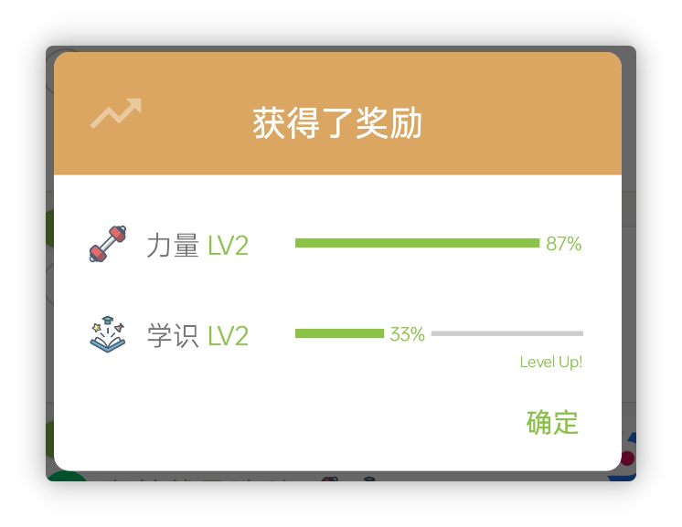

我們重構了屬性獎勵、懲罰彈窗的相關邏輯，重構後：

- 它將支援任意數量的屬性，也支援不同的數值增減，所以我們能夠同步作出一些改進：
  - 所以我們移除了商品使用效果中對屬性數量的限制
  - 逾期後的經驗值彈窗將不再會被分割成多個彈窗顯示，而是合併成同一個彈窗
  - 商品的使用效果也不會根據不同的數值而拆分多個彈窗顯示，而是合併成同一個彈窗
- 統一和改進過的動畫播放效果，現在會更加流暢與一致

## 五、其他一些小功能

**支援為歷史任務計時**

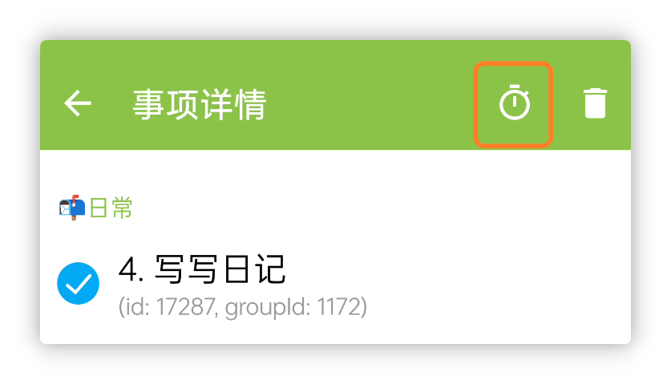

**任務備註中的第三方 URL Scheme 現也支援解析和直接點選跳轉**

比如點選任務備註開啟支付寶：

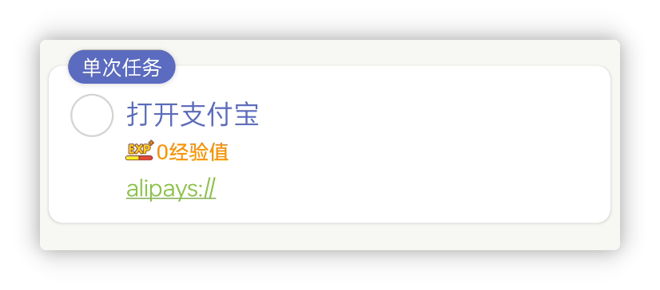

或者直接放人升的API：

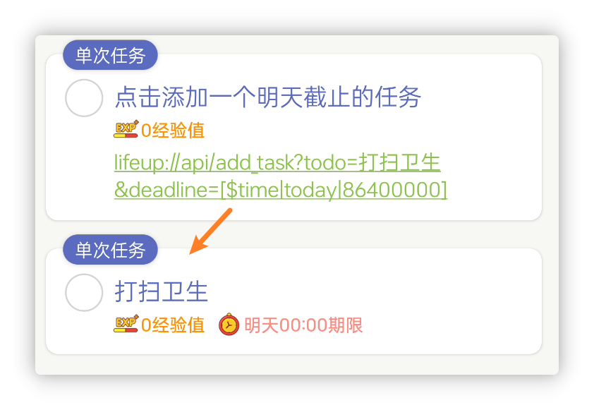

**歷史頁面現支援透過任務備註搜尋歷史記錄**

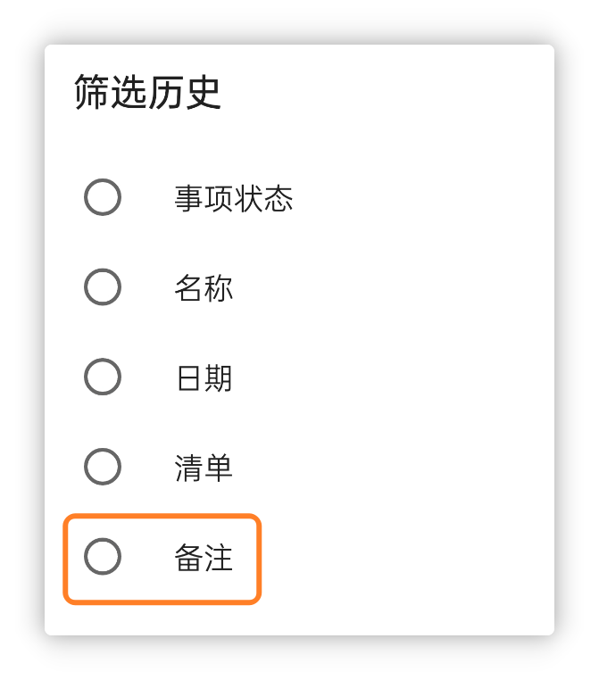

**統計頁面支援按大類篩選**

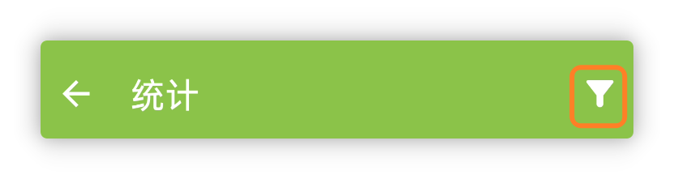

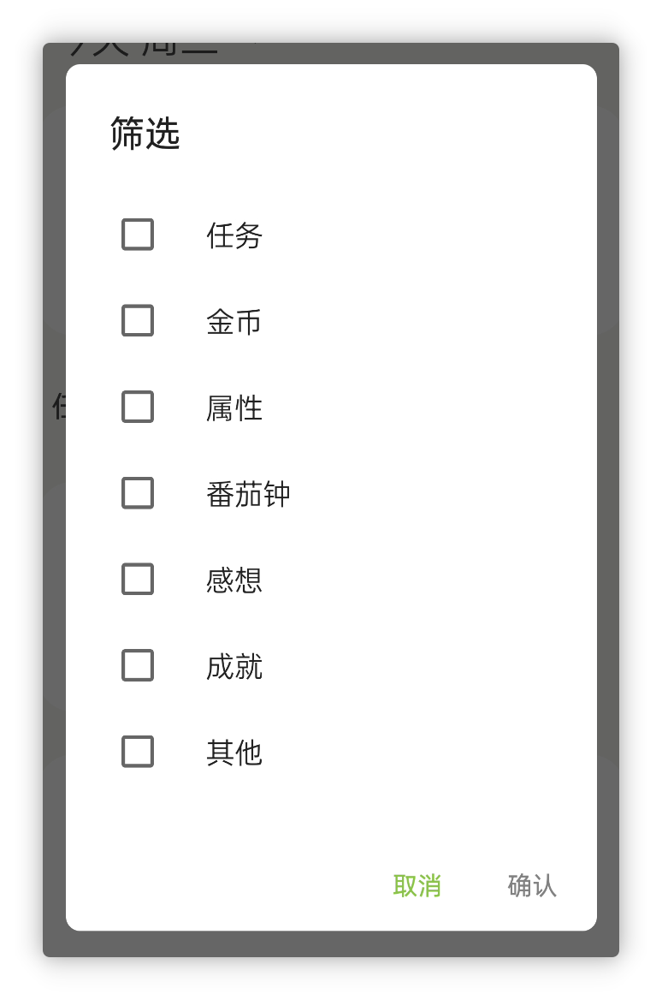

**在技術層面上**，

1. 我們全面升級了人升的相關基礎依賴、構建工具和混淆規則等。最明顯的改進可能是應用體積下降了（v1.95.0版本國內安裝包15.9MB -> v1.96.0-beta01版本國內會員內測13.4MB）
2. 我們自動化了文件庫的釋出流程，現在只要提交改動到倉庫即可自動釋出到對應的站點。在這裏也特別感謝@WantenMN最近對文件庫的 PR 貢獻。

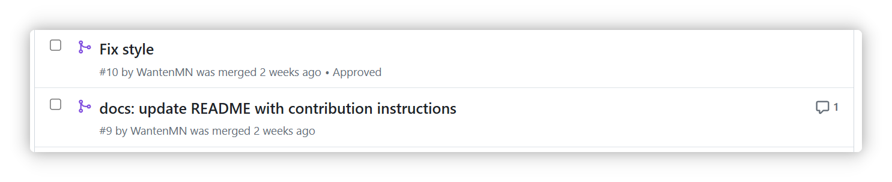

3. 自動化了會員內測的相關釋出流程。

## 六、✨更多最佳化和近期更新日誌

**🎉1.96.0 - beta01**

**✨特性**

**重點更新**

1. 完成任務或解鎖成就時直接使用商品，觸發商品效果
2. 單次使用商品的數量限制放寬至 1000
3. 現購買開箱、合成類商品也支援直接使用（開箱/合成）
4. 團隊任務也將支援釋出感想至本地感想
5. 任務備註中的第三方 URL Scheme 現也支援解析和直接點選跳轉
6. 歷史頁面現支援透過任務備註搜尋歷史記錄
7. 支援為歷史任務計時
8. 統計頁面支援按大類篩選
9. 重構了屬性經驗值獎勵、懲罰彈窗：同步最佳化了商品使用效果的屬性選擇數量限制、逾期的屬性經驗值減少彈窗拆分等相關邏輯

**♻️最佳化**

1. 選擇商品時，單選現在也沿用與多選一致的UI效果
1. 最佳化了任務列表的載入速度
1. 現新增或編輯任務時，不再強制要求期限時間在當前時間之後，這可以用於建立歷史記錄，以及增加了一些靈活性。
1. 如果開啟了顯示資料ID，現感想彈窗也會顯示對應的 ID
1. 最佳化了逾期處理彈窗的相關效能問題
1. 統一了倒計時計時狀態和暫停狀態的按鈕順序
1. 世界模組-個人主頁刪除動態的互動改為更容易理解的按鈕
1. 感想、成就頁面的相關載入效果最佳化

**🐛修復**

-
