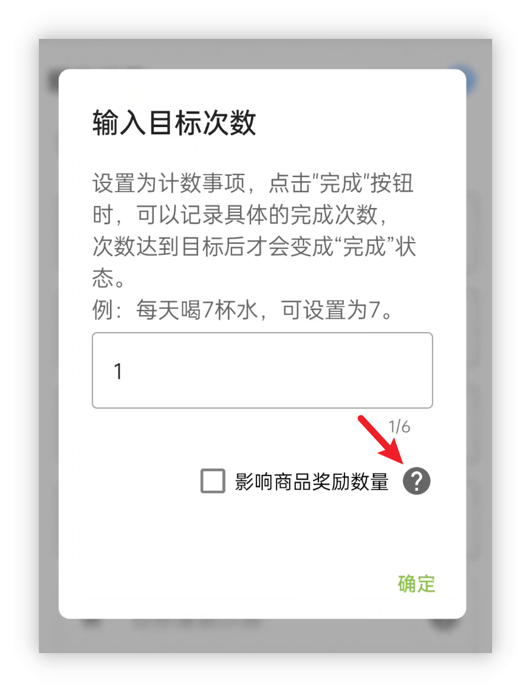

<h1 align="center" padding="100">v1.97.0 效能和體驗最佳化、內建字型大小設定</h1>

## 簡介
本期更新也是繼續聚焦於效能最佳化和一些遺留問題處理。

**效能最佳化**

應用效能一直是我們關注的重點之一。

隨著使用者長期使用和資料量的不斷增加，app 效能面臨的挑戰也在逐步加大。我們經常會收到使用者的疑問，比如在長期使用過程中，建立大量任務和商品是否會對 app 產生影響。

此前，我們主要優先處理了使用者反饋的崩潰問題和新功能開發，對一些遺留的 ANR（應用未響應）問題關注較少。

近期版本中，我們將逐步修復已知的 ANR 問題，以進一步提升使用者的使用體驗。

本次更新帶來了顯著的效能最佳化，旨在為長期使用的使用者提供更流暢的體驗。同時，這也是為後續 API 和 app 更新奠定基礎，帶來更多功能和改進。

**其他最佳化小點**

- 當金幣不足時，現商品購買按鈕會展示為禁用樣式
- 成就清單內，支援按成就名稱搜尋🔍
- 支援應用內字型大小設定
- 最佳化了世界-隨機任務的隨機邏輯，現在會減少最新一批任務出現的頻率，更為隨機化
- 最佳化了通知分組邏輯，現屬性、成就解鎖等通知應該能正確分組展示
- 統計-分享現支援切換是否展示二維碼
- API 任務、連結使用效果、計數任務等比較常見的諮詢項增加了應用內說明。

**❓如何加入內測？**

如果你已經是會員的話，可以在應用內-關於頁面，點選**檢測更新**獲取內測版本。

本期更新的 v1.97.0 版本已經在“會員嚐鮮”渠道釋出了一段時間。後續穩定會逐步釋出至“會員穩定”渠道。

由於本期更新涉及到一些基礎框架的更新，儘管我們已經進行了不少測試，但難以評估所有影響麵，建議更新前，備份一次完整的應用資料。

同時，上期更新的「v1.96.0 獲得時自動使用商品」現已輪動至【會員內測-穩定渠道】，「v1.95.0 大屏適配」已在官網釋出。

**📧如何反饋問題？**

如果你在內測途中遇到了任何問題，歡迎隨時透過郵件、會員渠道、騰訊頻道（QQ頻道）等方式反饋~

## 一、效能最佳化

這一段可能會偏技術一些，但從使用者的角度來看，它代表著整體效能的提升，包括但不限於：

- 啟動速度的提升
- 任務列表載入、任務重新整理速度的加快
- 完成任務的流暢度提升
- 屬性、商店、成就等操作的提速...

根據我們的實測結果，一些極限場景下的效能表現爲：

- 撤銷某個重複多次的任務：提速 95%
- 載入包含大量任務的任務列表：提速 10% ~ 26%
- 程式碼模擬高頻完成可重複任務：提速 75% ~ 80%
- ...

 

本次更新過程有些坎坷，我們非常感謝參與會員內測的使用者，感謝大家嚐鮮並反饋問題。

原本的更新計劃是透過最佳化一些頻繁呼叫資料庫的地方，增加記憶體快取，啟用資料庫的 WAL 模式，以及改進執行緒排程，來提升效能和修復已知的線上卡頓問題。

在實測中，我們發現快取的確很有效，能夠將幾百毫秒、幾十毫秒的耗時降至個位數毫秒，甚至接近 0 毫秒。

然而，在釋出了 rc-01 和 rc-02 版本後，意外出現了幾例啟動時完成任務卡住的奇怪問題反饋。這讓我們很難理解，且在測試中也無法復現類似問題。

我們只好繼續釋出多個版本，不斷修復已知問題，並直接修改所使用的資料庫 ORM 框架，以進一步提升效能。

經過數天的排查後，我們發現問題的根本原因是啟用資料庫的 WAL 模式時，修改了資料庫的備份邏輯，導致備份過程中會阻塞其他操作（如完成任務等）。如果使用者開啟了「啟動時自動雲備份」，這個問題就會尤為明顯。

不過，因禍得福的是，排查問題期間採取的激進效能改進方案，意外進一步釋放了資料庫的效能表現。

 

### 📕如何使用？

- 升級即可享受到效能提升。

## 二、最佳化小點
**當金幣不足時，現商品購買按鈕會展示為禁用樣式**
可以更直觀地在商店頁面瀏覽足夠金幣購買的商品了：

**成就清單內，支援按成就名稱搜尋🔍**

**支援應用內字型大小設定**

預設人升的字型大小設定是跟隨系統的，該版本允許在此基礎上進一步調整大小。

**最佳化了世界隨機任務的生成邏輯，降低了最近一批任務頻繁出現的機率，使隨機性更為均衡**

我們收到部分使用者反饋，隨機任務總是集中在前幾項。對此，我們進行了相關最佳化，改善了任務分佈的隨機性。

**最佳化了通知分組邏輯，現屬性、成就解鎖等通知應該能正確分組展示**

改動前：

改動後：

**統計-分享現支援切換是否展示二維碼**

**API 任務、連結使用效果、計數任務等比較常見的問題項增加了應用內說明。**

**UI層面**

1. 為彈窗增加了背景模糊的效果。因為人升有著較多的彈窗，甚至是連環彈窗。背景模糊可以讓使用者更好的聚焦於當前的彈窗內容上，更清晰。
2. 像商店的購買、倉庫使用等按鈕替換為系統控制元件實現，進一步提升UI一致性。

改動前：

改動後：

> 購買、使用按鈕看截圖可能不太明顯，但應用內還是能看出明確區別。

### 三、技術點最佳化
除了上述功能最佳化外，由於LifeUp是我們在空閒時間維護的應用，同時還需要維護「雲人升」和桌面端等多個應用，以及正在調研和開發中的iOS版本等，因此我們會持續最佳化一些技術細節，並逐步實現自動化流程，節省更多時間。

**3.1 Crowdin多語言自動同步**

此前，我們一直手動同步Crowdin上的多語言文字，如繁體中文、法語、德語、日語等。由於依賴人工操作，無論是英文原文的上傳，還是翻譯文字的下載，都可能出現版本延遲的情況。

本次更新，我們將Crowdin的多語言同步引入到了開發工作流中。今後，這項工作將會自動執行，使得多語言文字的更新更加快速和高效。

**3.2 功能點獨立回退機制**

過去的更新發布中，若某個功能出現問題，通常只能等待下一個版本的修復，無法直接回滾。由於更新和稽覈的過程都比較耗時，特別是稽覈時間不可控，導致問題難以及時解決。

爲了解決此類問題，本次更新引入了一套有效的控制機制，支援對單個功能點進行獨立開關和回退操作。今後，當我們開發可能存在風險的功能時，可以透過便捷的配置進行回退，減少問題的影響。

一個實際案例是，在rc01版本釋出時，由於「當金幣不足時，商品購買按鈕會展示為禁用樣式」的功能程式碼未考慮到貸款金額設定，導致貸款功能失效。使用者反饋後，我們透過回退該功能點，及時避免了問題影響，並獲得了充足的時間進行下一個版本的更新。

### 四、小預告

因為本期更新帶來的功能點比較少，順便也預告下後續版本的內容。

下個版本桌面端和 API 會迎來一波更新，到時候會先支援桌面端備份、恢復，以及從桌面端編寫新感想等。

我們也會嘗試適配一些桌面端特性：比如拖拽選擇要恢復的檔案；呼叫系統的檔案選擇器選擇感想圖片等等。

> 開發中版本截圖，不代表最終效果

## 六、✨完整更新日誌

**🎉1.97.0 (2024/09/11)**

**內測問題修復**

rc06 -> rc07

- 修復由於程式碼執行時序問題，可能會導致完成任務後，自動使用商品的邏輯失效的問題

rc03 -> rc06

- 資料庫相關問題修復
- 效能提升

rc02 -> rc03

- 多語言文字更新和裁剪
- 任務列表頁面與清單切換的相關效能提升
- 修復「全部」和「預設」清單的相關設定（篩選、排序）可能會互相關聯的異常問題
- 其他效能問題修復和最佳化

rc01 -> rc02

- 修復貸款金額足夠時，購買按鈕仍是不可按狀態的問題
- 部分卡頓問題最佳化

**✨特性**

**重點更新**

- 本次更新主要為效能最佳化和問題修復。
- 大幅最佳化了應用的整體效能表現，現在獲取任務列表和各種操作會更加流暢，目標安卓 API 版本適配至 Android 14。

**其他**

1. 當金幣不足時，現商品購買按鈕會展示為禁用樣式
2. 成就清單內，支援按成就名稱搜尋🔍
3. 支援應用內字型大小設定
4. 最佳化了世界-隨機任務的隨機邏輯，現在會減少最新一批任務出現的頻率，更為隨機化
5. 最佳化了通知分組邏輯，現屬性、成就解鎖等通知應該能正確分組展示
6. 統計-分享現支援切換是否展示二維碼

**♻️最佳化**

1. 最佳化了網路訪問邏輯
2. 彈窗增加背景模糊效果
3. 商店、倉庫、櫥窗等介面的按鈕最佳化，使用 Material 官方按鈕樣式
4. Content Provider 查詢任務歷史記錄的 API 現會返回任務的結束時間
5. Content Provider 查詢任務歷史記錄的 API 現支援篩選任務 Group Id
6. 提升了大量依賴庫的版本
7. Goto API 支援跳轉到「新事項預設設定」頁面
8. Goto API 跳轉到「新建成就」頁面時，現需要傳遞 category_id 引數
9. 增加 API 任務、計數任務、商品連結效果等應用內指引
10. 最佳化了新使用者檢測更新的邏輯和錯誤提示
11. 刪除賬號操作增加 loading 和錯誤提示
12. 最佳化了任務詳情頁面點選完成主任務的點選範圍
13. 最佳化了匯入備份的錯誤提示，現會更嚴格阻止匯入異常備份檔案

**🐛修復**

1. 修復新建任務時，如果先觸發了事項內容為空的錯誤提示，即便輸入了文字，該錯誤提示也不會自動消失的問題
2. 修復了底部導航欄模式下，統計頁面不展示篩選按鈕的問題
3. 修復了在特別窄小的裝置顯示比例下，部分介面顯示異常的問題
4. 修復了在複製任務的情況下，子任務的獎勵可能會出現異常關聯的問題（該問題出現自v1.96.0版本）
5. 修復了當觸發 Dropbox 自動備份時，因使用者連線 Dropbox 異常時的錯誤提示
6. 嘗試修復預覽極端大圖的記憶體消耗和崩潰問題
7. 修復了當購買物品時勾選使用但使用失敗的情況下，小部件的資料不會正確重新整理的問題
8. 修復了編輯成就會更改成就完成時間，而且有可能錯誤觸發成就解鎖通知等問題
9. 修復了大螢幕分屏顯示模式下，當同時顯示任務列表頁面和詳情頁面，完成任務、子任務、更新計數等操作時，兩個頁面不會同步重新整理的問題
10. 修復了在任務列表頁面，長按已經逾期過的單次任務，沒法清空期限顯示的問題

