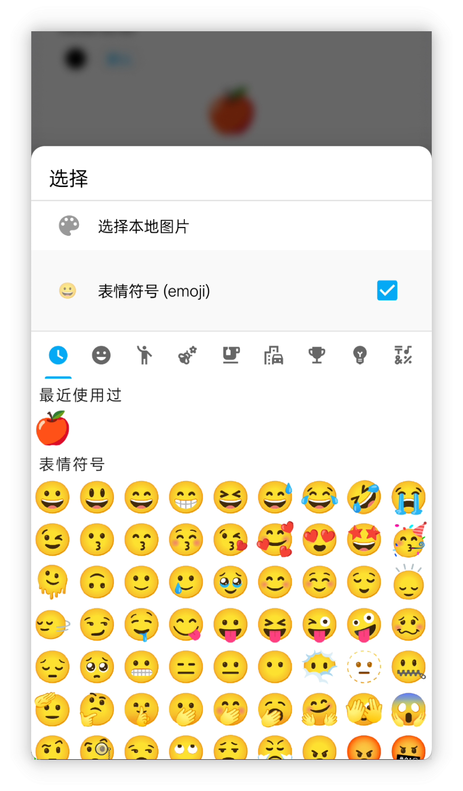
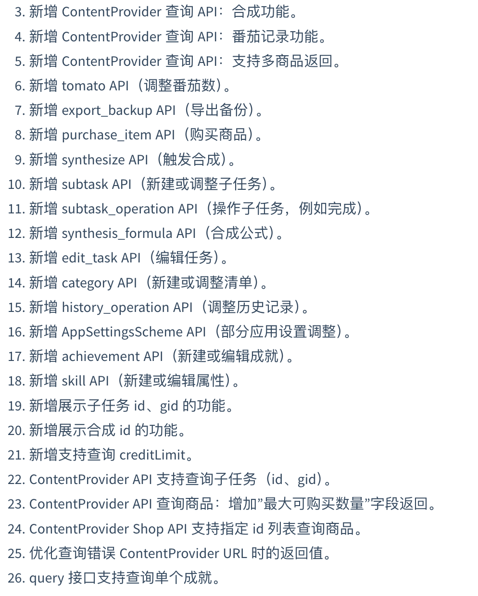
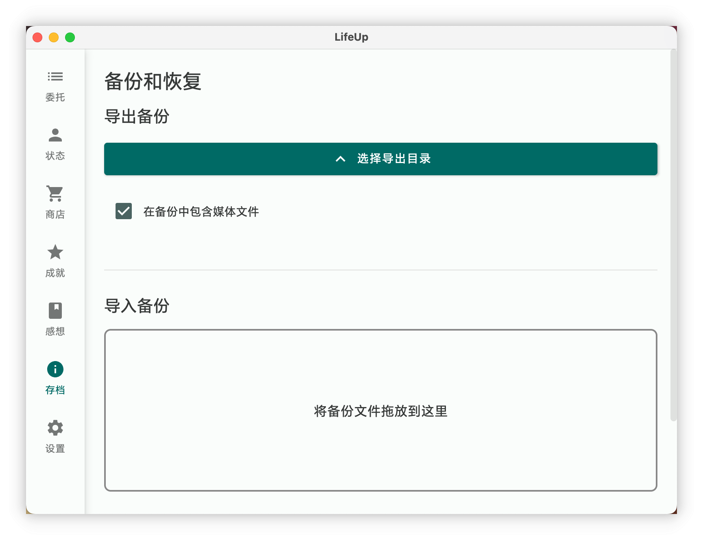
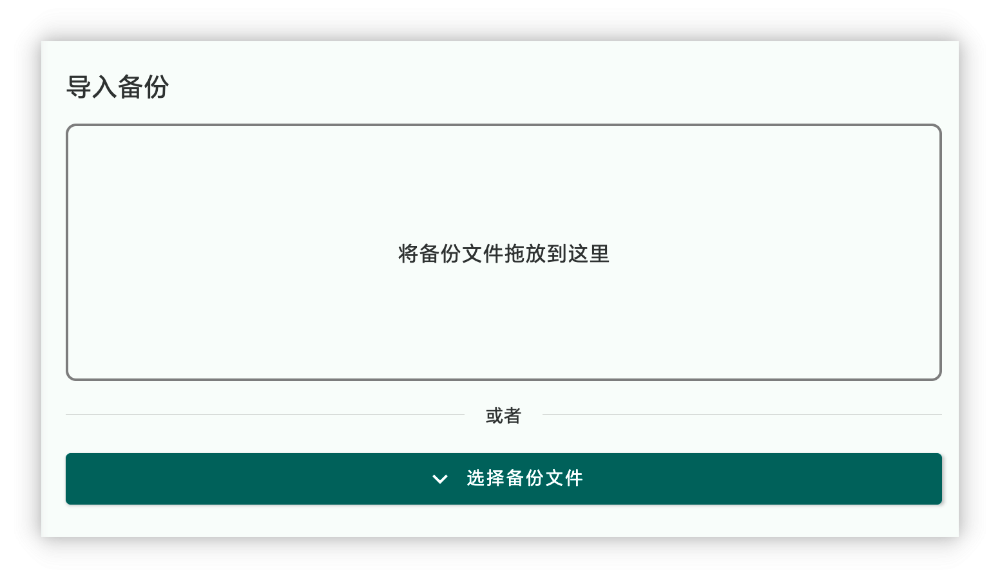
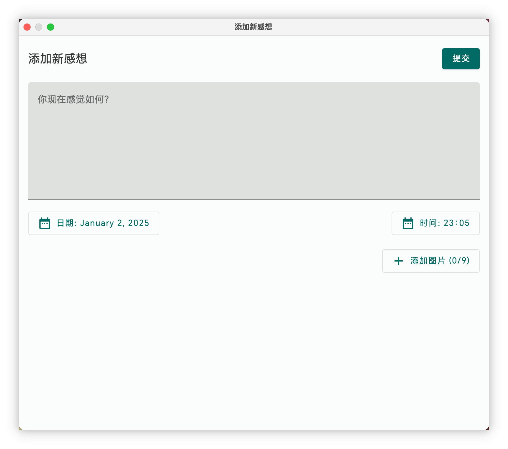
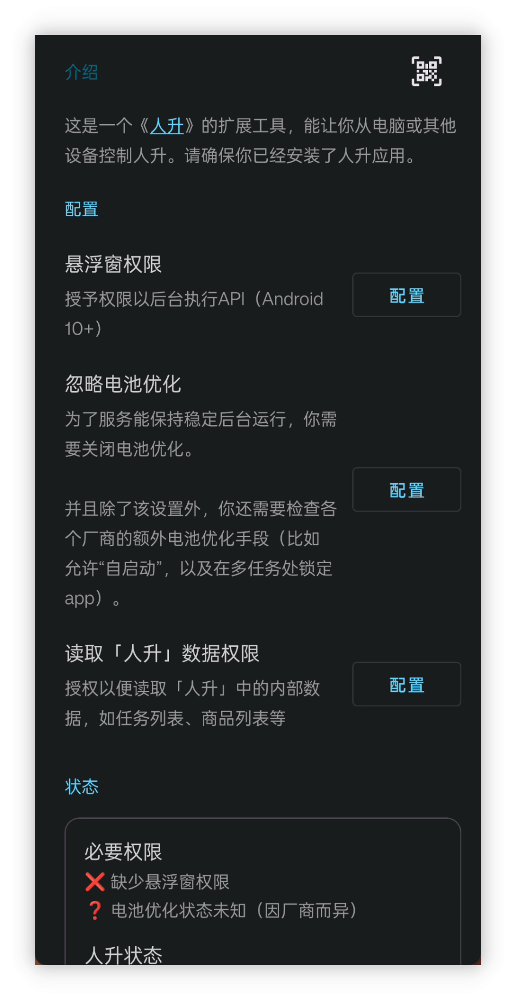
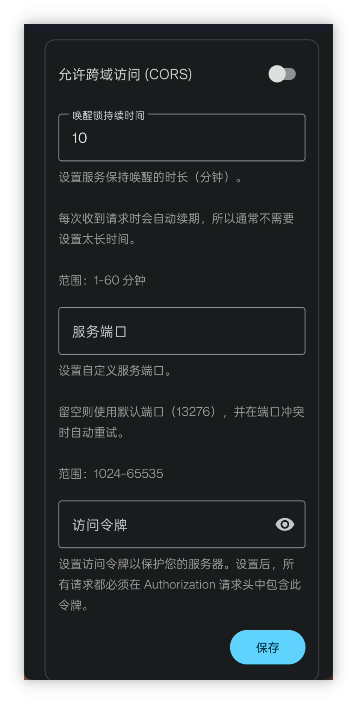

![[1.97.0更新介紹封面圖.webp|500]]
<h1 align="center" padding="100">v1.98.0 API 2.0 & 桌面端更新</h1>

## 簡介
這是 2025 年首個會員內測版本，主要更新如下：

- Emoji 圖示支援: 現在可以直接使用 Emoji 作為商品、成就等地方的圖示。

- 第二波 API 更新: 支援修改任務、編輯商品使用效果、成就解鎖條件以及合成等幾乎所有核心功能的 API 介面。

- 雲人升和桌面端最佳化: 提升了自動連線檢測的體驗；桌面端新增了“新建感想”功能，並支援備份資料的匯入匯出。

**❓如何加入內測？**

如果你已經是會員的話，可以在應用內-關於頁面，點選**檢測更新**獲取內測版本。

本期更新的 v1.97.0 版本已經在“會員嚐鮮”渠道釋出了一段時間。後續穩定會逐步釋出至“會員穩定”渠道。

由於本期更新涉及到一些基礎框架的更新，儘管我們已經進行了不少測試，但難以評估所有影響麵，建議更新前，備份一次完整的應用資料。

同時，上期更新的「v1.96.0 獲得時自動使用商品」現已輪動至【會員內測-穩定渠道】，「v1.95.0 大屏適配」已在官網釋出。

**📧如何反饋問題？**

如果你在內測途中遇到了任何問題，歡迎隨時透過郵件、會員渠道、騰訊頻道（QQ頻道）等方式反饋~

## 一、Emoji 圖示

 

### 📕如何使用？

- 該版本在為商品、成就等挑選圖示時，現在支援直接選擇 Emoji 表情符號作為圖示。

## 二、第二波 API 更新

自 v1.90.0 版本開放 API 功能以來，我們欣喜地看到許多使用者積極探索並基於 API 進行了豐富的創作。許多使用者從零開始學習 URL 相關知識，併成功應用 API 建立了桌面小部件、DIY 桌面端，甚至實現了網頁應用聯動，令人印象深刻。

然而，第一批 API 由於數據結構複雜，設計和開發工作量巨大，一直缺乏一些核心功能，例如編輯任務、編輯商品、建立帶解鎖條件的成就以及建立帶使用效果的商品等。這些功能的完善一直持續到本版本才最終完成。

API 的設計、開發、測試以及雲端、桌面端和 API 文件的更新，帶來了指數級增長的工作量，導致幾個月前啟動的開發分支直到現在才完成開發和測試。

**但我們的努力也帶來了豐碩的成果！如今，API 已覆蓋人升幾乎所有核心功能。我們希望透過開放 API，讓人升不止於一款應用，而是將其打造成一個開放平臺，讓使用者能夠自由地二次開發、擴充套件和定製自己的遊戲化系統。**

 

### 📕如何使用？

- API 使用的方式可以查閱我們的文件庫 - 目錄 - 開放介面一欄。
- 新增的 API 介面相關定義已補充到文件內。

### 三、桌面端：存檔功能 & 感想

#### 存檔

現在你可以在桌面端直接匯出或匯入備份檔案了。

這將簡化資料到其他裝置和恢復的流程。

#### 釋出新感想

現支援從桌面端釋出新感想，也完整支援新增圖片和設定時間等功能。

⚠️注意：暫不支援編輯感想。

#### 其他

- 最佳化了連線的相關錯誤提示和說明：比如明確是網路問題，還是因為人升後臺沒執行導致的失敗
- 支援檢視事項詳情了
- 支援了 API Token 安全令牌校驗功能（可選，需搭配雲人升 2.0.0 版本使用）
- 購買邏輯現在也是呼叫新的「購買商品 API」，而非之前的「調整商品數量 API」+「調整金幣數 API」。所以現在能夠正確處理限購之類的邏輯，跟應用內應該能夠保持一致的。

本次更新其實也是以演示 API 的目的更新桌面端的，桌面端的能力都是透過 API 實現的。

### 四、雲人升最佳化

>  雲人升是一個將 API 暴露成 HTTP 介面的一個工具，也是連結桌面（電腦）端的橋樑。

本次我們也針對雲人升的相關反饋做了不少的最佳化：

- 新增了相關狀態的顯示，以便快速檢測出為什麼桌面端連線不上
- 新增了一些高階設定
  - 允許跨域訪問：如果使用基於網頁的技術訪問雲人升的 HTTP 介面的話，這會有用
  - 允許自定義服務埠
  - 允許設定訪問令牌：可選的安全校驗手段
- 最佳化了雲人升的相關介面的錯誤返回值和規範
- 最佳化了服務發現和 HTTP 服務開關的邏輯，現在桌面端的自動檢測應該會更好使

### 五、小預告

因為本期更新帶來的非 API 功能點比較少，順便也預告下後續版本的內容，以下是幾個正在開發中的功能：

- **大型需求點：**重複型成就
- **中型需求點：**自定義背景的文字可讀性最佳化
  - 原本以為是小改動，但實際上挺複雜
- **小型需求點：**通知提醒增加完成、稍後提醒等操作
  - 原計劃還想要支援常駐提醒的，但高版本安卓已經不支援真正的常駐了，這一點先放棄了

## 六、✨完整更新日誌

#### 人升

**v1.98.0 (2025/01/01)**

**✨特性**

1. 整合 Google 登入和 Drive 授權，使用 Credential Manager。
2. 支援選擇 Emoji 作為圖示。
3. 新增 ContentProvider 查詢 API：合成功能。
4. 新增 ContentProvider 查詢 API：番茄記錄功能。
5. 新增 ContentProvider 查詢 API：支援多商品返回。
6. 新增 tomato API（調整番茄數）。
7. 新增 export_backup API（匯出備份）。
8. 新增 purchase_item API（購買商品）。
9. 新增 synthesize API（觸發合成）。
10. 新增 subtask API（新建或調整子任務）。
11. 新增 subtask_operation API（操作子任務，例如完成）。
12. 新增 synthesis_formula API（合成公式）。
13. 新增 edit_task API（編輯任務）。
14. 新增 category API（新建或調整清單）。
15. 新增 history_operation API（調整歷史記錄）。
16. 新增 AppSettingsScheme API（部分應用設定調整）。
17. 新增 achievement API（新建或編輯成就）。
18. 新增 skill API（新建或編輯屬性）。
19. 新增展示子任務 id、gid 的功能。
20. 新增展示合成 id 的功能。
21. 新增支援查詢 creditLimit。
22. ContentProvider API 支援查詢子任務（id、gid）。
23. ContentProvider API 查詢商品：增加"最大可購買數量"欄位返回。
24. ContentProvider Shop API 支援指定 id 列表查詢商品。
25. 最佳化查詢錯誤 ContentProvider URL 時的返回值。
26. query 介面支援查詢單個成就。

**♻️最佳化**

1. 最佳化新增商品的預設自定義排序。
2. 最佳化新增屬性的預設自定義排序。
3. 「add_item」 API 增加 `purchase_limit`、`disable_use`、`effects` 等引數。
4. 「add_task」 API 增加 `background_alpha`、`items`、`start_time`、`auto_use_item`、`remind_time`、`pin` 等引數支援。
5. 「add_task」 API 支援設定更多工頻率。
6. 「item」 API 支援 `effects` 和 `purchase_limit` 引數。
7. 前置 API（例如輸入等）支援終止操作。
8. 數字佔位符支援指定 `signed` 引數。
9. 新增隨機數字、隨機小數佔位符。

#### 雲人升

**v2.0.0 (2025/01/01)**

**🚀功能**
1. 服務最佳化
- 改進服務發現邏輯和相容性
- 更多裝置支援自動檢測 IP
- 最佳化服務啟動/暫停狀態切換
- 改進異常處理流程和提示
2. 安全與效能
- 新增可選的 API Token 校驗
- 新增跨域（CORS）設定選項
- 支援自定義埠
- 支援自定義喚醒鎖持續時間
3. 介面最佳化
- 全新的介面設計
- 改進整體視覺體驗

#### 桌面端

**v1.2.0 (2025/01/01)**

**🚀功能**
1. 支援存檔功能
- 直接備份到電腦
- 從電腦恢復備份
- 支援檔案拖放
2. 支援在桌面端建立新的感想
- 支援選擇圖片
- 支援圖片傳輸至手機
3. 支援檢視任務詳情
4. 改進購買系統
- 使用新版「購買物品」API
- 與 app 內限購邏輯保持一致
5. 支援可選的 API Token 校驗
6. 多平臺支援
- Windows
- Linux
- macOS（Apple Silicon）
- macOS（Intel）🆕
7. 改進異常處理流程和提示

