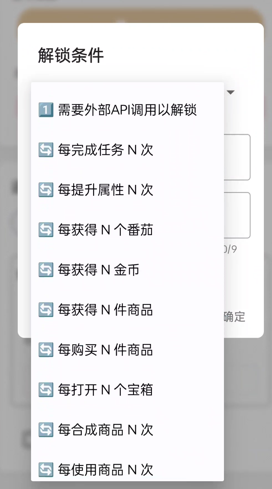
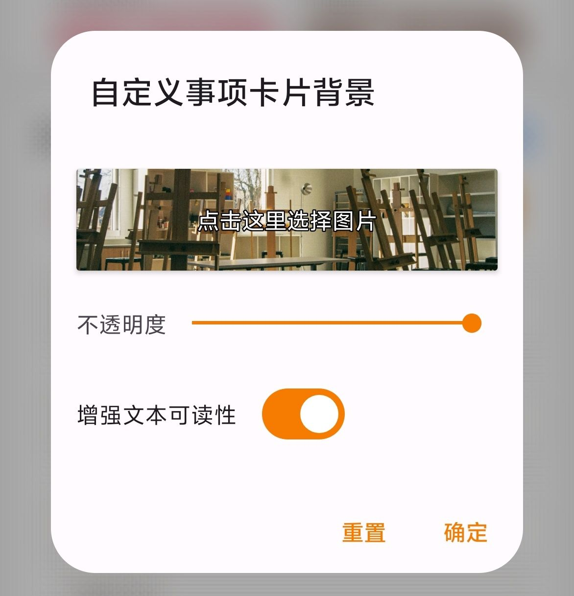
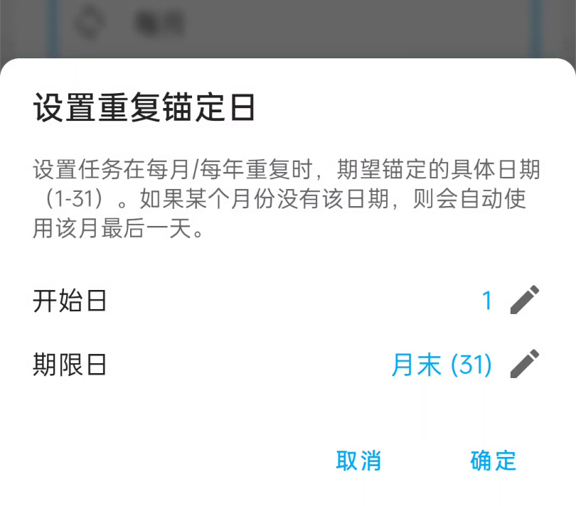
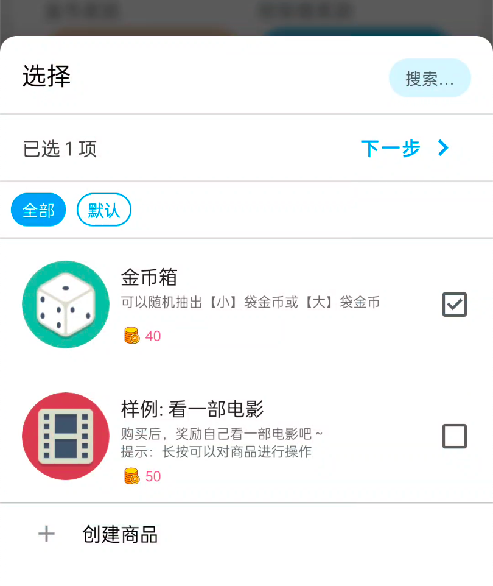

<h1 align="center" padding="100">v1.99.0 - 重複成就</h1>

## 簡介
該版本主要引入了：

- 重複達成型成就：比如每完成 X 次任務、每提升 X 次力量等級即可領取一次獎勵的成就
- 自定義卡片背景引入高對比度字型選項
- 通知提醒增加操作

## 一、重複達成型成就

本次更新主要引入了可重複達成型成就條件條件：

- 此類成就解鎖條件允許重複達成，並且每次達成都可以領取一次獎勵，多次達成可以領取多次。
  - 比如你可以設定「每提升 10 級力量」可解鎖一次成就。

 

### 📕如何使用？

- 它們屬於新增的成就解鎖條件，建立或編輯成就時指定解鎖條件。

## 二、自定義背景：增強字型可讀性

我們引入了一個「增強文字可讀性」選項，允許在自定義背景時，可以突出顯示文字和部分圖示。

 

### 📕如何使用？

- 編輯自定義背景時，勾選「增強文字可讀性」即可

### 三、通知操作

我們為應用的通知提醒增加了「完成任務」和「稍後提醒」操作。（只適用於通知提醒，不支援日曆提醒方式）

### 四、其他互動最佳化

1. 我們為每月、每年重複額外增加了一個錨定日選項。這可以讓使用者更方便地選擇月末或者指定日。

2. 選擇商品獎勵時，現在預設進入多選模式。我們不再嚴格區分單選/多選模式。這樣的互動會更加簡單和合理。並且重選時，也會保持之前的選項。

3. 成就也支援了更改「圖示裁剪樣式」

## 五、✨完整更新日誌

**v1.99.0 (2025/05/17)**

**✨特性**

1. 支援可重複達成的成就型別
1. 增加通知提醒操作：完成任務、稍後提醒
1. 自定義背景：新增增強文字可讀性選項
1. 支援調整成就的圖示裁剪樣式
1. 支援調整每月/每年任務的月錨定日

**♻️最佳化**

1. 最佳化了成就解鎖進度的計算邏輯
1. 最佳化了選擇商品的相關互動
1. 最佳化新建/編輯任務關於提醒許可權提醒按鈕的位置
1. 最佳化了相對提醒時間的儲存邏輯
1. 允許凍結非重複和無限重複任務

**🐛修復**

> 部分問題修復會陸續下放到【會員穩定版本】和【正式版】

1. 修復了編輯成就可能會以外重置 API 解鎖條件進度的問題
2. 修復了透過購買商品 API 可以購買庫存數為 0 的商品的問題
3. 修復了某些特殊情況下，新建商品頁面可以選中已刪除清單的問題
4. 修復了任務模板沒法儲存金幣自動計算狀態的問題
5. 移除了進入詳情頁面的相關轉場動畫，以修復長按互動失效的問題
6. 修復了番茄鍾選擇任務時，會出現凍結任務的問題
7. 修復了某些途徑編輯任務，會導致任務狀態錯誤重置為未完成的問題
8. 修復了感想彈窗相關的互動問題
