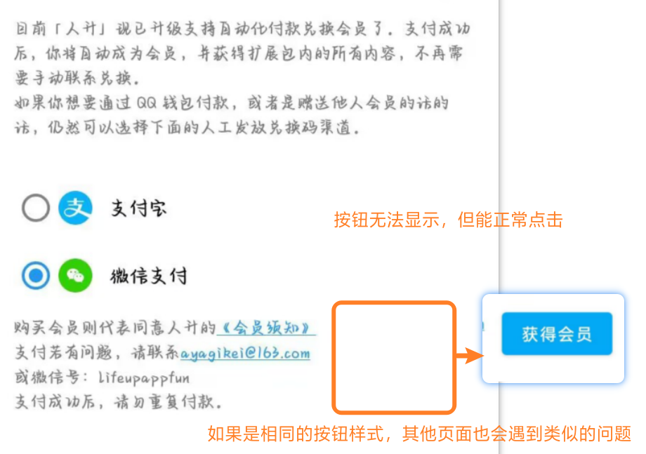

# 相容性配置

這裏列舉了部分裝置的相容性配置問題，

如果你不進行相應的配置，可能無法正常使用【提醒】、【番茄鍾】、【倒計時】、【小部件】等相應功能。

這些限制與應用本身並無關係，甚至與 Android 也沒多少關係，**大都是由手機廠商“定製”導致的問題。**並且由於是手機廠商“定製”的系統，應用開發者們也沒法從程式碼層面提供解決方案。

> 如果你使用的是 AOSP 或類 AOSP 系統（如 Pixel 手機），基本上只需要“忽略電池最佳化”即可正常使用`人升`所有功能。

## 主要問題

!> 我們已經在應用流程設下了無數提示，包含但不限於：初始任務、新手教程、常見問題、設定頁面小紅點和二次確認才能移除小紅點，部分相關的功能的額外提醒。但仍然沒法阻擋有陸陸續續的使用者可以完美繞開所有提示來到QQ群或者私聊反饋相同的問題。  **爲了你的應用正常使用體驗，請務必重視以下配置❗❗ 特別是如果你需要使用桌面小部件、番茄鍾、倒計時、提醒等功能時。**

?> 下方涉及「需要後臺執行」的功能點，由於不同手機、系統涉及到很多不一樣的選項。經常有使用者漏配一些選項（比如華為需要把電池最佳化調成“手動管理”），導致 app 仍有問題。  **經我們確認，主流裝置（如華為/榮耀、小米/紅米、OPPO/Realme/一加、VIVO/iQOO、三星、Pixel等），只要正常配置後，相關設定項都能正常使用過。**  如果你在配置後仍有問題，如需反饋，請帶上所有的配置項截圖、影片在頻道發帖。可以跟其他同型號的使用者對比一下設定項，也可以向對應的手機工程師/客服反饋問題。

| 功能                                                         | 需要後臺執行      | 需要其他許可權               | 備註                                                         |
| ------------------------------------------------------------ | ----------------- | -------------------------- | ------------------------------------------------------------ |
| 事項提醒（系統通知）                                         | ✔️                 | 需要“通知”許可權         | 預設方式，**請參考[後臺保活文章](guide/background_running)進行配置**； 並確認已經啟用了“通知”。 |
| 事項提醒（日曆事件）                                         | -                 | 需要“日曆讀寫”許可權         | **可在應用內【設定】-【事項】-【更換提醒方式】處更改**       |
| 番茄鍾/商品倒計時       | ✔️                 | -                          | **請參考[後臺保活文章](guide/background_running)進行配置；** 如果未配置可能出現不提醒、倒計時被凍結（回到應用內才計時）、通知倒計時不精準、通知的操作按鈕無法點選等多種現象 |
| 正計時                                                       | -                 | -                          | -                                                            |
| 小部件資料重新整理          | ✔️（部分裝置需要） | -                          | **請參考[後臺保活文章](guide/background_running)進行配置；** 如果未配置可能出現一直顯示“正在載入中”或“已經完成了所有任務”或無法重新整理等現象 設定後，需要建立新的小部件以生效 |
| （非小米手機）小部件完成計數任務、跳轉應用內                 | -                 | -                          | -                                                            |
| （小米手機）小部件完成計數任務、跳轉應用內                   | -                 | 需要“允許後臺顯示介面”許可權 | 該問題為 MIUI/澎拜 OS 系統獨有，需要在系統的APP設定頁面進行配置 |
| （小米手機）隱藏了安卓小部件新增入口  | -                 | -                          | 該問題為一部分系統系統（MIUI/澎拜 OS）獨有 - 「MIUI/澎拜 OS」設定方法請檢視[影片教程](https://www.bilibili.com/video/BV17W4y1s7dL) - 其他系統可檢索一下相關教程 |
| （李跳跳等廣告跳過工具）會幫你自動點選通知欄跳過番茄鍾、ATM 彈窗等 | -                 | -                          | 請在相應工具設定內，關閉對《人升》和《系統用戶界面》（主要影響番茄鐘的通知按鈕）的處理。 |
| 番茄設定中沒法建立快捷方式                                   | -                 | -                          | 部分廠商的手機需要先前往應用管理頁面，開啟“建立快捷方式”許可權 |

## 非常見問題

| 現象                                   | 裝置 | 可能/已知原因                                                | 解決方案                                                     |
| -------------------------------------- | ---- | ------------------------------------------------------------ | ------------------------------------------------------------ |
| ATM彈窗打不開                          | 任何 | 跳過廣告的工具可能錯誤認為部分彈窗為廣告，自動關閉了彈窗     | 使用相關工具時，將《人升》加入白名單                         |
| 介面異常文字無法顯示                   | ？   | 系統異常，導致官方控制元件的渲染異常                             | 建議更換穩定版系統，或等待系統更新                           |
| 系統渲染UI崩潰                         | ？   | 系統異常，崩潰堆疊皆為系統堆疊                               | 建議更換穩定版系統，或等待系統更新                           |
| 無法調整小部件尺寸                     | ?    | 一般是使用者操作問題                                           | [檢視影片教程](https://www.bilibili.com/video/BV17W4y1s7dL/?share_source=copy_web&vd_source=141b0b80de90aedb6b7f25458fa6b5d1&t=70) |
| 極少數使用者遇到了部分按鈕無法展示的問題 | ？   | 似乎與裝置關係不大，可能跟第三方工具、主題、系統bug相關 並且資訊有限，如果你遇到了該問題，或者發現瞭解決該問題的相關線索，歡迎向我們提供更多資訊（如裝置機型、系統版本等） |  |

## 鴻蒙系統相容性

##### 🔶 是否支援鴻蒙 Next（HarmonyOS NEXT）？

目前**不支援鴻蒙 Next 原生系統**。
「人升」基於安卓開發，**僅相容雙框架鴻蒙系統（HarmonyOS 4.3.0 及以下）**。

> ✅ **建議暫緩升級鴻蒙 Next**，避免功能異常。
> 🔧 可在「設定 → 系統和更新 → 軟體更新」中關閉自動升級。

- 由於目前安卓原生實現沒有可供使用的移植方案，我們短時間內缺少人力適配鴻蒙原生。
- 如果後續鴻蒙有提供更多開放的移植方案，我們可能會變更方案以實現更快的移植和開發。

###### 🌱 可選：透過「卓易通」執行人升

鴻蒙 Next 支援透過 **卓易通**（安卓相容層）執行人升，但存在以下**限制**：

####### 🔐 登入說明

| 登入方式 | 支援情況 | 建議         |
|--------|--------|------------|
| QQ | ✅ 支援（需安裝「卓易通版 TIM」） | 推薦使用       |
| 微信 | ⚠️ 僅支援「出境易」中的 WeChat 國際版 | 建議聯絡我們遷移會員 |
| 微博 | ✅ 支援（網頁直接登入） | 推薦使用       |

> 📩 如需更換繫結，請聯絡我們 lifeup@ulives.io 遷移會員賬號（不影響資料）。

####### ⚠️ 功能受限（非人為可控）

- 番茄鍾後臺易中斷
- 通知、日曆、倒計時可能延遲或失效
- 桌面小部件重新整理異常
- 跨應用跳轉失敗

> ❗ 這些限制由**卓易通許可權機制導致**，我們無法修復。

## 問題反饋

?> 遇到你遇到了更多的相容性問題，建議入群反饋，檢視是否有其他人也遇到了類似的問題。如果排查到並非`人升`自身的問題後，你需要向系統工程師反饋。

相容性問題屬於系統與應用間，或者應用與應用間相關的問題；

開發者一般也只能提供簡單的思路，具體可能需要手動排查問題原因，由我們登記在上述表格裡。
