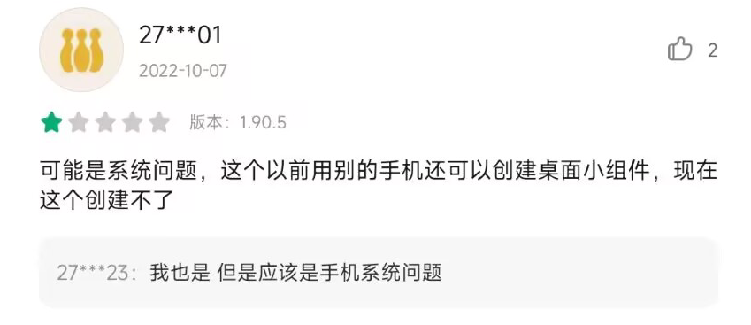

# 相容性配置

這裏列舉了部分裝置的相容性配置問題，

如果你不進行相應的配置，可能無法正常使用【提醒】、【番茄鍾】、【倒計時】、【小部件】等相應功能。

這些限制與應用本身並無關係，甚至與 Android 也沒多少關係，**大都是由手機廠商“定製”導致的問題。**並且由於是手機廠商“定製”的系統，應用開發者們也沒法從程式碼層面提供解決方案。

> 如果你使用的是 AOSP 或類 AOSP 系統（如 Pixel 手機），基本上只需要“忽略電池最佳化”即可正常使用`人升`所有功能。

## 主要問題

| 功能                                                         | 需要後臺執行      | 需要其他許可權               | 備註                                                         |
| ------------------------------------------------------------ | ----------------- | -------------------------- | ------------------------------------------------------------ |
| 事項提醒（系統通知）                                         | ✔️                 | 需要“通知”許可權         | 預設方式，**請參考[後臺保活文章](guide/background_running)進行配置**； 並確認已經啟用了“通知”。 |
| 事項提醒（日曆事件）                                         | -                 | 需要“日曆讀寫”許可權         | **可在應用內【設定】-【事項】-【更換提醒方式】處更改**       |
| 番茄鍾後臺結束提醒                                           | ✔️                 | -                          | **請參考[後臺保活文章](guide/background_running)進行配置；** 如果未配置可能出現不提醒、倒計時被凍結等多種現象 |
| 正計時                                                       | -                 | -                          | -                                                            |
| 小部件資料重新整理                                               | ✔️（部分裝置需要） | -                          | **請參考[後臺保活文章](guide/background_running)進行配置；** 如果未配置可能出現一直顯示“正在載入中”或“已經完成了所有任務”等現象 |
| （非小米手機）小部件完成計數任務、跳轉應用內                 | -                 | -                          | -                                                            |
| （小米手機）小部件完成計數任務、跳轉應用內                   | -                 | 需要“允許後臺顯示介面”許可權 | 該問題為 MIUI 系統獨有，需要在系統的APP設定頁面進行配置      |
| （小米手機）藏起了安卓小部件新增入口  | -                 | -                          | 該問題為 MIUI 系統獨有，設定方法請檢視[影片教程](https://www.bilibili.com/video/BV17W4y1s7dL) |
| （華為/榮耀-鴻蒙4）通知無法進行特殊操作，如暫停、停止和累計倒計時 | -                 | -                          | 該問題為鴻蒙4獨有，暫無解決方案，建議向系統工程師提工單      |

## 非常見問題

| 現象                 | 裝置 | 可能/已知原因                                            | 解決方案                                                     |
| -------------------- | ---- | -------------------------------------------------------- | ------------------------------------------------------------ |
| ATM彈窗打不開        | 任何 | 跳過廣告的工具可能錯誤認為部分彈窗為廣告，自動關閉了彈窗 | 使用相關工具時，將《人升》加入白名單                         |
| 介面異常文字無法顯示 | ？   | 系統異常，導致官方控制元件的渲染異常                         | 建議更換穩定版系統，或等待系統更新                           |
| 系統渲染UI崩潰       | ？   | 系統異常，崩潰堆疊皆為系統堆疊                           | 建議更換穩定版系統，或等待系統更新                           |
| 無法調整小部件尺寸   | ?    | 一般是使用者操作問題                                       | [檢視影片教程](https://www.bilibili.com/video/BV17W4y1s7dL/?share_source=copy_web&vd_source=141b0b80de90aedb6b7f25458fa6b5d1&t=70) |

## 問題反饋

?> 遇到你遇到了更多的相容性問題，建議入群反饋，檢視是否有其他人也遇到了類似的問題。如果排查到並非`人升`自身的問題後，你需要向系統工程師反饋。

相容性問題屬於系統與應用間，或者應用與應用間相關的問題；

開發者一般也只能提供簡單的思路，具體可能需要手動排查問題原因，由我們登記在上述表格裡。