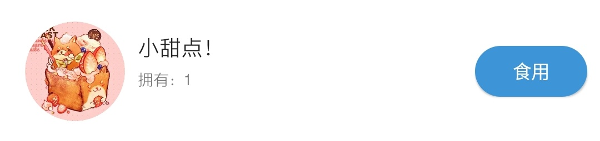
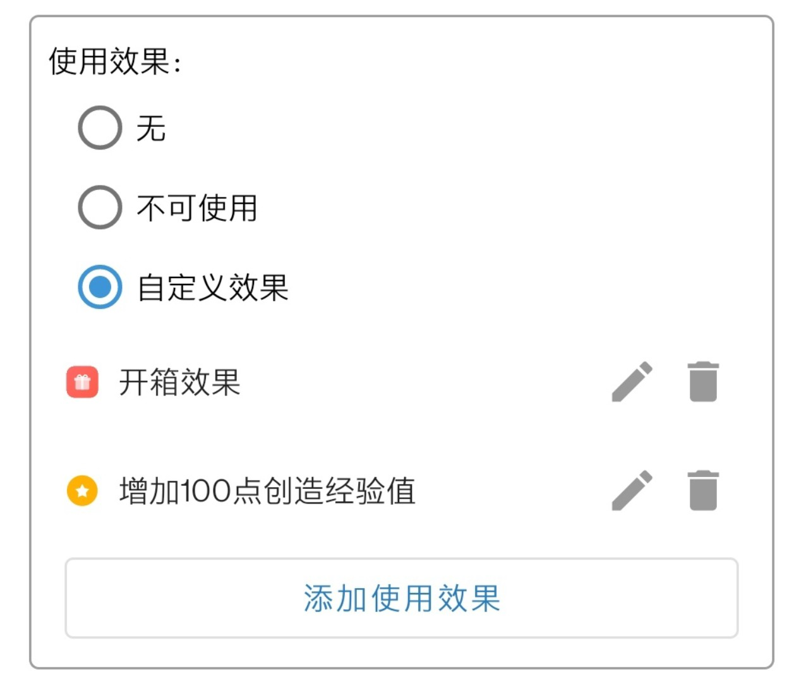
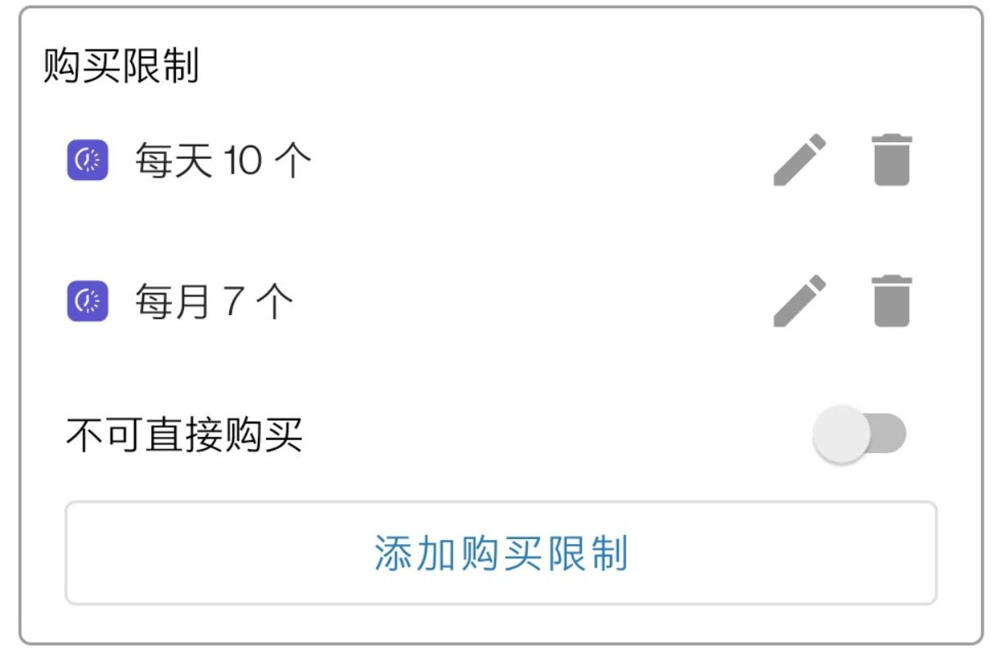
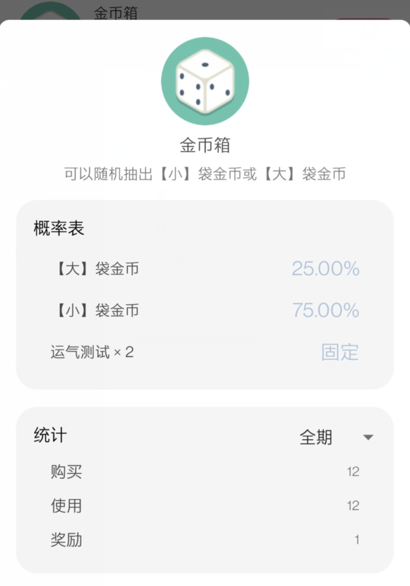

# 商品詳解

## 概念簡介

### 商品的含義

《人升》中的商品含義是“使用遊戲化的形式體現的自我獎勵機制”。

使用金幣衡量任務的完成程度，隨後購買自己心儀的獎勵，正向激勵自己繼續努力。

大體上可以分為兩類商品：

1. 現實獎勵。
   
   應用協助完成記錄、購買、限購等機制。但獎勵的具體實施需要現實中的你進行行動。
   比如「休息5分鐘」、「看一場電影」、「買一瓶肥宅快樂水」。

2. 應用內的獎勵。
   
   配合「使用效果」，可以實現一些應用內的獎勵。如獎勵一定的金幣、經驗值、隨機開箱（盲盒）抽取其他獎勵等等。

   這種獎勵也可以跟現實獎勵相配合，實現各種各樣的效果。

### 倉庫的含義

倉庫可以當作是一個暫存區，存放一些暫未使用的獎勵。

舉個簡單的例子，比如你購買了「看一場電影」的獎勵。

但是當時還不想實施這個獎勵的話，可以在購買時，不勾選「（立即）使用」的選項，那麼商品就會自動存放到倉庫中。

 

另外：
- 事項、成就設定的商品獎勵也會自動放入這裏。
- 含有特殊操作的商品（比如合成、開箱）也會強制放入倉庫。

---

## 新建商品

其實除了手動建立商品外，也可以**試試到櫥窗進貨別人建立好的各種商品**哦~

### 基礎資訊

這裏的資訊很簡單：
- 清單（最上方的`預設`)：點選可切換所屬清單，預設值會是當前清單
- 圖示：可以在應用提供的接近200個圖示中挑選，也可以隨時選擇本地裝置中的圖片。甚至可以在櫥窗中，將他人的商品圖示新增到臨時列表，然後再在這裏進行選擇。
- 商品名稱：輸入獎勵的名稱即可
- 售價：輸入購買一份獎勵所需的價格
- 描述：（可選）輸入商品的描述，會在一些介面進行展示

---

### 進階設定

#### 庫存數量

商店中該商品的庫存數量，當庫存為0時，該商品會自動下架。

以下情景都會減少庫存數量：
- 購買
- 或者從事項、成就得到商品獎勵

 

#### 自定義操作按鈕文案（會員功能）

 可自定義所有對該商品的使用操作的文案（比如購買彈窗中的`使用`開關和倉庫中的`使用`按鈕），預設值為`使用`。

 
 **使用場景：**

 - 將食品類的獎勵的文案，定義成`食用`
 - 將遊戲類的獎勵的文案，定義成`遊玩`

 

#### 使用效果

在這裏可以為商品定義特殊效果。

預設商品的行為是記錄數量，適用於上文所說的現實獎勵。

如果你想要實現一些特殊效果，可充分利用這裏提供的設定。

三大類使用效果：

1. **無**
   
   預設值，只負責記錄數量，使用時減少數量。
2. **不可使用**
   
   該選項會隱藏使用按鈕，可用於一些收藏型的獎勵。（如XX徽章）

3. **自定義效果**
   
   豐富多樣的特殊效果，如獎勵經驗值、金幣、隨機開箱。

**關於自定義效果的詳細說明，可以檢視該文章。（待編寫）**

 

#### 購買限制

##### 設定不可直接購買（會員功能）

如果你是會員的話，可以直接設定該商品無法直接購買，只能從事項/成就獎勵中獲取。

如果你是非會員的話，可以嘗試設定高價格。

##### 日/周/月/年限購

可以設定每日、每週、每月、每年限制購買的數量，可以同時新增多個條件。

> 注：每週是從週一開始計算。

---

## 列表管理

### 商店

#### 詳情

點選商品可檢視商品詳情資訊。

#### 選單

長按商品可對商品執行「編輯」、「下架」、「移至...」和「分享」等操作。

- **編輯**: 重新進入編輯頁面，可更改所有商品相關資訊。
- **下架**: 在商店列表中隱藏該商品，無法再在商店中購買。但不會影響事項成就獎勵該商品。下架後的商品，如有需要，可以在倉庫中「重新上架」。
- **移至**: 將商品移動至另外一個商品清單。
- **分享**: 公開上傳商品到「世界」中的「櫥窗」模組，讓全世界的使用者可以「進貨」該商品。

> 進貨的含義只是複製一份該商品，並不會影響你的金幣。但你可以檢視到有多少使用者進貨了你的商品。

---

### 倉庫

倉庫的清單預設會跟商店中的保持一致，暫時不支援自定義。

#### 詳情

點選商品可檢視商品詳情資訊。（與商店中一致）

#### 選單

長按商品可對商品執行「退貨」、「重新上架」等操作。

- **退貨**: 以售價的8折退貨商品，也可以選擇不獲得金幣退貨。
- **重新上架**: 針對已下架的商品可執行的操作。
