# 人升3週年啦~

時光荏苒，距離首次釋出《人升》並在 V2EX 宣傳已經過去了 3 年。

未曾想過當時在學校建立的小專案，能達到現在的小小高度。

想著，三週年做一些簡單的回顧和展望。

匆忙編寫，未作充分的準備，可能敘述的也比較水~

三週年之際，《人升》在各個市場的下載總和也大概超過了100W下載量（含有大量更新水分）。

今年7月份，也有幸自薦登上了Google Play英美各區首頁的「近期更新」模組。

後續明年年初也跟 Google 可能會有另一個小合作（

也從最初的默默無聞，到陸陸續續從一些自媒體或者使用者宣傳中，看到《人升》的影子。

很是欣慰。

## 開發歷程

### 1. 總時間線

這是《人升》較大的功能模組迭代時間線。

其中還持續穿插著諸多的功能小特性、最佳化、問題修復，程式碼重構和 UI 最佳化等工作。

感興趣的同學也可以檢視我們詳細的[更新日誌](https://wiki.lifeupapp.fun/zh-cn/#/introduction/release_log)。

接下來想按時間順序講下《人升》開發階段的相關時間節點事件。

### 2. 夢始

#### **緣由**

於我個人而言，一直想要一款**比較簡潔、支援離線使用**的遊戲化To-do應用，不需要繁瑣的遊戲化配置、小遊戲。

因為我當時主用的ToDo應用是《微軟ToDo》，所以可能更恰當的一句話需求就是：微軟ToDo+屬性等級。

恰逢一場校內的易班應用開發比賽（只要是支援易班登入的即可），拉上了一位後端同學開始了開發。

> 這就是支援易班登入的原因~

在開發《人升》之前，其實也只有一個書單列表的小demo的開發經驗。

**開發當時，也有一個比較重要的決策：**

在完全不會的場景下，就逼著自己使用 Kotlin 進行開發（也是後端同學的建議）。

#### **最初的需求思維導圖**

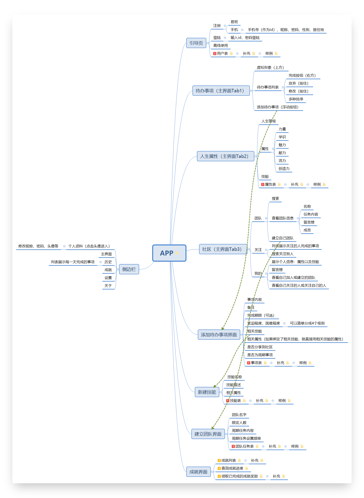

因為只有一兩個月的開發時間，當時版本很粗糙。

但也初備了「待辦事項」、「屬性」、「團隊」等功能。

「技能」和「成就」應該是鴿了。

> 因為技能的定義衝突問題，一直擱置到近期，才以屬性自定義的形式進行呈現。

#### **起名**

當時想著應用的理念為「人生升級」之類的詞彙，

就取了「人生」的諧音「人升」。英文名則是對應的「LifeUp」。

#### **開發**

> 你永遠想不到開發會先開發什麼功能.jpg

1. 先用 Inkscape 設計了應用圖示
2. 然後開發了引導頁
3. 多語言（部分英文化）
4. 首頁框架
5. 登入頁面
6. ...

#### **避免影響**

遊戲化部分，我們儘量避免著受已有應用的影響。

想靠著自己的見解開發一款與衆不同的遊戲化應用。

其中初始屬性的定義，也參考了不少遊戲的設定（比如Fallout系列的SPECIAL系統）。

#### **結果**

由於不擅拉票，易班這次比賽還次於某個無法正常使用的失物招領應用。

簡單略過描述。

### 3. 初次釋出

#### 上架酷安

易班比賽結束不久後，校內又舉辦了一場由*PeroPero Games*（就是那個開發了Muse Dash的工作室，蹭個熱度）贊助的遊戲和應用開發比賽。

我們就計劃著完善《人升》，再次參加比賽。

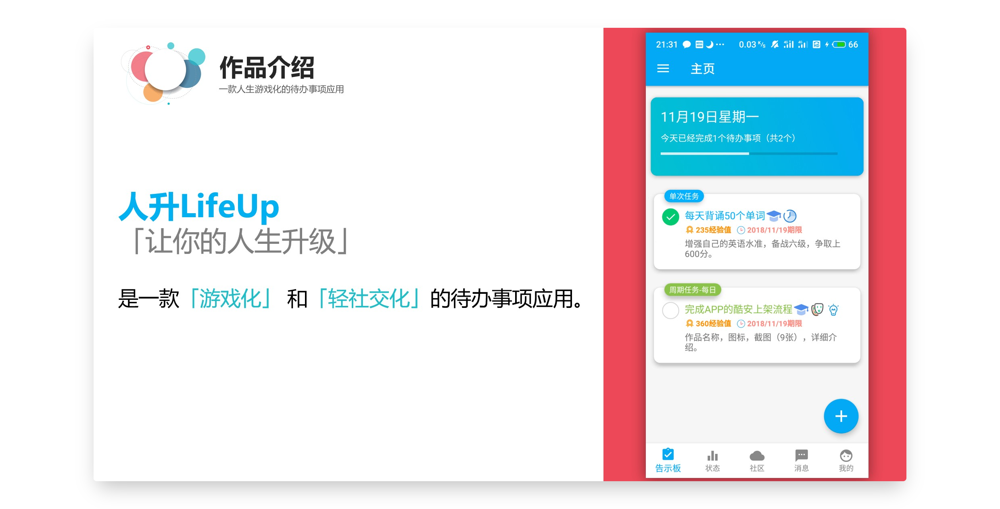

爲了讓應用的表現更有說服力，我們將應用釋出到了酷安，也方便評委/觀眾進行下載。

就是下面這個慘淡的資料：

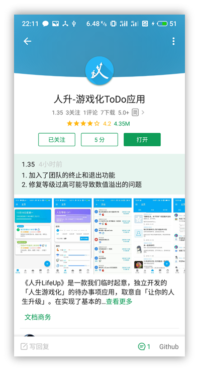

這時的應用版本，爲了實現更多的趣味功能，也增加了一個非常簡陋的成就係統（與現在版本的成就完全沒資格比對），以及“臭名昭著”的計步獎勵力量經驗值。

#### 比賽答辯

吸取了一些上次比賽答辯的經驗教訓，這次將答辯展示的關注點聚焦在了應用本身的趣味性（而非技術實現上）。

有個有趣的小插曲，當時的評委其實是分為遊戲組和應用組的。但由於《人升》是`遊戲化`應用，我們也很神奇地被*PeroPero Games*創始人之一的師兄提問。

我們也將應用在 V2EX 發了帖子進行簡單的宣傳，當時來了一波 V2 老哥在酷安留言，也算是我們的種子使用者了。

但其實在答辯的時候，總的下載數應該寥寥於100左右。（現在終於可以乘個萬了）。

這次，也終於拿下了第一。

### 4. 酷安頭條

賽後一段時間內，我們也在糾結如何處置這款應用。

如果沒有使用者的話，更新也就缺失了動力。

當時就是打算髮布個摸魚公告（短期內時間不夠維護，長期會做這些功能）的心態，在酷安釋出了一份簡單的後續開發計劃。

這份開發計劃如今看來是十分不靠譜的，比如聚焦在閱讀記錄統計等功能上。

完全想不到的是，這份公告居然被酷安小編推到了首頁頭條（萬惡之源）。

《人升》的評論區也在一天內被一兩百條評論淹沒，即便當時的應用基礎功能都不夠完備、遊戲化元素更是嚴重缺失。

然後，我們也是從那時候發現，當時的版本居然不相容安卓9。

在安卓9上，應用無法聯網。

因為當時的裝置是安卓8，無法復現問題。

**排查了好一段時間，才發現是安卓9預設禁止了htt**p訪問...

> 現在看來是大烏龍了（

也是因為涌入的使用者和鼓勵，我們持續著完善著應用的基礎功能。

當時主要的遊戲化體現仍然僅僅有「屬性」，但這已經足以實現一部分激勵作用了。

### 5. 更高一步的遊戲化

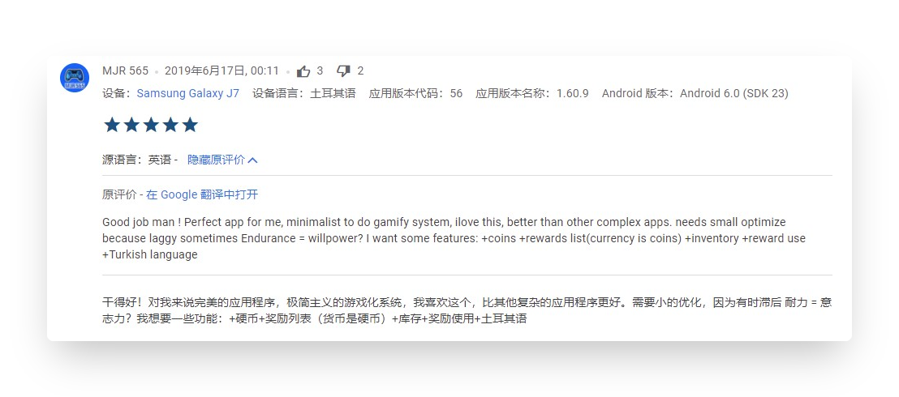

19年4月份，我們將應用完整英文化後，釋出到了 Google Play。

> 在當今看來，這無疑是最正確的重要決策之一。

因為Google Play上，不允許免費應用轉為付費。

我們將《人升》設定爲了買斷制付費應用，19年4月份上架後，也陸陸續續有零星的海外使用者使用。

其中，上圖中的評論，為我們指明瞭開發方向。

當時，我雖然知道有類似的獎勵機制的應用，但未曾試用。

也憑藉着自己的理解，在8月份的版本中釋出了「商店-倉庫-金幣」功能。

該功能無疑是當今人升中最為重要的功能之一。

> 但商店的理念與屬性其實並不一致，但又不矛盾。
>
> 屬性其實講究的是開箱即用，使用者完全不需要任何設定即可體驗經驗值增長和升級。
>
> 而商品則是對應自我獎勵，需要個性化配置。
>
> 但在人升中，它們同屬於激勵機制，而且有著諸多的聯動機制。

直至19年末，人升已經有了初具雛形的屬性和金幣體系了，還有個系統成就模組。

### 6. 篡改

當時，《人升》是開源的，我們希望能夠由開源社羣進行程式碼貢獻和維護（如Habitca的客戶端一樣）。

但沒想到，換來的只有一些篡改版本。

後續只能將其閉源，並且爭取登入各個應用市場。

### 7. 實驗功能（20年）

20年（中旬準備畢設摸了一陣子），我們則是推出了一系列實驗功能和功能完善：

- 簡潔模式
- 感想
- 自定義成就和解鎖條件支援
- 番茄鍾
- 商品使用效果
- 開箱
- 世界櫥窗

也終於滅絕了`商品無用論`。

也是在20年中下旬，我們“被逼著”上線了會員系統。

此前，人升一直是完全免費+自願捐贈。

用愛發電不可長取，營收也可以帶來持續的動力。

### 8. 標準化和基礎建設（21年）

今年，我們也持續維護著各個功能模組：

- 開箱功能完善（連開、固定）
- 合成系統
- 屬性自定義
- 正計時

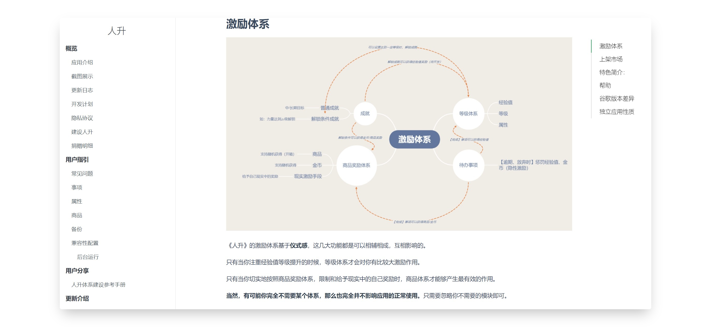

除應用功能外，也搭建了：

- 新官網
- 文件網站
- 新宣傳影片
- 伺服器升級和遷移
- 自動化打包
- 靜態程式碼掃描
- YouTrack需求和問題管理
- 新宣傳圖

此處可插入新宣傳影片：

---

## 感想

隨便提一些個人感想和碎碎念，時間有限未作充分思考。

### 1. 接受稱讚、反思吐槽、忽略噪聲

稱讚就不用多說了~

從吐槽中，我們也能發掘一些需求和最佳化點，比如是否是指引不到位、互動不合理等等。

關於噪聲，可以理解為毫無意義的批評。

> “噪聲”的說法也是來自某篇獨立開發相關的譯文。

印象最深刻的是，有一位會員，三番兩次透過多種渠道付款後，在同一天內找個奇怪的理由退款（比如“清單”不支援連續建立）。

後來退款時發現該使用者行為不正常，可能涉及詐騙等，後續就直接不傳送兌換碼而是退款了。

與此類似的，也有某市場評論區

> 應用內以前有個很好玩的小遊戲，後面被砍了

我都不知道我開發了小遊戲.jpg

甚至於經常會有經驗主義者，

「這種機制火不起來、這種收費模式不會有使用者的、要做押金制」等等。

學會忽略即可~

市場是公平的，交給市場做評判。

### 2. 關注中短期規劃

因為《人升》這款應用的特殊性，中短期靈活的規劃可能更適合它。

隨便舉兩個簡單的例子：

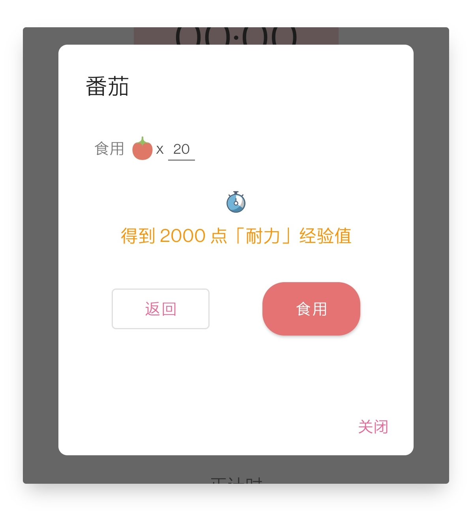

1. 當初開發番茄鐘的時候，直到功能開發完了一大半。才靈光一閃，加上了番茄食用的設定。

2. 開發商品使用效果的時候，也是直到最終階段，纔想到了合成機制這個比較有趣的玩法。

   後續更是將合成做成了獨立的系統。

### 3. 看重可維護性

一款需要長期更新維護的應用，可維護性是至關重要的。

我們在開發《人升》的過程中，也一直在推陳出新，調研新的技術框架，一步步從MVC -> MVP -> MVVM。

一些老且需要增添功能的頁面，我們也抽空進行了重構（統計、新建任務、任務列表頁面、狀態頁面等等）。

這些時間的投入，也是爲了減少未來的債務。

> 不要償還過去，不要透支未來。

### 4. 想法與表達之前註定存在失真

如同我們最初的思維導圖也未能完成實現一樣。

> 其實我們更早期的構想，也存在著人物系統。

一款產品的構思和最終實現，終究會存在不少的失真。

原因可能有平臺限制、時間限制、技術水平限制等等。

想法並不值錢。

對錶達失真的取捨，可能纔是價值點所在。

---

## 表現

### 1. 國際化

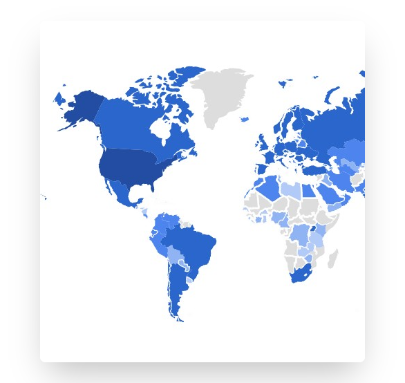

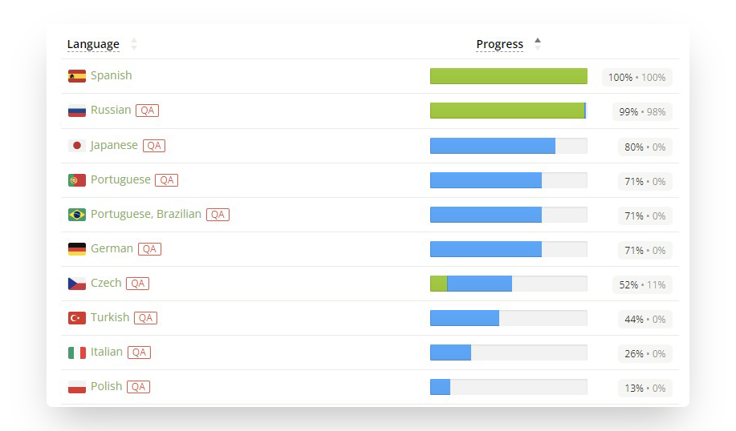

雖然當前人升海外的使用者總量不多，但使用者還是遍及各個國家地區。

多語言方面，我們初始維護著簡繁體中文和英文。

其餘語言由使用者參與貢獻和潤色，也有著不俗的翻譯進度。

### 2. 海外市場營收

隨著7月份上了一波英美區首頁，海外市場表現很驚人。

之後的幾個月也是平穩了下來。

我們也相信這一次的高度，更不會是頂峰，只是個山腰或者山腳~

### 3. 市場排名

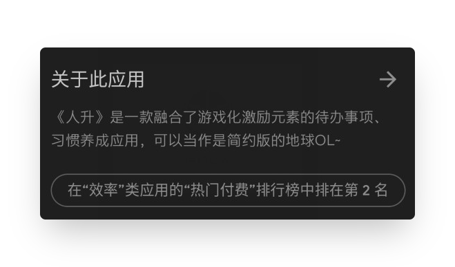

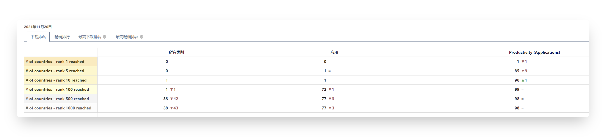

在限定「效率」類的「熱門付費」（這裏的付費指的是付費應用，其實屬於藍海了）的條件下，

**《人升》能在美區以及其他84個國家或地區保持著排名前5的水準。**

## 展望

### 1. 標準化

回顧前一段時間，其實《人升》的功能迭代導致的問題一直都很多。

也有一些比較嚴重的：

- 低版本手機啟動崩潰
- 服務端慢查詢導致年初經常宕機
- 商品排序導致商品被複制
- 谷歌新賬戶登入不了

曾經有一些系列版本中的小版本號迭代到了16。

因為這些問題，曾經嘗試了一些手段（會員alpha測試、發包週期調整、自測用例），但因為人力問題，還是不能很好地解決。

今年下旬，成功邀請了一位非常非常優秀的測試同學加入了團隊。

協助測試和搭建了很多相關的東西（自動化打包、靜態程式碼分析等等），使得近期的一些版本釋出週期很穩定。

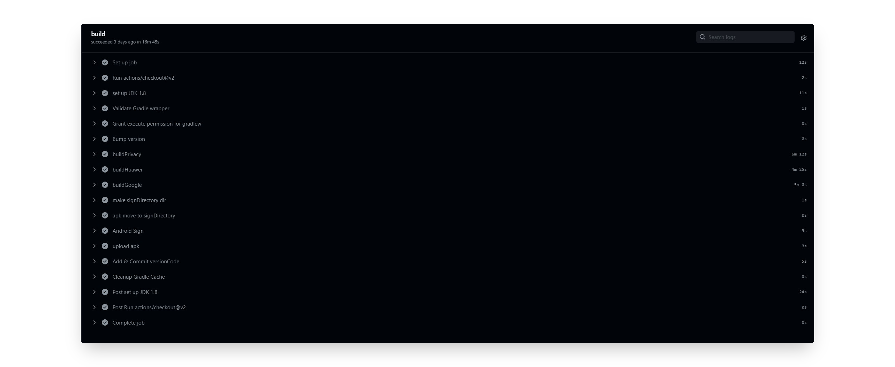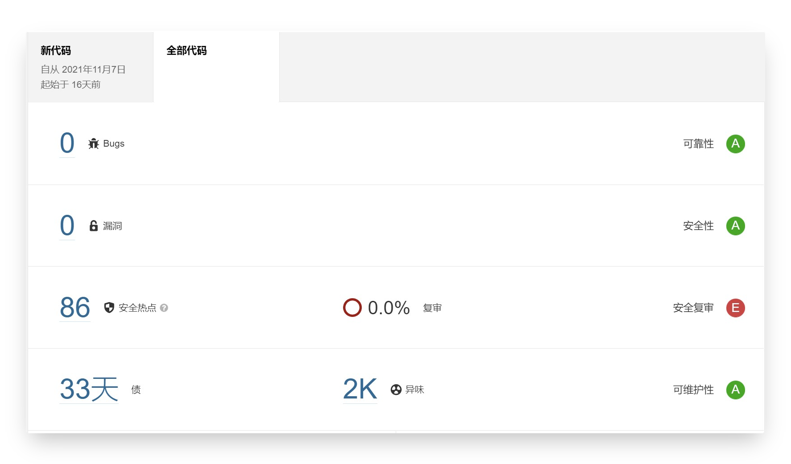

雖然拉長了初期版本的釋出週期，但是算上原先的修復釋出而言，總週期無疑是縮短了的。

甚至參與了一些功能的開發。

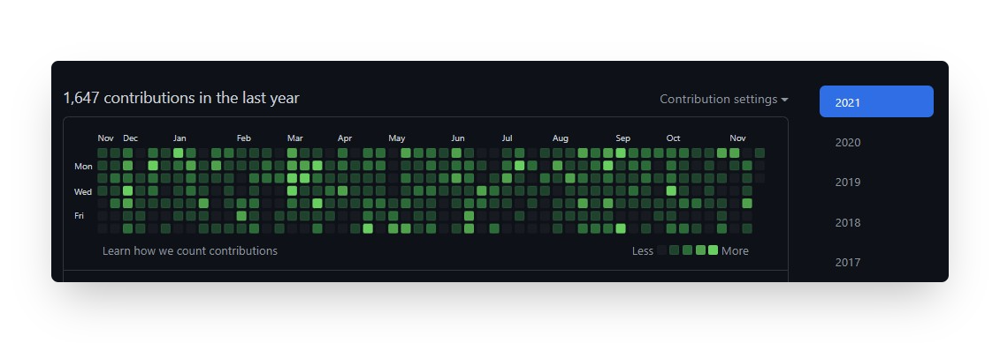

**作為一款有多達 2400 次程式碼提交的離線化工具類應用，穩定性是至關重要的。**

後續也會在注重穩定性的前提下進行功能迭代開發。

### 2. 跨平臺

iOS 版本是個巨大的痛點。

困於技術水平、時間和增量同步難以解決的情況，一直很難嘗試進行 iOS 版本的開發。

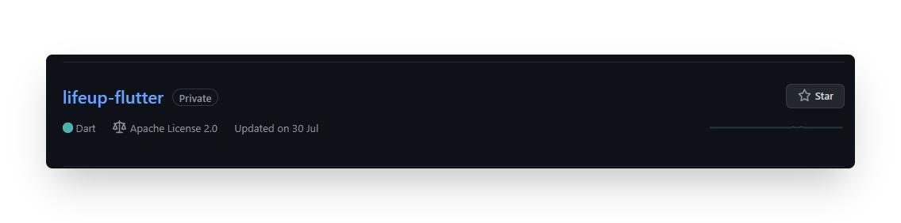

雖然今年建了 Flutter 版本倉庫，但仍沒時間學習和進行開發。

後續計劃是在 Flutter 上進行一些革新功能的實現和 UI 的重新設計（人升2.0？）

### 3. 開放

除了普通的功能迭代外，

我們會嘗試在後續版本中開放一些客戶端介面（比如新建任務、增減金幣、增刪商品）。

以便使用者也能夠在外部擴充套件實現一些功能。

### 4. 做時間的朋友

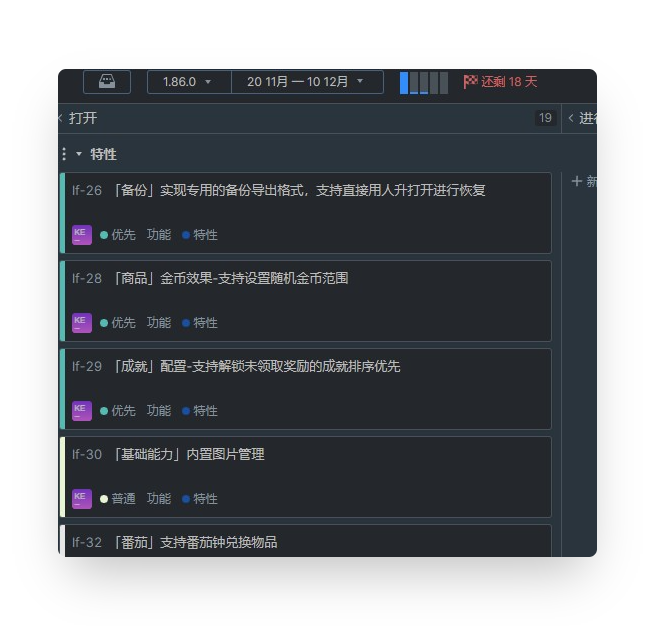

《人升》尚且仍有大量需要改進和維護的點，我們會做時間的朋友，持續維護和更新。

定個小目標，明年《人升》排名前5的數量保持不變或增長的前提下，能減少一個限定條件（在85個國家或地區的熱門付費類的所有應用排名前5）。

《人升》仍是由三名開發人員在業餘時間進行維護。

這裏的開發也是泛義，目前開發人員都是身兼數職的（所以英文版裡的關於頁面，將`developers`改爲了`designers`）。

> 實際上一款產品的誕生，需要產品、設計、互動、客戶端開發、後端開發、測試、運維、市場釋出、運營等諸多職位的參與。
>
> 看起來滿當當的半個月，我們的實際可開發時長可能不足4天。
>
> 但可以肯定的一點是，我們會堅持下去（因為還有很多活沒幹完~）。

## 結語

比較遺憾的是三週年沒有做充分的準備，今年公眾號也斷更了一年。

應用內有比較多的設計理念、一些細節改動都沒機會在本文涉及。

後續有機會可能會以獨立文章的形式釋出更多內容，感謝關注~

感謝使用者們的長期理解和支援！

希望人升能隨著優秀的使用者們一起升級成長~

> 也歡迎參與人升的共建。
