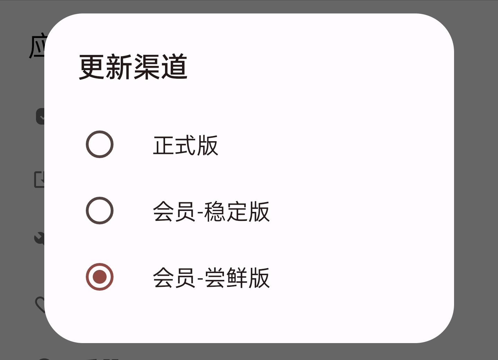
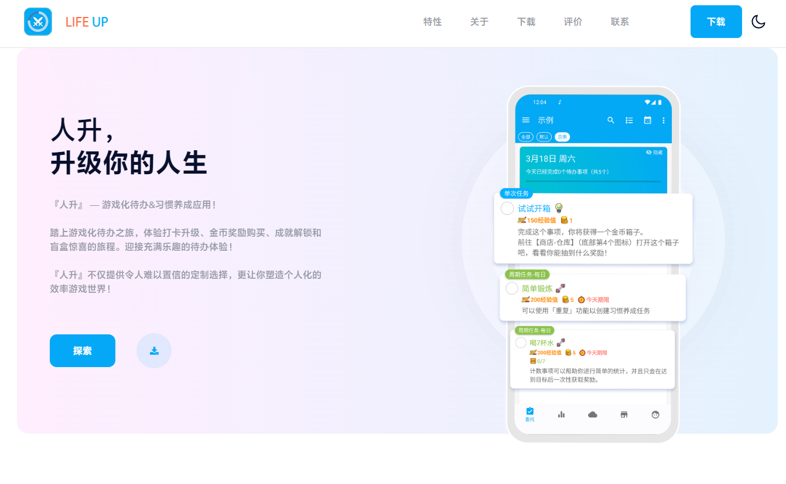
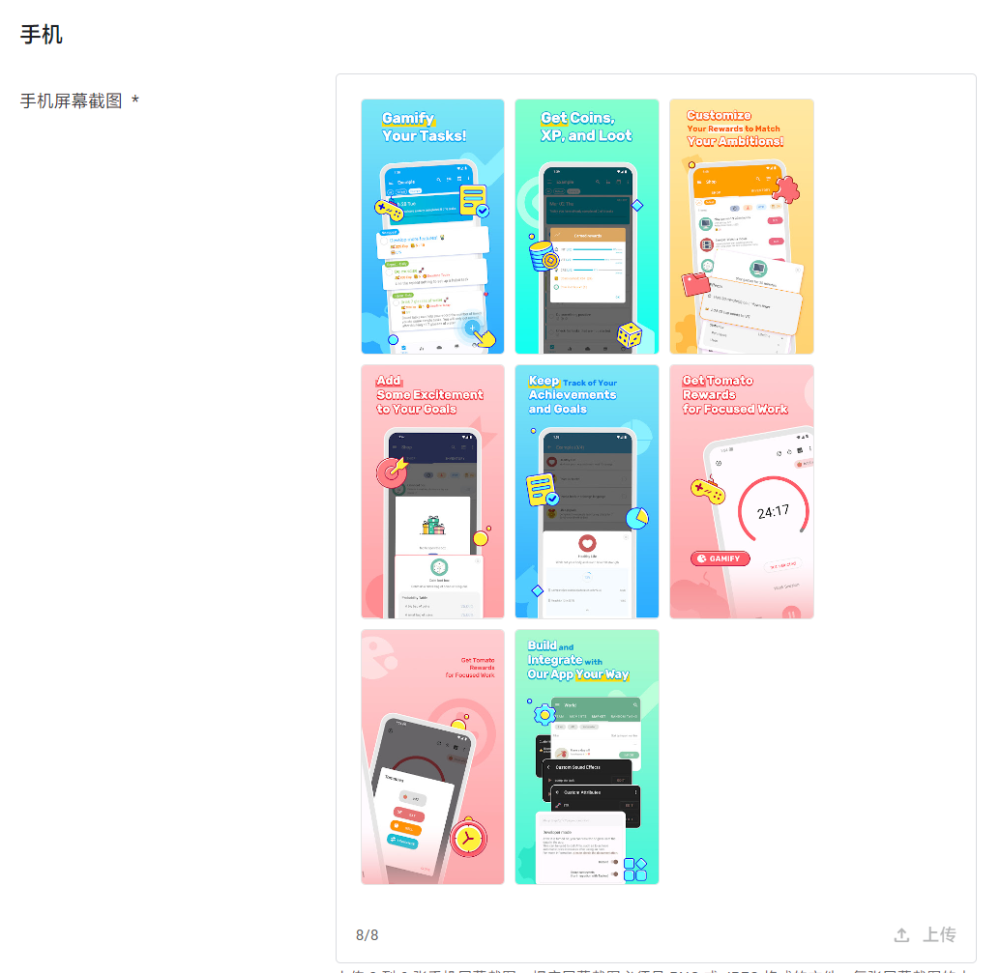
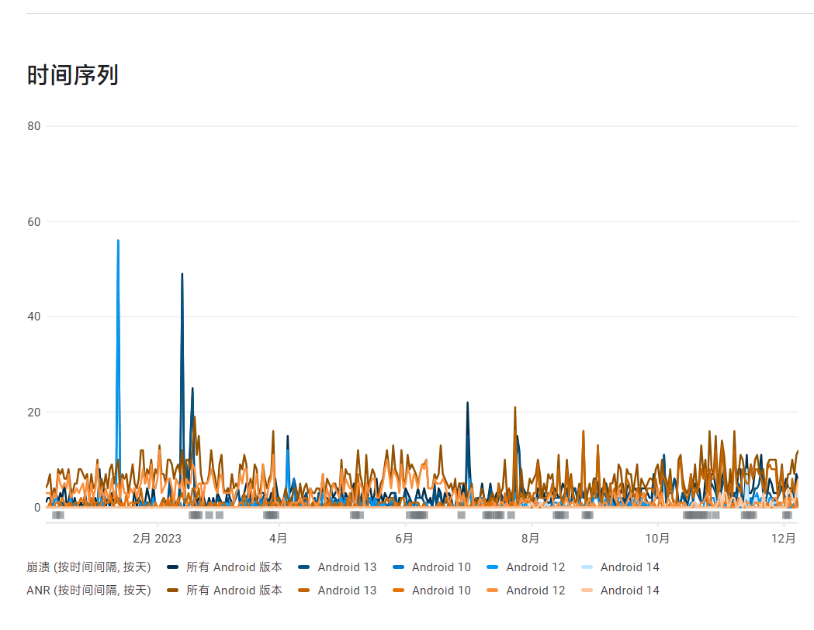
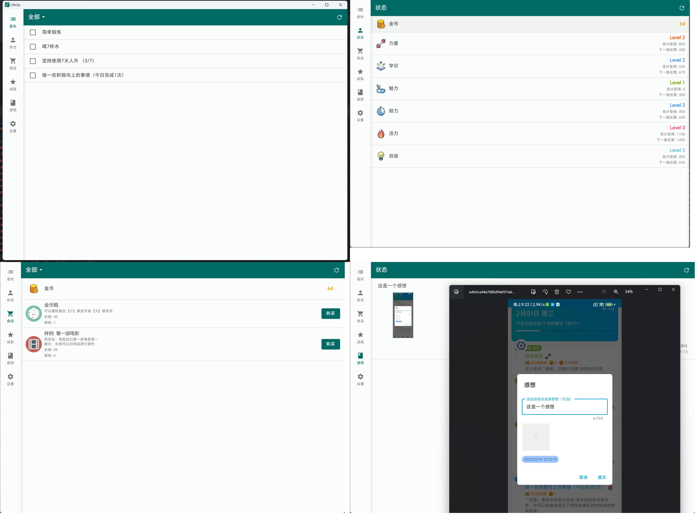

## 2024 年開發計劃

!> 這是我們目前正在進行的開發計劃。我們會竭盡所能根據該計劃指引進行產品的改進和升級。但考慮到環境的不斷變化，開發計劃中的內容可能會有所修改或增減。具體以產品釋出和上線的實際情況為標準。

### 一、開發計劃

> 更新於 2024/06/16

| 模組                      | 子功能                                                       | 預估版本    | 需求緣由                                                     | 優先順序 | 結果                                                         |
| ------------------------- | ------------------------------------------------------------ | ----------- | ------------------------------------------------------------ | ------ | ------------------------------------------------------------ |
| 基礎能力（1）             | 多選商品 & 獲得時使用商品（？）                              | v1.94       | 略                                                           | P0     | ✅ v1.94已上線多選功能 🚧自動使用商品仍在規劃中，預計v1.96 版本上線 |
| 基礎能力（2）             | 獎勵彈窗通用化改造（支援任意數量的屬性和商品）               | v1.96       | 略                                                           | P0     | 🚧 預計v1.96 版本上線                                         |
| 基礎能力（3）             | 音效資源管理 & 商品音效使用效果                              | v1.95       | 略                                                           | P0     | 🚧                                                            |
| 基礎能力（4）             | 提醒最佳化                                                     | v1.95       | 略                                                           | P0     | 🚧                                                            |
| 大螢幕適配（平板/摺疊屏） | 基於[Activity embedding](https://developer.android.com/guide/topics/large-screens/activity-embedding)適配平板、摺疊屏 | v1.95       | 略                                                           | P1     | ✅預計於v1.95上線                                             |
| 小部件                    | 小部件擴充（倉庫小部件）                                     | v1.95       | 略                                                           |        | ✅v1.94 已上線                                                |
| 日曆整合                  | - Google Calendar 雙向同步 - 系統日曆 雙向同步           | v1.96~v1.99 | - 海外大量需求反饋。 - 人升是一款待辦工具，與日程應用有功能重合但不一致，再內建日程功能的話，工程量十分龐大。與外部聯動或是更佳的解決方案，並能一定程度減少跨平臺同步需求。 | P1     | 🚧                                                            |
| APIs                      | - 擴充 API 能力和數量，儘量覆蓋所有基礎功能 - 桌面端功能完善，支援備份/恢復等 | v1.94~1.99  | - 仍缺少大量 APIs，如編輯等。 - 人升沒法做到 all in one，但提供APIs功能可以實現每個人定製和擴充套件自己的人升。並且實現開源社羣。  | P1     | 🚧                                                            |
| 成就                      | - 重複型成就                                                 | v1.94~1.97  | ~                                                            | P2     | 🚧                                                            |
| 資料體系                  | - 資料和圖片分開備份 - 支援部分資料匯出和匯入 - 支援內建多檔案切換 | ~           | - 因 WebDAV 上傳大檔案容易失敗，堅果雲有流量限制，全量+圖片備份過於龐大。 - 部分資料匯出+匯入，可以用於使用者間分享體系。也可以為增量同步打下一部分基礎。 - 內建多檔案，使用者可以直接切換多個體系使用，並且隨意除錯應用。而不需要重複清空資料或使用分身類軟體。 | P1     | 🚧                                                            |
| 多端（Flutter方向）       | - 持續學習和使用 Flutter 開發跨端版本                        | ~           | - iOS 版本雛形開發，復刻現有 Android 版本。                  | P0     | 🚧                                                            |
| 多端（KMP方向）           | - 探索使用 KMP 的更多可能性                                  | ~           | - 探索學習 KMP 技術，為未來做準備                            | P0     | 🚧                                                            |

總的來說：

1. 我們會貫徹之前定的方向，以穩定、最佳化現有功能為主，不隨意增添功能模組。
2. 我們使用一兩個大版本的時間。解決掉一些基礎功能上的缺陷和痛點。
3. 然後再研究日曆整合、重複型成就。
4. 期間會持續完善 APIs 等。

多端跨平臺則作為我們的2024年的重點目標之一進行推進。

### 二、2023 年回顧

`人升`的半業餘半課餘開發歷程已經度過了五週年，即將踏入第六個年頭，我們也釋出了數百個版本，單 Android 倉庫也提交了近 5000 次程式碼。

 

儘管22年10月提出的開發計劃是以深化人升的功能體系為主，但是由於環境變化問題，途中仍接受到了不少阻礙和困擾。

#### 1.1 環境

典型的就如：

- 受到了部分省份的“反詐”誤報且找不到申訴途徑，幾番周折才解決了一部分問題。但近期又出現了山東地區的誤報問題，目前還未找到申訴和復現途徑。

- 中國國內安卓手機應用市場稽覈標準層層加碼、市場和人員間規範不統一，稽覈人員不專業。

  - 某些應用市場經常會在沒改動的地方拒審。

  - 某V應用市場差點以“隱私合規”作為理由拒絕我們的`人升`應用。市場方面要求我們的應用必須申請【讀取所有檔案許可權】或者【讀取所有照片許可權】並提供相應說明，以便使用者可以從相簿中選擇圖片。不過，`人升`採用了更注重隱私保護的方法，不需要申請這樣的許可權，也不會直接讀取使用者的檔案。相反，我們的應用透過跳轉至系統自帶的相簿應用，只接收使用者選定的圖片，確保了隱私的最大程度保護。

    但稽覈人員反而不瞭解這類最正確的做法，經過了幾個工作日跟客服溝通才得以過審。

 

爲了減少環境問題對我們的影響：

我們加強了應用內更新機制，並減少提交應用市場稽覈的頻次了。

現國內版本支援應用內更新，並可自選切換穩定渠道、會員內測渠道了。

此外，我們也更新了一下官網（https://lifeupapp.fun/zh/index.html），作為備選的下載渠道。

以便大家可以更方便地透過我們官網下載到應用和安裝，並規避掉應用市場稽覈的風險和緩慢問題。

應用內的網路請求也增加了備用渠道，可以緩解和預防一些部分省份誤報後沒法訪問的問題。

 

隨著這些加嚴，以及看到了其他獨立開發者被國內安卓市場的各種阻礙。

只能說 2023 年當今，對於獨立開發者，非常不適合拿國內安卓當作目標上架平臺了。

畢竟國內安卓有著最嚴格的資歷要求，最複雜**多變靈活**的市場稽覈要求。

>  但最神奇的是，同時你又卻能看到一些粗製濫造的山寨應用輕輕鬆鬆上架並標識“人工複檢透過”。

這可能也是為什麼大量小紅書上能看到的獨立開發者的作品只有iOS版本。

Google Play、Appstore 仍是首選。

?> 大家也可以多關注和支援一下還能繼續堅持國內安卓的獨立開發者、小團隊們~

 

所以，2024年：

- 我們將遷移上一期開發計劃中仍未完成的部分至這一期，如日曆整合、重複型成就、基礎能力、資料體系等。
- 多端開發將作為我們的重要目標，並且可能會包含兩個方向。
  - 使用 Flutter 復刻人升（由於人力有限，這部分將由後端同學-小小開發推進）
  - 擴充套件探索使用 KMP（Kotlin Multiplatform Platforms）的更多可能性

#### 1.2 國內使用者增長

除此之外，2023年`人升`在中國應用市場也有著顯著的使用者增長。感謝大家的支援！

- 爲了減少手動發放兌換碼的耗時，並更集中將精力用於開發：2023年我們額外接入了自動化支付方式（微信、支付寶），並支援了微信登入。
  - 這一點解放了我們大量的時間。

- 23年有一次QQ空間的使用者傳播，再次把我們的伺服器打崩了好幾天。
- 我們也在嘗試運營公眾號、小紅書、B站等，推廣、介紹人升的更新和創意用法。
- 隨著使用者群的增長，我們也遇到了一些波折和奇特的經歷。例如：
  - 有使用者對著我們的公眾號自動回覆連續發了十幾句粗話。
  - 我們從Q群中移除了一位不友好的使用者，結果他轉頭去寫了一篇小作文。
  - 在回答一位使用者關於API獲取方法的詳細諮詢時，我們不僅給出了詳盡的解答，還提供了案例作為參考。然而，該使用者還是反覆問同一個問題，最後因為沒法理解自稱感受到了前所未有的心寒。
  - 在人工發放兌換碼期間，一位使用者在收到兌換碼後，又透過不同渠道請求相同的碼。我們提醒他不要多渠道重複申請，甚至替他解釋可能是網路延遲的原因，沒想到換來了一句“沒有人比我更懂網路”，然後還跑去市場評分留言他最懂網路。

- 透過眾多案例和與其他獨立開發者的交流，我們發現大多數獨立開發者都經歷過類似的困境，最終選擇關閉某些即時通訊和社交媒體渠道。我們深有同感。
  - 在大公司中，通常有專門的客服團隊或客服機器人來處理眾多諮詢，有效地將其轉化為具體需求或問題反饋給開發者。
  - **而獨立開發者自身一般要承擔客服、運營的工作，與一個不講理的使用者周旋，損失的是這個獨立開發者100%的開發時間（更別提還有小作文作為挑戰副本了），最終影響到的只能是開發者、產品以及使用該產品的核心使用者。**
  - 因此，我們也越來越傾向於推薦使用者透過電子郵件等方式提供反饋。

 

所以，2024年：

- 我們將繼續減少人力投入重複性的諮詢工作，而是完善文件、常見問題。即便存在諮詢，也是透過郵件、QQ頻道等統一處理。
- 嘗試少量運營一些社交媒體。

#### 1.3 海外使用者增長

2022年初，我們加入了 Google Play Pass 後，迎來了一大波使用者增長。

但該增長並沒有持續多久，到達2022年中旬的時候，使用者增長逐漸瘋狂減少，而且沒有好轉跡象。

由於`人升`是一款買斷制應用，使用者增長對我們非常重要，也是我們得以持續運營、以至未來有機會全職投入開發的基石。

我們嘗試了大量手段來改進增長：

- 找專業的設計師重新設計了商店宣傳圖
- 改進應用和宣傳圖多語言
- 改進應用描述
- 改進新手教程文件
- 加快更新的頻率
- ...

雖然實施了大量手段，並對部分指標有所改進。但仍然回不到穩定增長的時期。

我們就只能順其自然了。

好訊息是23年末，似乎有些好轉跡象了。

 

所以，2024年：

- 完善國際化建設（文件、應用內語言等）。

#### 1.4 質量管理

鑑於`人升`是一款由我獨自開發並進行測試的離線工具類應用，避免出現嚴重的崩潰問題尤為重要。

2023年的版本迭代過程相較以往耗時更長，同時，我們為會員內測預留了充足的時間，以確保準備充分。

這些措施似乎有效地防止了大規模嚴重崩潰的發生。

然而，每次版本更新仍不可避免地伴隨著一些問題，包括一些關鍵路徑上的問題。

為此，我們將持續提升`人升`的應用質量管理，以穩定性為最重要的指標（尤其是在當前日益嚴峻的環境和稽覈挑戰下）。

 

所以，2024年：

- 加強質量管理。

#### 1.5 深造功能

如之前三週年文章所提到的，`人升`是一款逐漸摸索和成長的應用。

所以什麼商店、自定義成就、API 此類功能都不在初期規劃中，而是隨著更新和反饋逐漸開發和新增的。

但這也引入了一些問題：

- 部分模組存在著一些粗糙的細節規劃。
  - 比如商品獎勵前期只考慮單獎勵。
  - 屬性等系統前期也未考慮自定義等，逐漸重構才能夠支援增刪和自定義等級等。
  - 還有很多此類問題，如屬性的獎懲彈窗和歷史展示最多隻支援3個。
- 這些後續新增的模組，缺少針對應用整體的分析和規劃。

我們將堅持三週年文章所說的方向，繼續深造應用的現有功能模組，解決一些痛點問題，而非追求新的功能模組。

比如我們會支援直接多選商品獎勵、完善備份機制、提醒最佳化、小部件補全等。

#### 1.6 API 和擴充套件性

如上面所說，我們已經不打算引入新的功能模組了。

但肯定會有想要擴充套件應用的需求。

所以我們 23 年引入了 API 功能。

將`人升`本體作為一臺體系的基礎能力提供出去。

即便使用者不懂程式設計，也可以使用 Tasker/Macrodroid 之類的自動化工具擴充套件功能，實現自動化能力。

典型的就如：

- NFC、掃碼完成任務
- 起床自動打卡
- 自定義小部件
- 等等...

如果使用者瞭解程式設計，更是能從上面擴充套件出更多的玩法甚至 app。

我們也基於 API 開發了一個簡易的桌面版本（並開源了）。

即便經過了數個版本的 API 擴充套件，目前仍然缺少不少能力。

比如不支援“感想”相關的操作，不支援透過 content provider 更新資料等。

我們將在 2024 年繼續擴充套件 API，使其儘量覆蓋應用的方方面面。

> 雖然目前看到了很多使用者自用 API，但還是缺少分享出來的可獨立執行的產物，我們需要持續提供更強的 API 能力，以便構建 API 生態。

#### 1.7 關於未來

隨著上述的種種問題和環境變化，我們也逐漸調整了`人升`永久會員的售價（即便如此，`人升`的會員定價也是遠遠低於大部分其他應用的），更新也會逐漸傾向於提供為會員功能。

我們逐漸意識到，應用終究還是為核心使用者服務的。

核心的使用者的反饋和支援能夠最終在應用的改進上體現，這才能實現開發者與使用者間的共創和正迴圈。

如果想要討好所有人，應用只會變成屎山，偏離核心使用者的訴求，也會降低開發者的收益和動力。

 

我們上面提到了 KMP（Kotlin Multiplatform Platforms），這是一門較為新興的跨平臺技術。也能混合運用上原生的能力。

在`人升`的開發途中，我們逐漸有些新的點子。但並非所有點子都能、都適合在`人升`上落地。

比如替換全套 UI、大改商店邏輯等等，這勢必會嚴重影響現有使用者的體驗。我們也見過了很多多番大改應用導致失敗的案例。

 

並且由於`人升`初期開發技術選型的時候，由於當時官方的資料庫框架`Room`尚未問世，挑選了一個國內開發的一個小眾資料庫框架。

現在一些效能問題也凸顯出來了，並且難以替換。

除此之外，現在`人升`同時支援Material 3和老版Material Design，加上夜間模式、多語言、國內手機系統的分裂（相容性配置的文件只會越來越長，原生系統以及海外版本的系統一般都只需要單個頁面配置即可）等等問題，每個頁面的開發需要考慮的東西都很多很複雜。

 

於是我們打算探索一下KMP，看看能否將一部分技術使用KMP實現。

也是爲了未來能夠有機會落地更多的點子和新專案，技多不壓身。  
