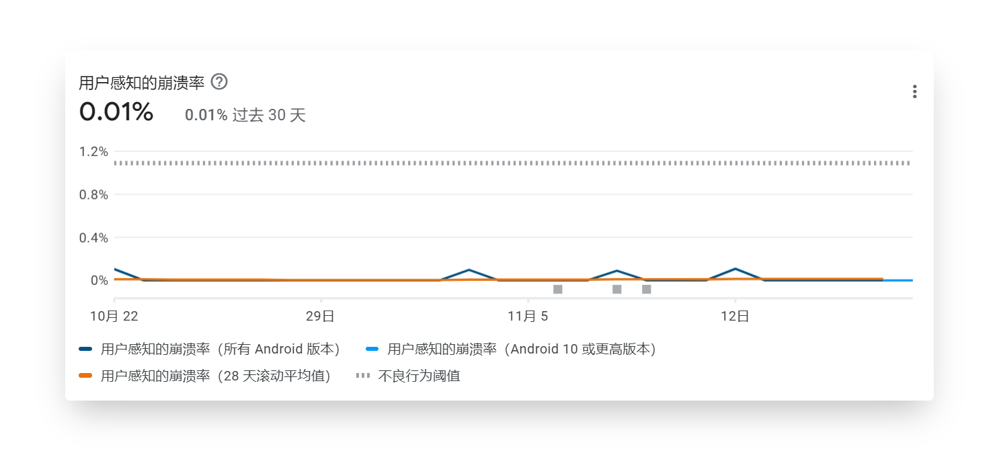
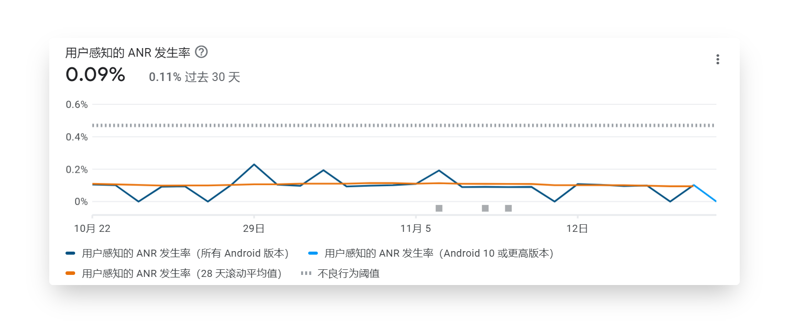
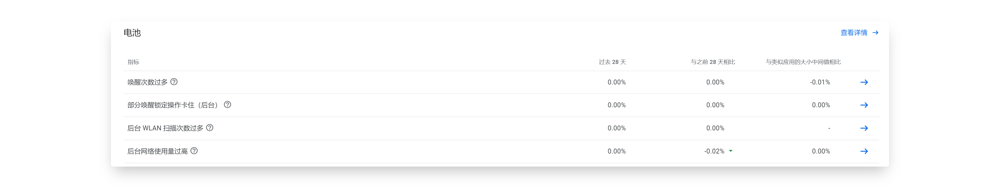
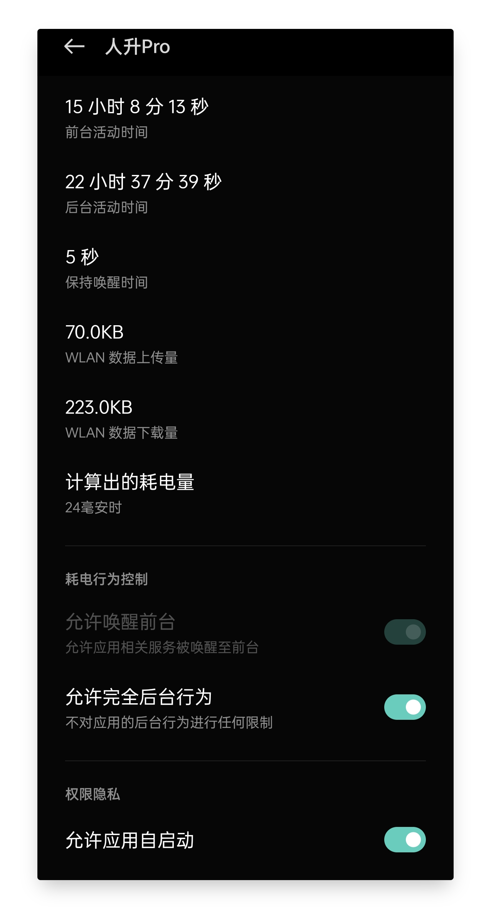
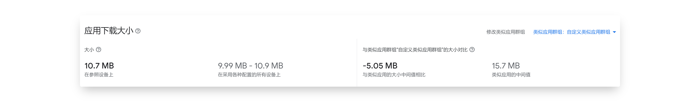
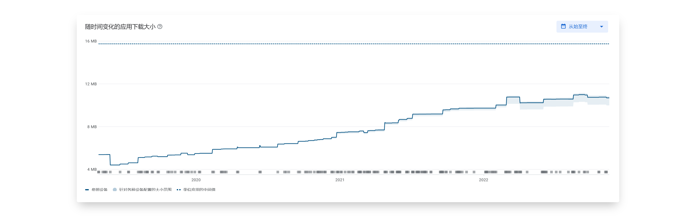
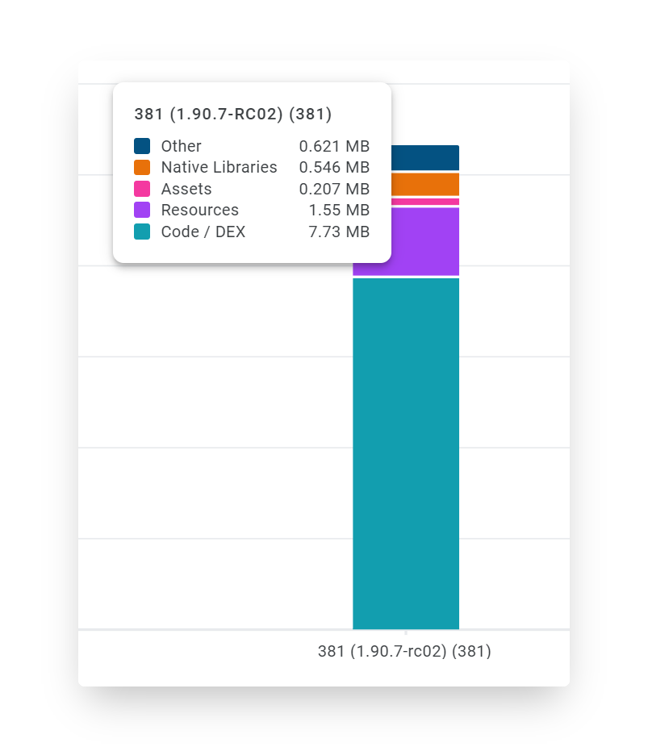
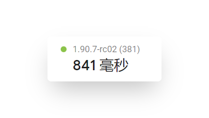
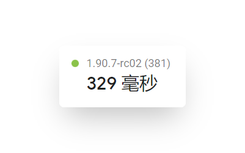

## 開發工效

儘管《人升》只是款小眾的軟體，但我們希望它的質量、效能水平能達到出衆的水平，並且我們做到了。

以下是一些線上相關資料：

> 資料基於 Google Play 統計，應用版本為 v1.90.7-rc02，覆蓋使用者群體為全球、使用者裝置 Android 版本為5~13。

 

### 崩潰率

《人升》近 60 天的崩潰率僅為 0.01%，遠低於 Google Play 定義的不良閾值 1.09%。

而類似群組應用的中間值為 0.14% 左右。

 

### ANR 率（應用未響應）

ANR 的定義是長時間卡頓，比如點選按鈕後，5 秒鐘應用都沒響應。

《人升》的 ANR 率為 0.10% 左右浮動，遠低於 Google Play 定義的不良閾值 0.47%。

但類似群組應用的中間值為 0.05% 左右。

 

由於《人升》前期留下了一些技術債務，這方面還有不少的改進空間。

 

## 電池耗電相關指標

後臺幾乎不存在任何耗電問題。

《人升》自身的邏輯後臺幾乎完全不會執行任何邏輯，只包含任務提醒、小部件重新整理等必要邏輯。

此處統計可能不包含番茄鍾**倒**計時場景，目前番茄鍾倒計時是基於手機執行和 CPU 排程的，而非類似任務提醒的定時任務。

 

此前也曾經出現過部分系統（MIUI）在部分系統版本下，出現耗電異常的情況。這可能是由於系統排程、第三方庫或相容性問題導致的。

目前沒有類似反饋。

 

以下是實測一加8T + ColorOS 後臺執行 24 小時以上的真實耗電情況。

 

## 包體積

即便《人升》已經持續更新了 4 年。

目前在 Google Play 上基於 App Bundle 的分發特性加持下，下載體積也保持在了 10.7 MB 左右。

對比海外類似群組應用的中間值（15.7 MB）也是少了接近 1/3。

《人升》接近 4 年的應用體積“膨脹”。

《人升》的體積構成，大部分都是被程式碼邏輯所佔用（含第三方庫）：

- 資原始檔（圖片、音效等）：0.207 MB + 1.55 MB
- 底層庫：0.5MB
- 程式碼：7.73MB

 

## 啟動速度

《人升》90 分位的**冷啟動**速度為 841 MS。

也就是說絕大多數使用者（90%）都能享受到秒啟動。

《人升》50 分位的**冷啟動**速度為 329 MS。

也就是說一半使用者（50%）都能享受到**半秒**啟動。

