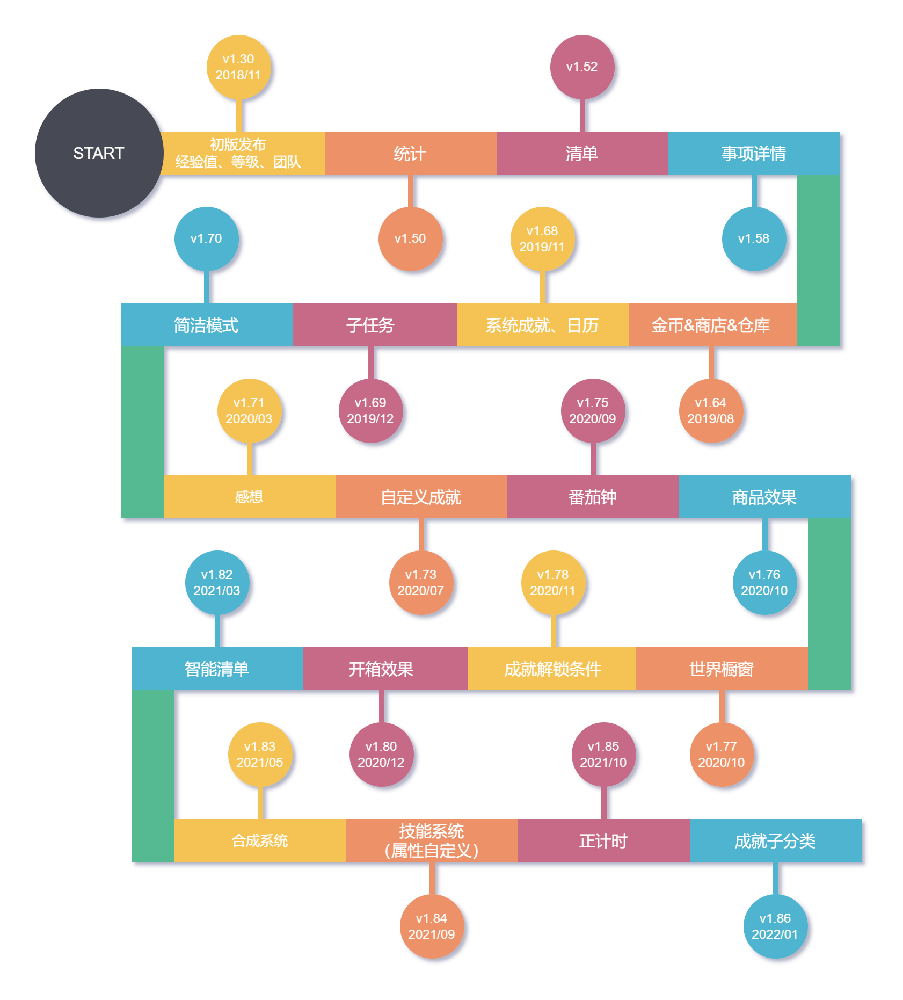

# 更新日誌

## 里程碑

## 詳細日誌

?> 下個版本在做了，咕咕咕.jpg

| 平臺         | 版本號       | 更新日期   |
| ------------ | ------------ | ---------- |
| 人升-Android | v1.97.0-rc01 | 2024/09/07 |
| 人升-iOS     | 開發中...    | 開發中...  |
| 人升-桌面端  | v1.1.1       | 2023/08/29 |
| 雲人升       | v1.3.0       | 2023/06/25 |

<!-- tabs:start -->

### **人升-Android**

**🎉1.97.0 (2024/09/11)**

**臨時修復**

rc02 -> rc03

- 多語言文字更新和裁剪
- 任務列表頁面與清單切換的相關效能提升
- 修復「全部」和「預設」清單的相關設定（篩選、排序）可能會互相關聯的異常問題
- 其他效能問題修復和最佳化

rc01 -> rc02

- 修復貸款金額足夠時，購買按鈕仍是不可按狀態的問題
- 部分卡頓問題最佳化

**✨特性**

**重點更新**

- 本次更新主要為效能最佳化和問題修復。
- 大幅最佳化了應用的整體效能表現，現在獲取任務列表和各種操作會更加流暢，目標安卓 API 版本適配至 Android 14。

**其他**

1. 當金幣不足時，現商品購買按鈕會展示為禁用樣式
2. 成就清單內，支援按成就名稱搜尋🔍
3. 支援應用內字型大小設定
4. 最佳化了世界-隨機任務的隨機邏輯，現在會減少最新一批任務出現的頻率，更為隨機化
5. 最佳化了通知分組邏輯，現屬性、成就解鎖等通知應該能正確分組展示
6. 統計-分享現支援切換是否展示二維碼

**♻️最佳化**

1. 最佳化了網路訪問邏輯
2. 彈窗增加背景模糊效果
3. 商店、倉庫、櫥窗等介面的按鈕最佳化，使用 Material 官方按鈕樣式
4. Content Provider 查詢任務歷史記錄的 API 現會返回任務的結束時間
5. Content Provider 查詢任務歷史記錄的 API 現支援篩選任務 Group Id
6. 提升了大量依賴庫的版本
7. Goto API 支援跳轉到「新事項預設設定」頁面
8. Goto API 跳轉到「新建成就」頁面時，現需要傳遞 category_id 引數
9. 增加 API 任務、計數任務、商品連結效果等應用內指引
10. 最佳化了新使用者檢測更新的邏輯和錯誤提示
11. 刪除賬號操作增加 loading 和錯誤提示
12. 最佳化了任務詳情頁面點選完成主任務的點選範圍
13. 最佳化了匯入備份的錯誤提示，現會更嚴格阻止匯入異常備份檔案

**🐛修復**

1. 修復新建任務時，如果先觸發了事項內容為空的錯誤提示，即便輸入了文字，該錯誤提示也不會自動消失的問題
2. 修復了底部導航欄模式下，統計頁面不展示篩選按鈕的問題
3. 修復了在特別窄小的裝置顯示比例下，部分介面顯示異常的問題
4. 修復了在複製任務的情況下，子任務的獎勵可能會出現異常關聯的問題（該問題出現自v1.96.0版本）
5. 修復了當觸發 Dropbox 自動備份時，因使用者連線 Dropbox 異常時的錯誤提示
6. 嘗試修復預覽極端大圖的記憶體消耗和崩潰問題
7. 修復了當購買物品時勾選使用但使用失敗的情況下，小部件的資料不會正確重新整理的問題
8. 修復了編輯成就會更改成就完成時間，而且有可能錯誤觸發成就解鎖通知等問題
9. 修復了大螢幕分屏顯示模式下，當同時顯示任務列表頁面和詳情頁面，完成任務、子任務、更新計數等操作時，兩個頁面不會同步重新整理的問題
10. 修復了在任務列表頁面，長按已經逾期過的單次任務，沒法清空期限顯示的問題

**1.96.1(2024/07/11)**

**🐛修復**

1. 修復完成子任務時，顯示的獎勵商品數量不正確的問題（不影響實際獎勵）

**🎉1.96.0 - beta01(2024/06/19)**

**✨特性**

**重點更新**

1. 完成任務或解鎖成就時直接使用商品，觸發商品效果
2. 單次使用商品的數量限制放寬至 1000
3. 現購買開箱、合成類商品也支援直接使用（開箱/合成）
4. 團隊任務也將支援釋出感想至本地感想
5. 任務備註中的第三方 URL Scheme 現也支援解析和直接點選跳轉
6. 歷史頁面現支援透過任務備註搜尋歷史記錄
7. 支援為歷史任務計時
8. 統計頁面支援按大類篩選
9. 重構了屬性經驗值獎勵、懲罰彈窗：同步最佳化了商品使用效果的屬性選擇數量限制、逾期的屬性經驗值減少彈窗拆分等相關邏輯

**♻️最佳化**

1. 選擇商品時，單選現在也沿用與多選一致的UI效果
2. 最佳化了任務列表的載入速度
3. 現新增或編輯任務時，不再強制要求期限時間在當前時間之後，這可以用於建立歷史記錄，以及增加了一些靈活性。
4. 如果開啟了顯示資料ID，現感想彈窗也會顯示對應的 ID
5. 最佳化了逾期處理彈窗的相關效能問題
6. 統一了倒計時計時狀態和暫停狀態的按鈕順序
7. 世界模組-個人主頁刪除動態的互動改為更容易理解的按鈕
8. 感想、成就頁面的相關載入效果最佳化

**🐛修復**

-

**🎉1.95.0-rc01 (2024/05/24)**

**✨特性**

**重點更新**

1. 支援為平板、摺疊屏等大屏裝置應用內分屏顯示

**♻️最佳化**

1. 商店、倉庫小部件的圖片現重新支援了應用內一致的裁剪效果
2. 統計頁面，當只選擇一天時，現在也支援顯示折線圖

**🐛修復**

1. 修復了編輯 API 任務時，編輯頁面顯示的任務型別不正確的問題
2. 修復了統計頁面中任務完成、放棄、逾期數統計計算異常的問題

**1.94.3 (2024/05/10)**

**♻️最佳化**

1. 當系統深色模式變動時，現會嘗試更新小部件適配主題
2. 當隱藏了【世界】模組後，系統成就的小紅點提醒不再計算【世界】模組相關的資料

**🐛修復**

1. 修復了多選商品時的低機率崩潰問題
1. 修復了與彈窗相關的低機率崩潰問題
1. 修復了呼叫修改商品 API 時，倉庫小部件可能不會重新整理的問題
1. 修復了倉庫小部件可以使用【不可使用】的商品的問題

**1.94.2 (2024/04/26)**

**🐛修復**

1. 修復了計算任務當前次數異常的問題（會導致設定了目標重複次數的任務進度不準確）
   - 該修復會回滾之前的最佳化撤銷任務的效能的改動，待後續實現更合理的解決方案

**1.94.1 (2024/04/22)**

**🐛修復**

1. 修復正計時或者透過 API 增加計時或者手動新增計時記錄時，番茄數計算結果少了1的問題
2. 修復在商店/倉庫頁面選擇商品後，滑動頁面可能會導致選擇欄閃爍不見的問題

**🎉1.94.0-rc03 (2024/04/22)**

**✨特性**

**重點更新**

1. 支援多選商品獎勵
2. 倉庫小部件

**UI 主題**

1. 自定義（任務、商品文字）顏色增加了更多的預設值
1. 適配 Android 14 單色自適應圖示特性
1. 增加了很多語言適配（Google Play版本）

**成就**

1. 如果存在未領取獎勵的成就，成就清單現會顯示小紅點。

**任務**

1. 懲罰任務的子任務現會正常執行懲罰邏輯
1. 增加【智慧時區管理】，如果你涉及到跨時區工作，人升也支援自動檢測時區變動，並且支援全域性調整時間
1. 詳情頁面的統計依據現支援記憶上一次的選擇，並且我們最佳化了部分場景的預設值
1. 最佳化了【我的】頁面的連續完成任務天數的寬限處理，現在應該某一天忘記完成任務，補打卡也能續上連續完成天數

**屬性**

1. 支援刪除經驗值記錄
1. 支援重置單獨一個屬性的經驗值

**小部件**

1. 現在點選商店、倉庫小部件的空白處，支援直接進入小部件所指向的清單，而非上一次清單
2. 任務小部件現會顯示計數任務的進度

**API**

> API 相關的文件在本文釋出時可能仍未更新，我們預計會在本週內更新，請等待一會~

1. 增加編輯番茄記錄的API
1. 完成任務的API現也支援正常處理懲罰任務
1. 完成任務的API現也支援處理計數任務（增加`count`引數）
1. 完成任務的API現支援獎勵係數引數
1. 調整商品API支援更改商品所屬清單id
1. 新建、調整商品的API支援排序依據引數
1. 跳轉API現支援跳轉到使用商品彈窗
1. 部分引數的定義不夠統一，現已統一處理。如`itemId` -> `item_id`
1. 增加正計時開始、暫停、結束的廣播通知
1. 調整商品的API的`title_color_string`現支援傳空字串以恢復預設值
1. 完成任務的廣播增加清單id
1. 開箱、合成現也會觸發使用商品的廣播

**♻️最佳化**

1. 新增或編輯任務時，如果沒有選擇屬性，輸入經驗值增加警告提示
2. 最佳化了上傳重試記錄
3. 最佳化了自定義等級頁面的標題展示和輸入限制
4. 最佳化了經歷過大量重複的任務的撤銷效能耗時問題。
5. 重構了使用商品彈窗、日曆介面等邏輯。
6. 最佳化了任務提醒的相關邏輯，確保已經刪除或者來自之前資料的提醒不會再被髮出。
7. 最佳化了備份介面的相關等待中文案。
8. 在自定義屬性頁面選擇的圖片，現也會加入到歷史選擇中。
9. 編輯番茄記錄時，現會嘗試修正（增加、減少）正確的番茄數。

**🐛修復**

1. 修復統計、備份相關的系統成就在重構後未正常觸發的問題。
2. 修復隨機API搭配toastAPI小部件使用等場景可能會跟預設的toast衝突問題。
3. 修復了從小部件進入任務詳情，在某些場景下不會重新整理任務詳情的問題。
4. 修復了某些特殊情況可能會導致錯誤多次開箱的問題（提前預支商品庫存）。
5. 修復在詳情頁面編輯沒有子任務的任務，並新增子任務，返回後不會展示子任務的問題。
6. 修復了某些特殊情況，無法編輯金幣獎勵的問題。
7. 修復了某些情況，領取團隊事項可能不生效的問題。
8. 修復了MD2下某些底部彈窗的樣式異常問題。
9. 修復了番茄鐘的追加時間取值可能錯誤的問題。
10. 修復了經驗值變動小部件的顏色條可能顯示不出來的問題。
11. 修復了某些任務在日曆-進行中可能沒法正常顯示出來的問題。
12. 修復了歷史、感想等頁面的某些列表載入問題。
13. 修復了完成任務API連續呼叫兩次沒法連續完成兩次任務的問題。

**1.93.4 (2024/01/09)**

**✨特性**

1. 增加【感想】API。

**♻️最佳化**

1. 統計頁面的平均值指標的計算現在不再包括未來日期。
2. 隱藏系統成就清單後，不再提示系統成就解鎖。
3. `goto` API 更新，不再支援顯示“不可購買”商品的購買彈窗。
4. 最佳化編輯任務時，解決輸入目標重複次數被遮擋的問題。

**🐛修復**

1. 修復自定義屬性頁面的邊到邊UI效果。
2. 修復在歷史/日曆頁面將任務設定為放棄後，再設為完成，懲罰不會撤銷的問題。
3. 修復Material2模式下底部彈窗與底部系統導航欄的顯示樣式問題。
4. 修復夜間模式下，待辦事項輸入框的邊框顏色不正確。
5. 修復螢幕旋轉後，使用三按鈕導航系統模式，可能導致頁面顯示不全。

**1.93.3 (2023/12/02)**

**♻️最佳化**

1. API 統一增加 debug 引數以便除錯

**🐛修復**

1. 修復了勾選“忽略提醒彈窗”不生效的問題
2. 修復了不能編輯【在感想頁面直接建立的感想】的問題
3. 修復了上傳團隊動態照片可以選擇9張圖片的問題，實際限制應該為3張
4. 修復了 use_item API 當 ui 為 false 時，不能觸發倒計時、URL效果的問題
5. 修復商店小部件使用商品可能會觸發兩次效果的問題

**1.93.1 -> 1.93.2 (2023/11/18)**

**♻️最佳化**

1. 最佳化了資料庫升級的邏輯，避免出現數據庫升級延遲的問題
2. 最佳化了編輯任務時的“開始時間”預設數值

**🐛修復**

1. 修復編輯商品的API呼叫後會導致商品使用效果丟失的問題
2. 修復將逾期、放棄的問題設為完成狀態時不會補回獎勵的問題
3. 修復了任務自定義排序可能會不符合預期的問題
4. 修復了單次任務逾期後的相關顯示、排序異常問題
5. 修復了篩選歷史頁面時的一個SQL異常問題
6. 修復了簡潔模式下，點選任務標題後，可能會出現再點選任務標題沒有任何反映的問題
7. 修復了重新命名任務模板不生效的問題

**🎉1.93.0 (2023/10/24)**

**✨特性**

**UI 主題**

1. 完整適配 Material Design 3
2. 支援設定 Material Design 3 主題的顏色來源：自選顏色、從桌布取色、從圖片取色等
3. 部分動畫效果改進：彈窗等
4. 最佳化“邊到邊”（沉浸式）適配效果

**任務**

1. 支援任務模板
2. 詳情頁面的統計，支援切換依據時間標準。並且最佳化了預設選項
3. 歷史頁面支援搜尋任務名稱，並調整了相應的 UI 和互動

**成就**

1. 支援設定秘密成就
2. 新增成就時，支援“繼續新增下一個成就”

**屬性**

1. 支援隱藏屬性

**番茄**

1. 支援編輯計時記錄
2. 番茄頁面支援完成任務（暫停狀態下，長按選擇的任務）

**感想**

1. 支援在感想頁面直接建立感想

**API**

1. 增加`使用商品`的 API

2. 增加`隨機` API

3. 增加`直接編輯經驗值`的 API

4. `商品`API現支援調整“禁止使用”、“標題顏色”、“操作文案”等引數

5. `商店設定` API 支援“silent”引數

6. 支援`time`時間佔位符

   現在你可以不借助自動化工具，就可以使用 API 設定明天截止、下個月截止之類的任務了

**♻️最佳化**

1. 部分顯示資料 ID 的地方增加字首
2. 團隊動態顯示最佳化
3. 嘗試解決部分 Toast 提示太長顯示不全的問題
4. 最佳化了小部件完成團隊時，部分邏輯與應用內不一致的問題
5. 統計頁面：在選中“自定義”時間範圍後，再次點選“自定義”，現在可以觸發重新選擇日期
6. 相容鴻蒙 4 上進度條通知沒法顯示操作按鈕的問題
7. 最佳化通知請求的互動邏輯
8. 最佳化輸入法會擋住【目標重複次數】輸入的問題
9. 現在建立任務時，會記錄使用者選擇的非具體的開始時間（比如自動、期限當天），編輯時，會恢復此類選項而非具體時間，避免導致編輯的時間不符合預期
10. 建立任務時，如果出現了重複不符合預期的警告，現在也會在“檢查重複”彈窗上顯示
11. 增加印尼語
12. 更新翻譯

**🐛修復**

1. 修復某些情況下，世界模組可能會卡載入（一直轉圈圈）的問題
2. 修復某些情況下，商店/倉庫可能會一直顯示載入（一直轉圈圈）的問題
3. 修復透過 content provider 呼叫含 UI 的 API 時，可能會發生錯誤的問題
4. 修復任務排序可能不符合預期的問題
5. 修復統計頁面選擇“自定義”時間範圍後，資料不正確的問題
6. 修復通知請求的彈窗不支援滾動的問題
7. 修復世界模組搜尋某些情況下會顯示所有內容的問題
8. 修復【顯示已完成】選項也會展示被凍結的任務的問題
9. 修復統計頁面平均值計算問題

**1.92.2 (2023/08/29)**

**✨特性**

1. 步數統計圖表（https://github.com/Ayagikei/LifeUp/issues/85）

**♻️最佳化**

1. 新建團隊頁面現增加了當前字數和上限字數提醒

**🐛修復**
1. 修復某種特殊條件下，「人升」可能會重複建立日曆提醒賬號的問題
2. 修復編輯團隊的選單按鈕未正確顯示的問題
3. 修復自動開始計時模式下，番茄鍾可能不會觸發振動提醒的問題
4. 修復在未選擇任何專注事項的情況下，番茄鐘的通知可能會錯誤顯示專注事項的問題

**1.92.1-rc02 - 1.92.1 (2023/08/18)**

> 會員內測釋出時間

**♻️最佳化**

1. 現在狀態頁面和統計頁面的統計時長，支援以【XX天XX小時XX分鐘】的形式展示

**🐛修復**

1. 修復 Android 12 版本以以下，通知許可權彈窗關閉互動不符合預期的問題
2. 修復屬性餅圖可能會出現透明顏色，導致不出來的問題

**1.92.1-rc01 (2023/08/13)**

> 會員內測釋出時間

**✨特性**

1. 新版統計融合了舊版統計的統計卡片，現已合併成同一個頁面，並適配了底部導航欄模式。

1. 升級了應用內更新機制和提醒功能

   現支援三種更新渠道：正式版、會員內測穩定版和會員內測嚐鮮版，以便後續側重於會員內測更新

1. TargetSdkVersion 適配了 Android 13 和通知許可權動態申請

1. 重新設計了編輯資料頁面

1. GP 版本重新最佳化了登入/選擇離線模式流程和說明

**♻️最佳化**

1. 相關技術依賴維護和更新
2. 完善了 WSA 適配和登入說明
3. 備份失敗時，現在會以彈窗的形式說明失敗原因。避免 toast 訊息顯示不全的問題。

**🐛修復**

1. 修復金幣歷史記錄頁面中可能存在的數值計算溢位崩潰問題
2. 修復團隊詳情頁面可能出現不符合許可權預期的選單問題
3. 嘗試修復正計時的時間誤差問題
4. 修復螢幕旋轉可能會導致完成任務的流程中斷、編寫感想的彈窗消失的問題

**1.92.0-rc02 (2023/07/16)**

> 會員內測釋出時間

**🐛修復**

1. 修復商店小部件跳轉其他應用（執行 API）可能不生效的問題
2. 修復商店小部件切換清單偶現異常的問題
3. 修復商店小部件不會按應用內設定隱藏售罄、隱藏不可購買商品的問題
4. 修復商店小部件可能會點選某件商品無反應的問題
5. 修復部分罕見的崩潰問題

**🎉1.92.0-rc01 (2023/07/11)**

> 會員內測釋出時間

**✨特性**

1. 統計2.0
1. 分享卡片

**♻️最佳化**

1. 現在支援為“不可購買”的商品設定價格，並用於退貨等場景
2. 當在設定中關閉“獨立設定任務懲罰”後，不再顯示懲罰按鈕
3. 最佳化團隊詳情中子任務的展示 UI
4. 最佳化感想的展示 UI

**🐛修復**

1. 修復當屬性裁剪樣式改為“圓角矩形”後，編輯圖示可能會長期顯示老圖示的問題

**1.91.3-rc04 (2023/06/07)**

> 會員內測釋出時間

**♻️最佳化**

1. 跳轉任務詳情的 API 現支援 task_gid 和 task_name
2. Content Provider 支援提供商品的遠端圖示的 URL
   - 以便後續桌面端修復部分商品圖示無法正確顯示的問題

**🐛修復**

1. 修復商店列表小部件未正確顯示當前金幣數的問題

**1.91.3 (2023/05/29)**

> 會員內測釋出時間

**✨特性**

1. 商店列表小部件（大、小版本）
2. 經驗值今日變動小部件
3. 新增跳轉任務詳情的 API
4. 感想：現在支援按時間正序排序，並且增加年份顯示

**♻️最佳化**

1. 現在支援為“不可購買”的商品設定價格，並用於退貨等場景
2. 當在設定中關閉“獨立設定任務懲罰”後，不再顯示懲罰按鈕
3. 最佳化團隊詳情中子任務的展示 UI
4. 最佳化感想的展示 UI

**🐛修復**

1. 修復當編輯任務時，如果清空激勵語，無法點選“確認”關閉彈窗的問題
2. 修復使用 API 無法搜索到被凍結的任務的問題
3. 修復商店、倉庫無法隱藏預設清單的問題

**1.91.2-rc版本 (2023/05/09)**

> 會員內測釋出時間

**✨特性**

1. 商店和倉庫清單支援分別設定隱藏
2. Goto API 現支援跳轉主頁的子頁面（如任務、狀態、商店、倉庫）
3. 統計中的金幣統計，現支援排除購買的消耗

**♻️最佳化**

1. 新建成就或編輯上鎖成就時，不再顯示“重新上鎖”按鈕
2. 金幣小部件現支援點選跳轉商店
3. 音效播放失敗時，顯示明確的錯誤提示資訊

**🐛修復**

1. 修復新增番茄記錄時，如果直接設定結束時間，可能會出現不符合預期的時長的問題
2. 修復任務篩選標籤後，會彈出輸入法的問題
3. 修復 ATM 利息不支援透過 API 設定絕對值的問題
4. 修復歷史頁面的資料載入異常問題
5. 修復在小部件完成計數任務時，點選“取消”會卡在透明頁面的問題
6. 修復統計頁面處於底部導航欄模式時，無法自動重新整理的問題
7. 修復當處於 GMT +-x.5 時區下，團隊任務領取異常的問題

**1.91.1 (2023/03/27)**

**✨特性**

1. 支援微信登入。
2. 支援自動化的會員購買方式（微信支付、支付寶）。
3. 顯示設定中增加「通知管理」選項。
4. 新建任務 API 現支援設定背景。
5. 增加商品倒計時相關的 API 廣播事件（[New API · Issue #64 · Ayagikei/LifeUp (github.com)](https://github.com/Ayagikei/LifeUp/issues/64)）。

**♻️最佳化**

1. 感想彈窗，點選外部空白處時，不再自動關閉彈窗。
2. 小部件不再會強制完成未開始的任務。
3. 完成任務的 API，當引數 ui 為 true 時，不再強制完成未開始的任務。
4. 當關閉設定任務單獨懲罰係數後，現在會忽略之前設定的任務懲罰係數，而優先使用全域性數值。
5. 現在會自動處理使用者輸入的 URL 前後的空格。
6. 當用戶開啟【隱藏不可購買商品】並建立不可購買商品時，會給出提示。
7. 當用戶開啟自定義等級後，如果沒定義任何等級就退出，現在會重置為內建等級表。
8. 最佳化小部件的預覽圖。
9. 步數輸入現在限定為數字（[[Feature\]輸入步數時預設使用數字鍵盤 · Issue #75 · Ayagikei/LifeUp (github.com)](https://github.com/Ayagikei/LifeUp/issues/75)）。
10. 商品的連結效果，開啟內建瀏覽器時，現在不再限定 https。
11. 商品的倒計時功能，增加了“相容性配置”說明。

**🐛修復**

1. 修復商店、倉庫中，選擇商品時，不符合預期的點選處理行為。
2. 修復 API 新增任務時，沒法為非重複任務設定期限的問題。
3. 修復某些裝置自定義屬性的圖片後，可能會不更新的問題。
4. 修復自定義音效可能會導致應用卡死的問題。改用了另一種自定義音效實現方式，理論上也會讓應用後臺播放音效更穩定和記憶體消耗更少，但播放速度可能會變慢。
5. 修復當未進行【忽略電池最佳化】配置時，Android 12 以上的裝置，開啟自動番茄鍾或休息時間，會在後臺導致崩潰的問題。
6. 修復商品倒計時音效會受番茄設定的音效開關影響的問題。
7. 修復 API 設定 ATM 日利率等引數時，存在浮點數計算誤差

**1.91.0-rc05 (2023/02/20)**

1. 改進應用內的部分提示，如配置桌面小部件、備份衝突如何選擇等
2. 修復無期限的任務有可能顏色不正確的問題
3. 為“無期限”的重複任務增加⚠說明
4. 更新翻譯（Google Play）
5. 增加跳轉到購買彈窗的 API（如`lifeup://api/goto?page=purchase_dialog&id=1`）
6. 支援檢測《雲人升》更新

**🎉1.91.0-alpha01 (2023/02/13)**

**✨特性**

1. 支援自定義等級梯度
2. 首批新增小部件
   - 金幣（小、大、目標）
   - 屬性（小、大）
3. 支援透過 Content Provider API 查詢“人升”中的大部分資料詳情資訊，包括：
   - 提供新版《雲人升》
   - 提供簡陋的初版區域網桌面版（Windows、Linux、MacOS）
4. 番茄計時記錄支援多選刪除
5. 番茄鍾支援設定自動開始休息和工作
6. API 改進和新增欄位，包括：
   - ATM 存取款
   - 商品設定“是否禁止購買”
   - 任務設定“標籤顏色”
   - 直接設定 ATM 餘額
   - 簡單查詢指定商品詳情
   - 彈窗介面增加第三種按鈕和操作選項

**♻️最佳化**

1. 改進大量資料時的查詢、處理速度和效能表現

2. 修復自適應圖示的不正確邊距問題

3. 最佳化番茄計時記錄的顯示效果

4. 改進恢復備份時的互動表現

5. 增加透過 Google Play 獲得會員許可的 UI 體現

6. 當從檔案系統直接匯入備份時，如果選中的不是“人升”的備份檔案，會提供禁用該一鍵匯入特性的提示

7. 在選擇商品彈窗時，搜尋商品後，自動關閉輸入法

8. API 行為變動，包括：

   - confirm_dialog 彈窗 API，如果不提供某些按鈕的文字或操作的話，該按鈕現在會直接不展示。

     這將提供更高的彈窗控制靈活度，比如你可以設定一個無按鈕的純文字彈窗，用於顯示文字、激勵語。

   - penalty 懲罰 API，以往版本扣除商品最多100件，現在將限制擴充套件到了9位數。

**🐛修復**

1. 修復番茄計時等頁面會在某些情況下在尾部顯示“載入中”的問題
2. 修復某些第三方庫導致的崩潰問題
3. 修復將番茄鍾放置於底部導航欄時，會因為提示彈窗而崩潰的問題
4. 修復在瀏覽他人個人主頁時，顯示的屬性值異常的問題
5. 修復屬性等級降低 API 事件、通知未能正確傳送的問題
6. 修復某些長按-編輯頁面的互動問題
7. 修復圖片管理、合成頁面的部分邊距異常問題
8. 修復部分彈窗不可滾動，導致橫屏下無法正常使用的問題

**✨特殊釋出：雲人升 v1.1.1（2023/02/13）**

1. 支援 Content Provider 資訊讀取和授權操作。
2. 在服務啟動期間，申請 Wake Lock，以便在鎖屏時也能夠響應操作。
3. 增加 Content Provider 的一系列介面。

**✨特殊釋出：人升-桌面端 v1.0.1（2023/02/13）**

初版釋出，需要搭配《雲人升》和手機端使用。

支援以下操作：

- 查詢任務、清單、商品、成就、商品、感想列表。
- 購買商品、完成任務。
- 支援使用桌面端圖片瀏覽器檢視感想大圖。

---

**✨特殊釋出：雲人升 v1.0.3-preview（2022/11/25）**

一款讓你能夠在電腦端呼叫手機上《人升》API的小工具。

詳情可查閱應用內-實驗頁面。

**1.90.7 (2022/11/25)**

**✨特性**

1. 增加：越南語翻譯和譯者署名（Google 版本）
2. 增加：“跳過裁剪”的圖片選擇方式，適用於選擇 gif 動圖（會員功能）
3. 增加：刪除任務 API
4. 增加：支援設定放棄任務音效
5. 增加：簡易合成 MAX 數量操作
6. 支援重新鎖上已解鎖的成就
7.  “新增商品 API”支援指定清單 id

**♻️最佳化**

1. 改進刪除歷史記錄的說明
2. 經驗值限制由（3/4 位）改為（4/5 位）
3. 詳情頁面增加懲罰係數展示
4. 全域性改進日期-時間選擇框的互動設計
5. 成就詳情彈窗，現會根據條件是否完成，區分圖示顏色
6. 更換番茄快捷方式圖示
7. 從智慧清單建立事項時，如果可選清單為 0 個或 1 個時，自動選擇
8. 開發者模式顯示商品清單 ID

**🐛修復**

1. 修復某些場景下，更改事項歷史記錄的獎勵計算異常的問題
2. 修復某些場景下，“顯示已歸檔”開關與顯示不符的問題
3. 改進小部件的資料載入邏輯（可能修復了部分異常問題）
4. 修復手動新增計時記錄的自動計算邏輯，現只需要任意填寫一項即可
5. 修復番茄計時記錄頁面的異常重新整理問題
6. 修復子任務不能清空商品獎勵的問題
7. 修復全選事項後，再反選部分事項不生效的問題
8. 最佳化預覽圖片所需的記憶體
9. 在調整清單順序後，現會觸發小部件重新整理
10. 修復簡易合成在某些情況能夠輸入合成 0 份，導致崩潰的問題
11. 限制部分常用欄位的輸入長度，避免崩潰
12. 最佳化部分備份方式會卡住介面的問題
13. 修復了當有跳轉其他應用的 API 與《人升》的 API 共存時，順序可能會導致執行阻塞或延遲的問題。

**1.90.9 (2022/12/14)**

1. 修復一個不明覆現條件的啟動崩潰問題

**1.90.8**

1. 因部分市場稽覈要求，移除 HMS 框架。減少應用體積。

**1.90.7**

1. 成就支援多解鎖條件和條件詳情瀏覽
2. 支援隱藏售罄和不可購買的商品
3. 支援在經驗值不足時，限制使用商品
4. 任務標籤系統
5. 重複任務支援設定無期限

想了解更多資訊，可以檢視 app 內的資訊。

**1.90.6 (2022/10/21，會員內測、Pro版本)**

**✨特性**

1. 增加設定指定日期步數的API
2. 增加查詢指定屬性狀態（經驗值、等級）的API
3. 支援從檔案管理器、QQ、微信等地方直接匯入備份資料（與系統相關，不保證所有系統可用）
4. 獎勵商品相關的API不再限制99

**♻️最佳化**

1. 最佳化進入事項詳情頁面時過渡動畫效果
2. 最佳化編輯事項頁面，增加啟用懲罰的UI效果，並增加懲罰的釋義
3. 更換正計時頁面的相關操作圖示
4. 購買彈窗中，為負數商品增加警告和說明
5. 最佳化首頁的沉浸式狀態列效果
6. 番茄鍾頁面增加相容性配置提醒
7. 提升匯出備份和恢復備份檔案的速度
8. 增加商品庫存的說明
9. 暫時移除【當商品庫存為0，會自動移除對應的任務獎勵】的設定。
10. 最佳化許可檢查機制
11. 選中“置頂”的任務時，現在會顯示操作為“取消置頂”
12. 切換至正計時時，不再每次都彈出“試驗”功能警告

**🐛修復**

1. 修復部分頁面或者平板的系統邊界異常問題
2. 修復在某些情況下 ，首次進入倉庫會顯示不正確資料的問題
3. 修復恢復損壞的備份檔案時，會因為內部部分損壞（比如圖片損壞）導致資料完全沒法恢復的問題
4. 修復售罄商品，長按後取消會意外顯示“購買”按鈕的問題
5. 修復新建團隊頁面的屬性介紹是舊版的問題

**1.90.5 (2022/09/22)**

**♻️最佳化**

1. 適配某些 webp 轉換異常的裝置上（這些裝置裁剪後的圖片可能比原圖更大）。選擇圖片後，判斷圖片體積並作二次壓縮。
2. 改進目標重複次數在詳情頁面中的描述
3. 支援在倒計時途中，使用同一個商品來累加計時
4. 增加更多新手指引任務
5. 更新翻譯

**🐛修復**

1. 修復合成頁面的異常UI問題
2. 修復已知的數個崩潰問題
3. 改進商品倒計時在長時間倒計時下，可能異常中斷、累加計時的問題
4. 修復小部件完成任務時，輸入感想彈窗的UI異常問題

**1.90.4 (2022/09/15)**

1. 修復小部件完成任務時的異常問題（可能會導致出現透明頁面，無法繼續操作）
2. 禁用小部件完成感想選擇圖片的功能

**1.90.3 (2022/09/14)**

1. 修復子任務排序時的焦點導致異常滾動的問題
2. 改進未開始/凍結任務的屬性顏色
3. 增加放棄任務的事件廣播（API）
4. 改進新手任務
5. 修復在匯入櫥窗商品時，可能能選擇“全部清單”的問題
6. 修復商品的分組異常問題
7. 設定任務的相關時間時，當時間不匹配重複頻次時，現在會彈出提示。
8. 改進日曆的未來任務的預測演算法，現在應該能準確檢視未來期限的任務。
9. 修復日曆的完成度可能會計算凍結任務的問題。
10. 改進編輯任務時的預設開始時間設定。
11. 改進許可檢測機制。
12. 最佳化商品倒計時的處理。禁止重複執行，減少會出現不符合預期的時間累積問題。
13. 修復部分頁面使用虛擬按鍵時，邊到邊的 UI 展示問題。
14. 修復在桌面小部件完成任務時，無法選擇感想圖片的問題。

**1.90.2 (2022/08/31)**

**✨特性**

1. 增加廣播事件。
   現在你可以用 Tasker/MacroDroid 接收使用商品、完成任務等事件，觸發 Tasker 的動作。
   如使用商品，觸發更換隨機桌布。
   理論上如果你想搗鼓的話，也能實現應用鎖、遊戲互動場景之類的功能。

2. 新增API：

- 放棄任務
- 凍結任務
- 解凍任務
- 空介面
- 查詢

3. 新建商品、任務API增加返回值
4. 櫥窗進貨時，支援指定清單
5. 適配 Material 3 的輔助色
6. （Google Play版本）更新多語言翻譯，新增韓語支援

**♻️最佳化**

1. 批次開箱時，也展示單個商品的機率
2. 最佳化夜間模式下的部分 UI 展示效果
3. 最佳化日期-時間選擇彈窗的互動邏輯，選擇當天時，也會自動切換到時間選擇頁
4. API 呼叫商品選擇、清單選擇時，彈窗不再支援直接關閉（防止API呼叫丟失）
5. 最佳化平板橫屏下，部分底部彈窗的預設高度問題
6. 最佳化彈窗的自動關閉時機

**🐛修復**

1. 修復可能某些情況API搜尋任務失敗的問題
2. 修復任務列表頁面的偶現崩潰問題
3. 修復未解鎖的普通成就，長按異常出現“撤銷”操作按鈕的問題
4. 修復成就詳情彈窗可能顯示不完整的問題
5. 修復上傳櫥窗時，可能因為圖片異常較大失敗的問題
6. 修復 item API 的 own_number 和 stock_number 不支援負數的問題
7. 修復「我的」頁面的堅持天數有時候會異常顯示為 1 的問題
8. 修復有時候顯示 -x 天前的問題
9. 修復批次呼叫 API 時，後續的 API 可能異常取消的問題
10. 修復頁面銷燬時，新建團隊填寫的內容可能會丟失的問題

**1.90.1 (2022/08/22)**

**🐛修復**

1. 修復 API 呼叫併發問題
2. 修復大量商品（數千）時，多次選擇商品可能引發卡頓的問題
3. 修復小部件完成團隊任務時的異常問題
4. 修復編輯子任務經驗不會回填的問題

**1.90.0 (2022/08/17)**

正式釋出

**1.90.0 - rc-02 (2022/08/16)**

✨**特性**

1. 增加調整開箱效果的 API

**♻️最佳化**

1. 最佳化世界模組的網路請求時機，減少流量消耗和減輕伺服器壓力
2. 最佳化會員檢測更新的提示，如果沒加入內測會有對應的提示

**🐛修復**

1. 修復 API 可以使商品價格變成負數的問題
2. 修復世界-搜尋商品時，可以檢視 tag 的問題（目前 tag 不支援搜尋）
3. 修復世界模組偶爾出現的異常“網路錯誤”資訊
4. 修復 API 調整商品庫存，可能會從 0 調整到無限的問題

**1.90.0 - rc-01 (2022/08/15)**

✨**特性**

1. 從智慧清單建立任務時，現在會要求選擇清單
2. 連結🔗效果現支援 intent 型別的 URL

**♻️最佳化**

1. 最佳化我的頁面、登入頁面的網路獲取邏輯
2. 最佳化圖片載入邏輯
3. 允許編輯團隊任務的名稱
4. 最佳化由於商品過於複雜時，不允許分享的錯誤提示

**🐛修復**

1. 修復 API 陣列失效的問題
2. 修復 API 中 callback 失效的問題
3. 修復桌面小部件完成任務時，顯示彈窗 UI 可能異常的問題

**1.90.0 - preview 08 (2022/08/12)**

✨**特性**

1. 增加懲罰 API
2. 佔位符現在也對外部 URL 生效

**♻️最佳化**

1. 連結效果輸入的輸入框改為多行文字
2. 最佳化完成子任務後自動觸發完成主任務的邏輯，改成直接在詳情頁面處理
3. 最佳化和修復桌面小部件帶彈窗樣式的完成任務的效果
4. 現在桌面小部件會預設使用彈窗樣式完成任務（MIUI也因此不需要相容性配置“後臺顯示介面”許可權）
5. 理論上鍊接效果支援載入本地 HTML
6. 延長激勵語的顯示時長
7. 事項詳情頁面完成任務，不再彈出底部的撤銷底欄

**🐛修復**

1. 修復部分頁面的異常頂欄邊距顯示
2. 修復團隊、時刻頁面變更條件後可能不會重新整理新資料的問題

**1.90.0 - preview 07 (2022/08/10)**

**♻️最佳化**

1. 進貨🔗連結商品增加警告
2. 最佳化商品名稱長度較長時的顯示問題

**🐛修復**

1. 修復部分頁面的異常頂欄邊距顯示
2. 修復感想頁面的圖片可能會錯誤顯示的問題
3. 修復部分手機呼叫 API 時可能會顯示灰色背景的問題

**1.90.0 - preview 06 (2022/08/10)**

**✨特性**

1. 新增API：自定義彈窗
2. 增加API佔位符：
   - 文字輸入框
   - 數字輸入框
   - 商品選擇
   - 任務清單選擇
3. 增加API結束回撥（支援連環呼叫，或者結束後呼叫回其他APP）
4. 沉浸式效果最佳化，全面適配系統底部導航欄
5. “連結”效果增加使用內建瀏覽器開啟的選項（用於網頁應用聯動）

**♻️最佳化**

1. 負面事項不應顯示懲罰係數設定
2. 最佳化歷史頁面的重新整理效果

**🐛修復**

1. 修復任務列表某種情況下會引發崩潰的問題（連續更換背景色等）
2. 修復倉庫歷史的購買歷史顯示異常的問題
3. <del>修復歷史頁面的資料可能會重複顯示的問題</del>
4. 修復感想頁面的圖片可能會錯誤顯示的問題

**1.90.0 - preview 05 (2022/08/07)**

**✨特性**

1. 新增API：
- 獎勵經驗值、商品
- 新增任務時設定頻次、清單、經驗值、隨機金幣、商品獎勵、程度
- 完成任務
- 商店設定增加可貸款金額等
- 新增商品
- 調整商品庫存、名稱、描述、價格等
- 新增番茄記錄
- 解鎖成就專有條件
2. 小部件支援設定彈窗互動（如同應用內的互動）
3. 事項詳情頁面支援完成任務
4. 逾期彈窗支援設定計數事項的完成次數

**♻️最佳化**

1. 子任務經驗值允許輸入4位數（解鎖成就後）

2. 新增番茄記錄成功後，顯示番茄獲得數

**🐛修復**

1. 最佳化部分裝置的輸入彈窗可能顯示不全的問題
2. 修復事項列表偶先的異常動畫效果
3. 修復在歷史頁面按狀態撤銷獎勵，可能會忽略計數的獎勵係數的問題
4. 修復貸款利息未限制輸入的問題
5. 修復編輯激勵語丟失的問題
6. 修復圖片壓縮後可能會方向變化的問題

**1.90.0 - preview 01-04 (2022/08/05)**

1. 修復已知崩潰問題

**1.90.0 - preview 01 (2022/08/03)**

**✨特性**

1. 任務獎勵設定最佳化：
- 商品獎勵 UI 調整
- 子任務支援設定經驗值和商品獎勵
- 將原有的“僅文字”商品獎勵改為獨立的“激勵語”獎勵
- 支援設定預設經驗值
2. 商品購買限制支援設定「屬性等級」限制
3. 商品新增「跳轉」效果：
- 支援跳轉網頁
- 呼叫外部應用api
- 呼叫“人升”介面（如實現使用某商品後，提升另外一個商品價格）
4. 商店支援檢視未結束的倒計時效果
5. 通知最佳化：
- 增加屬性升降級通知
- 增加成就解鎖通知，支援點選跳轉對應成就清單
- 通知分組最佳化
6. 番茄支援手動增加計時記錄
7. 番茄支援放置到底部導航欄
8. 支援介面（詳情請檢視商品「跳轉」效果的文件）：
- 彈出訊息
- 金幣獎勵，自定義獎勵理由
- 新增任務
- 利率調整
- 商品價格和擁有數量調整
- 跳轉應用內部頁面
9. 成就支援隱藏系統成就清單
10. 目標 API 版本適配到 Android 12L

**♻️最佳化**

1. 夜間模式現支援所有主題色，並且針對每個主題色做了單獨的夜間顏色定製，適配了Material 3
2. 相容性配置增加跳轉“電池最佳化”頁面
3. 番茄增加“螢幕常亮”開關
4. 為商品倒計時暫停狀態提供“累積”和“結束”兩種選擇
5. 當編輯目標次數已經大於當前次數時，提供錯誤提示

**🐛修復**

1. 修復世界-時刻偶爾會顯示+號的問題
2. 修復負面事項不會彈出感想的問題
3. 修復負面事項的目標完成次數不生效的問題
4. 嘗試修復對團隊任務設定“凍結至...”的效果

**1.89.5 (2022/8/5)**

1. 最佳化網路連線問題
2. （Google Play）更新翻譯

**1.89.4 (2022/7/13)**

1. 修復資訊小紅點問題
2. 修復任務重複生成問題（這次應該真的修復了.jpg）

**1.89.3 (2022/7/05)**

1. 修復大量成就條件時，可能無法完成計算的問題
2. 修復無期限任務的通知提醒會顯示異常期限的問題
3. 最佳化滑動切換清單的判定
4. 修復複製事項後，編輯事項背景會影響被複制的事項的問題
5. 修復編輯團隊任務的技能可能無法繼承的問題

**1.89.2 (2022/06/22)**

1. 移除相機許可權
2. 修復已知崩潰

**1.89.1 (2022/6/09)**

1. 修復魅族手機的設定文字相容性崩潰問題
2. 最佳化成就解鎖的計算邏輯

**1.89.0 (2022/6/08)**

**✨特性**

1. 支援多解鎖條件成就，成就詳情支援檢視條件詳情
2. 事項支援簡易標籤功能
3. 重複事項支援設定無期限
4. 商品頁面支援設定隱藏不可購買、售罄
5. 商品支援設定經驗值減少效果時，支援限制使用
6. 倉庫頁面支援多選、全選和批次退貨
7. 預設清單支援歸檔操作
8. 重新設計整理設定、資訊、商店頂欄、編輯清單等頁面
9. 重新設計應用內部分圖示（預設卡片相關圖示、金幣、經驗值、成就圖示）
10. 圖片儲存移入外部應用私有路徑

**♻️最佳化**

1. 設定頁面增加相容性配置
2. 番茄鍾倒計時-重置操作增加二次確認
3. 事項凍結增加說明
4. 子分類增加說明
5. 離線模式時，編輯資料頁面增加退出離線模式按鈕
6. 最佳化負面事項的統計，支援顯示當日次數和支援成就跟蹤
7. 最佳化應用啟動速度
8. 成就圖示支援檢視大圖
9. 隨機任務增加點贊（領取數）統計
10. 統一最佳化搜尋互動
11. 選擇事項時，切換至空列表顯示空佈局（而非一直 loading）
12. 檢視大圖頁面適配當前主題色設定
13. 最佳化選擇商品、任務彈窗高度變化時的動畫效果
14. 備份設定中，“刪除本地資料”也會支援刪除媒體檔案
15. 統一拍照的臨時檔案儲存和刪除邏輯
16. 區分預設和載入失敗的圖示
17. 事項預設開啟獨立懲罰設定
18. 最佳化感想頁面的重新整理、動畫邏輯和載入速度
19. 部分詳情彈窗增加快捷“選中”按鈕
20. 在進階裡的“音效”、“振動”總開關關閉時，番茄設定裡也提供對應說明
21. 新建的成就和子分類排序最佳化
22. 基礎庫和依賴升級
23. 最佳化成就進度計算方式
24. 修改“目標重複次數”的計算方式，改為遵循歷史記錄的統計完善，與詳情內次數保持一致
25. 最佳化凍結的英文操作文案
26. 輸入金幣數量、目標重複次數時，會自動全選當前的數值
27. 最佳化 WebDAV 配置異常時的錯誤提示
28. 最佳化 Google Drive 備份異常時的錯誤提示
29. 現支援在詳情頁面選中任務名稱

**🐛修復**

1. 修復在事項執行重複邏輯後，設定的計數影響商品獎勵失效的問題
2. 修復商店的排序分組問題
3. 修復隨機任務在某些情況下，上下翻頁異常問題
4. 修復某些情況使用正計時後，狀態頁面的「番茄」當日計時不準確的問題
5. 修復團隊事項執行重複邏輯會丟失計數事項型別設定的問題
6. 修復選擇成就條件相關任務時，會高亮顯示番茄正在選中的任務問題
7. 修復感想圖片沒有獨立儲存和顯示問題
8. 修復在登入失效時，可能頻繁彈出失效提示的問題
9. 新建任務、團隊、子任務的部分特殊輸入框不應該允許鍵盤輸入
10. 最佳化桌面小部件的無限事項的完成次數統計方式，與應用內保持一致
11. 修復 ATM 調整利率後，可能會以累加的時長跟調整後的利率計算利息的問題
12. 修復智慧清單內，凍結任務可能仍會顯示的問題
13. 最佳化選中某些物件時，仍可點選選擇欄擋住的操作按鈕的問題
14. 修復修改商品顏色不會立即重新整理 UI 的問題
15. 修復保持低利率（未能獲得 1 金幣）後突然設定成高利率可能得到鉅額利息的問題
16. 修復全部清單會顯示凍結任務的問題
17. 修復開啟搜尋欄後完成任務、使用商品後彈出搜尋框的問題
18. 修復修改無限任務的名稱後，應用內的當日完成次數可能與小部件不符的問題
19. 修復完成無限任務時出現的詭異動畫效果
20. 修復複製任務不會複製任務背景的問題
21. 修復某些情況下，成就條件都完成了，但成就不能解鎖的問題
22. 修復日期間隔的計算異常問題（可能會潛在影響多個邏輯）
23. 修復從事項詳情頁面開啟感想，不會自動篩選感想的問題

**🐛內測 rc01-> rc03 修復改動**

> 有一部分屬於線上問題，寫到了上面去了。比如「修復全部清單會顯示凍結任務的問題」。
> 這裏主要說明內測新增功能引起的問題。

1. 修復成就多條件，刪除條件不會重新進度的問題
2. 修復成就多條件，在一個條件達到目標後，再編輯目標，進度沒法再推進的問題
3. 修復首頁的小紅點都失效的問題
4. 最佳化成就進度的計算進度
5. 修復桌面小部件對無期限的重複任務顯示異常期限的問題
6. 修復首次安裝啟動的引導頁動畫明顯示卡頓的問題
7. 修復首次安裝進入首頁後，再後退，可以退回到引導頁的問題
8. 最佳化簡易標籤的分隔規則，如空格等也算是分隔符號
9. 修復點選幾次卡片後，點選任務名稱無效的問題
10. 完善英文和繁體中文，Play 版本更新更多語言文字
11. 凍結事項後，全部清單或其他智慧清單的頂部卡片計數異常
12. 修復無期限的重複任務的詳情頁面統計異常的問題
13. 無期限適配檢查重複效果

**1.88.4 (2022/4/21)**

1. 修復倉庫搜尋會導致崩潰的問題
2. 修復自定義背景和歷史頁面的顯示錯亂問題
3. 修復編輯時的UI重疊問題
4. 修復成就獲得商品獎勵時數量可能顯示異常的問題
5. 修復成就計算事項完成次數在某些特殊情況下，可能與實際次數不符的問題
6. 修復歷史頁面快速點選時可能會導致標題消失的問題
7. 修復新建或編輯事項時，點選屬性後，正在焦點的輸入框再次點選沒法彈出軟鍵盤的問題
8. （Play版本）修復法語語言下，設定每月限購會崩潰的問題

**1.88.3（2022/4/09）**

1. 修復恢復備份後，執行雲備份會提示衝突的問題
2. 修復編輯任務開始時間、子任務提醒時間未預設選中已填寫時間的問題
3. 修復批次簡易合成時，其他使用效果只會按一次計算的問題
4. 修復系統成就任意屬性達到10級不會計入自定義屬性的問題
5. 修復非會員“我的”頁面文字UI顯示異常問題

**1.88.2（-）**

> 僅Play版本釋出，更新內容包含於1.88.3

**1.88.1（2022/4/02）**

1. 修復一個備份提醒導致的崩潰問題

**1.88.0（2022/3/30）**

✨特性

1. 新增世界模組分享「隨機任務」功能
2. 計數事項可選設定係數影響商品數
3. 支援設定貸款利率
4. 圖片管理支援一鍵篩選未使用圖片+全選操作
5. 支援自定義圖片裁剪尺寸（即使用更高畫質的圖示，會員功能）
6. 成就內顯性顯示“感想”開關
7. 最佳化“全部”清單的排序演算法

⚡️最佳化

1. 最佳化部分彈窗視覺效果
2. 最佳化備份/恢復功能的相關互動
3. 最佳化委託頁面的載入速度
4. 大幅最佳化商品選擇彈窗的載入速度

🐛修復
1. 修復自定義背景錯亂的問題
2. 修復可能將任務建立至已刪除清單的問題
3. 一些崩潰問題修復

**1.87.1（2022/3/07）**

1. 商店和倉庫的排序選單顯性顯示“自定義”排序
2. 修復倉庫中可能出現異常排序的問題
3. 反饋頁面新增跳轉郵件反饋的按鈕
4. 最佳化因資料庫版本問題恢復失敗的提示語
5. 修復簡潔模式卡片偶現金幣數量不展示的問題

**1.87.0正式版（2022/3/04）**

> 這裏僅包含內測結束的修復改動，更多特性改動請檢視內測版本日誌

1. 修復自定義卡片背景某些情況下會縮放異常的問題
2. 修復在連續收到任務提醒時，點選任務提醒通知可能會跳往錯誤任務詳情的問題
3. 修復滑動增加計數任務計數時，卡片上的數字不正常重新整理的問題
4. 增加新版本新手指引任務

**1.87.0-rc02（2022/2/25）**

1. 完善恢復操作的錯誤處理和提示
2. 最佳化設定“每週幾”的互動，增加設定異常（開始-期限不處於同一天）的警告
3. 最佳化部分頁面的夜間模式配色
4. 修復圖片選擇框和圖片管理內可能會錯誤顯示快取的問題
5. 修復備份衝突彈窗中的“下載”操作不支援Google Drive/Dropbox的問題
6. 修復商店的搜尋可能會顯示錯誤結果的問題
7. 修復任務置頂可能會失效的問題
8. 修復部分UI異常和文字問題

**1.87.0-rc01（2022/2/23）**

**✨特性**

1. 成就子分類支援摺疊操作
2. 引入Material You設計風格開關（實驗）
3. 倉庫支援跟隨商店排序
4. 倉庫支援商品“星標”操作
5. 商店支援全選操作
6. 商店、倉庫的相關操作支援選擇MAX數量
7. 任務支援連續建立
8. 任務支援配置：卡片備註自動新增商品獎勵的描述（即會自動顯示“獎勵：【某商品】x1”）（會員）
9. 任務支援指定凍結持續時長（會員）

**⚡️最佳化**

1. 備份衝突彈窗增加“跳過”按鈕
2. Play版本支援法語/波蘭語
3. 任務點選通知提醒現支援跳轉到任務詳情
4. 編輯任務相關時間時，預設彈窗會指向編輯前的時間而非當前時間
5. 商店的各個清單選擇入口都支援“重新命名”、“刪除”、“新建”操作
6. 擴充套件頁面UI重新設計
7. “刪除日曆賬號”增加二次確認彈窗
8. 商品售罄不再自動下架
9. 示例任務中的“早起”任務改為0懲罰
10. 獲得商品獎勵時，如果商品數量為負數，現在會出現相關警告
11. 最佳化商品使用效果中的金幣隨機演算法
12. “設為完成”操作增加完成音效
13. 最佳化夜間模式下的部分UI顯示
14. 最佳化任務列表的效能表現

**🐛修復**

1. 修復部分語言下，“未關注”的文案異常
2. 修復“退貨”彈窗上的商品圖示可能顯示不正常的問題
3. 修復任務可能在快速完成時重複生成的問題
4. 修復“合成”系統的當前清單的記憶可能失效的問題
5. 修復橫屏狀態下可能無法正常QQ登入的問題
6. 修復“合成”系統在[全部]清單編輯合成配方，可能會導致合成配方在原清單中消失的問題
7. 修復無限任務連續多次點選完成，可能會導致完成次數顯示歸零的問題
8. 修復備份無法設定“每月”備份間隔的問題
9. 修復簡潔模式下經驗圖示不顯示的問題
10. 修復圖片管理中缺少“成就”、“成就清單”欄目的問題
11. 修復任務詳情頁面不支援放棄團隊任務的問題
12. 修復世界模組的指引未正確展示的問題
13. 修復圖片上傳失敗時，也能夠成功分享商品，但本地圖片會被覆蓋的問題
14. 修復部分罕見崩潰和異常問題

**1.86.0（2022/1/20）**

**特性**

1. 成就子分類：劃分類別，自動統計類目計數
2. Google Drive備份
3. 圖片管理功能（備份頁面內）
4. 商品隨機金幣效果
5. 成就批次複製
6. 計步支援多次輸入步數和多次領取獎勵
7. 番茄鍾支援設定商品兌換
8. 支援自定義退貨打折比例
9. 備份改用專屬格式（部分系統支援直接開啟匯入備份）
10. 簡易合成支援批次操作
11. 新增自定義音效選項：商品使用
12. 新增成就解鎖條件：當前ATM存款
13. 負面事項支援詳情頁面的次數統計
14. “全部”清單支援重新命名
15. 統一應用的通知渠道命名和描述

**最佳化**

1. 優先排序已解鎖但未領取獎勵的成就
2. 狀態頁面的番茄今日專注時長會根據時長按小時數顯示
3. 倉庫增加商品描述顯示
4. 新帳號註冊會彈出確認對話方塊
5. 支援顯示維護公告
6. 番茄額外計時增加“跳過”的確認對話方塊
7. 支援解除安裝應用時儲存資料（需要系統支援）
8. 最佳化備份和恢復邏輯
9. 最佳化單次事項和無限事項的逾期邏輯，支援編輯
10. 最佳化無限事項的圖表統計時間依據，以完成時間爲準而非期限時間
11. 簡潔模式卡片也會顯示單次、無限事項的逾期時間
12. 嘗試提升倒計時功能的後臺執行存活率
13.  最佳化感想功能：
    - 預設開啟
    - 團隊任務設定頁面不顯示實際不生效的“感想”開關
    - 去除令人迷惑的感想開關記憶功能
14. 商品、倉庫清單選擇彈窗增加商品數量展示
15. 通知欄繼續計時時，也取消正在進行中的振動效果
16. 世界模組中的動態文字支援選中複製
17. 最佳化自定義成就頁面的資料重新整理動畫效果
18. 最佳化恢復邏輯，顯示“載入中”對話方塊而非直接卡死介面
19. 最佳化“崩潰彈窗”可能看不到底部按鈕的問題
20. 點選任務通知提醒，現在會跳轉到任務所在的清單頁面
21. 自定義屬性圖示，現支援選擇應用內建圖示庫
22. 最佳化“稍後閱讀”的分享操作名稱，而非直接顯示應用名
23. 最佳化成就解鎖通知，現會顯示成就描述
24. 桌面小部件進入主頁，也會自動跳轉至“委託”模組
25. 最佳化完成日事項清單後的文案顯示
26. 最佳化商品倒計時效果的操作文案和順序
27. 在隱藏所有屬性的情況下，狀態頁面也不再顯示“屬性”卡片

**修復**

1. 修復一個罕見的成就解鎖彈窗崩潰問題
2. 修復桌面小部件在寬度不足的清空下，一個任務可能擠佔多行的顯示問題
3. 修復計步首次運動授權，可能會支援顯示感測器積累的總步數問題
4. 修復暫停一個倒計時，再啟動另一個倒計時會出現的崩潰或恢復錯亂問題
5. 修復可輸入商品0分鐘倒計時效果並會崩潰的問題
6. 修復在新增或編輯事項頁面，重新命名當前選中的清單，顯示的清單名稱沒有及時重新整理的問題
7. 修復“每年”重複頻次的卡片顯示異常
8. 修復自定義金幣在某些情況下不會及時生效的問題
9. 修復小部件會顯示凍結事項的問題
10. 修復自定義成就沒有顯示“長按操作”提示的問題
11. 修復“我的”頁面的總經驗值沒有統計自定義屬性經驗值的問題
12. 修復“感想”頁面在預覽圖片後的異常重新整理回到最頂的問題
13. 修復在MIUI系統下，已經啟動應用的時候，“番茄”的靜態快捷方式只會跳轉到首頁的問題
14. 修復非會員可能也會載入自定義背景的問題
15. 修復商店頁面金幣數量重新整理不及時的問題
16. 修復日曆不能翻到下一年的問題
17. 修復修改清單的名稱後，小部件上的清單名稱不會及時重新整理的問題

**內測 -> 正式版的修復改動**

1. 最佳化Google Drive上傳大檔案的成功率，增加重試和最佳化分塊策略
2. 修復非中文環境下，會員可能不展示單獨自定義任務背景按鈕的問題
3. Google Drive/DropBox備份失敗，改為跳轉到了備份頁面而非WebDAV配置頁面
4. 增加Google Play校驗失敗的彈窗說明，提供資料匯出路徑
5. 「我的」頁面的暱稱跟隨會員狀態變動顏色
6. 消除大部分場景下的ATM利率浮點數誤差問題
7. 刪除本地資料時，也會同步刪除自定義背景、屬性圖片和音效檔案
8. 修復步數統計圖的異常問題
9. 修復從新建待辦事項頁面點選屬性的問號按鈕，跳轉到屬性自定義頁面編輯後，回到新建待辦事項頁面屬性未重新整理的問題
10. 自定義商品效果時，點選彈窗外部不再會自動取消彈窗，避免編輯中的內容丟失
11. 最佳化商品設定頁面的外語UI問題（俄語文字過長）
12. 嘗試修復部分機型的彩色Toast崩潰問題
13. 修復倉庫頁面選中狀態下，仍能點選使用按鈕的問題
14. 修復智慧清單中顯示已逾期單次任務的邏輯，適配新的逾期時間儲存方式
15. 在倉庫選中狀態下，切換清單應該取消選擇

**1.85.4（2021/12/08）**

常規的問題修復版本，下個特性版本仍在盡力開發中~

1. 修復非暗色模式下小部件的金幣預設圖示顯示不正確的問題
2. 修復連續升級/降級的情況下，進度條動畫播放不正常的問題
3. 修復倉庫頁面的金幣數量更新不及時的問題
4. 修復編輯“每週幾”事項時，期限時間可能會被強制更改的問題
5. 修復編輯事項時，螢幕旋轉可能會導致更改的子任務資訊丟失的問題
6. 修復新建或編輯商品時，金幣的位數限制實際未生效的問題
7. 修正事項詳情頁面的年完成次數的顯示條件
8. 最佳化應用內的圖片儲存，不應被系統相簿掃描
9. 最佳化感想開關的描述
10. 一些崩潰問題修復

**1.85.3（2021/11/18）**

1. 最佳化正計時的時間計算方式，會補上CPU休眠的時間
2. 修復複製商品的同時編輯圖示會導致原商品圖示丟失的問題
3. 其它一些小問題修復（如團隊標籤）

**1.85.2（2021/11/07）**

1. 修復暫停正計時後，結算時無法生成記錄和獎勵的問題
2. 修復在智慧清單下使用“移至”操作會導致列表顯示不準確
3. 修復“當前金幣擁有數”的當前數值顯示與實際計算不符合的問題（當前數值顯示不包含ATM存款）
4. 修復番茄鍾工作結束，然後連續點兩次跳過按鈕，記錄和獎勵會重複的問題

**1.85.1（2021/11/02）**

0. 修復感想列表載入問題

**1.85.0**

> 可參考1.85.0-rc01

**1.85.0-rc02（會員內測版本，2021/10/23）**

1. 修復沒有歷史番茄記錄時，新增計時資料的崩潰問題
2. 自定義或重置金幣圖示後，應該重新整理首頁任務列表和小部件的顯示
3. 修復底部導航欄模組配置頁面點選左上角返回按鈕時，會閃屏回到首頁的問題
4. 修復重新啟用內建屬性後，頁面不會立即重新整理的問題

**1.85.0-rc01（會員內測版本，2021/10/20）**

【功能】
1. 番茄鍾支援正計時模式
2. 貼上多行文字快速建立子任務
3. 商品支援複製操作
4. 滑動切換事項清單方向，支援反向（設定-事項）
5. 支援清空番茄數獲得記錄
6. 番茄鍾增加強制橫豎屏切換按鈕
7. 成就解鎖條件增加：
    ● 合成獲得商品數量
    ● 商品累計獲得數量
    ● 商品當前擁有數量
    ● 人生等級
    ● （重複）任務的專注時長
8. 技能圖示也支援多種裁剪方式設定
9. 靜態快捷方式：
    ● 新增任務
    ● 進入番茄頁面
10. 音效自定義增加：
    ● 獲取成就獎勵（含系統成就和自定義成就）
    ● 開箱
    ● 合成（含簡易合成和合成）
    ● 通知提醒音效
11. 金幣圖示自定義
12. 商品使用效果支援設定多個經驗值變動效果
13. 經驗值餅圖適配技能的改動
14. 歷史頁面支援狀態篩選
15. 團隊標籤功能

【最佳化】
1. 子任務金幣獎勵為0時，不在詳情內展示金幣獎勵
2. 新建成就清單的頁面，增加“建立成就”的指引
3. 最佳化小部件的圖示顯示
4. 完成子任務增加音效（詳情、新增頁面）
5. 在新建或編輯（事項、商品、成就、合成）頁面輸入內容後點擊返回鍵，應彈放棄更改的確認框
6. 商品建立的排序最佳化（自定義排序情況下，新新增的商品應優先最頂）
7. 編輯事項/商品時，應不自動彈出輸入法
8. 新建事項頁面，應支援橫屏且不會丟失資料
9. 桌面小部件會員主題色適配
10. 商品選擇框最佳化，改為顯示後再非同步載入資料
11. 倉庫標籤也增加“合成”、“ATM”入口
12. 將歷史記錄更改狀態中的【設為完成】和【撤銷】操作放回一級選單
13. 事項詳情增加番茄鐘快捷入口
14. 商店“全部”清單排序最佳化（增加按清單分組的選項，僅商店）
15. 選擇每週幾重複後，應強制再次計算期限時間。（防止使用者選了工作日重複，期限還有停留在週六日。）
16. 返回“委託”頁面時，如果“+”號按鈕未顯示，觸發顯示。

【修復】
1. 將成就頁面配置到底部導航欄的情況下，清單上的進度重新整理不及時的問題修復
2. 歷史事項的狀態切換問題修復
3. 負數倒計時逾期顯示修復
4. 金幣成就應計入ATM中的存款
5. 修復番茄計時暫停狀態下，兩次重進入番茄鍾會導致計時清空的問題
6. 修復限購在某種情況下可能會失效
7. 修復倒計時記錄很罕見的情況下會重複的問題
8. 修復快速連續點選不同的任務卡片，可能會導致返回頁面後其中一個卡片的任務內容顯示為空白的問題
9. 金幣和經驗值自動計算的邏輯調整
10. 部分崩潰問題修復

**1.84.4 (2021/10/09)**

1. 修復內建圖示可能不顯示的問題

2. 更新Q群

**1.84.3 (2021/10)**

1. 更新海外文字

**1.84.2 (2021/09/26)**

1. 修復合成可能導致的死鎖問題

2. 修復不可使用的商品詳情中顯示異常的使用效果問題

3. 最佳化小部件圓角視覺效果

**1.84.1 (2021/09/20)**

1. 修復編輯時無法清空目標重複次數的問題

**1.84.0 (2021/09/19)**

【功能】

1. 技能系統（屬性自定義）

   原有的所有機制都適配了屬性自定義系統，如成就的屬性達到解鎖條件、商品的經驗值獎勵等。

2. 自定義番茄鐘的食用效果，允許更改經驗值和屬性種類

3. 商店圖示支援更改裁剪樣式（商店設定）

4. 商品詳情現會展示使用效果列表

5. 增加會員主題色#6bab8b

6. 支援刪除提醒日曆賬號

【最佳化】

1. 番茄鍾頁面支援橫屏樣式顯示

2. 商品設定增加“可貸款金額”的描述

3. 增加雲同步檔案體積提示

4. 升級Facebook、Dropbox相關依賴

5. 部分頁面UI顯示和文字最佳化

6. 最佳化新增子任務的互動

【修復】

1. 修復屬性預設圖示版本不一致的問題

2. 修復快速點選開箱可能會導致重複開箱或者崩潰的問題

3. 修復刪除事項時，已經提醒過的日曆事件不會同步移除的問題

4. 修復在歷史頁面將事項從“已完成”設定為“逾期”後的狀態異常問題，升級新版本應自動修復歷史資料

5. 修復新建商品時，清單選擇對話方塊中，當前選中的清單標記不正確的問題；並且移除了“全部”清單的顯示

6. 修復編輯事項其他內容+目標重複次數，會編輯失效一遍的問題

7. 新建成就頁面，修復屬性選擇不能編輯置空的問題

8. 其它一些小問題修復和最佳化

**1.83.16 (2021/08/20)**

1. 修復離線模式修改頭像的崩潰和不生效問題
2. 最佳化商品開箱效果選擇的互動
3. 修復部分長文字輸入框的聚焦問題
4. 修復提醒的期限時間在某些情況下顯示不正確的問題
5. 修復簡潔模式的相關配置更改後不會立即生效的問題

**1.83.15**

1. 懲罰事項支援在桌面小部件中標記懲罰
2. 修復“摺疊非七天內事項”的異常表現
3. 感想圖片數量上限提升爲9張圖
4. 登入頁面會展示上次登入方式
5. 懲罰事項撤銷（標記為完成）時，不再額外獎勵
6. 智慧清單現支援顯示已完成事項
7. 修復某些情況下，自動備份至下載資料夾的異常情況
8. 修復部分UI顯示問題

**1.83.14**

1. 修復番茄鍾執行“跳過”時可能不會記錄時長的問題
2. 修復懲罰事項會執行逾期和懲罰邏輯的問題
3. 修復懲罰事項編輯的相關問題
4. 修復橫屏狀態下選擇圖片的相關問題
5. 修復從自定義路徑恢復備份時的偶現恢復失敗問題

**1.83.8-1.83.13**
【功能】
1. （會員）支援獨立設定事項卡片背景
2. 刪除記錄功能現支援刪除感想、倉庫、計時記錄
3. 系統成就可抉擇是否獲取經驗值或金幣獎勵
4. 事項搜尋功能
5. 支援本地自動備份至“下載”資料夾（安卓10及以上）

【最佳化】
1. 改進預設的通知提醒呼叫方式，理論上能增強Android6以上的通知成功率
2. 提升番茄鍾計時的通知優先順序至【高】，提高後臺計時的存活機率和通知顯示
3. 關於頁面增加QQ群和官網連結，最佳化UI，QQ支援一鍵加群
4. 改進成就通知的觸發時機，在首頁時應觸發後就立即提醒
5. 事項清單“篩選”選項中增加“僅應用到當前清單”的選擇框，並且將預設和全部清單的選項分離
6. 合成時增加動畫效果
7. 反饋增加兔小巢社羣反饋渠道，方便上傳圖片和問題跟蹤
8. 計數事項輸入框增加相對值顯示
9. 最佳化未選中的Tab顯示效果
10. 移除點選頭像時的隨機提示，改為點選進入個人主頁
11. 未設定金幣獎勵時，顯示為“未設定”而非“0”
12. 開箱設定的機率低於0.01%時，不再顯示“0.00%”而是改為“<0.01%”
13. 感想不再記憶開關，並且預設關閉
14. 最佳化日曆、相機許可權申請流程
15. 最佳化部分頁面的點選效果和顯示效果
16. 最佳化日曆提醒方式，嘗試解決部分裝置可能會刪除日曆賬號的問題

【修復】
1. 修復感想頁面的連續篩選崩潰問題
2. 嘗試修復設定開箱的對話方塊的罕見崩潰問題
3. 修復感想輸入框較長的時候，點選文字都會自動跳到最底的問題
4. 修復建立團隊時不能設定隨機金幣獎勵的問題
5. 國內分發的版本徹底移除Firebase相關依賴
6. 修復成就清單頁面的重新整理偶現異常問題
7. 修復選擇內建圖示的一個偶現異常崩潰問題
8. 修復刪除所有子任務後，返回詳情頁面仍可見子任務的問題
9. 修復無法編輯合成預設清單名稱的問題
10. 修復個人資料頁面會顯示篩選框的問題
11. 修復團隊事項設定商品獎勵後，不能繼承的問題

**1.83.7 (2021/06/24)**

1. 清單增加按金幣排序
2. 引導頁面增加語言選擇
3. 最佳化成就頁面載入速度
4. 更換QQ群一鍵加入資訊
5. 修復開箱時連續點選可能多次觸發庫存變動的問題
6. 修復日事項清單中的單次逾期事項錯誤顯示問題

**1.83.6 (2021/06/22)**

【功能】
1. （會員）支援獨立設定事項卡片背景
2. 刪除記錄功能現支援刪除感想、倉庫、計時記錄
3. 系統成就可抉擇是否獲取經驗值或金幣獎勵
4. 事項搜尋功能
5. 支援本地自動備份至“下載”資料夾（安卓10及以上）

【最佳化】
1. 改進預設的通知提醒呼叫方式，理論上能增強Android6以上的通知成功率
2. 提升番茄鍾計時的通知優先順序至【高】，提高後臺計時的存活機率和通知顯示
3. 關於頁面增加QQ群和官網連結，最佳化UI，QQ支援一鍵加群
4. 改進成就通知的觸發時機，在首頁時應觸發後就立即提醒
5. 事項清單“篩選”選項中增加“僅應用到當前清單”的選擇框，並且將預設和全部清單的選項分離
6. 合成時增加動畫效果
7. 反饋增加兔小巢社羣反饋渠道，方便上傳圖片和問題跟蹤
8. 計數事項輸入框增加相對值顯示
9. 最佳化未選中的Tab顯示效果
10. 移除點選頭像時的隨機提示，改為點選進入個人主頁
11. 未設定金幣獎勵時，顯示為“未設定”而非“0”
12. 開箱設定的機率低於0.01%時，不再顯示“0.00%”而是改為“ <0.01%"

**1.83.0-alpha04 (2021/05/23)**

1. 支援底部模組自由配置、排序和禁用
   模組需要後續逐漸進行適配，目前僅支援部分功能模組（如番茄、歷史未適配）
2. 商品的倒計時效果增加第二種暫停模式，會停留在通知欄，可隨時恢復
   並且增加“試驗”標識
3. 選擇跳過番茄鍾時，增加無法獲得番茄的提示
4. 示例任務增加展開摺疊的提示
5. 修復部分頁面的列表頂部佈局可能導致的崩潰問題
6. 最佳化斷網時的網路錯誤提示
7. 最佳化完成子任務時的金幣獎勵提示，改為非阻礙式的Toast提示

**1.83.0-alpha03 (2021/05)**

1. 修復合成頁面的空佈局顯示可能超過螢幕的問題
2. 修復新建頁面的「魅力」屬性名稱顯示錯誤的問題
3. 修復金幣設定的部分問題
4. 最佳化成就頁面的動畫效果，適配處於底部導航欄的場景
（適配了但是還沒做好介面，請等待後續更新）
5. 升級目標SDK版本到Android11
6. 修復「時刻」頁面的空佈局展示問題
7. 修復利息計算異常的問題

**1.83.0-alpha02 (2021/05/16)**

1. 修復合成配方可以建立在「全部」清單內的問題
2. 修復進入合成系統介面後，無論處於哪個清單，實際顯示內容為「全部」清單的問題
3. 簡單修復ATM利息的計算方式

**1.83.0-alpha01 (2021/05/16)**

1. 完整的合成系統，支援任意N對N合成實現
   - 清單
   - 新建/編輯
   - 合成對話方塊
   - 夜間模式和多語言支援
   「入口」在商店頁面頂部

2. 新建事項頁面內部程式碼重構
   爲了應用的擴充套件性，我們幾乎完全整理了一遍新建事項的程式碼，後續可能也會重新設計UI。
   後續alpha更新也會增加「目標重複日期」、「相對提醒時間」、「懲罰型別事項（待定）」等功能。
   如果遇到了問題，可隨時切換至舊版頁面。

3. 在商店頂部增加ATM入口
4. 事項附件至多支援9張圖片，並且調整了儲存路徑
5. 團隊TAG功能
   內建了實現，但是目前還沒配置好具體TAG內容，所以暫時不會展示

**1.82.16 (2021/05)**

1. 修復示例事項無法正確執行逾期邏輯的問題（僅新使用者有效）
2. 修復無限事項在某些情景下完成次數數值會缺少1次的問題

**1.82.15 (2021/05)**

1. 修復後臺音效播放問題

**1.82.14 (2021/05)**

1. 再次修復gms損壞時的閃退問題
   該問題屬於使用者的gms損壞+系統機制導致的問題，《人升》雖然透過方法繞開了該問題，但如果使用者不進行處理的話，仍有更大可能執行其他一些app（接入了相關谷歌服務的app）會出現間歇性閃退問題。
   使用者側解決方法：解除安裝或者冰箱凍結谷歌框架，或者安裝完整可用的谷歌框架。

**1.82.13 (2021/05)**

1. 修復無限事項可能導致清單載入緩慢和撤銷計數不準確的問題
2. 修復在桌面小部件完成事項可能會多次播放完成音效的問題
3. 修復智慧清單內的頂部事項總計數不精準的問題
4. 支援刪除所有本地資料和刪除賬號功能
5. 修復團隊事項的子任務編輯不能繼承的問題

**1.82.12 (2021/05)**

1. 修復撤銷完成無限事項的計數問題
2. 修復凍結事項仍會提醒的問題
3. 對清單切換做了些許最佳化，可能會提高老裝置的切換速度，並且增加了載入動畫
4. 修復自定義休息結束音效不生效的問題，支援設定商品計時結束音效
5. 修復番茄鍾使用“跳過”操作時無法統計專注時長的問題
6. 修復商品倒計時的暫停按鈕不生效的問題

**1.82.11 (2021/05)**

1. 修復撤銷完成無限事項的計數問題
2. 修復凍結事項仍會提醒的問題
3. 對清單切換做了些許最佳化，可能會提高老裝置的切換速度，並且增加了載入動畫
4. 修復自定義休息結束音效不生效的問題，支援設定商品計時結束音效
5. 支援俄羅斯語（*僅Play版本支援）

**1.82.10 (2021/05)**

1. 修復番茄鍾使用“跳過”操作時無法統計專注時長的問題
2. 修復商品倒計時的暫停按鈕不生效的問題
3. 捕獲一個建立日曆提醒失敗導致崩潰的問題

**1.82.9 (2021/05)**

1. 修復複製後的事項的期限可能被清空，重複時可能會導致崩潰的問題
2. 最佳化完成無限事項後的重新整理速度
3. 修復團隊任務的提醒時間計算問題
4. 修復滑動完成事項可能導致動畫不能正確結束，一直留白的問題
5. 團隊任務應支援滑動放棄
6. 進貨視窗的商品介紹支援滑動瀏覽

**1.82.8 (2021/04/27)**

**功能**
1. 增加事項連續完成次數的顯示（目前僅支援當前連續完成）
2. 商品倒計時效果最佳化，增加結束和暫停兩種操作；在異常中止時以絕對時間計算
3. 支援單獨設定番茄鐘的振動模式和響鈴開關（後續會針對會員支援完全自定義振動模式）
4. 部分支援日曆中進行中事項的未來期限預覽
5. 支援重新開始單次、無限事項
6. 修改「我的」頁面的資料展示，將“逾期”、“放棄”改為“成就（解鎖）”和“感想”數；在統計頁面顯示“逾期”、“放棄”數量
7. 支援從「桌面小部件」設定頁面直接申請建立小部件（Android8以上）

**最佳化**
1. 移除gms部分依賴，改用hms實現崩潰收集等功能
2. 支援檢視商店、倉庫圖片大圖
3. 最佳化計步可能會導致的耗電問題
4. 修復字型偏大情況下的部分顯示問題
5. 最佳化對無限事項的撤銷處理
6. 最佳化番茄鍾通知的顯示，增加進度條顯示
7. 在事項完成後，移除當前正在顯示的通知提醒
8. 最佳化金幣的收入和支出統計方式
9. 補充一些使用者指引和提示
10. 編輯事項時，支援清空商品獎勵選擇
11. 連續崩潰處理時，增加「已知問題」公告
12. 最佳化屬性的未選中時顯示效果

**修復**
1. 首頁對清單排序後，應立即重新整理狀態
2. 修復詳情頁面不會立即重新整理子任務列表的問題
3. 強行修復微博授權登入的崩潰問題
4. 修復番茄鍾計時的通知可能顯示的事項名稱不正確的問題
5. 修復番茄鍾計時的通知倒計時顯示不準確的問題
6. 修復當事項、成就只有商品獎勵時，不會彈出獎勵框的問題
7. 修復某種情況下無法購買0金幣商品的問題
8. 最佳化修復艾賓浩斯事項的計算方式
9. 最佳化無限事項的今日完成次數計算方式

**1.82.7-hms (2021/04/16，僅在華為應用市場釋出)**

1. 去除gms，改用hms實現崩潰收集等功能

**1.82.7 (2021/04/10)**

1. 最佳化[時刻]頁面在空資料時的顯示
2. 修復處於智慧清單時，在完成所有子任務後，觸發錯誤位置的事項自動完成的問題
3. 最佳化對逾期單次事項的排序和智慧清單顯示規則
4. 字型現支援跟隨系統字型大小，適配了大部分有問題的UI
5. 增加和最佳化部分新手指引

**1.82.6 (2021/04/02)**

1. 修復番茄計時暫停時，偶現不能儲存狀態的問題
2. 修復番茄計時暫停時，不能記錄專注時長的問題
3. 最佳化在完成所有子任務後，觸發主事項完成的時機
4. 增加記憶法的時間表和目標重複次數的指引說明

**1.82.5 (2021/04/02)**

1. 修復開箱偶現異常展示結果的問題
2. 智慧清單分組現會按清單順序排序
3. 支援關閉按清單分組功能

**1.82.4-alpha01 (2021/03/25)**
功能：

1. 開箱支援設定固定獎勵
現可以使用開箱效果設定多種型別的獎勵了

2. 事項詳情頁面可以直接跳轉到感想頁面，檢視該事項相關的感想列表
3. 感想頁面支援直接過濾某個事項的感想列表
4. 重新編寫了重複事項的統計方式，這會修復一系列的統計異常問題
5. 在事項詳情頁面，點選統計日曆，可檢視具體某一天的完成數
6. 自定義成就現支援設定經驗值獎勵、隨機金幣獎勵，重新設計了獎勵設定的UI
7. 智慧清單現在會按清單分組顯示
8. 支援“年重複”

最佳化：
1. 將物品的使用次數限制調整到50，與開箱保持一致
2. ATM存款、取款增加max操作（最大值）
3. 部分外鏈改為應用內開啟，如事項說明書
4. 最佳化選擇圖示時，樣例圖示重複載入、混亂的問題
5. 倒計時效果結束時，現在會振動+播放音效，並支援自定義（會員）
6. 更換預設商品圖示

修復：
1. 修復可能將任務直接新增到智慧清單的問題
2. 修復新建成就清單、新建成就、新建商品時，螢幕旋轉可能導致的填寫丟失問題（新建事項頁面還未最佳化）
3. 修復選擇物品獎勵時，某些清單重複顯示的問題
4. 修復桌面小部件完成計數事項時，不支援提前結算的問題
5. 修復一個會導致桌面小部件載入不了資料的問題
6. 修復複製一個已解鎖成就，編輯後不能計算進度的問題
7. 修復一個導致番茄鍾正計時功能失效的問題

**1.82.1 (2021/03/12)**
1. 修復智慧清單的相關問題（無法二次啟用、進度計算為0、顯示錯誤時間事項、桌面小部件無法選擇、全部清單未隱藏等）
2. 修復頂部卡片進度條重新整理問題
3. 修復撤銷提前/超額完成的事項時，多扣/少扣獎勵的問題
4. 修復逾期處理時，懲罰可能顯示為”-NULL"的問題

**1.82.0 (2021/03/11)**
 【功能】
1. 智慧清單（智慧篩選日、周、月事項）
2. 全新一版屬性圖示
3. 新增商品使用效果「倒計時」
4. 番茄鍾自動結束後支援繼續計時，可選將額外時間計入專注時間，獲得額外的番茄
5. 計數事項支援提前結算獎勵，超額結算獎勵
6. 支援修改逾期事項的狀態至放棄
7. 支援完成未開始的事項，可選是否推遲時間

【最佳化】
1. 商品詳情頁面展示庫存數
2. 選擇事項、商品時，支援按清單篩選
3. 最佳化使用者成就頁面的載入效果
4. 最佳化使用者成就的進度觸發時機
5. 常見疑惑點增加更多指引
6. 商品統計支援按時間篩選
7. 改進使用者指引

【修復】
1. 修復升級音效未播放的問題
2. 修復逾期處理彈窗可能連續出現的問題
3. 修復新使用者提示和其他彈窗可能同時出現的問題
4. 修復番茄計時可能計入髒資料，影響頁面展示的問題
5. 修復小部件點選圖示進入應用，可能不會直接跳轉首頁對應清單的問題

**1.81.6**

1. 修復“未收到提醒”的判斷條件和提示上限

**1.81.5 (2021/03/02)**

1. 支援義大利語（部分）
2. 最佳化通知圖示顯示
3. 修復『每週幾』事項的提醒不能正確重複的問題
4. 最佳化常駐通知，增加耗電提示
5. 最佳化『每週幾』事項的預設期限日期
6. 最佳化按期限排序的規則：無期限在末尾
7. 修復選擇拍照時，無法拉起應用的問題
8. 最佳化日曆提醒的賬號規則：優先使用自建立的日曆賬號
9. 增加番茄鍾未收到提醒時的操作提示

**1.81.4**

1. 修復目標重複次數不能正確結束事項的問題
2. 最佳化成就解鎖條件查詢後的資源釋放

**1.81.3**

1. 支援設定預設期限時間（預設為次日0點）
2. 最佳化「擴充套件」頁面的邏輯
3. 最佳化「資訊」的配置邏輯
4. 修復幾個罕見崩潰問題
5. 修復不能重置屬性描述的問題

**1.81.0-1.81.2**

【功能】
1. 子任務全部完成後，會自動標記完成主任務
2. 支援刪除金幣歷史記錄
3. 支援「全選」、「批次凍結/解凍」操作
4. 增加滑動操作「編輯」、「計時」
5. 支援連續新建清單
6. 支援退貨商品時放棄金幣
7. 支援12小時制顯示

**1.80.7（2021/01/26)**

【功能】
1. 增加商品的相關統計（購買、使用、開箱、獎勵獲得次數）
2. 自定義屬性的描述
3. 簡潔模式增加配置項：隱藏所有額外資訊

【最佳化】
1. 「不可購買」的倉庫物品現也支援退貨（刪除）操作，返還0金幣
2. 重新設計的屬性描述對話方塊
3. 最佳化「快速建立常駐通知」的邏輯：新增事項後，回到之前的頁面（而不是人升中的上一個頁面）
4. 所有能夠選擇待辦清單的地方也支援了管理功能（編輯、重新命名等）
5. 搜尋介面增加搜尋動畫

【修復】
1. 修復某些情況下，番茄專注統計頁面的展示會很長的問題
2. 修復在修改團隊任務的經驗值後，下一次任務會恢復的問題
3. 修復自定義屬性後，狀態頁面不能及時更新，且可能字型重疊的問題
4. 移除番茄鐘的廢棄邏輯：距離上次專注超過4小時，會重置狀態
5. 修復在「忽略媒體檔案」的情況下生成的備份檔案，恢復時會出現異常的問題

**1.80.6（2021/01/22)**

【功能】
1. 支援分享帶有開箱效果的商品
2. 增加獨立的搜尋介面，支援根據使用者暱稱進行搜尋
3. 團隊和櫥窗介面按活躍度/熱度/進貨數排序，支援按時間進行篩選
4. 支援開啟常駐快速建立事項通知
5. 備份支援忽略媒體圖片檔案

【最佳化】
1. 資料管理介面會展示媒體圖片檔案佔用的體積
2. 隱藏商店的清單編輯彈窗中的「歸檔」按鈕
3. 更新葡萄牙語文字資源
4. 最佳化so庫，減少應用體積
5. 最佳化利息的計算時機，改為跨天時，而不是超過24小時後
6. 增加部分使用者指引

【修復】
1. 低版本系統可能無法建立番茄鐘快捷方式的問題
2. 當開箱效果套娃獲取當前物品時，結算的庫存數量異常的問題
3. 當刪除單次事項，頂部卡片進度條不會重新整理的問題
4. 修復當設定了空的開箱效果時，可以新增其他使用效果的問題
5. 修復介面快取導致的部分問題

**1.80.5（2021/01/14)**

1. 開箱支援10連、50連開啟
2. 增加【開箱得到指定物品一定次數】的成就解鎖條件選項
3. ATM增加利息功能，可自由設定日利率（0-10%）
4. 食用/售賣番茄時，支援輸入相應的數量
5. 可對休息時間結束專門設定音效（會員）
6. 互動最佳化和問題修復

**1.80.4（2021/01/05)**

1. 修復低版本安卓系統的相容性崩潰問題
2. 修復獎勵“僅文字”不可輸入的問題
3. 修復簡潔模式有時候顯示不出時間的問題

**1.80.3（2021/01/04)**

1. 櫥窗圖示增加檢視大圖/新增到選擇列表的功能
2. 修復內建圖示整體不居中的問題
3. 修正使用者成就介面的文案問題
4. 裁剪圖片支援自由裁剪
5. 修復夜間模式機率表的顏色錯誤，增加數量顯示
6. 修正商品相關的文案錯誤
7. 選擇待辦事項/商品時支援直接新建
8. 使用者成就支援「複製」操作
9. ATM增加隱藏金額的功能
10. 修復一個當商品操作過多時的崩潰問題
11. 金幣負數時應該支援購買0金幣的商品
12. 修復番茄專注記錄會重複計算暫停+跳過的時間，忽略小於半分鐘的專注記錄
13. 最佳化成就清單列表和商品列表的初次載入動畫
14. 修復倉庫歷史無法顯示櫥窗進貨的商品圖片的問題
15. 將限制同時使用的數量從5提升到了10

**1.80.2（2020/12/28)**

1. 適配HMS

**1.80.1（2020/12/27)**

1. 適配HMS
2. 修復自動備份開關判斷失誤的問題

**1.80.0（2020/12/17)**

**功能**

1. 新增【開箱】使用效果！
自定義機率隨機獲得物品，並且可以定義數量
2. 支援Dropbox雲同步（國內網路可能無法正常訪問）
3. 新增了幾個預設圖示，並且支援了動態更新
4. 支援設定自動備份間隔
5. 使用者成就補上「移至...」功能
6. 簡潔模式可進行配置（只顯示時間/顯示金幣數量）
7. 選擇圖片增加歷史記錄
8. 支援對單個事項設定懲罰係數
9. 支援在歷史頁面“重新開始”事項

**最佳化**

1. 最佳化倉庫的動畫效果
2. 在伺服器異常時彈窗提醒
3. 最佳化更新提示
4. 最佳化了番茄鍾結束時的振動效果和時長
5. 使用者成就的在標題欄增加（已完成/總數）的顯示
6. 記憶對事項的感想開關、系統成就的排序
7. 最佳化一些文案，修正錯誤
8. 支援從動態點選進入團隊詳情
9. 填寫的動態內容增加持久化快取，防止輸入的內容和圖片丟失
10. 對事項的狀態追加了一層判斷，防止各種意外導致重複事項丟失

**修復**

1. 修復“不可購買”商品可退貨的問題
2. 修復撤銷完成的成就進度顯示不正確的問題
3. 修復事項標籤顏色可能不正確的問題
4. 修復購買重新上架的商品後，倉庫顯示不正確的問題
5. 修復重新上架的商品，庫存為0的問題

**1.79.3（2020/12/17)**

1. 番茄鍾支援記錄暫停時間段
2. 增加“檢查重複效果”按鈕
3. 增加振動開關
4. 最佳化網路請求

**1.79.2（2020/12)**

1. 適配 EMUI 的日曆提醒
2. 修復使用者成就和倉庫物品拖動後，顯示狀態不正確的問題

**1.79.1（2020/12)**

1. 修復自定義屬性選擇不了圖片的問題

**1.79.0（2020/12)**
**功能**
【待辦事項】

1. 從日曆介面直接新建指定日期的待辦事項（作為開始時間或期限時間）
2. 支援針對單個待辦事項指定完成後是否要記錄感想

【番茄】
1. 增加計時統計頁面
2. 狀態頁面增加統計卡片
3. 事項詳情頁面增加該事項獲取的番茄總數顯示
4. 完成計時時增加振動提醒

【使用者成就】
1. 支援設定商品獎勵
2. 支援3種新的解鎖條件【待辦事項獲得番茄數】、【商品購買數】和【商品使用數】

【商店】
1. 商品點選可檢視詳情
2. 商店增加頂部快捷切換清單
3. 個人頁面增加上架櫥窗的商品顯示

【會員】
1. 增加5種專屬主題色
2. 支援自定義音效（完成、購買、升級和番茄計時結束）
3. 支援商品開啟“無法購買”的選項

**最佳化**

1. 最佳化編輯時對開始時間的處理
2. 增加備份間隔提醒
3. 增加番茄鍾介面指引
4. 桌面小部件設定內增加指引
5. 桌面小部件增加圓角（預設樣式）
6. 統一事項詳情內的完成次數計算方式，與成就保持一致
7. 倉庫物品增加選中提示
8. 商品、待辦事項選擇框增加搜尋
9. 最佳化團隊任務出現異常時（本地存在伺服器上已完成任務）的處理情況
10. 選擇商品作為獎勵時，顯示剩餘數量
11. 使用者成就新建後立即更新進度
12. 使用者成就頁面的浮動按鈕也會隨滾動自動隱藏
13. 點選狀態頁面的金幣狀態卡片可跳轉金幣詳情頁面
14. 商店的清單選擇頁面不應該顯示“歸檔”開關
15. 最佳化詳情頁面內，子任務的點選範圍

**修復**

1. 修復部分使用者可能遇到的合成到錯誤物品的問題
2. 修復首頁頂部欄可能會消失的問題
3. 修復一些介面商品圖示顯示不正確的問題
4. 修復未設定經驗值的事項在詳情頁面放棄，不會自動退出頁面的問題
5. 修復倉庫歷史記錄沒法正確顯示合成商品的資訊的問題
6. 修復使用者成就中的兩個金幣解鎖條件，設定時互動異常
7. 修復合成配方中的數量限制
8. 修復在不按確認鍵，直接建立待辦事項時，子任務不生效的問題
9. 修復不會摺疊已完成事項的問題

**1.78.0/1/2（2020/11)**

1. 自定義成就的自動解鎖條件，支援進度顯示和解鎖提示
（總計完成事項、連續完成事項、達到指定等級、獲得番茄總數等）
2. 支援自定義經驗值
3. 商品支援批次移動
4. 感想支援直接跳轉檢視事項詳情
5. 更新翻譯資源

**1.77.4（2020/11/12)**

功能
1. 【事項】詳情頁面增加子任務、計數和目標重複次數的進度展示
2. 【事項】詳情頁面增加週期完成統計

最佳化
1. 團隊事項現在也支援顯示已完成狀態

修復
1. 修復某些情況下點選新建團隊按鈕卻出現分享櫥窗商品的問題
2. 修復列表狀態異常導致崩潰的問題
3. 修復成就感想的一些異常問題

**1.77.3（2020/11/xx)**

1. 修復“顯示已完成事項”開啟後的一些問題（如無法正確刪除、撤銷彈窗不顯示）
2. 修復番茄鐘有時無法記錄當前時間的問題
3. 微調部分UI
4. 重複頻次增加一個“每週幾”的快捷入口
5. 修改篩選的文案

**1.77.2（2020/11/xx)**

1. 修復隱藏計數卡片後，重啟不生效的問題
2. 修復桌面小部件的非同步重新整理問題
3. 修復退貨多個商品時，返還的價格只計算了一個的問題
4. 排行榜增加“關注”提示
5. 對新使用者增加了一個樣例商品
6. 編輯待辦事項返回時，增加“是否放棄修改”的對話方塊
7. 修復上架櫥窗商品的對話方塊，可以選擇從其他使用者進貨的商品的問題

**1.77.1（2020/11/05)**

**功能**

1. 【事項】快捷切換清單的頂部導航欄
2. 【事項】“顯示已完成事項”的開關
3. 【事項】清單支援歸檔操作
4. 【狀態】頁面增加金幣的狀態顯示
5. 【使用者成就】現在也發表感想
6. 【櫥窗】現在支援分享和進貨帶有“合成”效果的商品（僅支援一級合成，且需要新版本使用者才能進貨成功）

**最佳化**

1. 【事項】凍結事項會摺疊顯示，且不在日曆的“即將期限”中顯示
2. 【事項】清單上現在會展示未完成數量
3. 【事項】夜間模式現在會跟隨系統設定
4. 【事項】增加說明文件入口，最佳化提示
5. 當資料庫版本異常時，增加升級應用的提醒
6. 最佳化WebDAV自動備份邏輯，完善自動備份的錯誤提示

**修復**

1. 修復在櫥窗頁面下載商品後，無法重新上架的問題
2. 修復主頁在放置後臺、旋轉螢幕等情況下可能導致崩潰的問題

**1.77.0（2020/10/28)**

**功能**

1. 社羣增加【櫥窗】模組
   - 分享你設定的商品
   - 隨意瀏覽、進貨社羣使用者們分享的有趣商品

**最佳化**

1. 修正“每月”重複迴圈的邏輯
2. 最佳化商店、倉庫列表的重新整理效果
3. 最佳化圖片上傳策略
4. 切換後臺時，自動釋放音訊池

**修復**

1. 修復當未執行過WebDAV備份時，啟用自動備份無法生效的問題
2. 修改待辦事項的商品獎勵不會受庫存設定影響的問題
3. 修復購買具有使用效果的物品時，即便切換至“不立即使用”，仍存在5個數量限制的問題
4. 修復設定“自定義商品使用文案”後，進入編輯頁面仍顯示預設值的問題

**1.76.0（2020/10/13)**

**功能**

1. 【事項】子任務預設金幣設定
2. 【商店】和【成就】：現已經內建了上百個模板圖示
3. 【通用】音效全域性開關
4. 【感想】現支援按事項內容進行篩選
5. 【番茄】支援在“設定”頁面建立快捷方式
6. 【番茄】自定義番茄售價

**最佳化**

1. 【感想】篩選時，現在會在頂部顯示篩選型別和內容
2. 【會員】增加更多會員狀態的 UI 顯示
3. 【番茄】倒計時的情況下，頁面會保持常亮狀態
4. 【雜項】指定文字預設顏色，防止因為自定義主題導致文字顯示異常
5. 【雜項】當頁面顯示有限時，新建事項頁面會提示下方還有更多設定
6. 【雜項】隱藏無用的“主頁”側邊欄按鈕，更換“感想”圖示
7. 【雜項】新建成就和商品頁面，增加了“更換圖示”按鈕

**修復**

1. 修復【重複事項】顏色設定會丟失的問題
2. 修復搜尋狀態中，檢視一個團隊並返回後，頁面會自動重新整理的問題
3. 修復當清單達到一定數量後，“新建”按鈕顯示不出來的問題
4. 修復當處理“自動備份”衝突後，點選“雲朵”按鈕無反應的問題

**1.76.0-alpha03 略**

**1.76.0-alpha02 略**

**1.76.0-alpha01（2020/10/09）**

**功能**

1. 【商店】：支援定製商品的使用效果
   - 增加或減少經驗值
   - 增加或減少金幣
   - 增加“不可使用”型別的商品

**最佳化**

1. 指定預設字型顏色，防止受到第三方主題影響

**修復**

1. 修復 MIUI 下，建立的番茄鍾圖示顯示不出來的問題

**1.75.2（2020/10/05）**

**功能**

1. 【事項】子任務預設金幣設定
2. 【商店】和【成就】：現已經內建了上百個模板圖示
3. 【通用】音效全域性開關
4. 【感想】現支援按事項內容進行篩選
5. 【番茄】支援在“設定”頁面建立快捷方式
6. 【番茄】自定義番茄售價

**最佳化**

1. 【感想】篩選時，現在會在頂部顯示篩選型別和內容
2. 【會員】增加更多會員狀態的 UI 顯示
3. 【番茄】倒計時的情況下，頁面會保持常亮狀態
4. <del>【雜項】指定文字預設顏色，防止因為自定義主題導致文字顯示異常</del>（仍存在該問題）
5. 【雜項】當頁面顯示有限時，新建事項頁面會提示下方還有更多設定
6. 【雜項】隱藏無用的“主頁”側邊欄按鈕，更換“感想”圖示
7. 【雜項】新建成就和商品頁面，增加了“更換圖示”按鈕

**修復**

1. 修復【重複事項】顏色設定會丟失的問題
2. 修復搜尋狀態中，檢視一個團隊並返回後，頁面會自動重新整理的問題
3. 修復當清單達到一定數量後，“新建”按鈕顯示不出來的問題
4. 修復當處理“自動備份”衝突後，點選“雲朵”按鈕無反應的問題

**1.75.1（2020/09/20）**

**最佳化**

1. 國內應用市場分發的版本，預設語言設定為簡體中文

**修復**

1. 修復計步模組隱藏不生效的問題
2. 修改重複待辦事項的商店獎勵不能被繼承的任務
3. 修復逾期處理彈窗的UI問題
4. 修復經驗值減少時的進度條不精準的問題
5. 修復獲得金幣總數顯示不正確的問題
6. 修復商店/倉庫搜尋不正常的問題
7. 修復頂部進度條重新整理不及時的問題

**1.75.0（2020/09/16）**

**功能**

1. 初版遊戲化番茄鍾：完成番茄鍾獲得番茄，食用或者出售番茄，支援關聯待辦事項
2. 自定義清單事項顏色、待辦事項顏色
3. 支援自由隱藏【狀態】、【商店】、【我的】模組
4. WebDAV 自動備份同步功能：每次進入應用時自動同步，出現衝突時彈窗處理（需要手動開啟）
5. 待辦事項列表支援展開收縮，隱藏未開始事項
6. 支援清除所有歷史記錄
7. 可以但沒有必要的會員系統

**最佳化**

1. 終止團隊增加確認對話方塊
2. WebDAV 頁面增加堅果雲教程入口
3. 重構了狀態頁面，提高了主頁效能
4. 去除了側邊欄的“主頁”按鈕
5. 替換掉一些不符合風格的圖示
6. 最佳化新建頁面選擇清單的UI
7. 使用者成就支援批次刪除
8. 支援從倉庫”重新上架“商品

**修復**

1. 修復在完成待辦事項後，但在沒關閉彈窗前，直接關閉應用導致事項不會執行【重複】的問題
2. 修復一些其他崩潰問題

**1.74.2（2020/08/23，僅谷歌Play釋出）**

支援葡萄牙語

**1.74.1（2020/08/16）**

1. 修復登入頁面的UI重疊問題
2. 修復安卓10以下也會顯示運動許可權“授權”按鈕的問題

**1.74.0（2020/08/12）**

**功能：**

1. ATM：使用ATM來存放你的金幣
2. 商品庫存設定：售罄時商品自動下架
3. 現支援把商品設定為事項的獎勵
4. 將使用者成就的互動邏輯與其他頁面保持統一

**最佳化：**

1. 部分操作增加小幅度振動
2. 改進一些頁面的動畫效果和 UI
3. 改進第一次播放音效的效果

**修復：**

1. 適配 Android 10 的獲取步數許可權（需手動授權）
2. 修復某些情況下，切換語言不生效的問題
3. 修復在桌面小部件完成任務時，即便達到目標次數也不會自動結束的問題
4. 修復在隱藏社羣的情況下，底部選單欄顏色不正確的問題

**1.73.0（2020/07/26）**

**功能：**

1. 使用者成就初版（入口在“實驗”內）
2. 經驗值懲罰動畫
3. 支援微博授權登入
4. 現支援修改事項記錄的完成時間
5. 團隊現在也支援設定子任務金幣獎勵
6. 團隊現在支援點贊操作

**最佳化：**

1. 購買商品增加音效
2. 裁剪圖片增加圓形標識

**修復：**

1. 修復子任務的金幣設定不能繼承到下一次事項的問題

**1.72.1（2020/06/13）**

**功能：**

1. 清空成就資料

**最佳化：**

1. 商品描述的展示

**修復：**

1. 修復編輯商品圖片不生效的問題
2. 修復編輯動態文字不生效的問題

**1.72.0（2020/06/10）**

**功能：**

- 子任務提醒
- 子任務金幣獎勵
- 桌面小部件最佳化：
  1. 設定透明度（僅暗色模式）
  2. 顯示金幣
  3. 支援顯示計數事項對話方塊
- 統計頁面時間區間選擇
- 倉庫：商品支援退貨（8折出售）
- 團隊支援子任務

**最佳化：**

- 單次事項不再顯示完成次數
- 計數事項可選擇是否啟用“多倍經驗值獎勵”
- 滑動完成計數任務的行為修改爲：完成次數+1
- 崩潰收集系統升級
- 語言選擇對話方塊：增加“幫助翻譯”的入口
- 增加時區變化監聽

**修復：**

- 設定商品圖片：在裁剪透明圖片後，透明部分不再會變成純黑

- 最佳化桌面小部件完成事件處理，修復完成後出現提醒、後臺無法完成的異常問題
- Google Play版本應用內切換語言，將會觸發語言下載
- 修復沒有設定金幣獎勵的事項，在詳情頁面仍顯示金幣項的問題
- 修復“滑動完成（無對話方塊）”模式下，滑動後頁面顯示異常的問題
- 嘗試修復部分機型，輸入子任務後，點選軟鍵盤迴車無反應的問題

**1.71.4（2020/04/17 更新）**

**修復**

- 一個相容性崩潰問題

**1.71.3（2020/04/16 更新）**

**修復：**

- 修復圖示顯示不正確的問題
- 修復崩潰報告上報異常的問題

**1.71.2（2020/04/14 Google Play更新）**

**功能：**

- Play版專屬功能（以後會員也會加上）：
  1. 自定義卡片背景圖和不透明度
  2. 自定義商店物品的”使用“操作按鈕文案

- 感想收藏功能
- 感想頁面增加搜尋功能：按感想內容、按日期收藏、只檢視收藏
- 增加土耳其語言

**最佳化：**

- 改用新圖示

- “舉報”列表條目支援多語言顯示
- 調整設定頁面UI
- 最佳化切換主題顏色/語言時的切換效果，理論上不再需要重啟
- 裁剪圖片介面最佳化
- 清單介面：目前選中的清單會有額外背景效果
- 稍微最佳化了一下增加子任務的邏輯
- 商店頁面增加至多兩行的描述顯示

**修復：**

- 修復成就完成日期顯示不正確的問題
- 修復商店圖片被誤刪除後，顯示為空白的問題
- 單次事項逾期後，不再清空子任務狀態
- 修復不同語言情況下，事項詳情頁面的兩個等級顯示不全的問題
- 修復逾期處理後，下一個事項的重複次數不會+1的問題
- 修復預設事項設定中，隨即金幣數量的“最大值”顯示不正確的問題
- 修復資料備份介面不能滑動的問題
- 修復快速滑動完成事項時，出現異常情況的問題
- 修復桌面小部件不會顯示“凍結”狀態的問題
- 修復首頁頂部的進度條偶現不正確的問題

**服務端修復（2020/4/13）**

- 修復舉報功能異常的問題

**1.71.1（2020/03/17）**

**最佳化：**

- 最佳化待辦事項頂部卡片的進度條動畫效果

**修復：**

- 修復部分使用者會啟動閃退的問題（感謝酷安 @第六代魁拔 幫忙驗證）
- 選擇圖片增加許可權判斷

**1.71.0（2020/03/13）**

**功能：**

- 感想功能：記錄完成本地事項的心得體會

- 增加滑動操作“完成事項（不彈窗）”：使用該操作的時候，不會顯示獎勵、感想等彈窗。

**修復：**

- 修復卡片不能正確地從未開始狀態切換到開始狀態

- 修復“撤銷”過的事項，在逾期的時候，可能會消失的問題。

- 修復“重要程度”、“困難程度”排序時，不能正確顯示選中狀態的問題。

**1.70.6（2020/03/09）**

**最佳化：**

1. 調整成就提示框的顏色，與主題色一致。

**修復：**

1. 修復點選“逾期處理”對話方塊的按鈕時，狀態不能正確切換的問題。

2. 修復“複製”功能，不能正確複製子任務的問題。

3. 修復偶現的批次“移動”事項時，可能的崩潰問題。
4. 修復某些機器上，頂部選單卡片不能正確顯示在最前的問題。

**1.70.5（2020/03/06）**

**修復：**

1. 修復某些情況下，待辦事項卡片顯示持續載入中的問題。

**1.70.4（2020/03/05）**

**最佳化：**

- 沒有商品時，商店頁面現在也會顯示金幣數
- 點選商店頁面的金幣數，現在能跳轉「金幣收支詳情」頁面
- 修改倉庫為空時的文案
- 最佳化在英文下，桌面小部件的文字格式顯示
- 重新實現點選桌面小部件事項，跳轉事項詳情頁

**修復：**

- 修復當篩選為“今天”時，完成事項後可能不會出現“還有x個事項未開始”的問題
- 修復社羣動態顯示不正常的問題

**1.70.3（2020/03/05）**

**修復：**

- 修復手動輸入金幣數量無效的問題
- 修復在團隊、個人頁面點贊無效的問題
- 修復子任務進度不能正確更新的問題
- 修復桌面小部件不能正常完成事項的問題

**1.70.2（2020/03/04）**

**功能：**

- 複製任務：長按可以在選單中複製一份相同的任務
- 新事項預設設定
- 商店清單功能

- 社羣時區支援：社羣現支援任意時區，非東8區的會顯示相同時區資訊
- 社羣海外版：使用英語語言現在會進入英文社羣
- 桌面小部件升級：
  1. 點選事項空白處能進入事項詳情
  2. 點選“主頁”按鈕能進入應用內的相應清單顯示
  3. 點選"新增"按鈕能進入當前所選清單的“新建事項”頁面
- 「日曆頁面」“已完成”也加上了選單，可進行撤銷等操作

**最佳化：**

- 事項卡片的動畫更加完善

- 移除了一個不必要的許可權
- 增加了完成音效
- 最佳化了「歷史頁面」顯示樣式
- 在啟用「系統日曆提醒」情況下，如果缺少日曆讀寫許可權，現在會顯示能夠再次申請的彈窗。

**修復：**

- 修復在簡潔模式下，計數事項的進度顯示不會更新的問題
- 修復某些情況可能導致事項重複的問題
- 修復某些情況下移除子任務會崩潰和顯示不正常的問題
- 修復 WebDAV 在地址出錯時崩潰的問題
- 修復在恢復備份後，偶現的主題色顯示異常的問題

**1.70.1（2020/02/14）**

1. 功能：可進行“撤銷”對話方塊顯示時長設定（事項設定內）
2. 最佳化：歷史頁面的操作邏輯，現可在“選單”中進行“撤銷”操作
3. 最佳化：更改撤銷邏輯，現在可以撤銷任意時間的單次事項
4. 最佳化：最佳化動態的顯示效果
5. 修復：多個頁面不該出現的附件按鈕
6. 修復：修改自定義屬性的文字定義後，在新建事項頁面不生效的問題
7. 修復：圖片附件不會被重複事項繼承的問題

**1.70.0（2020/02/11）**

1. 簡潔模式：全新的簡潔待辦卡片
2. 圖片附件：每個待辦事項可以附上至多3張圖片
3. 支援WebDAV雲備份設定
4. 自定義屬性的名稱和圖示
5. 修復桌面小部件的顏色不正確問題
6. 修復選中狀態下，點選圓圈仍是完成事項的問題
7. 最佳化各個頁面卡片顯示

**1.69.2（2020/01/10）**

1. 修復罕見的登入崩潰問題
2. 調整夜間模式下選單文字顏色

**1.69.1（2020/01/08）**

1. 【最佳化】“未開始事項”提示佈局最佳化
2. 【最佳化】桌面小部件的時間顯示
3. 【修復】載入團隊事項後，不會自動重新整理列表的問題
4. 【修復】團隊事項在詳情頁面點選編輯按鈕扔無法編輯的問題
5. 【修復】罕見的子任務列表崩潰問題

**1.69.0（2019/12/28）**

1. 【功能】子任務
2. 【功能】自定義排序：現支援待辦事項/清單/商店的拖動排序
3. 【功能】凍結事項：用於暫停某個重複事項，凍結的事項逾期時不會進行經驗值/金幣懲罰
4. 【功能】批次操作：事項批次刪除/移動，商品批次下架
5. 【功能】桌面小部件支援清單選擇
6. 【功能】“逾期處理”頁面
7. 【功能】團隊支援“按活躍度排序”、“篩選未截止團隊”
8. 【功能】團隊事項現在支援部分編輯：設定備註、金幣、提醒等
9. 【功能】排序依據增加“重要程度“、“困難程度”
10. 【功能】成就現在支援排序：“按完成時間”、“按進度”
11. 【功能】成就進度現在會同步到雲端
12. 【功能】現支援自定義滑動操作
13. 【最佳化】“篩選”設定為“顯示今天事項”或者“顯示僅七天事項”的時候，會提示還有多少個事項未開始，並可以臨時顯示
14. 【最佳化】桌面小部件現支援跟隨主題色設定
15. 【最佳化】團隊事項現支援放棄操作
16. 【最佳化】“設為完成”操作將撤銷懲罰
17. 【最佳化】發表動態的內容增加保護機制，在傳送的時候再次點選完成的時候會恢復之前的內容。
18. 【最佳化】“單次事項”的逾期處理最佳化
19. 【最佳化】“日曆”檢視的待辦事項增加點選到事項詳情的入口
20. 【最佳化】最佳化平板的顯示效果
21. 【最佳化】“置頂”圖示增加英文版圖示
22. 【最佳化】大量視覺最佳化效果：升級Material Components
23. 【修復】某些情況下點贊顯示“點贊操作失敗”的問題
24. 【修復】“倒計時顯示時間”的狀態顯示不正確的問題
25. 【修復】改動系統時區後，應用內時間顯示不生效的問題
26. 【修復】某些事項的逾期時間顯示不準確的問題

**1.68.5（2019/12/20）**

1. 修復逾期事項的時間計算問題

**1.68.4（2019/12/13）**

1. 修復成就重複問題
2. 修復某些情況下開始/期限時間計算錯誤的問題
3. 修復少了一個成就的問題

**1.68.3（2019/12/10）**

1. 【修復】修復設定了提醒的單次事項逾期時的崩潰問題

2. 【修復】修復編輯事項/新建事項的時候的一些異常崩潰問題

3. 【修復】修復商店新增按鈕偶現點選無效的問題

4. 【修復】修復系統缺失儲存訪問框架時，使用自定義路徑備份/恢復時崩潰的問題

   這裏捕獲了異常（不直接崩潰），加上了提醒。但實際問題出於系統缺失，所以沒法根本上解決。**需要檢查系統完整性（更新或者重新安裝系統），或者使用預設路徑。**

5. 【修復】修復當放棄事項的時候很罕見的崩潰問題

6. 【修復】修復當成就解鎖動畫彈出時很罕見的崩潰問題

**1.68.2（2019/12/05）**

1. 【功能】備份升級：備份現在支援備份商店圖片和偏好設定
2. 【功能】計數事項獎勵調整：計數事項的經驗值獎勵現在會根據次數增倍（最高6倍）
3. 【最佳化】卡片最佳化：事項卡片部分視覺最佳化
4. 【最佳化】團隊詳情裡事項時間顯示最佳化
5. 【最佳化】計數事項點選的時候會自動將完成次數+1
6. 【修復】修復偶現的備份恢復失敗問題
7. 【修復】修復在事項詳情頁面進行操作後，返回歷史頁面事項狀態沒更新的顯示問題
8. 【修復】修復兌換“堅持完成事項天數”的獎勵顯示是”耐力“，卻實際是”力量“的問題
9. 【修復】修復「程度級別介紹]頁面中的lv4圖示錯誤
10. 【修復】修復某些清空下，提醒時間計算錯誤的問題

**1.68.1（2019/11/25）**

1. 【最佳化】最佳化單次/多次事項的逾期邏輯。
2. 【修復】修復歷史頁面點選日期的崩潰問題。
3. 【修復】開啟“統一事項顏色“後，修復選擇重複頻次的顏色錯亂問題。

**1.68.0（2019/11/24）**

1. 【功能】全新設計的成就係統：包含56種成就。
2. 【功能】日曆檢視：總覽你的事項完成情況，能快速瀏覽某一天的期限情況。
3. 【功能】歷史頁面：改進了UI，增加了頭部日期顯示，並且增加了篩選清單功能。
4. 【功能】金幣詳情頁面：顯示每一天的金幣變動條目，並且彙總了每天的收入支出。
5. 【功能】開放了目標次數編輯的限制。
6. 【功能】金幣懲罰係數：現在可以在“自定義設定”裡設定金幣的懲罰係數（預設是0）。
7. 【功能】加入團隊的時候，現在可以選擇事項所屬清單，並且可以把團隊描述用作事項備註。
8. 【功能】商店：搜尋功能。
9. 【功能】商店：購買商品時可直接選擇是否使用。
10. 【功能】倒計時：顯示設定裡新增“倒計時顯示時間”的選項。
11. 【最佳化】經驗值獲取動畫改進：現在支援升多級的動畫效果，並且修復了某些情況下動畫顯示不準的問題。
12. 【最佳化】最佳化了「告示板」主頁面右上角的選單，將“顯示xx事項”放入了新增的“篩選”按鈕裡。
13. 【最佳化】事項詳情頁面的“事項完成次數”演算法改進，不再是按事項內容匹配。
14. 【最佳化】「告示板」頁面的今日事項計數現在與所選清單繫結，不再是所有清單的。
15. 【修復】修復當改動日期格式後，因為格式問題，新建團隊失敗的問題。
16. 【修復】修復了底部導航欄導致的一些崩潰問題。
17. 【修復】修復了夜間模式下，應用內語言設定不生效的問題。
18. 【修復】修復某些情況下偶現的，商店頁面“新建”按鈕永遠消失的問題。
19. 【修復】團隊時間計算問題修復，並且新建團隊時候加上“首次結束時間”設定不正確的提醒。

**1.67.4（2019/11/08）**

1. 【功能】“時刻”增加“優質”篩選項，保留有寫下感想的動態和新建團隊的動態。
2. 【功能】檢視使用者團隊的時候，可以篩選“進行中”和“已終止”的團隊。
3. 【功能】增加重要程度和困難程度的四個級別的描述。（入口是新建事項頁面的獎勵設定卡片右方問號。
4. 【最佳化】團隊數量現在顯示的是進行中的團隊數量。
5. 【最佳化】最佳化夜間模式下，一些頁面的顏色顯示。
6. 【最佳化】最佳化一些圖片資源記憶體消耗大的問題。
7. 【最佳化】刪除歷史記錄增加二次確認對話方塊。
8. 【最佳化】商品描述改為可多行輸入，並且最佳化了商品描述的顯示。
9. 【修復】修復在”所有清單“情況下編輯事項，自動修改爲”預設清單”的問題。
10. 【修復】修復一個底部導航欄導致的崩潰問題。
11. 【修復】修復“單次”團隊任務會有兩次的問題。

**1.67.3（2019/10/28）**

1. 【最佳化】現在你可以為不同清單分別設定排序、分類條件。
2. 【修復】修復一個告示板頁面的崩潰問題。
3. 【修復】修復引導頁的狀態列顏色異常問題。
4. 【修復】修復成就提示框被遮擋的問題。

**1.67.2（2019/10/25）**

1. 【功能】備份和恢復功能現支援自定義路徑。

2. 【最佳化】捐贈增加微信渠道，以及增加了檢視捐贈名單的功能。

3. 【最佳化】最佳化使用者詳細資訊頁面的顯示問題。

4. 【修復】最佳化達成成就的提示框顯示位置異常的問題。

5. 【修復】修復當旋轉手機螢幕，會導致步數統計異常的問題。

   

**1.67.1（2019/10/22）**

1. 【功能】選擇圖片新增從檔案選擇器中選擇。
2. 【最佳化】最佳化新建計數事項時的輸入框顯示。
3. 【最佳化】最佳化了計數事項填寫已完成次數的游標位置。
4. 【最佳化】最佳化了倉庫使用物品的次數的游標位置。
5. 【修復】修復了時刻、使用者、團隊頁面中動態的圖片錯亂問題。
6. 【修復】修復選擇圖片時因許可權問題導致的崩潰問題，並且現在會提示更換選擇圖片的方式。
7. 【修復】修復完成事項時旋轉螢幕導致的崩潰問題。
8. 【伺服器】暫時取消了發表動態時的敏感詞過濾。因為現在用的網上的詞庫不合理，如果遇到不合理的情況麻煩反饋~我們會盡快修改詞庫。

**1.67.0（2019/10/20）**

1. 【功能】新增事項型別：計數事項。
2. 【功能】面板系統：顯示設定裡增加主題顏色設定，預設了18種主題色。
3. 【功能】批次購買和使用：商店購買和倉庫使用物品現在支援設定數量。
4. 【功能】金幣統計：統計頁面增加金幣獲取量/使用量的統計圖表。
5. 【功能】使用者的屬性等級：現在可以在使用者個人詳情頁面檢視使用者的屬性等級、性別、地址等資訊。
6. 【功能】清空金幣：現在你能將金幣重置為0。
7. 【功能】應用內反饋：關於介面新增應用內反饋功能。
8. 【功能】團隊設定最佳化：現在可以設定團隊任務的結束日期了，並且改進了事項時間的計算方式，持續時間不再是一天內。
9. 【最佳化】新建團隊的截止時間改為可選項。
10. 【最佳化】任務卡片顯示金幣數量。
11. 【最佳化】稍後閱讀備註最佳化：自動去除備註中與事項內容重複的部分。
12. 【最佳化】將“統一事項顏色為藍色”改為“統一為主題色”。
13. 【修復】修復桌面小部件有時不能完成已經開始事項的問題。
14. 【修復】修復事項詳情中團隊任務時間顯示不正確的問題。
15. 【修復】嘗試修復Smartisan OS選擇圖片時的許可權崩潰問題（未驗證）
16. 【修復】修復Android8.0可能導致的輸入框崩潰問題
17. 【修復】修復設定為日曆後，取消日曆提醒許可權導致的崩潰問題。

**1.66.1（2019/9/27）**

1. 【最佳化】將“緊迫程度”的文案變更為“重要程度”
2. 【修復】修復“告示板”頁面長按彈出選單時，頁面自動滾動的問題。
3. 【修復】修復新建團隊的時候，開始時間和結束時間設定無效的問題。
4. 【修復】修復“預設不發表團隊動態”初次設定不生效的問題。
5. 【修復】修復查詢已加入團佇列表、關注列表、粉絲列表的一些問題。

<!-- more -->

**1.66.0 （2019/9/25）**

1. 【功能】團隊現在支援設定金幣（範圍限制0-99）
2. 【功能】本地和團隊現在支援設定隨機金幣
3. 【功能】商店增加設定：自動使用購買的物品、貸款金額設定
4. 【最佳化】屬性升級增加提示，部分圖示和顏色最佳化，事項卡片間隙改小
5. 【最佳化】將正倒序選項移入“排序”選項裡，並且增加現在使用的排序方式提示
6. 【最佳化】最佳化團隊事項的獲取邏輯，增加獲取時的提示，以及獲取後自動重新整理列表
7. 【最佳化】標題欄增加自動收縮，增大可視面積
8. 【最佳化】最佳化頁面的載入邏輯，加快載入速度
9. 【修復】修復可完成時間的錯誤顯示
10. 【修復】修復新增事項裡的選擇清單的“預設清單”名稱顯示不正確的問題

**1.65.1 （2019/9/13）**

1. 【最佳化】桌面小部件增加顯示“多次”事項的每日完成次數
2. 【修復】Kotlin升級導致的一個嚴重崩潰問題
3. 【修復】告示板列表重新整理的一個崩潰問題

**1.65.0 （2019/9/10）**

1. 【功能】稍後閱讀：透過其他應用的分享功能（如知乎、微博、瀏覽器等）快速建立“稍後閱讀事項”。

   同時，事項備註中的連結現在支援點選調起瀏覽器。

2. 【功能】自定義經驗值懲罰倍數，可設定 0 - 5.0 倍。

3. 【功能】商店、倉庫的排序系統。（因為遇到了一些問題，倉庫暫不支援拼音排序）

4. 【功能】現在可以點選選擇緊迫程度和困難程度了。

5. 【功能】事項詳情頁面加上該事項完成總次數。

6. 【功能】“多次”事項新增每天完成次數顯示。

7. 【最佳化】取消了狀態頁面的波浪動畫和相應選項，該動畫即便不播放也會消耗大量效能。

8. 【最佳化】完成、放棄、刪除事項後，自動取消該次事項的提醒。

9. 【最佳化】最佳化社羣搜尋不到相應團隊時的顯示。

10. 【最佳化】社羣頁面的新增按鈕也新增自動隱藏功能，另外頁面切換時會重新顯示該按鈕。

11. 【最佳化】當選擇的屬性少於3個的時候，任務卡片不合理的間距修復。

12. 【最佳化】最佳化了一些圖示顯示。

13. 【修復】修復“事項詳情”頁面、“我的”頁面不會及時重新整理的問題。（修改團隊資訊現在還有這個問題，下個版本修復）

14. 【修復】修復部分Android版本應用內語言修改不生效的問題。

15. 【修復】修復了一兩個可能的崩潰問題。

**1.64.3 （2019/8/30）**

1. 修復完成/放棄/刪除事項後，立刻進行變更清單/排序等操作引起的崩潰問題。
2. 最佳化社羣的頁面載入邏輯。

**1.64.2 （2019/8/29）**

1. 修復兩個比較嚴重的崩潰問題
2. 修復逾期事項的逾期時間顯示問題，應該為期限時間
3. 修復逾期事項設為「已經完成」不會增加金幣的問題
4. 修復新增事項裡，選擇清單的時，不能正確顯示更改後的名字問題

**1.64.1 （2019/8/28）**

1. 增加編輯商品功能，修復商品描述不生效的問題。
2. 增加刪除倉庫記錄功能，修復倉庫記錄時間不顯示日期的問題
3. 商店和統計對調了入口
4. 商店頁面滑動時自動隱藏“新增”按鈕，增加點選tab回到最頂功能
5. 最佳化計步統計
6. 修復已建立事項的提醒時間/期限時間不能置空儲存的問題

**1.64.0 （2019/8/23）**

1. 全新的金幣&商店&倉庫激勵體系：
   管理個人商店，上架商品（自己想要的獎勵），設定價格（獎勵獲取的代價）

   完成事項獲得金幣獎勵，前往商店購買商品（獲取獎勵），然後在倉庫中使用你的商品吧~

2. 新增放棄事項時的經驗值損失提示

3. 修復團隊搜尋、計步統計問題

4. 統計頁面的統計範圍從7天調整為30天

5. 一些佈局最佳化，修復一些罕見崩潰。

**注：**金幣現在僅本地事項支援，團隊事項暫時不支援。後續會繼續完善金幣功能。

**1.63.0（2019/8/11）**

1. 增加系統日曆提醒機制（可在事項設定中更換）
2. 增加清空經驗值的功能
3. 增加刪除已發表的動態功能（在個人主頁長按動態）
4. 最佳化一些介面顯示

**1.62.3（2019/8/6）**

1. 採用新的崩潰反饋方式。
2. 修復社羣頁面重複載入的問題。
3. 修復一個獲取經驗值時的崩潰問題。

**1.62.2**

1. 設定裡增加自動檢測更新功能。
2. 修復[使用者]頁面的點贊操作失敗的問題。

**1.62.1**

1. 修復完成事項時可能崩潰的問題。

**1.62.0**

1. 社羣動態增加點贊功能
2. 在「我的」頁面可以將收穫的點贊數兌換成魅力經驗值
3. 在「我的」頁面可以將連續完成事項天數兌換成耐力經驗值。
4. 社羣中的「時刻」頁面新增自動過濾功能。
5. 社羣頁面可以點選Tab回到最頂了。
6. 修復一個因網路問題引起的崩潰問題。
7. 效能最佳化，文案更改。

**1.61.0**

1. 新增夜間模式。
2. 新增「歷史」頁面的日期篩選功能。
3. 新增「特性」頁面展示更新內容和未來計劃。
4. 「顯示設定」頁面新增更改日期格式的設定。
5. 待辦事項頁面滾動時，自動隱藏新增事項按鈕。
6. 修復部分Android版本應用內修改語言無效的問題。
7. 修復暖啟動時短暫黑屏，細節、效能最佳化。

**1.60.8**

1. 修復因為混淆導致登入介面閃退的問題。

**1.60.7**

1. 現支援重新命名預設清單。
2. 修復有時候圖示顯示不出來的問題。
3. 最佳化提交崩潰報告的對話方塊。
4. 採用混淆最佳化應用體積，提高執行效率。
5. 部分介面開始採用MVP架構重構。

**1.60.6**

1. 修復新建事項時候“開始時間資料異常”的問題
2. 將隱藏事項頁面頭部的事項計數卡片改為永續性的，不再是臨時性的了。
3. 大幅度最佳化了主頁、狀態、歷史等頁面的效能表現。

**1.60.5**

1. 修復逾期事項的清單分類可能變回預設清單的問題。

**1.60.4**

1. 增加應用內語言更改。

   設定(Settings)→顯示設定(Display Settings)→語言設定(Language)

2. 新建本地事項的開始時間新增了兩個選項

   - 自動調整（根據重複頻次）
   - 期限當天
   - 自定義

3. 現在支援隱藏事項頁面頭部的事項計數卡片。相應的也在右上角選單加入了重新顯示的選項。

4. 修復了當編輯事項時，修改所屬清單不生效的問題。

**1.60.3**

1. 修復數個崩潰問題。

**1.60.2**

1. 修復一些文字顯示

**1.60.1**

1. 修復了預設情況下，桌面小部件設定「隱藏非今日事項」顯示勾選，實際未生效的問題。

**1.60**

1. 新增了英文翻譯
2. 新增了 Google 授權登入
3. 介面微調

**1.59c**

1. 修復了提醒不正常的問題。
2. 修復了在一些情況下，新建事項點選沒反應的問題。

**1.59b**

1. 修復 Android P 在桌面小部件完成時可能崩潰的問題。

**1.59a**

1. 修復v1.59的桌面小部件完成時可能崩潰的問題。  

**1.59**

1. 現在支援滑動完成事項了。
2. 新增「統一事項顏色」設定：將所有型別的事項統一為藍色。
3. 完成事項時底部彈框提供「撤銷」選項。
4. 「新建事項」頁面可以選擇「所屬清單」了。
5. 「排序」新增按「重複頻次」排序選項。
6. 最佳化了桌面小部件完成事項的實現方式，可能解決了一些問題。
7. 「關於」頁面新增「透過Android綠色應用公約認證」的連結。
8. 現在新建事項時可以不選擇相關屬性，直接新建普通事項了。

**1.58c**

1. 爲了提前適配Android Q和遵守綠色應用公約，去掉了對讀寫外部儲存許可權的使用依賴。
2. 修復放棄事項會讓目標完成次數+1的邏輯問題。
3. 修復選擇艾賓浩斯記憶法的事項缺少最後一天的問題。（需要新建事項）
4. 修復不能把事項編輯為艾賓浩斯記憶法的事項的問題。
5. 修復編輯個人資料的一個崩潰問題。

**1.58b**

1. 修復選擇艾賓浩斯記憶法的事項開始時間異常的問題。
2. 修復事項詳情頁面目標次數計數有誤的問題。

**1.58a**

1. 修復「狀態」頁面的步數兌換經驗值“領取”按鈕不可點選的問題。
2. 修復刪除歷史記錄後，「我的」的事項統計數據不會相應變化的問題。

**1.58**

1. 增加事項詳情頁面。（可點選待辦事項卡片或者歷史頁面的記錄檢視）
2. 最佳化當事項備註過長時，待辦事項卡片的顯示效果。
3. 最佳化大部分對話方塊的顯示效果。
4. 最佳化設定頁面的顯示效果，並且增加了選項說明文字。
5. 新建待辦事項頁面，增加了各個設定項的指引說明。並且屬性下方加上了名字。
6. 新手指引增加清單和主頁右上角的選單選項（時間範圍選擇）的說明內容。
7. 修復了當團隊事項逾期後，自動領取下一次團隊事項不會重新整理頁面的問題。
8. 更換了新圖示。
9. 支援庫遷移到了AndroidX。
10. 修復了一個桌面小部件完成事項時的問題。
11. 修復了一些崩潰、邏輯和記憶體洩露問題。

**1.57a**

1. 修復當事項名較長時候的一些顯示問題。

**1.57**

1. 新增了「隱藏計步」的設定項。
2. 調整了重複事項的處理邏輯：每次事項的持續時間將對應上重複頻次。
3. 修復了編輯事項的一些問題。
4. 修復了兩個罕見的崩潰問題。
5. 去掉了手動輸入計步資料的步數限制。
6. 顏色微調。

**1.56**

1. 重複頻率增加"艾賓浩斯記憶法"選項。

   （依次重複頻率為當天→1天后→2天后→4天后→7天后→15天后）

2. 最佳化待辦事項卡片和桌面小部件的時間顯示。

3. 新增了本地資料的備份/恢復功能。

4. 修復重置“團隊截止加入日期”時的崩潰問題。

5. 修復了一些情況下標題欄選單錯亂的問題。

6. 一些介面最佳化。

**1.55**

1. 修改了“放棄”操作的邏輯：不再會中斷重複事項。
2. 修復了編輯事項時候的“重置”按鈕顯示異常。
3. 桌面小部件新增圓角。
4. 修復伺服器宕機時的程式崩潰，並且新增了提示。
5. 伺服器修復了 emoji 問題，在暱稱、團隊、動態等地方都能使用 emoji 了。（代價是丟失了一天的資料orz）
    因為一些意外，3月3號伺服器停止了服務近10個小時。
    並且丟失了一小段時間的團隊資料，很抱歉_(:з」∠)_。
    丟失的部分團隊事項應該無法完成，2號後第一次登陸的使用者可能要重新登陸一遍，麻煩了。

**1.54**

1. 修復因為網路原因沒領取到下一次事項的問題（上次判斷寫錯了orz）
2. 修復一個崩潰問題
3. 一些介面微調

**1.53**

1. 「清單」新增了一個「所有清單」：可以檢視所有清單的事項。
2. 「提醒時間」加入了三個預設選項：期限前10分鐘、期限前30分鐘、期限前1小時。
3. 修復桌面小部件只顯示當前清單的問題。
4. 「待辦事項」和「狀態」頁面佈局最佳化，理論上適配了任意寬度。（解決了當最低寬度為320dp的顯示問題）
5. 修復 QQ 授權登陸時獲取失敗暱稱、頭像的問題。
6. 步數兌換力量經驗值的獎勵數值調低。
7. 修復了右上角選單錯亂的問題。
8. 一些頁面的小修小改，屬性圖示進行了微調。
9. 偷偷地加了個「捐贈」功能。

**1.52**
功能：

1. 「清單」分類功能：
- 新建清單
- 重新命名清單
- 刪除清單
- 事項的「移至」功能。
2. 「歷史」頁面新增將逾期事項「設為完成」的功能（點選時間會彈出選項）

最佳化：
1. 最佳化了對團隊事項逾期的處理邏輯，防止出現因為網路原因沒領取到下一次事項的情況。
2. 最佳化了當團隊名太長時，動態的佈局顯示。
3. 修復了當重複點期限日期的「設定時間」時觸發的一個問題。
4. 最佳化了對登陸授權失效的處理。
5. 修復了發表動態時的一個錯誤提示。

**1.51**

功能：

1. 新增「期限日期」的「具體時間」設定，現在可以建立如“每天的4:00到第二天的4:00”週期事項。
2. 當選擇「重複頻次」為「每日」的時候，新增了一個設定「星期幾忽略」的功能。即可以設定如“每週一到週三”的週期事項。
3. 設定裡新增了「預設不發表團隊動態」的選擇項
4. 「社羣」的「時刻」新增了範圍的選擇，可以選擇「所有」瀏覽社羣的所有建立和完成事項的動態。
5. 「排序」新增按拼音字母排序的功能。

最佳化：

1. 待辦事項頁面新增了移除和新增的動畫效果。
2. 修復了完成事項後，桌面小部件沒有立即重新整理的問題。
3. 修復了近七天步數統計柱形圖的資料顯示不全的問題。
4. 修復了經驗值收支詳情頁面的文字重疊問題。
5. 「關於」頁面的「檢測更新」功能，檢測到新的更新時，會彈出一個對話方塊說明更新內容，詢問是否更新。
6. 「自動重做逾期事項」加上了對單次事項的支援。
7. 還有一些頁面的小修小改和程式碼最佳化。

**1.50**

1. 新增「統計」頁面（替換掉原來的「訊息」模組）：可以檢視近七天事項完成數、經驗值獲取、經驗值分佈、每日步數等統計數據。
2. 新增了「經驗值收支詳情」頁面，可以檢視經驗值的變動詳情。
3. 新增了本地事項的「完成獎勵」功能，可以自設事項的完成獎勵。
4. 新增了「手動輸入每日步數」的功能。
5. 最佳化了各個頁面的工具欄標題顯示。
6. 最佳化了「歷史」的載入方式，提升了載入速度。
7. 最佳化了小部件的自動重新整理間隔。
8. “登陸”→ "登入"。

**1.49**

1. 緊急修復一個逾期事項重做的邏輯bug
2. 增加了歷史頁面中記錄的刪除功能

**1.48**

1. 增加了【隱藏社羣和訊息模組】的設定項
2. 修復了【自動重做逾期事項】的一個邏輯問題：可能把團隊事項當做本地事項來重做。
3. 修復了歷史頁面的逾期事項不顯示【重做】按鈕的問題

**1.47**

1. 增加了事項的【開始時間】選項
2. 增加了事項的【顯示所有事項】、【顯示今日事項】、【顯示近七天事項】的選項
3. 增加了簡單的【排序】功能（按開始時間、期限時間、建立時間或者經驗值排序）
4. 最佳化了新建事項的介面
5. 修復了一個登陸後開啟社羣還要求登陸的問題
6. 修復了社羣的一個崩潰問題

**1.46**

1. 增加了簡單的新手指引功能
2. 增加了一個預設開啟的“自動重做逾期事項”的選項
3. 新增事項頁面增加了容錯處理：選擇重複週期後，會預設期限日期為當天
4. 修復了重做時，期限日期不正確邏輯問題；以及在歷史頁面的“重做”按鈕的顯示邏輯問題
5. 修復了在有事項逾期情況下，小部件可能導致應用崩潰的問題
6. 修復了登陸介面的一個崩潰問題（還最佳化了按鈕的字型位置）
7. 修復了終止團隊時的一個崩潰問題

**1.45**

1. 增加了編輯團隊的功能
2. 增加了小部件的【白色字型和圖示】的設定選項
3. 增加了一個“常見問題”的側邊欄入口
4. 最佳化了載入中和載入失敗的圖片顯示
5. 修復了一個可能導致團隊頭像為空的問題
6. 修復了一個“退出登入”可能引起的問題

**1.44**

1. 【功能】本地事項可以設定事項「目標次數」了
2. 【最佳化】簡單適配了一下全面屏
3. 【最佳化】最佳化了小部件的隱藏事項的邏輯（從隱藏所有未開始事項改成隱藏非今日的事項）
4. 【最佳化】預設不開啟“狀態”頁面的波浪動畫（開啟可能導致頁面卡頓和崩潰（？)）
5. 【最佳化】修復了一個導致事項的字型顏色不正常的bug
6. 【最佳化】排行榜可以直接進入個人主頁

**1.43**

1. 增加了小部件的【暗色主題】
2. 增加了小部件的【隱藏未開始事項】的設定選項
3. 修復了在完成團隊事項、領取團隊事項時，小部件不會自動重新整理的問題

**1.42**

1. **桌面小部件**

2. 最佳化了團隊、動態列表的每次載入數量
3. 稍微最佳化了計步器（只有步行檢測感測器的時候也能計步了）
4. 修復了單次和多次任務“重做”時崩潰的問題
5. 修復了修改個人資訊後，本地顯示頭像異常的問題

**1.41:**

功能：

1. （本地）可以自定義重複頻次
2. 增加了一個“預設重複事項”的選項

其他：
1. 修復了成就頁面的一個邏輯bug
2. 修復了當伺服器在維護時，開啟社羣可能會應用崩潰的問題
3. 修復了一個引起新建團隊時崩潰的問題（彈出錯誤提示）
4. 一些頁面的細節最佳化

**1.40：**

1. 解決了Android P不能QQ登陸的問題（暱稱暫不能含emoji，這個要等伺服器端修復）
2. 解決了動態文字顯示不全的問題

### **人升-桌面端**

**v1.1.1 (2023/08/29)**

**🔧最佳化和問題修復**

1. 修復金幣輸入時的非預期行為
2. 修復檢查更新可能會導致應用崩潰的問題

**v1.1.0 (2023/06/25)**

**🚀特性**

1. 支援自動檢查《雲人升》IP地址並連線（需要雲人升 v1.3.0）
2. 支援新增任務，但目前支援的選項有限（Fixed [#6](https://github.com/Ayagikei/LifeUp-Desktop/issues/6)）
3. 支援將感想匯出為 markdown 格式（Fixed [#5](https://github.com/Ayagikei/LifeUp-Desktop/issues/5)）
4. 增加繁體中文語言文字
5. 增加 MacOS 釋出版本
6. 支援在桌面端檢測更新

**🔧最佳化和問題修復**

1. 修復無法正確顯示成就子分類的問題
2. 修復部分圖示無法正確顯示的問題（需要v1.91.3版本的《人升》）
3. 修復標題不匹配的問題（Fixed [#8](https://github.com/Ayagikei/LifeUp-Desktop/issues/8)）
4. 為 Windows 的安裝包增加 shortcuts 選項（Fixed [#13](https://github.com/Ayagikei/LifeUp-Desktop/issues/13)）
5. 改進視窗尺寸的取值方式，適配小於 1080p 的解析度

**v1.0.2 (2023/02/20)**

1. 新增更詳細的錯誤報告彈窗 [#2](https://github.com/Ayagikei/LifeUp-Desktop/issues/2)
2. 改進打包配置

**v1.0.1 (2023/02/12)**

1. 初次釋出

### **雲人升**

**v1.3.0 (2023/06/25)**

**🚀特性**

1. 支援註冊 mDNS 服務，以便讓桌面端自動發現其IP（需要桌面端v1.1.0）
2. 透過 ContentProvider 方式呼叫的 API 增加了結果值。

**🔧改進**

1. 增加了掃描二維碼按鈕的點選範圍
2. 修復 ActivityNotFound 崩潰

**v1.2.0 (2023/03/10)**

1. 支援掃描二維碼呼叫 API
2. 改進 IP 列表的展示

**v1.1.2 (2023/02/12)**

1. 支援透過 Content Provider 查詢完整的資料，用於支撐桌面端的功能
2. 規範 HTTP 響應內容

**v1.0.3-preview (2022/11/22)**

1. 初次釋出（加上一些初次釋出的問題修復）

<!-- tabs:end -->